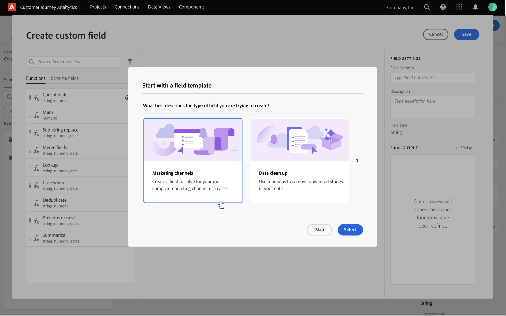

# 派生字段

{{release-limited-testing}}

派生字段是Customer Journey Analytics(CJA)中实时报表功能的一个重要方面。 利用派生（自定义）字段，可通过可自定义的规则生成器，即时定义（通常复杂）的数据操作。 然后，您可以将该派生字段用作 [工作区](../../analysis-workspace/home.md) 或在 [数据视图](../data-views.md).

与转换或处理CJA外其他位置的数据相比，派生字段可节省大量时间和精力。 例如 [数据准备](https://experienceleague.adobe.com/docs/experience-platform/data-prep/home.html?lang=zh-Hans), [数据Distiller](https://experienceleague.adobe.com/docs/experience-platform/query/data-distiller/overview.html?lang=en)，或在您自己的提取转换加载(ETL)/提取加载转换(ELT)流程中。

派生字段定义为 [数据视图](../data-views.md)，基于一组定义为规则的函数，并应用于可用的标准和/或架构字段。

示例用例包括：

- 定义一个自定义的“页面名称”字段，以更正不正确收集的页面名称值，从而更正页面名称值。

- 定义自定义营销渠道字段，以根据一个或多个条件（例如URL参数、页面URL、页面名称）确定适当的营销渠道。

## 自定义字段界面

创建或编辑自定义字段时，使用自定义字段界面。

|  | 名称 | 描述 |
|---------|----------|--------|
| 1 | **选择器** | 您可以使用选择器区域选择并拖放您的  函数， 函数模板， 架构字段，或标准字段。  使用下拉菜单选择 [!UICONTROL 函数], [!UICONTROL 函数模板], [!UICONTROL 架构字段]和 [!UICONTROL 标准字段]. 您可以使用  搜索框。  您可以通过选择  在 [!UICONTROL 过滤字段依据] 对话框。 您可以使用  的值。 |
| 2 | **规则生成器** | 您可以使用一个或多个规则按顺序构建自定义字段。 规则是函数的特定实现，因此始终只与一个函数关联。 通过将函数拖放到规则生成器中来创建规则。 函数类型确定规则的界面。 请参阅 [规则界面](#rule-interface) 以了解更多信息。  您可以在规则生成器中已有的可用规则之间，在开始、结束或插入函数。 规则生成器中的最后一个规则确定自定义字段的最终输出。 |
| 3 | **[!UICONTROL **&#x200B;字段设置&#x200B;**]** | 您可以命名并描述自定义字段，并检查其字段类型。 |
| 4 | **[!UICONTROL **&#x200B;最终输出&#x200B;**]** | 此区域会根据过去30天的数据以及您对规则生成器中自定义字段所做的更改，即时显示输出值的更新预览。 |

{style="table-layout:auto"}

首次访问自定义字段界面时， [!UICONTROL 从字段模板开始] 向导。

1. 选择最能描述您尝试创建的字段类型的模板。
2. 选择 **[!UICONTROL **&#x200B;选择&#x200B;**]** 按钮继续。

“自定义字段”对话框中填充了您所选字段类型的必需或有用的规则（和函数）。 请参阅 [函数模板](#function-templates) 以了解有关可用模板的更多信息。

## 规则界面

在规则生成器中定义规则时，您会使用规则界面。

|  | 名称 | 描述 |
|---------|----------|--------|
| A | **规则名称** | 默认情况下，规则名称为 **规则X** （X引用序列号）。 要编辑规则的名称，请选择其名称并键入新名称，例如 `Query Parameter`. |
| B | **函数名称** | 例如，规则的选定函数名称 [!DNL URL PARSE]. 当函数是函数序列中的最后一个函数并确定最终输出值时，函数名称后跟 [!DNL FINAL OUTPUT]，例如 [!DNL URL PARSE - FINAL OUTPUT].  要显示包含函数更多信息的弹出窗口，请选择 . |
| C | **规则描述** | 您可以选择向规则添加描述。 选择 ，然后选择 **[!UICONTROL **&#x200B;添加描述&#x200B;**]** 添加描述或 **[!UICONTROL **&#x200B;编辑描述&#x200B;**]** 以编辑现有描述。 使用编辑器输入描述。 您可以使用工具栏设置文本格式（使用样式选择器、粗体、斜体、下划线、右、左、居中、颜色、数字列表、项目符号列表），并添加指向外部信息的链接。  要完成编辑描述，请在编辑器外部单击。 |
| D | **功能区** | 定义函数的逻辑。 接口取决于函数的类型。 请参阅 [函数引用](#function-reference) 详细了解支持的每个功能。 |

{style="table-layout:auto"}

## 创建自定义字段

1. 选择现有的数据视图或创建数据视图。 请参阅 [数据视图](../data-views.md) 以了解更多信息。

2. 选择 **[!UICONTROL **&#x200B;组件&#x200B;**]** 选项卡。

3. 选择 **[!UICONTROL **&#x200B;创建自定义字段&#x200B;**]** 从左边栏。

4. 要定义自定义字段，请使用 [!UICONTROL 创建自定义字段] 界面。 请参阅 [自定义字段界面](#custom-field-interface).

   要保存新的自定义字段，请选择 **[!UICONTROL **&#x200B;保存&#x200B;**]**.

5. 您的新自定义字段将添加到 **[!UICONTROL **&#x200B;自定义字段>**]** 容器，作为 **[!UICONTROL **&#x200B;架构字段&#x200B;**]** 的双曲余切值。

## 编辑自定义字段

1. 选择现有数据视图。 请参阅 [数据视图](../data-views.md) 以了解更多信息。

2. 选择 **[!UICONTROL **&#x200B;组件&#x200B;**]** 选项卡。

3. 选择 **[!UICONTROL **&#x200B;架构字段&#x200B;**]** 选项卡 [!UICONTROL 连接] 窗格。

4. 选择 **[!UICONTROL **&#x200B;自定义字段>**]** 容器。

5. 将鼠标悬停在要编辑的自定义字段上，然后选择 .

6. 要编辑自定义字段，请使用 [!UICONTROL 编辑自定义字段] 界面。 请参阅 [自定义字段界面](#custom-field-interface).

   - 选择 **[!UICONTROL **&#x200B;保存&#x200B;**]** 以保存更新的自定义字段。

   - 选择 **[!UICONTROL **&#x200B;取消&#x200B;**]** 取消您对自定义字段所做的任何更改。

   - 选择 **[!UICONTROL **&#x200B;另存为&#x200B;**]** 将自定义字段另存为新的自定义字段。 新的自定义字段与原始编辑的自定义字段具有相同的名称，其中 `(copy)` 中。

## 删除自定义字段

1. 选择现有数据视图。 请参阅 [数据视图](../data-views.md) 以了解更多信息。

2. 选择 **[!UICONTROL **&#x200B;组件&#x200B;**]** 选项卡。

3. 选择 **[!UICONTROL **&#x200B;架构字段&#x200B;**]** 选项卡 [!UICONTROL 连接] 中。

4. 选择 **[!UICONTROL **&#x200B;自定义字段>**]** 容器。

5. 将鼠标悬停在要删除的自定义字段上，然后选择 .

6. 使用中 **[!UICONTROL **&#x200B;编辑自定义字段&#x200B;**]** 界面中，选择删除。

   A [!UICONTROL 删除组件] 对话框要求您确认删除。 考虑数据视图外部对自定义字段可能存在的任何外部引用。

   - 选择 **[!UICONTROL **&#x200B;继续&#x200B;**]** 删除自定义字段。

## 函数模板

要快速为特定用例创建自定义字段，可使用函数模板。 这些函数模板可从自定义字段界面的选择器区域访问，或在 [!UICONTROL 从字段模板开始] 向导。

### 营销渠道

此模板配置为使用 [Url解析](#dnl-url-parse) 和 [用例](#dnl-case-when) 函数多次，以从URL获取适当的值。 然后，对这些值应用逻辑，以将URL与特定营销渠道关联。

+++ 详细信息

要使用模板，必须为作为模板规则一部分列出的每个函数指定正确的参数。 请参阅 [函数引用](#function-reference) 以了解更多信息。

+++

<!--

+++ Data clean up template

>[!WARNING]
>
>Could not find any information on this template.
+++

-->

## 函数引用

对于每个受支持的函数，请在下面找到详细信息：

- 规范：
   - 输入数据类型：支持的数据类型，
   - 输入：输入的可能值，
   - 包含的运算符：此函数支持的运算符（如果有），
   - 限制：使用此函数可在派生字段中使用的最大规则数，
   - 输出。

- 用例包括：
   - 定义自定义字段前的数据
   - 如何定义自定义字段
   - 定义自定义字段后的数据

- 约束（可选）

<!-- Concatenate -->

### [!DNL Concatenate]

将两个或多个字段、自定义字段或用户输入的值合并到具有定义分隔符的单个字段中。

+++ 详细信息

## 规范 {#concatenate-io}

| 输入数据类型 | 输入 | 包含的运算符 | 限制 | 输出 |
|---|---|---|:--:|---|
| 
字符串
 | <ul><li>要组合的两个或多个值<ul><li>字段</li><li>从前一个规则派生的值</li><li>用户输入的值</li></ul></li><li>分隔符<ul><li>输入或选择每个值的分隔符</li></ul></li> </ul> | 
不适用
 | 
2
 | 
新建自定义字段
 |

{style="table-layout:auto"}

## 用例 {#concatenate-uc}

您当前将原点和目的地机场代码作为单独的字段进行收集。 您希望获取这两个字段，并将它们合并到一个以连字符(-)分隔的维度中。 因此，您可以分析原点和目的地的组合，以确定已预订的最热门的路线。

假设：

- 源值和目标值在同一表中的单独字段中收集。
- 用户确定在值之间使用分隔符“ — ”。

想象一下，将发生以下预订：

- 客户ABC123预订在盐湖城(SLC)和奥兰多(MCO)之间的航班
- 客户ABC456预订在盐湖城(SLC)和洛杉矶(LAX)之间的航班
- 客户ABC789预订在盐湖城(SLC)和西雅图(SEA)之间的航班
- 客户ABC987预订在盐湖城(SLC)和圣何塞(SJO)之间的航班
- 客户ABC654预订在盐湖城(SLC)和奥兰多(MCO)之间的航班

所需的报表应当类似于：

| 源/目标 | 预订 |
|----|---:|
| SLC-MCO | 2 |
| SLC-LAX | 1 |
| SLC-SEA | 1 |
| SLC-SJO | 1 |

{style="table-layout:auto"}

### 数据之前 {#concatenate-uc-databefore}

| Origin | 目标 |
|----|---:|
| SLC | MCO |
| SLC | LAX |
| SLC | SEA |
| SLC | SJO |
| SLC | MCO |

{style="table-layout:auto"}

### 自定义字段 {#concatenate-customfield}

您定义新 **[!UICONTROL **&#x200B;源 — 目标&#x200B;**]** 自定义字段。 您使用 **[!UICONTROL 连接]** 函数来定义要连接的规则 [!UICONTROL 原始] 和 [!UICONTROL 目标] 字段 `-` [!UICONTROL 分隔符].

![[!DNL Concatenate] 规则](assets/concatenate.png)

### 之后的数据 {#concatenate-dataafter}

| 源 — 目标 （自定义字段） |
|---|
| SLC-MCO |
| SLC-LAX |
| SLC-SEA |
| SLC-SJO |
| SLC-MCO |

{style="table-layout:auto"}

+++

<!-- CASE WHEN -->

### [!DNL Case When]

根据一个或多个字段中的定义条件应用条件。 然后，可使用这些条件根据条件的顺序在新自定义字段中定义值。

+++ 详细信息

## 规范 {#casewhen-io}

| 输入数据类型 | 输入 | 包含的运算符 | 限制 | 输出 |
|---|---|---|:---:|---|
| <ul><li>字符串</li><li>数值</li><li>Date/Date-Time</li></ul> | <ul><li>输入字段</li><li>条件</li></ul> | 
<u>字符串</u>
<ul><li>等于</li><li>等于任何词语</li><li>包含该短语</li><li>包含任何词语</li><li>包含所有词语</li><li>开始于</li><li>以任意词开头</li><li>结束于</li><li>以任何术语结尾</li><li>不等于</li><li>不等于任何词语</li><li>不包含该短语</li><li>不包含任何词语</li><li>不包含所有词语</li><li>未始于</li><li>不以任何术语开头</li><li>未止于</li><li>不以任何术语结尾</li><li>已设置</li><li>未设置</li></ul>
<u>数值</u>
<ul><li>等于</li><li>不等于</li><li>高于</li><li>高于或等于</li><li>低于</li><li>低于或等于</li><li>已设置</li><li>未设置</li></ul>
<u>日期</u>
<ul><li>等于</li><li>不等于</li><li>晚于</li><li>晚于或等于</li><li>在之前</li><li>早于或等于</li><li>已设置</li><li>未设置</li></ul> | 
5
 | 
新建自定义字段
 |

{style="table-layout:auto"}

## 用例1 {#casewhen-uc1}

您需要定义规则以通过应用级联逻辑将营销渠道字段设置为正确的值，来识别各种营销渠道：

- 如果反向链接来自搜索引擎，并且页面具有查询字符串值，其中 `cid` 包含 `ps_`，营销渠道应被识别为 **付费搜索**.
- 如果反向链接来自搜索引擎，并且页面没有查询字符串 `cid`，营销渠道应被识别为 **免费搜索**.
- 如果页面具有查询字符串值，其中 `cid` 包含 `em_`，营销渠道应被识别为 **电子邮件**.
- 如果页面具有查询字符串值，其中 `cid` 包含 `ds_`，营销渠道应被识别为 **展示广告**.
- 如果页面具有查询字符串值，其中 `cid` 包含 `so_`，营销渠道应被识别为 **付费社交**.
- 如果反向链接来自twitter.com、facebook.com、linkedin.com或tiktok.com的反向链接域，则营销渠道应被识别为 **自然社交**.
- 如果上述规则均不匹配，则应将营销渠道标识为 **其他反向链接**.

如果您的网站收到以下包含反向链接和页面URL的示例事件，则应按以下方式标识这些事件：

| 事件 | 反向链接 | 页面 URL | 营销渠道 |
|:--:|----|----|----|
| 1 | `https://facebook.com` | `https://site.com/home` | 自然社交 |
| 2 | `https://abc.com` | `https://site.com/?cid=ds_12345678` | 显示 |
| 3 |  | `https://site.com/?cid=em_12345678` | 电子邮件 |
| 4 | `https://google.com` | `https://site.com/?cid=ps_abc098765` | 付费搜索 |
| 5 | `https://google.com` | `https://site.com/?cid=em_765544332` | 电子邮件 |
| 6 | `https://google.com` |  | 免费搜索 |

{style="table-layout:auto"}

### 数据之前 {#casewhen-uc1-databefore}

| 反向链接 | 页面 URL |
|----|----|
| `https://facebook.com` | `https://site.com/home` |
| `https://abc.com` | `https://site.com/?cid=ds_12345678` |
|  | `https://site.com/?cid=em_12345678` |
| `https://google.com` | `https://site.com/?cid=ps_abc098765` |
| `https://google.com` | `https://site.com/?cid=em_765544332` |
| `https://google.com` |

{style="table-layout:auto"}

### 自定义字段 {#casewhen-uc1-customfield}

您定义新 `Marketing Channel` 自定义字段。 您使用 **[!UICONTROL 大小写]** 函数来定义规则，以便根据这两个规则的现有值为其创建值 `Page URL` 和 `Referring URL` 字段。

请注意函数的用法 **[!UICONTROL ** URL解析&#x200B;**]** 定义规则以获取 `Page Url` 和 `Referring Url` 在 **[!UICONTROL **&#x200B;大小写&#x200B;**]** 规则。

![[!DNL Case when] 规则1](assets/case-when-1.png)

### 之后的数据 {#casewhen-uc1-dataafter}

| 营销渠道 |
|----|
| 自然社交 |
| 显示 |
| 电子邮件 |
| 付费搜索 |
| 电子邮件 |
| 免费搜索 |

{style="table-layout:auto"}

## 用例2 {#casewhen-uc2}

您在“产品查找方法”维度中收集了多个不同的搜索变体。 要了解搜索与浏览的整体性能，您必须花费大量时间手动组合结果。

您的网站会为产品查找方法维度收集以下值。 最后，所有这些值都表示搜索。

| 收集的值 | 实际值 |
|---|---|
| 搜索p13n_no | 搜索 |
| 搜索p13n_yes | 搜索 |
| 搜索优化p13n_no | 搜索 |
| 搜索优化p13n_yes | 搜索 |
| 搜索重定向p13n_yes | 搜索 |
| search-redirect | 搜索 |

{style="table-layout:auto"}

### 数据之前 {#casewhen-uc2-databefore}

| 产品查找方法 |
|----|
| 搜索p13_no |
| search p13_yes |
| 浏览器 |
| search refine p13_no |
| search refine p13_yes |
| 浏览器 |
| 搜索重定向p13_yes |
| search-redirect |
| 浏览器 |

{style="table-layout:auto"}

### 自定义字段 {#casewhen-uc2-customfield}

您定义 `Product Finding Methods (new)` 自定义字段。 您可以创建以下内容 **[!UICONTROL **&#x200B;大小写&#x200B;**]** 规则生成器中的规则。 这些规则会将逻辑应用于旧的所有可能变体 **[!UICONTROL **&#x200B;产品查找方法&#x200B;**]** 字段值 `search` 和 `browse` 使用 **[!UICONTROL 包含短语]** 标准。

![[!DNL Case When] 规则2](assets/case-when-2.png)

### 之后的数据 {#casewhen-uc2-dataafter}

| 产品查找方法（新） |
|----|
| 搜索 |
| 搜索 |
| 浏览器 |
| 搜索 |
| 搜索 |
| 浏览器 |
| 搜索 |
| 搜索 |
| 浏览器 |

{style="table-layout:auto"}

## 用例3 {#casewhen-uc3}

作为一家旅游公司，您希望将已预订行程的行程时长存储起来，以便报告已存储的行程时长。

假设：

- 组织正在将行程持续时间收集到数字字段中。
- 他们希望将1-3天的持续时间存储到名为“短行程”的存储段中
- 他们希望将4-7天的持续时间存储到称为“中途旅行”的时段中
- 他们希望将8天以上的持续时间存储到名为“长途旅行”的时段中
- 132次旅行被预订，为期1天
- 共预订了110次旅行，为期2天
- 共预订了105次旅行，为期3天
- 99次旅行在4天内预订
- 92次旅行在5天内预订
- 85次旅行在6天内预订
- 82次旅行在7天内预订
- 为期8天的78次旅行预订
- 50次旅行已预订9天
- 44次旅行在10天内预订
- 38次旅行在11天内预订
- 31次旅行在12天内预订

所需的报表应类似于：

| 行程持续时间类型 | 预订 |
|----|---:|
| 中行程 | 358 |
| 短行程 | 347 |
| 长途旅行 | 241 |

{style="table-layout:auto"}

### 数据之前 {#casewhen-uc3-databefore}

| 行程持续时间 |
|---:|
| 1 |
| 12 |
| 3 |
| 6 |
| 4 |
| 8 |
| 6 |
| 2 |
| 1 |
| 2 |
| 21 |
| 8 |

### 自定义字段 {#casewhen-uc3-customfield}

您定义 `Trip Duration (bucketed)` 自定义字段。 您可以创建以下内容 **[!UICONTROL **&#x200B;大小写&#x200B;**]** 规则生成器中的规则。 此规则将逻辑应用于存储旧 **[!UICONTROL **&#x200B;行程持续时间&#x200B;**]** 字段值分为三个值： `short trip`, `medium  trip`和 `long trip`.

![[!DNL Case When] 规则3](assets/case-when-3.png)

### 之后的数据 {#casewhen-uc3-dataafter}

| 行程持续时间（分段统计） |
|---|
| 短行程 |
| 长途旅行 |
| 短行程 |
| 中行程 |
| 中行程 |
| 长途旅行 |
| 中行程 |
| 短行程 |
| 短行程 |
| 短行程 |
| 长途旅行 |
| 长途旅行 |

## 约束

CJA使用以Adobe Experience Platform [XDM](https://experienceleague.adobe.com/docs/experience-platform/xdm/home.html?lang=zh-Hans) （体验数据模型）。 此容器模型虽然在性质上是灵活的，但在使用规则生成器时仍会施加一些限制。 CJA使用的默认嵌套容器模型的结构如下图所示：

请参阅 [容器](../create-dataview.md#containers) 和 [过滤器容器](../../components/filters/filters-overview.md#filter-containers) 以了解更多背景信息。

以下容器约束在 _选择_ 和 _设置_ 值。

|  | 约束 |
|:---:|----|
| **A** | 您的值 _选择_ 在同一 [!UICONTROL 如果], [!UICONTROL Else If] 构造(使用 [!UICONTROL 和] 或 [!UICONTROL 或])必须源于同一容器，并且可以是任何类型（字符串） ，数字 ，等等)。   |
| **B** | 所有值 _set_ 跨规则必须来自同一容器，并且具有相同类型或相同类型的自定义值。    |
| **C** | 您的值 _选择_ 跨 [!UICONTROL 如果], [!UICONTROL Else If] 规则中的构造 _not_ 必须源自同一容器，并且 _not_ 必须是同一类型。    |

{style="table-layout:auto"}

+++

<!-- FIND AND REPLACE -->

### [!DNL Find and Replace]

查找选定字段中的所有值，并在新的自定义字段中将这些值替换为不同的值。

+++ 详细信息

## 规范 {#findreplace-io}

| 输入数据类型 | 输入 | 包含的运算符 | 限制 | 输出 |
|---|---|---|:---:|---|
| 
字符串
 | <ul><li>“替换时间”字段标准</li><li>“替换为”字段值<ul><li>用户输入</li><li>单独字段</li></ul></li></ul> | 
<u>字符串</u>
<ul><li>全部查找并全部替换</li></ul> | 
1
 | 
新建自定义字段
 |

{style="table-layout:auto"}

## 用例 {#findreplace-uc}

例如，您收到了外部营销渠道报表的一些格式错误的值 `email%20 marketing` 而不是 `email marketing`. 这些格式错误的值会断开您的报表，使您更难以查看电子邮件的执行情况。 要替换 `email%20marketing` with `email marketing`.

**原始报表**

| 外部营销渠道 | 会话 |
|---|--:|
| 电子邮件营销 | 500 |
| 电子邮件%20marketing | 24 |

{style="table-layout:auto"}

**首选报表**

| 外部营销渠道 | 会话 |
|---|--:|
| 电子邮件营销 | 524 |

### 数据之前 {#findreplace-uc-databefore}

| 外部营销 |
|----|
| 电子邮件营销 |
| email%20marketing |
| 电子邮件营销 |
| 电子邮件营销 |
| email%20marketing |

{style="table-layout:auto"}

### 自定义字段 {#findreplace-uc-customfield}

您定义 `Email Marketing (updated)` 自定义字段。 您使用 **[!UICONTROL 查找和替换]** 函数来定义规则以查找和替换所有出现的 `email%20marketing` with `email marketing`.

![[!DNL Find and Replace] 规则](assets/find-and-replace.png)

### 之后的数据 {#findreplace-uc-dataafter}

| 外部营销 （自定义字段） |
|----|
| 电子邮件营销 |
| 电子邮件营销 |
| 电子邮件营销 |
| 电子邮件营销 |
| 电子邮件营销 |

{style="table-layout:auto"}

+++

<!-- LOOKUP -->

### [!DNL Lookup]

定义一组由相应值替换的查找值。

+++ 详细信息

## 规范 {#lookup-io}

| 输入数据类型 | 输入 | 包含的运算符 | 限制 | 输出 |
|---|---|---|:---:|---|
| <ul><li>字符串</li><li>数值</li><li>日期</li></ul> | <ul><li>单个字段</li><li>查找文件<ul><li>Key Column（键列）</li><li>新建字段列</li></ul></li></ul> | 
不适用
 | 
5
 | 
新建自定义字段
 |

{style="table-layout:auto"}

## 用例1 {#lookup-uc1}

您的CSV文件中包含的键列适用于 `hotelID` 和与 `hotelID`: `city`, `rooms`, `hotel name`.
您正在某个维度中收集酒店ID，但希望创建从 `hotelID` 中。

**CSV文件结构和内容**

| hotelID | city | 客房 | 酒店名称 |
|---|---|---:|---|
| SLC123 | 盐湖城 | 40 | SLC市中心 |
| LAX342 | 洛杉矶 | 60 | 洛杉矶机场 |
| SFO456 | 旧金山 | 75 | 市场街 |

{style="table-layout:auto"}

**当前报表**

| 酒店ID | 产品查看次数 |
|---|---:|
| SLC123 | 200 |
| LX342 | 198 |
| SFO456 | 190 |

{style="table-layout:auto"}

**所需报表**

| 酒店名称 | 产品查看次数 |
|----|----:|
| SLC市中心 | 200 |
| 洛杉矶机场 | 198 |
| 市场街 | 190 |

{style="table-layout:auto"}

### 数据之前 {#lookup-uc1-databefore}

| 酒店ID |
|----|
| SLC123 |
| LAX342 |
| SFO456 |

{style="table-layout:auto"}

### 自定义字段 {#lookup-uc1-customfield}

您定义 `Hotel Name` 自定义字段。 您使用 **[!UICONTROL **&#x200B;查找&#x200B;**]** 函数来定义一个规则，您可以在该规则中查找 **[!UICONTROL **&#x200B;酒店ID **]** 字段，并替换为新值。

![[!DNL Lookup] 规则1](assets/lookup-1.png)

### 之后的数据 {#lookup-uc1-dataafter}

| 酒店名称 |
|----|
| SLC市中心 |
| 洛杉矶机场 |
| 市场街 |

{style="table-layout:auto"}

## 用例2 {#lookup-uc2}

您收集了多个页面的URL，而不是易记页面名称。 此混合值集合会中断报表。

### 数据之前 {#lookup-uc2-databefore}

| 页面名称 |
|---|
| 主页 |
| 飞行搜索 |
| `http://www.adobetravel.ca/Hotel-Search` |
| `https://www.adobetravel.com/Package-Search` |
| 交易和优惠 |
| `http://www.adobetravel.ca/user/reviews` |
| `https://www.adobetravel.com.br/Generate-Quote/preview` |

{style="table-layout:auto"}

### 自定义字段 {#lookup-uc2-customfield}

您定义 `Page Name (updated)` 自定义字段。 您使用 **[!UICONTROL **&#x200B;查找&#x200B;**]** 函数来定义规则，从中查找现有值 **[!UICONTROL **&#x200B;页面名称&#x200B;**]** 字段，并替换为更新的正确值。

![[!DNL Lookup] 规则2](assets/lookup-2.png)

### 之后的数据 {#lookup-uc2-dataafter}

| 页面名称（已更新） |
|---|
| 主页 |
| 飞行搜索 |
| 搜索酒店 |
| 包搜索 |
| 交易和优惠 |
| 评论 |
| 生成报价 |

+++

<!-- URL PARSE -->

### [!DNL URL Parse]

解析URL的不同部分，包括协议、主机、路径或查询参数。

+++ 详细信息

## 规范 {#urlparse-io}

| 输入数据类型 | 输入 | 包含的运算符 | 限制 | 输出 |
|---|---|---|:---:|---|
| <ul><li>字符串</li></ul> | <ul><li>单个字段</li><li>解析选项<ul><li>获取协议</li><li>获取主机</li><li>获取路径</li><li>获取查询值<ul><li>查询参数</li></ul></li><li>获取哈希值</li></ul></li></ul></li></ul> | 
不适用
 | 
5
 | 
新建自定义字段
 |

{style="table-layout:auto"}

## 用例1 {#urlparse-uc1}

您只希望将反向链接URL中的反向链接域用作营销渠道规则集的一部分。

### 数据之前 {#urlparse-uc1-databefore}

| 反向链接 URL |
|----|
| `https://www.google.com/` |
| `https://duckduckgo.com/` |
| `https://t.co/` |
| `https://l.facebook.com/` |

{style="table-layout:auto"}

### 自定义字段 {#urlparse-uc1-customfield}

您定义  `Referring Domain` 自定义字段。 您使用 **[!UICONTROL ** URL解析&#x200B;**]** 函数来定义从 **引荐URL** 并将其存储到新的自定义字段中。

![[!DNL Url Parse] 规则1](assets/url-parse-1.png)

### 之后的数据 {#urlparse-uc1-dataafter}

| 反向链接域 |
|----|
| www.google.com |
| duckduckgo.com |
| t.co |
| l.facebook.com |

{style="table-layout:auto"}

## 用例2 {#urlparse-uc2}

要使用 `cid` 作为派生跟踪代码报表输出的一部分的页面URL中查询字符串的参数。

### 数据之前 {#urlparse-uc2-databefore}

| 页面 URL |
|----|
| `https://www.adobe.com/?cid=abc123` |
| `https://www.adobe.com/?em=email1234&cid=def123` |
| `https://www.adobe.com/landingpage?querystring1=test&test2=1234&cid=xyz123` |

{style="table-layout:auto"}

### 自定义字段 {#urlparse-uc2-customfield}

您定义 `Query String CID` 自定义字段。 您使用 **[!UICONTROL ** URL解析&#x200B;**]** 函数来定义规则以获取页面URL中查询字符串参数的值，指定 `cid` 作为查询参数。 输出值将存储在新的自定义字段中。

![[!DNL Url Parse] 规则2](assets/url-parse-2.png)

### 之后的数据 {#urlparse-uc2-dataafter}

| 查询字符串CID |
|----|
| abc123 |
| def123 |
| xyz123 |

{style="table-layout:auto"}

+++
