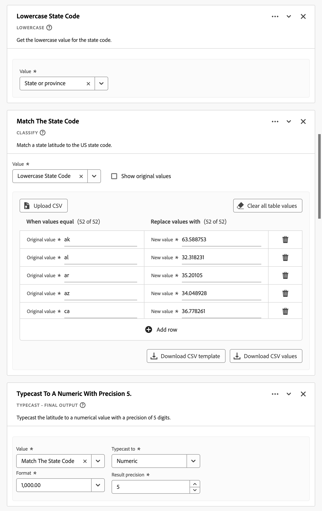
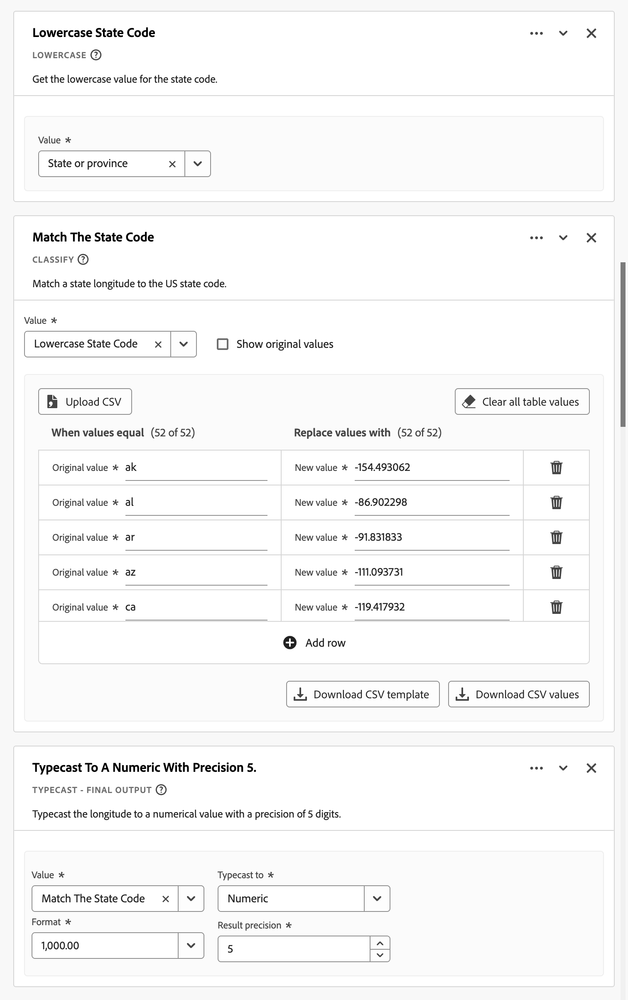
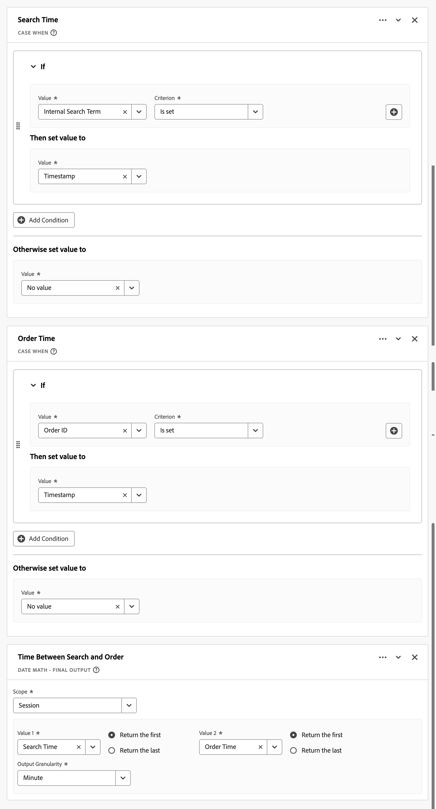

# 派生字段 {#derived-fields}

>[!CONTEXTUALHELP]
>id="dataview_derivedfields"
>title="派生字段"
>abstract="派生字段允许您通过可自定义的规则生成器动态定义数据操作。然后，您可以将该派生字段用作工作区中的组件（度量或维度），甚至可以在“数据”视图中进一步定义为组件。"

派生字段是 Adobe Customer Journey Analytics 中实时报告功能的一个重要方面。通过派生字段和可自定义的规则生成器，即可迅速定义（一般较为复杂的）数据操作。然后，您可以将该派生字段用作[工作区](../../analysis-workspace/home.md)中的组件（量度或维度），甚至可以进一步将该派生字段定义为[数据视图](../data-views.md)中的组件。

与在 Customer Journey Analytics 之外的其他位置转换或操作数据相比，派生字段可以节省大量时间和精力。例如[数据准备](https://experienceleague.adobe.com/docs/experience-platform/data-prep/home.html)、[数据蒸馏器](https://experienceleague.adobe.com/docs/experience-platform/query/data-distiller/overview.html)，或者在您自己的提取转换加载 (ETL) / 提取加载转换 (ELT) 流程中。

派生字段是在[数据视图](../data-views.md)中定义的，它们基于一组定义为规则的函数，并会应用于可用的标准和/或架构字段。

>[!NOTE]
>
>[标准组件](../component-reference.md)绑定到事件数据集并与之关联。 因此，用作派生字段一部分的标准组件仅适用于事件数据集中的数据。
>

示例用例为：

- 定义一个派生的“页面名称”字段，该字段可将收集到的错误页面名称值更正为正确的页面名称值。

- 定义一个派生的“营销渠道”字段，该字段可根据一个或多个条件（例如 URL 参数、页面 URL、页面名称）确定适当的营销渠道。

只有派生字段中的事件数据集支持标准组件。

## 派生字段界面 {#interface}

当您创建或编辑派生字段时，您可以使用派生字段界面。

|  | 名称 | 描述 |
|---------|----------|--------|
| 1 | **选择器** | 您可以使用选择器区域选择函数、函数模板、架构字段或标准字段，并将其拖放到规则生成器上。 使用下拉菜单进行选择：  [!UICONTROL 函数] - 列出可用的[函数](#function-reference)，  [!UICONTROL 函数模板] - 列出可用的[函数模板](#function-templates)，   [!UICONTROL 架构字段] - 列出可从数据集类别（事件、轮廓、查找）获得的字段以及先前定义的派生字段，以及  [!UICONTROL 标准字段] - 标准可用字段（如平台数据集 ID）。选择器中仅显示字符串和数字标准字段。如果该函数支持其他数据类型，则可以为规则界面内的值或字段选择具有这些其他数据类型的标准字段。 您可以使用  搜索框搜索函数、函数模板、架构和标准字段。 您可以通过选择  过滤器来过滤选定的对象列表，并在[!UICONTROL 过滤字段依据]对话框中指定过滤器。您可以使用每个过滤器的  轻松移除过滤器。 |
| 2 | **规则生成器** | 您可以使用一个或多个规则按顺序构建派生字段。规则是函数的具体实施，因此始终只与一个函数相关联。您可以通过将函数拖放到规则生成器中来创建规则。函数的类型决定了规则的界面。 有关更多信息，请参阅[规则界面](#rule-interface)。 您可以在规则生成器中已有的规则开始、结束或中间位置插入函数。规则生成器中的最后一条规则决定了派生字段的最终输出。 |
| 3 | **[!UICONTROL **&#x200B;字段设置&#x200B;**]** | 您可以为派生字段命名并进行描述，并检查其字段类型。 |
| 4 | **[!UICONTROL **&#x200B;最终输出&#x200B;**]** | 此区域根据过去 30 天的数据以及您对规则生成器中的派生字段所做的更改，显示实时更新的输出值预览。 |

{style="table-layout:auto"}

## 字段模板向导 {#wizard}

当您首次访问派生字段界面时，您会看到[!UICONTROL 从字段模板开始]向导。

1. 选择最能描述您想要创建的字段类型的模板。
2. 点击 **[!UICONTROL **&#x200B;选择&#x200B;**]** 按钮以继续。

您的派生字段对话框中会根据您所选择的字段类型填充了必要或有用的规则（和函数）。有关可用模板的更多信息，请参阅[函数模板](#function-templates)。

## 规则界面 {#rules}

当您在规则生成器中定义规则时，您需要使用规则界面。

|  | 名称 | 描述 |
|---------|----------|--------|
| A | **规则名称** | 默认规则名称为&#x200B;**规则 X**（X 指序列号）。要编辑规则的名称，请选择其名称并输入新名称，例如 `Query Parameter`。 |
| B | **函数名称** | 为规则选择的函数名称，例如 [!UICONTROL URL PARSE]。当该函数是函数序列中的最后一个，并决定最终输出值时，函数名称后将加上 [!UICONTROL - FINAL OUTPUT]，例如 [!UICONTROL URL PARSE - FINAL OUTPUT]。 要显示包含有关该函数的详细信息的弹出窗口，请选择 。 |
| C | **规则和描述** | 您可以选择为规则添加描述。 选择 ，然后选择&#x200B;**[!UICONTROL **&#x200B;添加说明&#x200B;**]**&#x200B;来添加说明，或选择&#x200B;**[!UICONTROL **&#x200B;编辑说明&#x200B;**]**&#x200B;来编辑现有说明。 使用编辑器来输入描述。您可以使用工具栏来设置文本格式（使用样式选择器、粗体、斜体、下划线、右对齐、左对齐、居中、颜色、编号列表、项目符号列表）并添加外部信息链接。 要完成编辑描述，请单击编辑器外部。 |
| D | **函数区** | 定义函数的逻辑。其界面取决于函数的类型。[!UICONTROL 字段]或[!UICONTROL 值]的下拉菜单根据函数所需的输入类型显示所有类别的可用字段（规则、标准字段、字段）。 或者，您可以将字段从“架构和标准”字段选择器拖放到“字段”或“值”上。当拖动的字段是来自查找数据集的字段时，查找函数会自动插入到您定义的函数之前。 请参阅[函数引用](#function-reference)，了解关于所支持的每个函数的详细信息。 |

{style="table-layout:auto"}

## 创建派生字段 {#create}

1. 选择现有的数据视图，或创建一个数据视图。有关更多信息，请参阅[数据视图](../data-views.md)。

2. 选择数据视图的&#x200B;**[!UICONTROL **&#x200B;组件&#x200B;**]**&#x200B;选项卡。

3. 从左边栏中选择&#x200B;**[!UICONTROL **&#x200B;创建派生字段&#x200B;**]**。

4. 要定义派生字段，请使用[!UICONTROL 创建派生字段]界面。请参阅[派生字段界面](#derived-field-interface)。

   要保存新的派生字段，请选择&#x200B;**[!UICONTROL **&#x200B;保存&#x200B;**]**。

5. 您的新派生字段将会被添加到[!UICONTROL 派生字段 >] 容器中，作为数据视图左边栏中&#x200B;**[!UICONTROL **&#x200B;架构字段&#x200B;**]**&#x200B;的一部分。

## 编辑派生字段 {#edit}

1. 选择一个现有的数据视图。有关更多信息，请参阅[数据视图](../data-views.md)。

2. 选择数据视图的&#x200B;**[!UICONTROL **&#x200B;组件&#x200B;**]**&#x200B;选项卡。

3. 选择左侧[!UICONTROL 连接]窗格中的&#x200B;**[!UICONTROL **&#x200B;架构字段&#x200B;**]**&#x200B;选项卡。

4. 选择&#x200B;**[!UICONTROL **&#x200B;派生字段 >**]** 容器。

5. 将鼠标悬停在要编辑的派生字段上，然后选择 。

6. 要编辑派生字段，请使用[!UICONTROL 编辑派生字段]界面。请参阅[派生字段界面](#derived-field-interface)。

   - 选择&#x200B;**[!UICONTROL **&#x200B;保存&#x200B;**]**&#x200B;来保存更新后的派生字段。

   - 选择&#x200B;**[!UICONTROL **&#x200B;取消&#x200B;**]**&#x200B;来取消对派生字段所做的任何更改。

   - 选择&#x200B;**[!UICONTROL **&#x200B;另存为&#x200B;**]**&#x200B;来将派生字段保存为新的派生字段。新派生字段的名称与原始已编辑派生字段的名称相同，只是在后面加了一个 `(copy)`。

或者，如果您在数据视图中将派生字段用作维度或量度的组件：

1. 选择该组件。请注意，该组件的名称可能与派生字段的名称不同。

1. 在“组件”面板中，选择位于架构字段名称下方的派生字段旁边的 。

1. 要编辑派生字段，请使用[!UICONTROL 编辑派生字段]界面。请参阅[派生字段界面](#derived-field-interface)。

   - 选择&#x200B;**[!UICONTROL **&#x200B;保存&#x200B;**]**&#x200B;来保存更新后的派生字段。

   - 选择&#x200B;**[!UICONTROL **&#x200B;取消&#x200B;**]**&#x200B;来取消对派生字段所做的任何更改。

   - 选择&#x200B;**[!UICONTROL **&#x200B;另存为&#x200B;**]**&#x200B;来将派生字段保存为新的派生字段。新派生字段的名称与原始已编辑派生字段的名称相同，只是在后面加了一个 `(copy)`。

## 删除派生字段 {#delete}

1. 选择一个现有的数据视图。有关更多信息，请参阅[数据视图](../data-views.md)。

2. 选择数据视图的&#x200B;**[!UICONTROL **&#x200B;组件&#x200B;**]**&#x200B;选项卡。

3. 选择[!UICONTROL 连接]窗格中的&#x200B;**[!UICONTROL **&#x200B;架构字段&#x200B;**]**&#x200B;选项卡。

4. 选择&#x200B;**[!UICONTROL **&#x200B;派生字段 >**]** 容器。

5. 将鼠标悬停在要删除的派生字段上，然后选择 。

6. 在[!UICONTROL 编辑派生字段]界面，选择&#x200B;**[!UICONTROL 删除]**。

   [!UICONTROL 删除组件]对话框会要求您确认删除操作。考虑在数据视图之外可能存在的对派生字段的任何外部引用。

   - 选择&#x200B;**[!UICONTROL **&#x200B;继续&#x200B;**]**&#x200B;来删除派生字段。

或者，如果您在数据视图中将派生字段用作维度或量度的组件：

1. 选择该组件。请注意，该组件的名称可能与派生字段的名称不同。

1. 在“组件”面板中，选择位于架构字段名称下方的派生字段旁边的 。

1. 在[!UICONTROL 编辑派生字段]界面，选择&#x200B;**[!UICONTROL 删除]**。

   [!UICONTROL 删除组件]对话框会要求您确认删除操作。考虑在数据视图之外可能存在的对派生字段的任何外部引用。

   - 选择&#x200B;**[!UICONTROL **&#x200B;继续&#x200B;**]**&#x200B;来删除派生字段。

>[!NOTE]
>
>在 Customer Journey Analytics 中，派生字段是在连接级别进行管理的。在与该连接关联的任何数据视图中对派生字段所做的任何更改，都会应用于所有这些关联的数据视图。

## 函数模板 {#templates}

为了快速创建特定用例的派生字段，可以使用函数模板。这些函数模板可以从派生字段界面中的选择器区域访问，或在[!UICONTROL 从字段模板开始]向导中首次使用时显示。

### 营销渠道 {#mchannel}

该功能模板使用一组规则来构建营销渠道。

+++ 详细信息

要使用该模板，您必须为模板中规则内列出的每个函数指定正确的参数。有关详细信息，请参阅[函数参考](#function-reference)。

+++

### 退信数 {#bounces}

此函数模板使用一组规则来识别网站退信数。

+++ 详细信息

{{select-package}}

要使用该模板，您必须为模板中规则内列出的每个函数指定正确的参数。有关详细信息，请参阅[函数参考](#function-reference)。

+++

### 多维度合并 {#multi-dim}

此函数模板将两个值合并为一个。

+++ 详细信息

{{select-package}}

要使用该模板，您必须为模板中规则内列出的每个函数指定正确的参数。有关详细信息，请参阅[函数参考](#function-reference)。

+++

### 简单易记的数据集名称 {#friendlyname}

该函数模板提供了一个可读的数据集名称。

+++ 详细信息

{{select-package}}

要使用该模板，您必须为模板中规则内列出的每个函数指定正确的参数。有关详细信息，请参阅[函数参考](#function-reference)。

+++

### URL 中的页面名称 {#pagename}

该函数模板会创建一个简单的页面名称。

+++ 详细信息

{{select-package}}

要使用该模板，您必须为模板中规则内列出的每个函数指定正确的参数。有关详细信息，请参阅[函数参考](#function-reference)。

+++

### 节假日 {#holiday}

该函数模板对一年中的关键时间进行了分类。

+++ 详细信息

{{select-package}}

要使用该模板，您必须为模板中规则内列出的每个函数指定正确的参数。有关详细信息，请参阅[函数参考](#function-reference)。

+++

### 每月目标 {#goals}

此函数模板会设置自定义的月度目标。

+++ 详细信息

{{select-package}}

要使用该模板，您必须为模板中规则内列出的每个函数指定正确的参数。有关详细信息，请参阅[函数参考](#function-reference)。

+++

### 获取带分隔符的列表中的所有值 {#allvalues}

该函数模板会将有限的列表转换为数组。

+++ 详细信息

{{select-package}}

要使用该模板，您必须为模板中规则内列出的每个函数指定正确的参数。有关详细信息，请参阅[函数参考](#function-reference)。

+++

### 获取带分隔符的列表中的第一个值 {#firstvalue}

此函数模板会获取带分隔符的列表中的第一个值。

+++ 详细信息

{{select-package}}

要使用该模板，您必须为模板中规则内列出的每个函数指定正确的参数。有关详细信息，请参阅[函数参考](#function-reference)。

+++

### 获取带分隔符的列表中的最后一个值 {#lastvalue}

此函数模板会获取带分隔符的列表中的最后一个值。

+++ 详细信息

{{select-package}}

要使用该模板，您必须为模板中规则内列出的每个函数指定正确的参数。有关详细信息，请参阅[函数参考](#function-reference)。

+++

### 域名 {#domain}

该函数模板会使用正则表达式提取域名。

+++ 详细信息

{{select-package}}

要使用该模板，您必须为模板中规则内列出的每个函数指定正确的参数。有关详细信息，请参阅[函数参考](#function-reference)。

+++

### 获取查询字符串参数 {#querystring}

该函数模板会提取查询字符串值。

+++ 详细信息

{{select-package}}

要使用该模板，您必须为模板中规则内列出的每个函数指定正确的参数。有关详细信息，请参阅[函数参考](#function-reference)。

+++

### 转换字段 {#transition}

此函数模板会将报告从一个字段转换到另一个字段。

+++ 详细信息

{{select-package}}

要使用该模板，您必须为模板中规则内列出的每个函数指定正确的参数。有关详细信息，请参阅[函数参考](#function-reference)。

+++

### 简单易用的机器人检测 {#botdetection}

此函数模板实现了轻量级的机器人识别功能。

+++ 详细信息

{{select-package}}

要使用该模板，您必须为模板中规则内列出的每个函数指定正确的参数。有关详细信息，请参阅[函数参考](#function-reference)。

+++

### 退出链接 {#exit}

此函数模板会识别会话中最后点击的链接。

+++ 详细信息

{{select-package}}

要使用该模板，您必须为模板中规则内列出的每个函数指定正确的参数。有关详细信息，请参阅[函数参考](#function-reference)。

+++

### 下载链接 {#download}

该函数模板会标记常见的下载链接。

+++ 详细信息

{{select-package}}

要使用该模板，您必须为模板中规则内列出的每个函数指定正确的参数。有关详细信息，请参阅[函数参考](#function-reference)。

+++

### 州纬度 {#state-latitude}

此函数模板获取美国某个州的纬度，精度为5位数。

+++ 详细信息

{{select-package}}

要使用该模板，您必须为模板中规则内列出的每个函数指定正确的参数。有关详细信息，请参阅[函数参考](#function-reference)。

+++

### 州经度 {#state-longitude}

此函数模板获取US状态的经度，精度为5位。

+++ 详细信息

{{select-package}}

要使用该模板，您必须为模板中规则内列出的每个函数指定正确的参数。有关详细信息，请参阅[函数参考](#function-reference)。

+++

<!--

+++ Data clean up template

>[!WARNING]
>
>Could not find any information on this template.
+++

-->

## 函数参考 {#functionref}

{{select-package}}

对于每个支持的函数，请参阅以下详细信息：

- 规范：
   - 输入数据类型：支持的数据类型，
   - 输入：输入的可能值，
   - 包含的运算符：此函数支持的运算符（如果有），
   - 限制：适用于此特定函数的限制，
   - 输出。

- 用例，包括：
   - 定义派生字段之前的数据，
   - 如何定义派生字段，
   - 定义派生字段后的数据。

- 约束条件（如果适用）。

<!-- CASE WHEN -->

### Case When {#casewhen}

>[!CONTEXTUALHELP]
>id="dataview_derivedfields_casewhen"
>title="Case When"
>abstract="此函数提供了根据一个或多个字段中定义的标准应用条件的能力。然后使用这些标准根据完成情况序列来定义新派生字段中的值。"

根据一个或多个字段中定义的标准应用条件。然后使用这些标准根据条件序列来定义新派生字段中的值。

+++ 详细信息

## 规范 {#casewhen-io}

| 输入数据类型 | 输入 | 包含的运算符 | 限制 | 输出 |
|---|---|---|---|---|
| <ul><li>字符串</li><li>数值</li><li>日期</li></ul> | <ul><li>[!UICONTROL If], [!UICONTROL Else If] 容器：
<ul><li>[!UICONTROL 值]</li><ul><li>规则</li><li>标准字段</li><li>字段</li></ul><li>[!UICONTROL 标准]（根据所选的值类型查看包含的运算符）</li></ul></li><li>[!UICONTROL 然后将值设置为]，[!UICONTROL 否则将值设置为]：
<ul><li>[!UICONTROL 值]</li><ul><li>规则</li><li>标准字段</li><li>字段</li></ul></ul></li></ul> | 
字符串
<ul><li>等于</li><li>等于任何词语</li><li>包含该短语</li><li>包含任何词语</li><li>包含所有词语</li><li>开始于</li><li>以任意词语开头</li><li>结束于</li><li>以任意词语结尾</li><li>不等于</li><li>不等于任何词语</li><li>不包含该短语</li><li>不包含任何词语</li><li>不包含所有词语</li><li>未始于</li><li>不以任何词语开头</li><li>未止于</li><li>未以任何词语结尾</li><li>已设置</li><li>未设置</li></ul>
数值
<ul><li>等于</li><li>不等于</li><li>高于</li><li>高于或等于</li><li>低于</li><li>低于或等于</li><li>已设置</li><li>未设置</li></ul>
日期
<ul><li>等于</li><li>不等于</li><li>晚于</li><li>晚于或等于</li><li>早于</li><li>早于或等于</li><li>已设置</li><li>未设置</li></ul> | <ul><li>每个派生字段有 5 个函数</li><li>每个派生字段有 200 个[运算符](#operators)。单一运算符的一个例子是“反向链接域包含 google”。 </li></ul> | 
新的派生字段
 |

{style="table-layout:auto"}

## 用例 1 {#casewhen-uc1}

您想要通过应用级联逻辑将营销渠道字段设置为适当的值来定义规则以识别各种营销渠道：

- 如果反向链接来自搜索引擎，并且页面具有查询字符串值，其中 `cid` 包含 `ps_`，则营销渠道应被确定为&#x200B;[!DNL *付费搜索*]。
- 如果反向链接来自搜索引擎，并且页面没有查询字符串 `cid`，则营销渠道应被确定为&#x200B;[!DNL *免费搜索*]。
- 如果页面具有查询字符串值，其中 `cid` 包含 `em_`，则营销渠道应被确定为&#x200B;[!DNL *电子邮件*]。
- 如果页面具有查询字符串值，其中 `cid` 包含 `ds_`，则营销渠道应被确定为&#x200B;[!DNL *展示广告*]。
- 如果页面具有查询字符串值，其中 `cid` 包含 `so_`，则营销渠道应被确定为&#x200B;[!DNL *付费社交媒体*]。
- 如果反向链接来自 [!DNL twitter.com]、[!DNL facebook.com]、[!DNL linkedin.com] 或者 [!DNL tiktok.com] 的反向链接域，则营销渠道应被确定为&#x200B;[!DNL *免费社交媒体*]。
- 如果以上规则均不符合，则应将营销渠道确定为&#x200B;[!DNL *其他反向链接*]。

如果您的网站收到以下示例事件，其中包含[!UICONTROL 反向链接]和[!UICONTROL 页面 URL]，则应按以下方式确定这些事件：

| [!DNL Event] | [!DNL Referrer] | [!DNL Page URL] | [!DNL Marketing Channel] |
|:--:|----|----|----|
| 1 | `https://facebook.com` | `https://site.com/home` | [!DNL Natural Social] |
| 2 | `https://abc.com` | `https://site.com/?cid=ds_12345678` | [!DNL Display] |
| 3 | | `https://site.com/?cid=em_12345678` | [!DNL Email] |
| 4 | `https://google.com` | `https://site.com/?cid=ps_abc098765` | [!DNL Paid Search] |
| 5 | `https://google.com` | `https://site.com/?cid=em_765544332` | [!DNL Email] |
| 6 | `https://google.com` |  | [!DNL Natural Search] |

{style="table-layout:auto"}

### 之前的数据 {#casewhen-uc1-databefore}

| [!DNL Referrer] | [!DNL Page URL] |
|----|----|
| `https://facebook.com` | `https://site.com/home` |
| `https://abc.com` | `https://site.com/?cid=ds_12345678` |
|  | `https://site.com/?cid=em_12345678` |
| `https://google.com` | `https://site.com/?cid=ps_abc098765` |
| `https://google.com` | `https://site.com/?cid=em_765544332` |
| `https://google.com` | |

{style="table-layout:auto"}

### 派生字段 {#casewhen-uc1-derivedfield}

您定义一个 `Marketing Channel` 派生字段。您使用 [!UICONTROL CASE WHEN] 函数来定义基于 `Page URL` 和 `Referring URL` 字段的现有值来创建新值的规则。

请注意，在应用 [!UICONTROL CASE WHEN] 规则之前，使用 [!UICONTROL URL PARSE] 函数来定义获取 `Page Url` 和 `Referring Url` 值的规则。

### 之后的数据 {#casewhen-uc1-dataafter}

| [!DNL Marketing Channel] |
|----|
| [!DNL Natural Social] |
| [!DNL Display] |
| [!DNL Email] |
| [!DNL Paid Search] |
| [!DNL Email] |
| [!DNL Natural Search] |

{style="table-layout:auto"}

## 用例 2 {#casewhen-uc2}

您在 [!DNL Product Finding Methods] 维度内收集了多种不同的搜索变体。要了解搜索与浏览的整体绩效，您必须花费大量时间手动合并结果。

您的网站会为您的 [!DNL Product Finding Methods] 维度收集以下值。最后，所有这些值都表示一次搜索。

| 已收集的值 | 实际值 |
|---|---|
| [!DNL search p13n_no] | [!DNL search] |
| [!DNL search p13n_yes] | [!DNL search] |
| [!DNL search refine p13n_no] | [!DNL search] |
| [!DNL search refine p13n_yes] | [!DNL search] |
| [!DNL search redirect p13n_yes] | [!DNL search] |
| [!DNL search-redirect] | [!DNL search] |

{style="table-layout:auto"}

### 之前的数据 {#casewhen-uc2-databefore}

| [!DNL Product Finding Methods] |
|----|
| [!DNL search p13_no] |
| [!DNL search p13_yes] |
| [!DNL browse] |
| [!DNL search refine p13_no] |
| [!DNL search refine p13_yes] |
| [!DNL browse] |
| [!DNL search redirect p13_yes] |
| [!DNL search-redirect] |
| [!DNL browse] |

{style="table-layout:auto"}

### 派生字段 {#casewhen-uc2-derivedfield}

您定义一个 `Product Finding Methods (new)` 派生字段。您在规则生成器中创建以下 [!UICONTROL CASE WHEN] 规则。这些规则使用[!UICONTROL 包含短语]标准，将逻辑应用于 `search` 和 `browse` 的旧[!UICONTROL 产品查找方法]字段值的所有可能变体。

### 之后的数据 {#casewhen-uc2-dataafter}

| [!DNL Product Finding Methods (new)] |
|----|
| [!DNL search] |
| [!DNL search] |
| [!DNL browse] |
| [!DNL search] |
| [!DNL search] |
| [!DNL browse] |
| [!DNL search] |
| [!DNL search] |
| [!DNL browse] |

{style="table-layout:auto"}

## 用例 3 {#casewhen-uc3}

作为一家旅游公司，您希望对已预订行程的旅行时长进行划分，以便可以报告按照旅行时长划分的行程。

假设：

- 该组织正在将旅行时长收集到一个数字字段中。
- 他们希望将 1-3 天的旅行时长归入一个名为“[!DNL short trip]”的桶中
- 他们希望将 4-7 天的旅行时长归入一个名为“[!DNL medium trip]”的桶中
- 他们希望将超过 8 天的旅行时长归入一个名为“[!DNL long trip]”的桶中
- 共预订了 132 次旅行时长为 1 天的行程
- 共预订了 110 次旅行时长为 2 天的行程
- 共预订了 105 次旅行时长为 3 天的行程
- 共预订了 99 次旅行时长为 4 天的行程
- 共预订了 92 次旅行时长为 5 天的行程
- 共预订了 85 次旅行时长为 6 天的行程
- 共预订了 82 次旅行时长为 7 天的行程
- 共预订了 78 次旅行时长为 8 天的行程
- 共预订了 50 次旅行时长为 9 天的行程
- 共预订了 44 次旅行时长为 10 天的行程
- 共预订了 38 次旅行时长为 11 天的行程
- 共预订了 31 次旅行时长为 12 天的行程

您想要的报告应该是这样的：

| [!DNL Trip Duration Type] | [!DNL Bookings] |
|----|---:|
| [!DNL medium trip] | 358 |
| [!DNL short trip] | 347 |
| [!DNL long trip] | 241 |

{style="table-layout:auto"}

### 之前的数据 {#casewhen-uc3-databefore}

| [!DNL Trip Duration] |
|---:|
| 1 |
| 12 |
| 3 |
| 6 |
| 4 |
| 8 |
| 6 |
| 2 |
| 1 |
| 2 |
| 21 |
| 8 |

### 派生字段 {#casewhen-uc3-derivedfield}

您定义一个 `Trip Duration (bucketed)` 派生字段。您在规则生成器中创建以下 [!UICONTROL CASE WHEN] 规则。此规则会应用逻辑来将旧的[!UICONTROL 旅行时长]字段值分为三个值：`short trip`、`medium  trip` 和 `long trip`。

### 之后的数据 {#casewhen-uc3-dataafter}

| [!DNL Trip Duration (bucketed)] |
|---|
| [!DNL short trip] |
| [!DNL long trip] |
| [!DNL short trip] |
| [!DNL medium trip] |
| [!DNL medium trip] |
| [!DNL long trip] |
| [!DNL medium trip] |
| [!DNL short trip] |
| [!DNL short trip] |
| [!DNL short trip] |
| [!DNL long trip] |
| [!DNL long trip] |

## 更多信息 {#casewhen-more-info}

Customer Journey Analytics 使用嵌套的容器结构，该结构仿照的是 Adobe Experience Platform 的 [XDM](https://experienceleague.adobe.com/docs/experience-platform/xdm/home.html)（体验数据模型）。有关更多背景信息，请参阅[容器](../create-dataview.md#containers)和[区段容器](/help/components/segments/seg-overview.md#containers)。 这种容器模型虽然本质上很灵活，但在使用规则生成器时会施加一些约束。

Customer Journey Analytics 使用以下默认容器模型：

在&#x200B;*选择*&#x200B;和&#x200B;*设置*&#x200B;值时，以下约束适用并会强制执行。

|  | 限制 |
|:---:|----|
| **A** | 在规则中的相同的 [!UICONTROL If]、[!UICONTROL Else If] 构造（使用 [!UICONTROL And] 或 [!UICONTROL Or]）中&#x200B;*选择*&#x200B;的值必须来自同一容器，并且可以是任何类型（字符串、数字等）。  |
| **B** | 您在规则中&#x200B;*设置*&#x200B;的所有值必须来自同一容器，并且具有相同的类型或相同类型的派生值。   |
| **C** | 您在规则中的 [!UICONTROL If]、[!UICONTROL Else If] 构造中&#x200B;*选择*&#x200B;的值&#x200B;*不必*&#x200B;来自同一容器，也&#x200B;*不必*&#x200B;属于同一类型。   |

{style="table-layout:auto"}

+++

<!-- CLASSIFY -->

### 分类 {#classify}

>[!CONTEXTUALHELP]
>id="dataview_derivedfields_classify"
>title="分类"
>abstract="此函数提供了定义一组值的功能，这些值通过文本输入被相应的值替换。"

定义一组值，这些值在新的派生字段中会被相应的值替换。

+++ 详细信息

## 规范 {#classify-io}

| 输入数据类型 | 输入 | 包含的运算符 | 限制 | 输出 |
|---|---|---|---|---|
| <ul><li>字符串</li><li>数值</li><li>日期</li></ul> | <ul><li>[!UICONTROL 要分类的字段]：<ul><li>规则</li><li>标准字段</li><li>字段</li></ul></li><li>[!UICONTROL 当值等于]以及[!UICONTROL 将值替换为]：
<ul><li>字符串</li></ul><li>显示原始值<ul><li>布尔值</li></ul></li></ul> | 
不适用
 | <ul><li>每个派生字段有 5 个函数</li><li>每个派生字段有 200 个[运算符](#operators)。每次输入[!UICONTROL 当值等于原始值时] [!UICONTROL 将值替换为新值]时均被视为一项操作。</li></ul> | 
新的派生字段
 |

{style="table-layout:auto"}

## 用例 1 {#classify-uc1}

您确实有一个 CSV 文件，其中包括 `hotelID` 的关键列和与 `hotelID` 相关的一个或多个附加列：`city`、`rooms`、`hotel name`。
您正在收集维度中的 [!DNL Hotel ID]，但希望创建一个从 CSV 文件中的 `hotelID` 派生的 [!DNL Hotel Name] 维度。

**CSV 文件结构和内容**

| [!DNL hotelID] | [!DNL city] | [!DNL rooms] | [!DNL hotel name] |
|---|---|---:|---|
| [!DNL SLC123] | [!DNL Salt Lake City] | 40 | [!DNL SLC Downtown] |
| [!DNL LAX342] | [!DNL Los Angeles] | 60 | [!DNL LA Airport] |
| [!DNL SFO456] | [!DNL San Francisco] | 75 | [!DNL Market Street] |
| [!DNL AMS789] | [!DNL Amsterdam] | 50 | [!DNL Okura] |

{style="table-layout:auto"}

**当前报告**

| [!DNL Hotel ID] | 产品查看次数 |
|---|---:|
| [!DNL SLC123] | 200 |
| [!DNL LX342] | 198 |
| [!DNL SFO456] | 190 |
| [!DNL AMS789] | 150 |

{style="table-layout:auto"}

**所需报告**

| [!DNL Hotel Name] | 产品查看次数 |
|----|----:|
| [!DNL SLC Downtown] | 200 |
| [!DNL LA Airport] | 198 |
| [!DNL Market Street] | 190 |

{style="table-layout:auto"}

### 之前的数据 {#classify-uc1-databefore}

| [!DNL Hotel ID] |
|----|
| [!DNL SLC123] |
| [!DNL LAX342] |
| [!DNL SFO456] |
| [!DNL AMS789] |

{style="table-layout:auto"}

### 派生字段 {#classify-uc1-derivedfield}

您定义一个 `Hotel Name` 派生字段。您可以使用 [!UICONTROL CLASSIFY] 函数定义一个规则，在该规则中可以对 [!UICONTROL Hotel ID] 字段的值进行分类，并替换为新值。

如果要将未定义的原始值包含在要分类的值中（例如酒店 ID AMS789），请确保选择&#x200B;**[!UICONTROL 显示原始值]**。这可以确保 AMS789 成为派生字段输出的一部分，尽管该值尚未被分类。

### 之后的数据 {#classify-uc1-dataafter}

| [!DNL Hotel Name] |
|----|
| [!DNL SLC Downtown] |
| [!DNL LA Airport] |
| [!DNL Market Street] |

{style="table-layout:auto"}

## 用例 2 {#classify-uc2}

您收集了多个页面的 URL，而不是简单易记的页面名称。这种对值的混合收集破坏了报告。

### 之前的数据 {#classify-uc2-databefore}

| [!DNL Page Name] |
|---|
| [!DNL Home Page] |
| [!DNL Flight Search] |
| `http://www.adobetravel.ca/Hotel-Search` |
| `https://www.adobetravel.com/Package-Search` |
| [!DNL Deals & Offers] |
| `http://www.adobetravel.ca/user/reviews` |
| `https://www.adobetravel.com.br/Generate-Quote/preview` |

{style="table-layout:auto"}

### 派生字段 {#classify-uc2-derivedfield}

您定义一个 `Page Name (updated)` 派生字段。您可以使用 [!UICONTROL CLASSIFY] 函数定义一条规则，在该规则中，您可以对现有的[!UICONTROL 页面名称]字段的值进行分类，并替换为更新的正确值。

### 之后的数据 {#classify-uc2-dataafter}

| [!DNL Page Name (updated)] |
|---|
| [!DNL Home Page] |
| [!DNL Flight Search] |
| [!DNL Hotel Search] |
| [!DNL Package Search] |
| [!DNL Deals & Offers] |
| [!DNL Reviews] |
| [!DNL Generate Quote] |

## 更多信息 {#classify-moreinfo}

分类规则界面还提供以下附加功能：

- 要快速清除所有表格值，请选择  **[!UICONTROL 清除所有表格值]**。
- 要上传包含“当值等于”时使用的原始值以及“将值替换为”时使用的新值的 CSV 文件，请选择  **[!UICONTROL 上传 CSV]**。
- 要下载用于创建包含要上传的原始值和新值的 CSV 文件的模板，请选择  **[!UICONTROL 下载 CSV 模板]**。
- 要下载规则界面中填充了所有原始值和新值的 CSV 文件，请选择  **[!UICONTROL 下载 CSV 值]**。

+++

<!-- CONCATENATE -->

### 连接 {#concatenate}

<!-- markdownlint-disable MD034 -->

>[!CONTEXTUALHELP]
>id="dataview_derivedfields_concatenate"
>title="连接"
>abstract="此函数提供了将两个或多个字段、派生字段或用户输入的字符串值组合到具有定义的分隔符的单个字段中的能力。"

<!-- markdownlint-enable MD034 -->

将字段值组合成具有定义的分隔符的单个新派生字段。

+++ 详细信息

## 规范 {#concatenate-io}

| 输入数据类型 | 输入 | 包含的运算符 | 限制 | 输出 |
|---|---|---|---|---|
| <ul><li>字符串</li></ul> | <ul><li>[!UICONTROL 值]：<ul><li>规则</li><li>标准字段</li><li>字段</li><li>字符串</li></ul></li><li>[!UICONTROL 分隔符]：<ul><li>字符串</li></ul></li> </ul> | 
不适用
 | 
每个派生字段有 2 个函数
 | 
新的派生字段
 |

{style="table-layout:auto"}

## 用例 {#concatenate-uc}

您当前是将出发地和目的地机场代码收集为单独的字段。您希望将这两个字段合并为一个维度，并用连字符 (-) 分隔。因此，您可以通过分析出发地和目的地的组合来确定预订量最大的航线。

假设：

- 出发地和目的地值会收集在同一张表的不同字段中。
- 用户决定在值之间使用分隔符“-”。

假设进行以下预订：

- 客户 ABC123 预订了盐湖城 (SLC) 和奥兰多 (MCO) 之间的航班
- 乘客 ABC456 预订了盐湖城 (SLC) 和洛杉矶 (LAX) 之间的航班
- 客户 ABC789 预订了盐湖城 (SLC) 和西雅图 (SEA) 之间的航班
- 客户 ABC987 预订了盐湖城 (SLC) 和圣何塞 (SJO) 之间的航班
- 客户 ABC654 预订了盐湖城 (SLC) 和奥兰多 (MCO) 之间的航班

所需的报告应如下：

| 出发地 / 目的地 | 预订 |
|----|---:|
| SLC-MCO | 2 |
| SLC-LAX | 1 |
| SLC-SEA | 1 |
| SLC-SJO | 1 |

{style="table-layout:auto"}

### 之前的数据 {#concatenate-uc-databefore}

| 出发地 | 目的地 |
|----|---:|
| SLC | MCO |
| SLC | LAX |
| SLC | SEA |
| SLC | SJO |
| SLC | MCO |

{style="table-layout:auto"}

### 派生字段 {#concatenate-derivedfield}

您可以定义一个 `Origin - Destination` 派生字段。您可以使用 [!UICONTROL CONCATENATE] 函数来定义一条规则，以使用[!UICONTROL 分隔符]连接[!UICONTROL 出发地]和`-` [!UICONTROL 目的地]字段。

### 之后的数据 {#concatenate-dataafter}

| 出发地 - 目的地 （派生字段） |
|---|
| SLC-MCO |
| SLC-LAX |
| SLC-SEA |
| SLC-SJO |
| SLC-MCO |

{style="table-layout:auto"}

+++

<!-- DATE MATH -->

### 日期运算 {#datemath}

>[!CONTEXTUALHELP]
>id="dataview_derivedfields_datemath"
>title="日期运算"
>abstract="此函数可返回两个日期或日期时间字段之间的差值。基于人员的字段（来自轮廓数据集）没有&#x200B;**[!UICONTROL 返回第一个]**&#x200B;和&#x200B;**[!UICONTROL 返回最后一个]**&#x200B;这两个选项。"

返回两个日期或两个日期时间字段之间的差值。

+++ 详细信息

## 规范 {#datemath-io}

| 输入数据类型 | 输入 | 包含的运算符 | 限制 | 输出 |
|---|---|---|---|---|
| <ul><li>日期</li><li>日期时间</li></ul> | <ul><li>[!UICONTROL 范围]<ul><li>事件</li><li>会话</li><li>人员</li></ul></li><li>[!UICONTROL 值]：<ul><li>日期</li><li>日期时间</li><li>静态日期（用户输入）</li><li>静态日期时间（用户输入）</li><li>动态日期<ul><li>今天</li></ul></li><li>动态日期时间<ul><li>现在</li></ul></li></ul></li><li>[!UICONTROL 粒度]：<ul><li>Seconds</li><li>Minutes</li><li>小时</li><li>Days</li><li>Weeks</li><li>Months</li><li>季度</li><li>年</li></ul></li><li>对于每个日期或日期时间返回：<ul><li>第一次（会话或人员内）</li><li>上次（会话或人员内）</li></ul></li></ul> | 
不适用
 | 
每个派生字段有 2 个函数
 | 
新的派生字段
 |

{style="table-layout:auto"}

## 用例 1 {#datemath-uc1}

作为一家酒店公司的营销分析师，您想要了解上周客户签到日期和预订日期之间的天数差异。

### 派生字段 {#datemath-uc1-derivedfield}

您定义一个 `Days between booking and check-in` 派生字段。您使用[!UICONTROL DATE MATH]函数定义规则以计算[!UICONTROL 范围] [!DNL Person]在[!UICONTROL 预订日期]和[!UICONTROL 登记日期]之间的天数。 您选择[!UICONTROL 天]作为[!UICONTROL 输出粒度]。 并且您选择[!UICONTROL 返回]预订日期[!UICONTROL 和]登记日期[!UICONTROL 的最后一个]以确保在计算中使用最后一个人员范围值。

## 用例 2 {#datemath-uc2}

作为一家实体店的营销分析师，您想要了解客户距商店上次访问是多少天前。 您可以使用移动设备应用程序中的地理位置功能以及商店中的信标来捕获客户的实际访问。

### 派生字段 {#datemath-uc2-derivedfield}

您可以定义一个新的 `Days Since Visit To Shop` 派生字段。您使用[!UICONTROL DATE MATH]函数定义规则以计算自定义日期时间（您在[!UICONTROL Date]中指定）和[!UICONTROL 本地时间]（来自事件数据集的[!UICONTROL placeContext]字段组）之间的天数，该自定义日期时间具有[!UICONTROL 重复数据删除范围]/[!UICONTROL 人员]。 选择[!UICONTROL 返回最后]以确保在计算中使用[!UICONTROL 本地时间]的最后一个人员范围值。 选择“日”作为[!UICONTROL 输出粒度]。

的屏幕截图

或者，您可以使用方便的动态日期范围值“现在”在现在和[!UICONTROL 本地时间]（从事件数据集的[!UICONTROL placeContext]字段组）之间计算

的屏幕截图

## 用例 3 {#datemath-uc3}

您希望了解会话中客户下订单之前的搜索时间（以分钟为单位）。

您定义了一个新的`Time Between Search And Order In Minutes`派生字段，该字段是两个[[!UICONTROL CASE WHEN]函数](#case-when)的结果，用于定义[!UICONTROL 搜索时间]和[!UICONTROL 订单时间]值。
然后使用这两个值计算差值，其中[!UICONTROL DATE MATH]函数的[!UICONTROL 作用域]设置为[!UICONTROL 会话]，值设置为[!UICONTROL 搜索时间]和[!UICONTROL 订单时间]，而[!UICONTROL 输出粒度]设置为[!UICONTROL 分钟]。 对于这两个值，请选择[!UICONTROL 返回第一个]以确保返回第一个[!UICONTROL 搜索时间]和[!UICONTROL 订单时间]。

的屏幕截图

## 更多信息 {#datemath-more-info}

当您选择基于人员的（从用户档案数据集）字段时，[!UICONTROL 返回第一个]或[!UICONTROL 返回最后一个]的选项不可用。 基于人员的字段对于人员的“日期”或“日期时间”字段只能有一个值。
+++

<!-- DEDUPLICATE -->

### 删除重复数据 {#dedup}

>[!CONTEXTUALHELP]
>id="dataview_derivedfields_deduplicate"
>title="删除重复数据"
>abstract="此函数可以配置字段，以仅在线程或人员级别非重复地计算值。此外，可以使用删除重复项 ID 来确保基于给定的 ID（例如购买 ID），仅使用一个值（第一个实例或最后一个实例）。"

防止多次计算一个值。

+++ 详细信息

## 规范 {#deduplicate-io}

| 输入数据类型 | 输入 | 包含的运算符 | 限制 | 输出 |
|---|---|---|---|---|
| <ul><li>字符串</li><li>数值</li></ul> | <ul><li>[!UICONTROL 值]：<ul><li>规则</li><li>标准字段</li><li>字段</li><li>字符串</li></ul></li><li>[!UICONTROL 范围]：<ul><li>人员</li><li>会话</li></ul></li><li>[!UICONTROL 重复数据删除 ID]：<ul><li>规则</li><li>标准字段</li><li>字段</li><li>字符串</li></ul><li>[!UICONTROL 要保留的值]：<ul><li>保留第一个实例</li><li>保留最后一个实例</li></ul></li></ul> | 
不适用
 | 
每个派生字段有 5 个函数
 | 
新的派生字段
 |

{style="table-layout:auto"}

## 用例 1 {#deduplicate-uc1}

您想要避免在用户重新加载预订确认页面时计算重复收入。您可以在身份标识符中使用预订确认 ID，这样在收到同一事件的信息时就不会再次计算收入。

### 之前的数据 {#deduplicate-uc1-databefore}

| 预订确认 ID | 收入 |
|----|---:|
| ABC123456789 | 359 |
| ABC123456789 | 359 |
| ABC123456789 | 359 |

{style="table-layout:auto"}

### 派生字段 {#deduplicate-uc1-derivedfield}

您定义一个 `Booking Confirmation` 派生字段。您可以使用 [!UICONTROL DEDUPLICATE] 函数定义一条规则，以使用[!UICONTROL 重复数据删除 ID] [!UICONTROL 预订确认 ID ]对[!UICONTROL 范围] [!DNL Person] 的[!UICONTROL 值] [!DNL Booking] 进行重复数据删除。您可以选择[!UICONTROL 保留第一个实例]作为[!UICONTROL 要保留的值]。

### 之后的数据 {#deduplicate-uc1-dataafter}

| 预订确认 ID | 收入 |
|----|---:|
| ABC123456789 | 359 |
| ABC123456789 | 0 |
| ABC123456789 | 0 |

{style="table-layout:auto"}

## 用例 2 {#deduplicate-uc2}

您可以将事件作为外部营销活动中营销活动点击量的代理量度。重新加载和重新定向导致事件量度被夸大。您想要对跟踪代码维度进行重复数据删除，以便仅收集第一个维度，并最大限度地减少对事件重复计数。

### 之前的数据 {#deduplicate-uc2-databefore}

| 访客 ID | 营销渠道 | 事件 |
|----|---|---:|
| ABC123 | 付费搜索 | 1 |
| ABC123 | 付费搜索 | 1 |
| ABC123 | 付费搜索 | 1 |
| DEF123 | 电子邮件 | 1 |
| DEF123 | 电子邮件 | 1 |
| JKL123 | 免费搜索 | 1 |
| JKL123 | 免费搜索 | 1 |

{style="table-layout:auto"}

### 派生字段 {#deduplicate-uc2-derivedfield}

您可以定义一个新的 `Tracking Code (deduplicated)` 派生字段。您可以使用 [!UICONTROL DEDUPLICATE] 函数来定义一条规则，以对[!UICONTROL 跟踪代码]进行重复数据删除，其中[!UICONTROL 重复数据删除范围]为[!UICONTROL 会话]，并且[!UICONTROL 保留第一个实例]作为[!UICONTROL 要保留的值]。

### 之后的数据 {#deduplicate-uc2-dataafter}

| 访客 ID | 营销渠道 | 事件 |
|----|---|---:|
| ABC123 | 付费搜索 | 1 |
| DEF123 | 电子邮件 | 1 |
| JKL123 | 免费搜索 | 1 |

{style="table-layout:auto"}

+++

<!-- DEPTH -->

### 深度 {#depth}

>[!CONTEXTUALHELP]
>id="dataview_derivedfields_depth"
>title="深度"
>abstract="此函数可用于返回任意字段的深度，其功能类似于事件深度标准组件。"

返回字段的深度，类似于现成可用的标准事件深度维度。

+++ 详细信息

## 规范 {#depth-io}

| 输入数据类型 | 输入 | 包含的运算符 | 限制 | 输出 |
|---|---|---|---|---|
| 任何 | 任意字段 | 不适用 | 每个派生字段有 3 个函数 | 新的派生字段 |

{style="table-layout:auto"}

## 用例 {#depth-uc1}

您希望了解内部搜索深度（您也可以将其解释为搜索次数）。 因此，您可以稍后使用该内部搜索深度来细分与特定搜索深度关联的搜索词。

### 派生字段 {#depth-uc1-derivedfield}

您可以定义一个新的 `Internal Search Depth` 派生字段。您使用[!UICONTROL DEPTH]函数定义规则以检索[!UICONTROL 内部搜索项]的深度并将其存储在新的派生字段中。

深度规则

然后，在可视化图表中使用新派生的字段，以细分在第一次搜索时用于搜索的词条。

深度规则

+++

<!-- FIND AND REPLACE -->

### 查找和替换 {#find-and-replace}

<!-- markdownlint-disable MD034 -->

>[!CONTEXTUALHELP]
>id="dataview_derivedfields_findandreplace"
>title="查找和替换"
>abstract="此函数提供了在选定字段中查找所有值并将这些值替换为新派生字段中的不同值的功能。"

查找选定字段中的所有值，并用新派生字段中的其他值替换这些值。

+++ 详细信息

## 规范 {#findreplace-io}

| 输入数据类型 | 输入 | 包含的运算符 | 限制 | 输出 |
|---|---|---|---|---|
| <ul><li>字符串</li></ul> | <ul><li>[!UICONTROL 值]<ul><li>规则</li><li>标准字段</li><li>字段</li></ul></li><li>[!UICONTROL 查找所有]，[!UICONTROL 并全部替换为]：<ul><li>字符串</li></ul></li></ul></ul> | 
字符串
<ul><li>[!UICONTROL 查找所有]，[!UICONTROL 并全部替换为]</li></ul> | 
每个派生字段有 5 个函数
 | 
新的派生字段
 |

{style="table-layout:auto"}

## 用例 {#findreplace-uc}

您的外部营销渠道报告收到了一些格式错误的值，例如 `email%20 marketing` 而不是 `email marketing`。这些格式错误的值会破坏您的报告，并使您更难了解电子邮件的表现情况。您想要将 `email%20marketing` 替换为 `email marketing`。

**原始报告**

| [!DNL External Marketing Channels] | [!DNL Sessions] |
|---|--:|
| [!DNL email marketing] | 500 |
| [!DNL email %20marketing] | 24 |

{style="table-layout:auto"}

**首选报告**

| [!DNL External Marketing Channels] | [!DNL Sessions] |
|---|--:|
| [!DNL email marketing] | 524 |

### 之前的数据 {#findreplace-uc-databefore}

| [!DNL External Marketing] |
|----|
| [!DNL email marketing] |
| [!DNL email%20marketing] |
| [!DNL email marketing] |
| [!DNL email marketing] |
| [!DNL email%20marketing] |

{style="table-layout:auto"}

### 派生字段 {#findreplace-uc-derivedfield}

您可以定义一个 `Email Marketing (updated)` 派生字段。您可以使用 [!UICONTROL FIND AND REPLACE] 函数来定义一条规则，以查找所有出现的 `email%20marketing` 并将其替换为 `email marketing`。

### 之后的数据 {#findreplace-uc-dataafter}

| [!DNL External Marketing (updated)] |
|----|
| [!DNL email marketing] |
| [!DNL email marketing] |
| [!DNL email marketing] |
| [!DNL email marketing] |
| [!DNL email marketing] |

{style="table-layout:auto"}

+++

<!-- LOOKUP -->

### 查询 {#lookup}

>[!CONTEXTUALHELP]
>id="dataview_derivedfields_lookup"
>title="查询"
>abstract="此函数提供了利用数据集之间的匹配键来使用查找数据集中的字段的能力。"

使用查找数据集中的字段来查找值，并在新的派生字段中返回一个值，或用于进一步的规则处理。

+++ 详细信息

## 规范 {#lookup-io}

| 输入数据类型 | 输入 | 包含的运算符 | 限制 | 输出 |
|---|---|---|---|---|
| <ul><li>字符串</li><li>数值</li><li>日期</li></ul> | <ul><li>[!UICONTROL 应用查找的字段]：</li><ul><li>规则</li><li>标准字段</li><li>字段</li></ul><li>[!UICONTROL 查询数据集]</li><ul><li>数据集</li></ul><li>[!UICONTROL 匹配键]<ul><li>规则</li><li>字段</li></ul></li><li>要返回的值<ul><li>规则</li><li>字段</li></ul></li></ul> | 
不适用
 | 
每个派生字段有 3 个函数
 | 
新的派生字段或值，以便在下一个规则中进一步处理
 |

{style="table-layout:auto"}

## 用例 {#lookup-uc}

您想使用客户点击通过 Adobe Target 展示的个性化横幅时收集的活动 ID 来查找活动名称。您希望将查找数据集与包含活动 ID 和活动名称的 Analytics for Target (A4T) 活动一起使用。

### A4T 查找数据集 {#lookup-uc-lookup}

| 活动 ID | 活动名称 |
|---|---|
| 415851 | MVT 测试类别页面 |
| 415852 | Luma - Campaign Max 2022 |
| 402922 | 主页横幅 |

{style="table-layout:auto"}

### 派生字段 {#lookup-uc-derivedfield}

您可以定义一个 `Activity Name` 派生字段。您可以使用 [!UICONTROL LOOKUP] 函数来定义一个规则，以便从收集的数据中查找该值，该值在[!UICONTROL 应用查找的字段]字段中指定（例如 **[!DNL ActivityIdentifier]**）。您从[!UICONTROL 查找数据集]列表中选择查找数据集（例如 **[!DNL New CJA4T Activities]**）。然后，从[!UICONTROL 匹配键]列表中选择身份标识符字段（例如 **[!DNL ActivityIdentifier]**），并从[!UICONTROL 要返回的值]列表中选择要返回的字段（例如 **[!DNL ActivityName]**）。

## 更多信息 {#lookup-more-info}

查找函数在报告时应用于 Customer Journey Analytics 从您在连接中配置的查找数据集中检索的数据。

您可以在已包含一个或多个其他函数的规则生成器中快速插入一个[!UICONTROL 查找]函数。

1. 从选择器中选择&#x200B;**[!UICONTROL 架构字段]**。
1. 选择  **[!UICONTROL 查找数据集]**。
1. 选择您的查找数据集，并找到您想要用于查找的字段。
1. 将查找字段拖放到函数的任何可用输入字段上（例如 Case When）。当该功能有效时，一个标有 **[!UICONTROL + 添加]**的蓝色框会允许您拖放字段，并自动在您放置查找字段的函数之前插入一个查找函数。所插入的查找函数会自动填充所有字段的相关值。
   

+++

<!-- LOWERCASE -->

### 小写字母 {#lowercase}

>[!CONTEXTUALHELP]
>id="dataview_derivedfields_lowercase"
>title="小写字母"
>abstract="该函数可将整个字符串文本转换为小写值。"

将字段中的值转换为小写，并将其存储到新的派生字段中。

+++ 详细信息

## 规范 {#lowercase-io}

| 输入数据类型 | 输入 | 包含的运算符 | 限制 | 输出 |
|---|---|---|---|---|
| <ul><li>字符串</li><li>数值</li><li>日期</li></ul> | <ul><li>[!UICONTROL 字段]：</li><ul><li>规则</li><li>标准字段</li><li>字段</li></ul> | 
不适用
 | 
每个派生字段有 2 个函数
 | 
新的派生字段
 |

{style="table-layout:auto"}

## 用例 {#lowercase-uc}

为了确保报告的准确性，您希望将收集到的所有产品名称转换为小写。

### 之前的数据 {#lowercase-uc-databefore}

| 收集的产品名称 | 产品查看次数 |
|---|---:|
| 网球拍 | 35 |
| 网球拍 | 33 |
| 网球拍 | 21 |
| 棒球棒 | 15 |
| 棒球棒 | 12 |
| 棒球棒 | 10 |

{style="table-layout:auto"}

### 派生字段 {#lowercase-uc-derivedfield}

您定义一个 `Product Names` 派生字段。您可以使用 [!UICONTROL LOWERCASE] 函数定义一个规则，以将该值从[!UICONTROL 收集的产品名称]字段转换为小写，并将其存储在新的派生字段中。

### 之后的数据 {#lowercase-uc-dataafter}

| 产品名称 | 产品查看次数 |
|---|---|
| 网球拍 | 89 |
| 棒球棒 | 37 |

{style="table-layout:auto"}

+++

<!-- MATH -->

### 数学 {#math}

>[!CONTEXTUALHELP]
>id="dataview_derivedfields_math"
>title="数学"
>abstract="该函数提供对字段执行数学运算的能力。该函数可用于执行基本算术运算，例如加法、减法、乘法和除法。"

在数字字段上使用基本的数学运算符（加、减、乘、除和乘方）。

+++ 详细信息

## 规范 {#math-io}

| 输入数据类型 | 输入 | 包含的运算符 | 限制 | 输出 |
|---|---|---|---|---|
| <ul><li>数值</li></ul> | <ul><li>一个或多个数字字段</li><li>一个或多个运算符（加、减、乘、除、乘方）</li><li>使用输入值</li></ul> | <ul><li>`+`（加）</li><li>`-`（减）</li><li>`*`（乘）</li><li>`/`（除）</li><li>`^`（乘方）</li></ul> | <ul><li>每个派生字段执行 25 次运算</li><li>每个派生字段有 5 个数学函数</li></ul> | 
新的派生字段
 |

{style="table-layout:auto"}

## 用例 {#math-uc}

由于通货膨胀，您想要将已摄入的 CRM 数据的收入数字按 5% 的通胀率进行调整。

### 之前的数据 {#math-uc-databefore}

| CRM ID | 年收入 |
|---|---:|
| 1234 | 35,070,000 |
| 4133 | 7,500,000 |
| 8110 | 10,980 |
| 2201 | 42,620 |

{style="table-layout:auto"}

### 派生字段 {#math-uc-derivedfield}

您定义一个 `Corrected Annual Revenue` 派生字段。您使用 [!UICONTROL MATH] 函数来定义将原始年收入数字乘以 1.05 的规则。

### 之后的数据 {#math-uc-dataafter}

| CRM ID | 修正后的年收入 |
|---|---:|
| 1234 | 36,823,500 |
| 4133 | 7,875,000 |
| 8110 | 11,529,00 |
| 2201 | 44,751 |

{style="table-layout:auto"}

## 更多信息 {#math-more-info}

要创建一个公式：

1. 只需在公式字段中开始输入内容，与您输入的内容匹配的数字字段就会出现在弹出菜单中。或者，您可以从左侧窗格中的可用字段中拖放一个数字字段。
   

1. 添加运算数（例如 `*` 表示乘法），后跟另一个字段或静态值。您可以使用括号来定义更复杂的公式。

1. 要插入静态值（例如  `1.05`），请键入该值并从弹出菜单中选择&#x200B;**[!UICONTROL 添加 *x* 作为静态值]**&#x200B;或&#x200B;**[!UICONTROL 添加 -*x* 作为负静态值]**。
   

1. 绿色复选标记  表示您的数学公式是否有效，否则您将看到警告  和[!UICONTROL 公式表达式无效]的消息。
   

在 [!UICONTROL MATH] 函数中使用静态数字时，需要考虑一些重要事项：

- 静态值需要与字段关联。例如，不支持仅使用静态字段的 [!UICONTROL MATH] 函数。
- 您不能对静态值使用幂运算符 (`ˆ`)。
- 如果在公式中使用多个静态值，则应使用括号对这些静态值进行分组，这样公式才会有效。例如：

   - 此公式返回错误。
     

   - 这个公式是有效的。
     

使用数学函数进行基于点击级别的计算。使用 [Summarize](#summarize) 函数进行基于事件、会话或人员范围的计算。

+++

<!-- MERGE FIELDS -->

### 合并字段 {#merge}

>[!CONTEXTUALHELP]
>id="dataview_derivedfields_mergefields"
>title="合并字段"
>abstract="此函数可以从两个不同的字段中获取值，并在单个维度中包含其各自的值。该规则首先会检查第一个值是否已设置。如果没有，那么它会使用第二个值，依此类推。"

将两个不同字段的值合并到一个新的派生字段。

+++ 详细信息

## 规范 {#merge-fields-io}

| 输入数据类型 | 输入 | 包含的运算符 | 限制 | 输出 |
|---|---|---|---|---|
| <ul><li>字符串</li><li>数值</li><li>日期</li></ul> | <ul><li>[!UICONTROL 字段]：</li><ul><li>规则</li><li>标准字段</li><li>字段</li></ul> | 
不适用
 | 
每个派生字段有 5 个函数
 | 
新的派生字段
 |

{style="table-layout:auto"}

## 用例 {#merge-fields-uc}

您想要创建一个由页面名称字段和调用原因字段组成的维度，以便分析跨渠道的历程。

### 之前的数据 {#merge-fields-uc-databefore}

| 页面名称 | 会话 | 访客 |
|---|--:|--:|
| 帮助页面 | 250 | 200 |
| 主页 | 500 | 250 |
| 产品详细信息页面 | 300 | 200 |

{style="table-layout:auto"}

| 来电原因 | 会话 | 访客 |
|---|--:|--:|
| 关于我的订单的问题 | 275 | 250 |
| 更改我的订单 | 150 | 145 |
| 订购问题 | 100 | 95 |

{style="table-layout:auto"}

### 派生字段 {#merge-fields-uc-derivedfield}

您定义一个 `Cross Channel Interactions` 派生字段。您可以使用 [!UICONTROL MERGE FIELDS] 函数定义一条规则，以合并[!UICONTROL 页面名称]字段和[!UICONTROL 调用原因]字段中的值，并将其存储在新的派生字段中。

### 之后的数据 {#merge-fields-uc-dataafter}

| 跨渠道互动 | 会话 | 访客 |
|---|--:|--:|
| 主页 | 500 | 250 |
| 产品详细信息页面 | 300 | 200 |
| 关于我的订单的问题 | 275 | 250 |
| 帮助页面 | 250 | 200 |
| 更改我的订单 | 150 | 145 |
| 订购问题 | 100 | 95 |

{style="table-layout:auto"}

## 更多信息 {#merge-fields-moreinfo}

您必须在合并字段规则中选择相同类型的字段。例如，如果您选择“日期”字段，则要合并的所有其他字段都必须是日期字段。

+++

<!-- NEXT OR PREVIOUS -->

### 下一个或上一个 {#next-previous}

>[!CONTEXTUALHELP]
>id="dataview_derivedfields_nextprevious"
>title="下一个或上一个"
>abstract="此函数可以查看针对给定字段收集的下一个或上一个值。"

将字段作为输入并在会话或使用范围内解析该字段的下一个或上一个值。这仅适用于访问和事件表字段。

+++ 详细信息

## 规范 {#prevornext-io}

| 输入数据类型 | 输入 | 包含的运算符 | 限制 | 输出 |
|---|---|---|---|---|
| <ul><li>字符串</li><li>数值</li><li>日期</li></ul> | <ul><li>[!UICONTROL 字段]：</li><ul><li>规则</li><li>标准字段</li><li>字段</li></ul><li>[!UICONTROL 方法]：<ul><li>上一个值</li><li>下一个值</li></ul></li><li>[!UICONTROL 范围]：<ul><li>人员</li><li>会话</li></ul></li><li>[!UICONTROL 索引]：<ul><li>数值</li></ul><li>[!UICONTROL 包括重复项]：<ul><li>布尔值</li></ul></li></ul> | 
不适用
 | 
每个派生字段有 3 个函数
 | 
新的派生字段
 |

{style="table-layout:auto"}

## 用例 {#prevornext-uc1}

您想了解所接收数据的&#x200B;**下一个**&#x200B;或&#x200B;**上一个**&#x200B;值是什么（考虑到重复值）。

### 数据 {#prevornext-uc1-databefore}

**示例 1 - 处理包含重复项**

| 接收到的数据 | 下一个值 会话 索引 = 1 包括重复项 | 下一个值 会话 索引 = 1 不包括重复项 | 上一个值 会话 索引 = 1 包括重复项 | 上一个值 会话 索引 = 1 不包括重复项 |
|---|---|---|---|---|
| 主页 | 主页 | 搜索 | *没有值* | *没有值* |
| 主页 | 搜索 | 搜索 | 主页 | *没有值* |
| 搜索 | 搜索 | 产品详细信息 | 主页 | 主页 |
| 搜索 | 产品详细信息 | 产品详细信息 | 搜索 | 主页 |
| 产品详细信息 | 搜索 | 搜索 | 搜索 | 搜索 |
| 搜索 | 产品详细信息 | 产品详细信息 | 产品详细信息 | 产品详细信息 |
| 产品详细信息 | 搜索 | 搜索 | 搜索 | 搜索 |
| 搜索 | 搜索 | *没有值* | 产品详细信息 | 产品详细信息 |
| 搜索 | *没有值* | *没有值* | 搜索 | 产品详细信息 |

{style="table-layout:auto"}

**示例 2 - 处理包括收到的数据中包含空白值的重复项**

| 接收到的数据 | 下一个值 会话 索引 = 1 包括重复项 | 下一个值 会话 索引 = 1 不包括重复项 | 上一个值 会话 索引 = 1 包括重复项 | 上一个值 会话 索引 = 1 不包括重复项 |
|---|---|---|---|---|
| 主页 | 主页 | 搜索 | *没有值* | *没有值* |
| 主页 | 主页 | 搜索 | 主页 | *没有值* |
| 主页 | 搜索 | 搜索 | 主页 | *没有值* |
| 搜索 | 搜索 | 产品详细信息 | 主页 | 主页 |
|   |   |   |   |   |
| 搜索 | 搜索 | 产品详细信息 | 搜索 | 主页 |
| 搜索 | 产品详细信息 | 产品详细信息 | 搜索 | 主页 |
| 产品详细信息 | *没有值* | *没有值* | 搜索 | 搜索 |
|   |   |   |   |   |

{style="table-layout:auto"}

### 派生字段 {#prevnext-uc1-derivedfield}

您定义一个 `Next Value` 或 `Previous value` 派生字段。您使用 [!UICONTROL NEXT OR PREVIOUS] 函数来定义一条规则，该规则会选择[!UICONTROL 收到的数据]字段，其中选择[!UICONTROL 下一个值]或[!UICONTROL 上一个值]作为[!UICONTROL 方法]，选择[!UICONTROL 会话]作为范围，并将[!UICONTROL 索引]的值设置为 `1`。

## 更多信息 {#prevnext-moreinfo}

您只能选择属于“访问”或“事件”表的字段。

[!UICONTROL 包括重复项]决定如何处理 [!UICONTROL NEXT OR PREVIOUS] 函数的重复值。

- 包括重复项外观和下一个或上一个值。如果选择了[!UICONTROL 包括重复项]，它会忽略当前匹配中的下一个或上一个值的任何连续重复项。

- 对于选定字段没有值（空白）的行，在 [!UICONTROL NEXT OR PREVIOUS] 函数输出中不会返回下一个值或上一个值。

+++

<!-- REGEX REPLACE -->

### 正则表达式替换 {#regex-replace}

>[!CONTEXTUALHELP]
>id="dataview_derivedfields_regexreplace"
>title="正则表达式替换"
>abstract="此函数提供使用正则表达式提取部分字符串的功能。"

使用正则表达式将字段中的值替换为新的派生字段。

+++ 详细信息

## 规范 {#regex-replace-io}

| 输入数据类型 | 输入 | 包含的运算符 | 限制 | 输出 |
|---|---|---|---|---|
| <ul><li>字符串</li><li>数值</li></ul> | <ul><li>[!UICONTROL 字段]：</li><ul><li>规则</li><li>标准字段</li><li>字段</li></ul></ul><ul><li>[!UICONTROL 正则表达式]：</li><ul><li>字符串</li></ul></li><li>[!UICONTROL 输出格式]：<ul><li>字符串</li></ul></ul><ul><li>区分大小写</li><ul><li>布尔值</li></ul></li></ul></li> | 
不适用
 | 
每个派生字段有 1 个函数
 | 
新的派生字段
 |

{style="table-layout:auto"}

## 用例 {#regex-replace-uc}

您希望提取 URL 的一部分，并将其用作唯一的页面身份标识符，以分析流量。您使用 `[^/]+(?=/$|$)` 作为正则表达式来捕获 URL 的结尾，并使用 `$1` 作为输出模式。

### 之前的数据 {#regex-replace-uc-databefore}

| 页面 URL |
|---|
| `https://business.adobe.com/products/analytics/adobe-analytics-benefits.html` |
| `https://business.adobe.com/products/analytics/adobe-analytics.html` |
| `https://business.adobe.com/products/experience-platform/customer-journey-analytics.html` |
| `https://business.adobe.com/products/experience-platform/adobe-experience-platform.html` |

{style="table-layout:auto"}

### 派生字段 {#regex-replace-uc-derivedfield}

您创建一个 `Page Identifier` 派生字段。您使用 [!UICONTROL REGEX REPLACE] 函数来定义一条规则，以使用 `[^/]+(?=/$|$)` 的[!UICONTROL 正则表达式]和 `$1` 的[!UICONTROL 输出格式]替换[!UICONTROL 引用 URL] 字段的值。

### 之后的数据 {#regex-replace-uc-dataafter}

| 页面身份标识符 |
|---|
| adobe-analytics-benefits.html |
| adobe-analytics.html |
| customer-journey-analytics.html |
| adobe-experience-platform.html |

## 更多信息 {#regex-replace-more-info}

Customer Journey Analytics 使用 Perl 正则表达式语法的子集。支持以下表达式：

| 表达式 | 描述 |
| --- | --- |
| `a` | 单个字符 `a`。 |
| `a\|b` | 单个字符 `a` 或者 `b`。 |
| `[abc]` | 单个字符 `a`、`b` 或者 `c`。 |
| `[^abc]` | 除 `a`、`b` 或者 `c` 之外的任意单个字符。 |
| `[a-z]` | 在 `a`–`z` 之间的任意单个字符。 |
| `[a-zA-Z0-9]` | 在 `a`–`z`、`A`–`Z` 或者数字 `0`–`9` 之间的任意单个字符。 |
| `^` | 匹配行的开头。 |
| `$` | 匹配行的结尾。 |
| `\A` | 字符串的开始。 |
| `\z` | 字符串的结束。 |
| `.` | 匹配任意字符。 |
| `\s` | 任意空白字符。 |
| `\S` | 任意非空白字符。 |
| `\d` | 任意数字。 |
| `\D` | 数字类型 |
| `\w` | 任意字母、数字或下划线。 |
| `\W` | 任意非单词字符。 |
| `\b` | 任意单词边界。 |
| `\B` | 任何不是单词边界的字符。 |
| `\<` | 单词的开头. |
| `\>` | 单词的结尾. |
| `(...)` | 捕获包含的任何内容。 |
| `(?:...)` | 无标记捕获。防止在输出字符串中引用匹配项。 |
| `a?` | 零个或一个 `a`。 |
| `a*` | 零个或多个 `a`。 |
| `a+` | 一个或多个 `a`。 |
| `a{3}` | 恰好 3 个 `a`。 |
| `a{3,}` | 3 个或更多 `a`。 |
| `a{3,6}` | 3 到 6 个 `a`。 |

您可以在 [!UICONTROL 输出格式] 中使用这些序列，以任何次数和顺序来实现所需的字符串输出。

| 输出占位符序列 | 描述 |
| --- | --- |
| `$&` | 输出与整个表达式匹配的内容。 |
| `$n` | 输出与第 n 个子表达式匹配的内容。例如，`$1` 输出第一个子表达式。 |
| ``$` `` | 输出从上一个匹配结束（若未找到上一个匹配，则为文本开头）到当前匹配开头的文本。 |
| `$+` | 输出与正则表达式中最后标记的子表达式匹配的内容。 |
| `$$` | 输出字符串 `"$"`。 |

{style="table-layout:auto"}

+++

<!-- SPLIT -->

### 拆分 {#split}

>[!CONTEXTUALHELP]
>id="dataview_derivedfields_split"
>title="拆分"
>abstract="利用此函数，可以根据分隔符将一个字段拆分为多个字段。"

将字段的值拆分到新的派生字段中。

+++ 详细信息

## 规范 {#split-io}

| 输入数据类型 | 输入 | 包含的运算符 | 限制 | 输出 |
|---|---|---|---|---|
| <ul><li>字符串</li><li>数值</li></ul> | <ul><li>[!UICONTROL 字段]：</li><ul><li>规则</li><li>标准字段</li><li>字段</li></ul></ul><ul><li>[!UICONTROL 方法]：</li><ul><li>从左侧</li><li>从右侧</li><li>转换为数组</li></ul></li><li>对于分隔符：<ul><li>字符串</li></ul><li>对于索引：<ul><li>数值</li></ul></li> | 
不适用
 | 
每个派生字段有 2 个函数
 | 
新的派生字段
 |

{style="table-layout:auto"}

## 用例 1 {#split-uc1}

您将语音应用程序的响应收集到一个单独维度中的分隔列表内。您希望列表中的每个值在响应报告中都是唯一的值。

### 之前的数据 {#split-uc1-databefore}

| 语音应用程序响应 | 事件 |
|---|--:|
| 非常棒，非常合理，会推荐给其他人 | 1 |
| 很棒，有点令人困惑，会推荐给其他人 | 1 |
| 不太好，很混乱，不会推荐给其他人 | 1 |

{style="table-layout:auto"}

### 派生字段 {#split-u1-derivedfield}

您创建一个 `Responses` 派生字段。您可以使用 [!UICONTROL SPLIT] 函数来定义一个规则，以使用[!UICONTROL 转换为数组]的方法转换[!UICONTROL 语音应用程序响应]字段中的值，并使用 `,` 作为[!UICONTROL 分隔符]。

### 之后的数据 {#split-uc1-dataafter}

| 响应 | 事件 |
|---|--:|
| 非常棒 | 2 |
| 会推荐给其他人 | 2 |
| 不太好 | 1 |
| 完全合理 | 1 |
| 有点令人困惑 | 1 |
| 非常令人困惑 | 1 |
| 不会推荐给其他人 | 1 |

{style="table-layout:auto"}

## 用例 2 {#split-uc2}

您将语音应用程序的响应收集到一个单独维度中的分隔列表内。您希望将列表中第一个值的响应放入其自己的维度中。您希望将列表中的最后一个值放入其自己的维度中。

### 之前的数据 {#split-uc2-databefore}

| 响应 | 事件 |
|---|--:|
| 非常棒，非常合理，会推荐给其他人 | 1 |
| 很棒，有点令人困惑，会推荐给其他人 | 1 |
| 不太好，很混乱，不会推荐给其他人 | 1 |

{style="table-layout:auto"}

### 派生字段 {#split-u2-derivedfield}

您创建一个 `First Response` 派生字段。您使用 [!UICONTROL SPLIT] 函数来定义一个规则，将响应 `,` 左侧的[!UICONTROL 响应]字段中的第一个值作为分隔符。

您可以创建一个 `Second Response` 派生字段，通过选择“从右侧开始”，1 作为分隔符，1 作为索引，从[!UICONTROL 响应]字段中获取最后一个值。

### 之后的数据 {#split-uc2-dataafter}

| 第一次响应 | 事件 |
|---|--:|
| 非常棒 | 2 |
| 不太好 | 1 |

{style="table-layout:auto"}

| 第二次响应 | 事件 |
|---|--:|
| 会推荐给其他人 | 2 |
| 不会推荐给其他人 | 1 |

{style="table-layout:auto"}

+++

<!-- SUMMARIZE -->

### 总结 {#summarize}

>[!CONTEXTUALHELP]
>id="dataview_derivedfields_summarize"
>title="总结"
>abstract="此函数提供在事件、线程或人员级别聚合值的能力。根据选择字段的字段类型，将会提供不同的选项。"

在事件、会话和用户级别对量度或维度应用聚合类型函数。

+++ 详细信息

## 规范 {#summarize-io}

| 输入数据类型 | 输入 | 包含的运算符 | 限制 | 输出 |
|---|---|---|---|---|
| <ul><li>字符串</li><li>数值</li><li>日期</li></ul> | <ul><li>值<ul><li>规则</li><li>标准字段</li><li>字段</li></ul></li><li>总结方法</li><li>范围<ul><li>事件</li><li>会话</li><li>人员</li></ul></li></ul> | <ul><li>数值<ul><li>MAX——返回一组值中的最大值</li><li>MIN——返回一组值中的最小值</li><li>MEDIAN——返回一组值的中位数</li><li>MEAN——返回一组值的平均值</li><li>SUM——返回一组值的总和</li><li>COUNT——返回收到的值的数量</li><li>DISTINCT——返回一组不同的值</li></ul></li><li>字符串<ul><li>DISTINCT——返回一组不同的值</li><li>COUNT DISTINCT——返回不同值的数量</li><li>MOST COMMON——返回最常收到的字符串值</li><li>LEAST COMMON——返回最不常见字符串值</li><li>FIRST——收到的第一个值；仅适用于会话和事件表</li><li>LAST——收到的最后一个值；仅适用于会话和事件表</li></ul></li><li>日期<ul><li>DISTINCT——返回一组不同的值</li><li>COUNT DISTINCT——返回不同值的数量</li><li>MOST COMMON——返回最常收到的字符串值</li><li>LEAST COMMON——返回最不常见字符串值</li><li>FIRST——收到的第一个值；仅适用于会话和事件表</li><li>LAST——收到的最后一个值；仅适用于会话和事件表</li><li>EARLIEST——收到的最早值（由时间确定）；仅适用于会话和事件表</li><li>LATEST——收到的最新值（由时间确定）；仅适用于会话和事件表</li></ul></li></ul> | 每个派生字段有 3 个函数 | 新的派生字段 |

{style="table-layout:auto"}

## 用例 {#summarize-uc}

您想将“添加到购物车收入”分为三个不同的类别：小、中、大。这使您可以分析和识别高价值客户的特征。

### 之前的数据 {#summarize-uc-databefore}

假设：

- “添加到购物车收入”以数字字段的形式收集。

情景：

- CustomerABC123 向购物车中添加了价值 35 美元的 ProductABC 产品，然后单独向购物车中添加了价值 75 美元的 ProductDEF 产品。
- CustomerDEF456 将价值 50 美元的 ProductGHI 添加到购物车中，然后单独将价值 275 美元的 ProductJKL 添加到购物车中。
- CustomerGHI789 向其购物车中添加了价值 500 美元的 ProductMNO。

逻辑：

- 如果一位访客的“添加到购物车总收入”低于 150 美元，则将其设置为“小”。
- 如果一位访客的“添加到购物车总收入”大于 150 美元，但少于 500 美元，则将其设置为“中”。
- 如果一位访客的“添加到购物车总收入”大于或等于 500 美元，则将其设置为“大”。

结果:

- CustomerABC123 的“添加到购物车总收入”为 110 美元。
- CustomerDEF456 的“添加到购物车总收入”为 325 美元。
- CustomerGHI789 的“添加到购物车总收入”为 500 美元。

### 派生字段 {#summarize-uc-derivedfield}

您创建一个 `Add To Cart Revenue Size` 派生字段。您使用 [!UICONTROL SUMMARIZE] 函数和 [!UICONTROL Sum] [!UICONTROL 汇总方法]，将[!UICONTROL 范围]设置为[!UICONTROL 人员]，对 [!UICONTROL cart_add] 字段的值求和。然后，您使用第二个 [!UICONTROL CASE WHEN] 规则，将结果按三种类别大小进行拆分

### 之后的数据 {#summarize-uc-dataafter}

| 添加到购物车的收入大小 | 访客 |
|---|--:|
| 小 | 1 |
| 中 | 1 |
| 大 | 1 |

{style="table-layout:auto"}

## 更多信息 {#summarize-more-info}

使用 Summarize 函数进行基于事件、会话或人员范围的计算。使用[数学](#math)函数进行基于点击级别的计算。

+++

<!-- TRIM -->

### 修剪 {#trim}

>[!CONTEXTUALHELP]
>id="dataview_derivedfields_trim"
>title="修剪"
>abstract="此函数可以从字符串的开头或结尾修剪空格或特殊字符。此外，还可以指定用于返回值的字符数，无论是从字符串的前面还是末尾。"

修剪字段值开头或结尾的空格、特殊字符或字符数，并将结果存入一个新的派生字段中。

+++ 详细信息

## 规范 {#trim-io}

| 输入数据类型 | 输入 | 包含的运算符 | 限制 | 输出 |
|---|---|---|---|---|
| <ul><li>字符串</li></ul> | <ul><li>[!UICONTROL 字段]<ul><li>规则</li><li>标准字段</li><li>字段</li></ul></li><li>修剪空格</li><li>修剪特殊字符<ul><li>特殊字符的输入</li></ul></li><li>从左侧修剪<ul><li>从<ul><li>字符串开始</li><li>位置<ul><li>位置 #</li></ul></li><li>字符串<ul><li>字符串值</li><li>索引</li><li>标记以包含字符串</li></ul></li></ul></li><li>至<ul><li>字符串结束</li><li>位置<ul><li>位置 #</li></ul></li><li>字符串<ul><li>字符串值</li><li>索引</li><li>标记以包含字符串</li></ul></li><li>长度</li></ul></li></ul></li><li>从右侧修剪<ul><li>从<ul><li>字符串结束</li><li>位置<ul><li>位置 #</li></ul></li><li>字符串<ul><li>字符串值</li><li>索引</li><li>标记以包含字符串</li></ul></li></ul></li><li>至<ul><li>字符串开始</li><li>位置<ul><li>位置 #</li></ul></li><li>字符串<ul><li>字符串值</li><li>索引</li><li>标记以包含字符串</li></ul></li><li>长度</li></ul></li></ul></li></ul> | 
不适用
 | 
每个派生字段有 1 个函数
 | 
新的派生字段
 |

## 用例 1 {#trim-uc1}

您可以收集产品数据，但该数据包含隐藏的空白字符，从而会导致报告碎片化。您希望轻松地修剪掉多余的空格

### 之前的数据 {#trim-uc1-databefore}

| 产品 ID | 事件 |
|---|--:|
| `"prod12356 "` | 1 |
| `"prod12356"` | 1 |
| `" prod12356"` | 1 |

{style="table-layout:auto"}

### 派生字段 {#trim-u1-derivedfield}

您创建一个 `Product Identifier` 派生字段。您使用 [!UICONTROL TRIM] 函数来定义一条规则，以从&#x200B;**[!UICONTROL 产品 ID]** 字段中&#x200B;**[!UICONTROL 修剪空格]**。

### 之后的数据 {#trim-uc1-dataafter}

| 产品身份标识符 | 事件 |
|---|--:|
| `"prod12356"` | 3 |

{style="table-layout:auto"}

## 用例 2 {#trim-uc2}

您收集的页面名称数据在页面名称末尾包含一些错误的特殊字符，因此必须将其移除。

### 之前的数据 {#trim-uc2-databefore}

| 名称 | 事件 |
|---|--:|
| 主页# | 1 |
| 主页? | 1 |
| 主页% | 1 |
| 主页&amp; | 1 |
| 主页/ | 1 |

{style="table-layout:auto"}

### 派生字段 {#trim-u2-derivedfield}

您创建一个 `Page Name` 派生字段。您使用 [!UICONTROL TRIM] 函数来定义一条规则，以使用[!UICONTROL 特殊字符] `#?%&/` 修建[!UICONTROL 名称]字段中的[!UICONTROL 特殊字符]。

### 之后的数据 {#trim-uc2-dataafter}

| 页面名称 | 事件 |
|---|--:|
| 主页 | 5 |

{style="table-layout:auto"}

## 用例 3 {#trim-uc3}

您收集包括 storeID 在内的数据。storeID 的前两个字符是美国州代码的缩写。您只想在报告中使用州代码。

### 之前的数据 {#trim-uc3-databefore}

| storeID | 事件 |
|---|--:|
| CA293842 | 1 |
| CA423402 | 1 |
| UT123418 | 1 |
| UT189021 | 1 |
| ID028930 | 1 |
| OR234223 | 1 |
| NV22342 | 1 |

{style="table-layout:auto"}

### 派生字段 {#trim-u3-derivedfield}

您创建一个 `Store Identifier` 派生字段。您使用 [!UICONTROL TRIM] 函数来定义一条规则，将 [!UICONTROL storeID] 字段[!UICONTROL 从右侧]从字符串末尾截断到位置 `3`。

### 之后的数据 {#trim-uc3-dataafter}

| 商店身份标识符 | 事件 |
|---|--:|
| CA | 2 |
| UT | 2 |
| ID | 1 |
| OR | 1 |
| NV | 1 |

{style="table-layout:auto"}

+++

<!-- TYPECASE -->

### 类型转换 {#typecast}

>[!CONTEXTUALHELP]
>id="dataview_derivedfields_typecast"
>title="类型转换"
>abstract="此函数可实现字段类型的即时转换，使该字段能够在 Customer Journey Analytics 中进行进一步转换。"

更改字段的字段类型，使其可用于Customer Journey Analytics中的其他转换。

+++ 详细信息

## 规范 {#typecast-io}

| 输入数据类型 | 输入 | 包含的运算符 | 限制 | 输出 |
|---|---|---|---|---|
| <ul><li>数值</li><li>日期</li><li>日期时间</li><li>字符串</li></ul> | <ul><li>[!UICONTROL 字段] | 
<ul><li>整数<ul><li>目标字符串</li></ul></li><li>双线<ul><li>目标字符串<ul><li>包含要继承的小数位数（最多5位？）</li></ul></li><li>到整数</li></ul></li><li>字节<ul><li>目标字符串</li></ul></li><li>长型<ul><li>目标字符串</li></ul></li><li>日期<ul><li>目标字符串<ul><li>提供定义输出格式的功能</li></ul></li><li>示例<ul><li>日期（例如2025年1月7日）<ul><li data-stringify-indent="1" data-stringify-border="0">MM-DD-YY<ul><li data-stringify-indent="2" data-stringify-border="0">例如 01-07-25</li></ul></li><li data-stringify-indent="1" data-stringify-border="0">MM-DD-YYYY<ul><li data-stringify-indent="2" data-stringify-border="0">例如 01-07-2025</li></ul></li><li data-stringify-indent="1" data-stringify-border="0">DD-MM-YY<ul><li data-stringify-indent="2" data-stringify-border="0">例如 07-01-25</li></ul></li><li data-stringify-indent="1" data-stringify-border="0">DD-MM-YYYY<ul><li data-stringify-indent="2" data-stringify-border="0">例如 07-01-2025</li></ul></li><li data-stringify-indent="1" data-stringify-border="0">YY-MM-DD<ul><li data-stringify-indent="2" data-stringify-border="0">例如 25-01-07</li></ul></li><li data-stringify-indent="1" data-stringify-border="0">YYYY-MM-DD<ul><li data-stringify-indent="2" data-stringify-border="0">例如 2025-01-07</li></ul></li><li data-stringify-indent="1" data-stringify-border="0">MM/DD/YY<ul><li data-stringify-indent="2" data-stringify-border="0">例如 01/07/25</li></ul></li><li data-stringify-indent="1" data-stringify-border="0">YYYY/MM/DD<ul><li data-stringify-indent="2" data-stringify-border="0">例如 01/07/2025</li></ul></li><li data-stringify-indent="1" data-stringify-border="0">YYYY/MM/DD<ul><li data-stringify-indent="2" data-stringify-border="0">例如 2025/01/07</li></ul></li><li data-stringify-indent="1" data-stringify-border="0">YY/MM/DD<ul><li data-stringify-indent="2" data-stringify-border="0">例如 25/01/07</li></ul></li><li data-stringify-indent="1" data-stringify-border="0">MMM DD, YYYY<ul><li data-stringify-indent="2" data-stringify-border="0">例如 2025年1月7日</li></ul></li></ul></li></ul></li></ul></li><li>日期时间<ul><li>目标字符串<ul><li>提供定义输出格式的功能</li></ul></li><li>示例<ul><li data-stringify-indent="0" data-stringify-border="0">日期时间（例如2025年1月7日，1:30pm，52秒）<ul><li data-stringify-indent="2" data-stringify-border="0">月/日/年时分秒<ul><li data-stringify-indent="3" data-stringify-border="0">例如 01-07-25 13:30:52</li></ul></li><li data-stringify-indent="2" data-stringify-border="0">YYYY年MM月DD日hhmmss<ul><li data-stringify-indent="3" data-stringify-border="0">例如 01-07-2025 13:30:52</li></ul></li><li data-stringify-indent="2" data-stringify-border="0">DD-MM-YY hhmmss<ul><li data-stringify-indent="3" data-stringify-border="0">例如 07-01-25 13:30:52</li></ul></li><li data-stringify-indent="2" data-stringify-border="0">日-月-年时分秒<ul><li data-stringify-indent="3" data-stringify-border="0">例如 07-01-2025 13:30:52</li></ul></li><li data-stringify-indent="2" data-stringify-border="0">年/月/日时分秒<ul><li data-stringify-indent="3" data-stringify-border="0">例如 25-01-07 13:30:52</li></ul></li><li data-stringify-indent="2" data-stringify-border="0">年-月-日时分秒<ul><li data-stringify-indent="3" data-stringify-border="0">例如 2025-01-07 13:30:52</li></ul></li><li data-stringify-indent="2" data-stringify-border="0">月/日/年时分秒<ul><li data-stringify-indent="3" data-stringify-border="0">例如 01/07/25 13:30:52</li></ul></li><li data-stringify-indent="2" data-stringify-border="0">月-日-年时分秒<ul><li data-stringify-indent="3" data-stringify-border="0">例如 01/07/2025 13:30:52</li></ul></li><li data-stringify-indent="2" data-stringify-border="0">年-月-日时分秒<ul><li data-stringify-indent="3" data-stringify-border="0">例如 2025/01/07 13:30:52</li></ul></li><li data-stringify-indent="2" data-stringify-border="0">YY/MM/DD hh:mm :ss<ul><li data-stringify-indent="3" data-stringify-border="0">例如 25/01/07 13:30:52</li></ul></li><li data-stringify-indent="2" data-stringify-border="0">YYYY 年 MM 月 DD 日时分秒<ul><li data-stringify-indent="3" data-stringify-border="0">例如 2025年1月7日13:30:52</li></ul></li></ul></li></ul></li><li>字符串<ul><li>到数字<ul><li>如果我们具有的值本质上不是数字，则它们将返回空值。</li><li>我们需要用户输入精度和要使用的区域设置。 </li></ul></li></ul></li></ul></li></ul>
 | 
每个派生字段有 3 个函数
 | 
新的派生字段
 |

{style="table-layout:auto"}

## 用例 1 {#typecast-uc1}

您有一个整数字段，即屏幕高度（例如，事件数据集中的device.screenHeight），您要将其用作基于字符串的维度。

### 派生字段 {#typecast-uc1-derivedfield}

您定义一个 `Screen Height` 派生字段。您使用[!UICONTROL TYPECAST]函数将规则定义为[!UICONTROL Typecast to] [!UICONTROL String] [!UICONTROL 屏幕高度]字段，并将其存储在新的派生字段中。

的屏幕截图

## 用例 2 {#typecast-uc2}

您想在同类群组表（仅支持整数）中使用收入，但收入字段具有双精度类型。

的屏幕快照

### 派生字段 {#typecast-uc2-derivedfield}

您定义一个 `Revenue (integer)` 派生字段。您使用[!UICONTROL TYPECAST]函数将规则定义为[!UICONTROL Typecast to] [!UICONTROL Integer] [!UICONTROL Revenue]字段，并将其存储在新的派生字段中。

+++

<!-- URL PARSE -->

### URL 解析 {#urlparse}

>[!CONTEXTUALHELP]
>id="dataview_derivedfields_urlparse"
>title="URL 解析"
>abstract="此函数可用于解析出 URL 的不同部分，包括主机、路径或查询参数。"

解析 URL 的不同部分，包括协议、主机、路径或查询参数。

+++ 详细信息

## 规范 {#urlparse-io}

| 输入数据类型 | 输入 | 包含的运算符 | 限制 | 输出 |
|---|---|---|---|---|
| <ul><li>字符串</li></ul> | <ul><li>[!UICONTROL 字段]：</li><ul><li>规则</li><li>标准字段</li><li>字段</li></ul><li>[!UICONTROL 选项]：<ul><li>[!UICONTROL 获取协议]</li><li>[!UICONTROL 获取主机]</li><li>[!UICONTROL 获取路径]</li><li>[!UICONTROL 获取查询字符串值]<ul><li>[!UICONTROL 查询参数]：<ul><li>字符串</li></ul></li></ul></li><li>[!UICONTROL 获取哈希值]</li></ul></li></ul></li></ul> | 
不适用
 | 
每个派生字段有 5 个函数
 | 
新的派生字段
 |

{style="table-layout:auto"}

## 用例 1 {#urlparse-uc1}

您只想使用反向链接 URL 中的反向链接域作为营销渠道规则集的一部分。

### 之前的数据 {#urlparse-uc1-databefore}

| [!DNL Referring URL] |
|----|
| `https://www.google.com/` |
| `https://duckduckgo.com/` |
| `https://t.co/` |
| `https://l.facebook.com/` |

{style="table-layout:auto"}

### 派生字段 {#urlparse-uc1-derivedfield}

您定义一个 `Referring Domain` 派生字段。您使用  [!UICONTROL URL PARSE]  函数来定义一条规则，从[!UICONTROL 反向链接 URL] 字段获取主机，并将其存储在新的派生字段中。

### 之后的数据 {#urlparse-uc1-dataafter}

| [!DNL Referrer Domain] |
|----|
| [!DNL www.google.com] |
| [!DNL duckduckgo.com] |
| [!DNL t.co] |
| [!DNL l.facebook.com] |

{style="table-layout:auto"}

## 用例 2 {#urlparse-uc2}

您希望将 [!DNL Page URL] 中查询字符串的 `cid` 参数的值作为派生跟踪代码报告输出的一部分。

### 之前的数据 {#urlparse-uc2-databefore}

| [!DNL Page URL] |
|----|
| `https://www.adobe.com/?cid=abc123` |
| `https://www.adobe.com/?em=email1234&cid=def123` |
| `https://www.adobe.com/landingpage?querystring1=test&test2=1234&cid=xyz123` |

{style="table-layout:auto"}

### 派生字段 {#urlparse-uc2-derivedfield}

您定义一个 `Query String CID` 派生字段。您使用 [!UICONTROL URL PARSE] 函数来定义一条规则，以获取[!UICONTROL 页面 URL] 字段中查询字符串参数的值，并指定 `cid` 作为查询参数。输出值存储在新的派生字段中。

### 之后的数据 {#urlparse-uc2-dataafter}

| [!DNL Query String CID] |
|----|
| [!DNL abc123] |
| [!DNL def123] |
| [!DNL xyz123] |

{style="table-layout:auto"}

+++

## 限制

通常，派生字段功能存在以下限制：

- 定义派生字段的规则时，最多可以使用十个不同的架构字段（不包括标准字段）。
   - 在最多十个不同的架构字段中，最多只允许使用三个查找架构或轮廓架构字段。
- 每个Customer Journey Analytics连接可以有最大数量的派生字段，具体取决于您许可的包。 有关详细信息，请参阅[产品描述](https://helpx.adobe.com/cn/legal/product-descriptions/customer-journey-analytics.html){target="_blank"}。

### 功能限制摘要

| 功能 | 限制 |
|---|---|
| 
Case When
 | <ul><li>每个派生字段 5 个 Case When 函数</li><li>每个派生字段 200 个[运算符](#operators)</li></ul> |
| 
分类
 | <ul><li>每个派生字段 5 个分类函数</li><li>每个派生字段 200 个[运算符](#operators)</li></ul> |
| 
拼接
 | <ul><li>每个派生字段 2 个连接函数</li><li>每个连接函数有3个值</ul> |
| 
日期运算
 | <ul><li>每个派生字段有2个日期数学函数</li></ul> |
| 
删除重复数据
 | <ul><li>每个派生字段 5 个重复数据删除函数</li></ul> |
| 
深度
 | <ul><li>每个派生字段有3个深度函数</li></ul> |
| 
查找和替换
 | <ul><li>每个派生字段 2 个查找和替换函数</li></ul> |
| 
查找
 | <ul><li>每个派生字段 5 个查找函数</li></ul> |
| 
小写字母
 | <ul><li>每个派生字段 2 个小写函数</li></ul> |
| 
数学
 | <ul><li>每个派生字段执行 25 次运算</li><li>每个派生字段有 5 个数学函数</li></ul> |
| 
合并字段
 | <ul><li>每个派生字段 2 个合并字段函数</li></ul> |
| 
下一个或上一个
 | <ul><li>每个派生字段 3 个下一个或上一个函数</li></ul> |
| 
正则表达式替换
 | <ul><li>每个派生字段 1 个正则表达式替换函数</li></ul> |
| 
拆分
 | <ul><li>每个派生字段 2 个拆分函数</li></ul> |
| 
总结
 | <ul><li>每个派生字段 3 个汇总函数</li></ul> |
| 
修剪
 | <ul><li>每个派生字段有 1 个修剪函数</li></ul> |
| 
类型转换
 | <ul><li>每个派生字段有3个类型转换函数</li></ul> |
| 
URL 解析
 | <ul><li>每个派生字段 5 个 URL 解析函数</li></ul> |

{style="table-layout:auto"}

### 运算符

Case When 函数中的 If 或 Else If 结构中的运算符是条件与&#x200B;**一个**&#x200B;值的组合。该条件的每个附加值都会增加运算符的数量。

例如，下面的条件使用了 13 个运算符。

分类函数中的一个运算符是一个单一条目，用于[!UICONTROL 当值等于原始值] [!UICONTROL 用新值替换值]。

例如，下面的分类规则使用了 3 个运算符。

## 更多信息 {#trim-more-info}

[`Trim`](#trim) 并且 [`Lowercase`](#lowercase) 是已在[数据视图](../component-settings/overview.md)的组件设置中可用的功能。使用派生字段允许您对这些功能进行组合，以直接在 Customer Journey Analytics 中执行更复杂的数据转换。例如，您可以使用 `Lowercase` 移除事件字段中的大小写敏感性，然后使用 [`Lookup`](#lookup) 将新的小写字段与仅包含小写查找键的查找数据集进行匹配。或者您可以使用 `Trim` 在新字段上设置 `Lookup` 之前移除字符。

对派生字段中的查找和轮廓字段的支持使您能够根据事件查找和轮廓属性转换数据。这在查找或轮廓数据集中包含帐户级数据的 B2B 场景中尤其有用。此外，这种支持对于从查找数据（如营销活动信息和产品建议类型）或轮廓数据（如会员等级和帐户类型）中操作常见字段的数据非常有用。

>[!MORELIKETHIS]
>
>- [博客：充分利用您的数据：在 Customer Journey Analytics 中使用派生字段的框架](https://experienceleaguecommunities.adobe.com/t5/adobe-analytics-blogs/making-the-most-of-your-data-a-framework-for-using-derived/ba-p/601670)
>- [博客：Customer Journey Analytics 的派生字段用例](https://experienceleaguecommunities.adobe.com/t5/adobe-analytics-blogs/derived-fields-use-cases-for-customer-journey-analytics/ba-p/601679)
>- [博客：Adobe Customer Journey Analytics 派生字段增强功能](https://experienceleaguecommunities.adobe.com/t5/adobe-analytics-blogs/adobe-customer-journey-analytics-derived-fields-enhancements/ba-p/697808)

