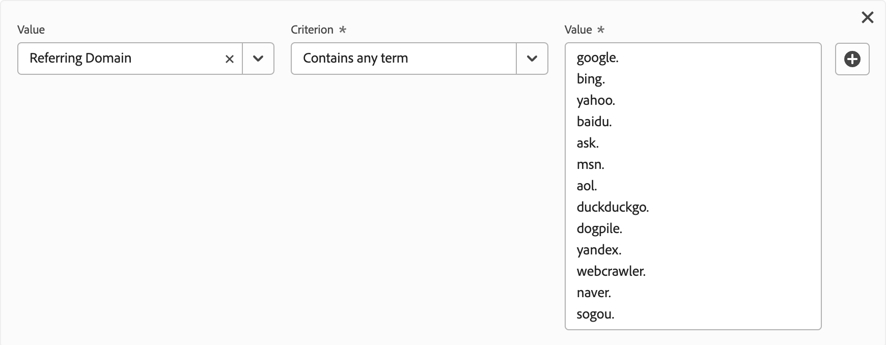

# 派生字段

派生字段是Adobe Customer Journey Analytics中实时报表功能的一个重要方面。 通过派生字段和可自定义的规则生成器，即可迅速定义（一般较为复杂的）数据操作。然后，您可以将该派生字段用作中的组件（量度或维度） [工作区](../../analysis-workspace/home.md) 或者甚至进一步将派生字段定义为中的组件 [数据视图](../data-views.md).

与在Customer Journey Analytics之外的其他位置转换或处理数据相比，派生字段可以节省大量时间和精力。 例如 [数据准备](https://experienceleague.adobe.com/docs/experience-platform/data-prep/home.html?lang=zh-Hans)， [数据Distiller](https://experienceleague.adobe.com/docs/experience-platform/query/data-distiller/overview.html)，或在您自己的提取转换加载(ETL)/提取加载转换(ELT)进程中。

派生字段可在以下位置定义： [数据视图](../data-views.md)基于一组定义为规则的函数，并应用于可用的标准和/或架构字段。

示例用例包括：

- 定义派生的“页面名称”字段，该字段可更正不正确收集的页面名称值以更正页面名称值。

- 定义派生的营销渠道字段，以根据一个或多个条件（例如URL参数、页面URL、页面名称）确定正确的营销渠道。

## 派生字段界面

创建或编辑派生字段时，使用派生字段界面。

|  | 名称 | 描述 |
|---------|----------|--------|
| 1 | **选择器** | 使用选择器区域选择您的函数、函数模板、架构字段或标准字段并将它们拖放到规则生成器中。  使用下拉菜单选择：   [!UICONTROL 函数]  — 列表可用 [函数](#function-reference)，   [!UICONTROL 函数模板]  — 列表可用 [函数模板](#function-templates)，    [!UICONTROL 架构字段]  — 列出数据集类别（事件、个人资料、查询）中可用的字段和以前定义的派生字段，以及   [!UICONTROL 标准字段]  — 标准可用字段（如Platform数据集ID）。 选择器中只显示字符串和数字标准字段。 如果函数支持其他数据类型，则可以为规则界面中的值或字段选择具有这些其他数据类型的标准字段。 您可以使用以下搜索功能、功能模板、架构和标准字段  搜索框。  可以通过选择来过滤所选对象列表  在中筛选和指定筛选器 [!UICONTROL 字段过滤条件] 对话框。 您可以使用轻松删除过滤器  用于每个过滤器。 |
| 2 | **规则生成器** | 您可以使用一个或多个规则按顺序构建派生字段。 规则是函数的特定实现，因此始终只与一个函数关联。 通过将函数拖放到规则生成器中来创建规则。 函数类型确定规则的接口。 请参阅 [规则界面](#rule-interface) 以了解更多信息。  您可以在规则生成器中已存在的规则的开始、结束或之间插入函数。 规则生成器中的最后一个规则可确定派生字段的最终输出。 |
| 3 | **[!UICONTROL **&#x200B;字段设置&#x200B;**]** | 您可以命名和描述派生字段并检查其字段类型。 |
| 4 | **[!UICONTROL **&#x200B;最终输出&#x200B;**]** | 此区域根据过去30天的数据以及您在规则生成器中对派生字段所做的更改，显示输出值的动态更新预览。 |

{style="table-layout:auto"}

## 字段模板向导

首次访问派生字段界面时， [!UICONTROL 从字段模板开始] 将显示向导。

1. 选择最能描述您尝试创建的字段类型的模板。
2. 选择 **[!UICONTROL **&#x200B;选择&#x200B;**]** 按钮以继续。

派生的字段对话框中填充了所选字段类型所需的或有用的规则（和函数）。 请参阅 [函数模板](#function-templates) 以了解有关可用模板的详细信息。

## 规则界面

在规则生成器中定义规则时，将使用规则界面。

|  | 名称 | 描述 |
|---------|----------|--------|
| A | **规则名称** | 默认情况下，规则名称为 **规则X** （X表示序列号）。 要编辑规则的名称，请选择其名称，然后键入新名称，例如 `Query Parameter`. |
| B | **函数名称** | 规则的选定函数名称，例如 [!UICONTROL URL解析]. 当函数是函数序列中的最后一个并确定最终输出值时，函数名称后面将跟有 [!UICONTROL  — 最终输出]例如 [!UICONTROL URL分析 — 最终输出].  要显示包含函数详细信息的弹出窗口，请选择 . |
| C | **规则描述** | 您可以选择向规则添加说明。 选择 ，然后选择 **[!UICONTROL **&#x200B;添加说明&#x200B;**]** 添加说明或 **[!UICONTROL **&#x200B;编辑描述&#x200B;**]** 编辑现有描述。 使用编辑器输入说明。 您可以使用工具栏设置文本格式（使用样式选择器、粗体、斜体、下划线、右、左、居中、颜色、数字列表、项目符号列表）并向外部信息添加链接。  要完成编辑说明，请单击编辑器外部的。 |
| D | **功能区域** | 定义函数的逻辑。 接口取决于函数的类型。 的下拉菜单 [!UICONTROL 字段] 或 [!UICONTROL 值] 根据函数期望的输入类型，显示所有类别的可用字段（规则、标准字段、字段）。 或者，您可以将架构和标准字段选择器中的字段拖放到字段或值中。 如果该拖动字段源自查找数据集，则将自动在定义的函数之前插入查找函数。  请参阅 [函数引用](#function-reference) 每个受支持功能的详细信息。 |

{style="table-layout:auto"}

## 创建派生字段

1. 选择现有数据视图或创建数据视图。 请参阅 [数据视图](../data-views.md) 以了解更多信息。

2. 选择 **[!UICONTROL **&#x200B;组件&#x200B;**]** 数据视图的选项卡。

3. 选择 **[!UICONTROL **&#x200B;创建派生字段&#x200B;**]** 从左边栏开始。

4. 要定义派生字段，请使用 [!UICONTROL 创建派生字段] 界面。 请参阅 [派生字段界面](#derived-field-interface).

   要保存新的派生字段，请选择 **[!UICONTROL **&#x200B;保存&#x200B;**]**.

5. 您的新派生字段将添加到 [!UICONTROL 派生字段>] 容器，作为的一部分 **[!UICONTROL **&#x200B;架构字段&#x200B;**]** 数据视图的左边栏中。

## 编辑派生字段

1. 选择现有数据视图。 请参阅 [数据视图](../data-views.md) 以了解更多信息。

2. 选择 **[!UICONTROL **&#x200B;组件&#x200B;**]** 数据视图的选项卡。

3. 选择 **[!UICONTROL **&#x200B;架构字段&#x200B;**]** 选项卡 [!UICONTROL 连接] 窗格在左边。

4. 选择 **[!UICONTROL **&#x200B;派生字段>**]** 容器。

5. 将鼠标悬停在要编辑的派生字段上，然后选择 .

6. 要编辑派生字段，请使用 [!UICONTROL 编辑派生字段] 界面。 请参阅 [派生字段界面](#derived-field-interface).

   - 选择 **[!UICONTROL **&#x200B;保存&#x200B;**]** 以保存更新的派生字段。

   - 选择 **[!UICONTROL **&#x200B;取消&#x200B;**]** 以取消对派生字段所做的任何更改。

   - 选择 **[!UICONTROL **&#x200B;另存为&#x200B;**]** 将派生字段另存为新的派生字段。 新的派生字段与原始编辑的派生字段具有相同的名称 `(copy)` 已添加到其中。

或者，如果您已将派生字段用作数据视图中维度或量度的组件：

1. 选择组件。 请注意，组件的名称可能与派生字段不同。

1. 在组件面板中，选择  位于派生字段旁边的架构字段名称下。

1. 要编辑派生字段，请使用 [!UICONTROL 编辑派生字段] 界面。 请参阅 [派生字段界面](#derived-field-interface).

   - 选择 **[!UICONTROL **&#x200B;保存&#x200B;**]** 以保存更新的派生字段。

   - 选择 **[!UICONTROL **&#x200B;取消&#x200B;**]** 以取消对派生字段所做的任何更改。

   - 选择 **[!UICONTROL **&#x200B;另存为&#x200B;**]** 将派生字段另存为新的派生字段。 新的派生字段与原始编辑的派生字段具有相同的名称 `(copy)` 已添加到其中。

## 删除派生字段

1. 选择现有数据视图。 请参阅 [数据视图](../data-views.md) 以了解更多信息。

2. 选择 **[!UICONTROL **&#x200B;组件&#x200B;**]** 数据视图的选项卡。

3. 选择 **[!UICONTROL **&#x200B;架构字段&#x200B;**]** tab in [!UICONTROL 连接] 窗格。

4. 选择 **[!UICONTROL **&#x200B;派生字段>**]** 容器。

5. 将鼠标悬停在要删除的派生字段上，然后选择 .

6. 在 [!UICONTROL 编辑派生字段] 界面，选择 **[!UICONTROL 删除]**.

   A [!UICONTROL 删除组件] 对话框要求您确认删除。 考虑对数据视图外部的派生字段可能存在的任何外部引用。

   - 选择 **[!UICONTROL **&#x200B;继续&#x200B;**]** 以删除派生字段。

或者，如果您已将派生字段用作数据视图中维度或量度的组件：

1. 选择组件。 请注意，组件的名称可能与派生字段不同。

1. 在组件面板中，选择  位于派生字段旁边的架构字段名称下。

1. 在 [!UICONTROL 编辑派生字段] 界面，选择 **[!UICONTROL 删除]**.

   A [!UICONTROL 删除组件] 对话框要求您确认删除。 考虑对数据视图外部的派生字段可能存在的任何外部引用。

   - 选择 **[!UICONTROL **&#x200B;继续&#x200B;**]** 以删除派生字段。

>[!NOTE]
>
>派生字段在Customer Journey Analytics中的连接级别进行管理。 对与该连接关联的任何数据视图中派生字段所做的任何更改将应用于所有这些关联的数据视图。

## 函数模板

要快速为特定用例创建派生字段，可以使用函数模板。 这些函数模板可以从派生字段界面的选择器区域访问，或者在首次使用时显示在中 [!UICONTROL 从字段模板开始] 向导。

### 营销渠道

此函数模板使用规则集合来构建营销渠道。

+++ 详细信息

要使用模板，必须为作为模板规则的一部分列出的每个函数指定正确的参数。 请参阅 [函数引用](#function-reference) 以了解更多信息。

+++

### 退信数

此函数模板使用规则集合来标识网站退回。

+++ 详细信息

要使用模板，必须为作为模板规则的一部分列出的每个函数指定正确的参数。 请参阅 [函数引用](#function-reference) 以了解更多信息。

+++

### 多维度合并

此函数模板将两个值合并为一个。

+++ 详细信息

要使用模板，必须为作为模板规则的一部分列出的每个函数指定正确的参数。 请参阅 [函数引用](#function-reference) 以了解更多信息。

+++

### 简单易记的数据集名称

此函数模板提供了一个可读的数据集名称。

+++ 详细信息

要使用模板，必须为作为模板规则的一部分列出的每个函数指定正确的参数。 请参阅 [函数引用](#function-reference) 以了解更多信息。

+++

### URL 中的页面名称

此函数模板创建一个简单的页面名称。

+++ 详细信息

要使用模板，必须为作为模板规则的一部分列出的每个函数指定正确的参数。 请参阅 [函数引用](#function-reference) 以了解更多信息。

+++

### 节假日

此函数模板对每年的关键时间进行分类。

+++ 详细信息

要使用模板，必须为作为模板规则的一部分列出的每个函数指定正确的参数。 请参阅 [函数引用](#function-reference) 以了解更多信息。

+++

### 每月目标

此函数模板可设置自定义的每月目标。

+++ 详细信息

要使用模板，必须为作为模板规则的一部分列出的每个函数指定正确的参数。 请参阅 [函数引用](#function-reference) 以了解更多信息。

+++

### 获取带分隔符的列表中的所有值

此函数模板将受限列表转换为数组。

+++ 详细信息

要使用模板，必须为作为模板规则的一部分列出的每个函数指定正确的参数。 请参阅 [函数引用](#function-reference) 以了解更多信息。

+++

### 获取带分隔符的列表中的第一个值

此函数模板获取分隔列表中的第一个值。

+++ 详细信息

要使用模板，必须为作为模板规则的一部分列出的每个函数指定正确的参数。 请参阅 [函数引用](#function-reference) 以了解更多信息。

+++

### 获取带分隔符的列表中的最后一个值

此函数模板获取分隔列表中的最后一个值。

+++ 详细信息

要使用模板，必须为作为模板规则的一部分列出的每个函数指定正确的参数。 请参阅 [函数引用](#function-reference) 以了解更多信息。

+++

### 域名

此函数模板使用正则表达式提取域名。

+++ 详细信息

要使用模板，必须为作为模板规则的一部分列出的每个函数指定正确的参数。 请参阅 [函数引用](#function-reference) 以了解更多信息。

+++

### 获取查询字符串参数

此函数模板可提取查询字符串值。

+++ 详细信息

要使用模板，必须为作为模板规则的一部分列出的每个函数指定正确的参数。 请参阅 [函数引用](#function-reference) 以了解更多信息。

+++

### 转换字段

此函数模板可将报告从一个字段转移到另一个字段。

+++ 详细信息

要使用模板，必须为作为模板规则的一部分列出的每个函数指定正确的参数。 请参阅 [函数引用](#function-reference) 以了解更多信息。

+++

### 简单易用的机器人检测

此函数模板实现了轻量级机器人识别。

+++ 详细信息

要使用模板，必须为作为模板规则的一部分列出的每个函数指定正确的参数。 请参阅 [函数引用](#function-reference) 以了解更多信息。

+++

### 退出链接

此函数模板可识别会话中最后点击的链接。

+++ 详细信息

要使用模板，必须为作为模板规则的一部分列出的每个函数指定正确的参数。 请参阅 [函数引用](#function-reference) 以了解更多信息。

+++

### 下载链接

此函数模板可标记常见的下载链接。

+++ 详细信息

要使用模板，必须为作为模板规则的一部分列出的每个函数指定正确的参数。 请参阅 [函数引用](#function-reference) 以了解更多信息。

+++

<!--

+++ Data clean up template

>[!WARNING]
>
>Could not find any information on this template.
+++

-->

## 函数引用

{{select-package}}

对于每个支持的功能，请在下面查找有关以下内容的详细信息：

- 规范：
   - 输入数据类型：支持的数据类型，
   - 输入：输入的可能值，
   - 包含的运算符：此函数支持的运算符（如果有）、
   - 限制：适用于此特定函数的限制，
   - 输出。

- 用例，包括：
   - 定义派生字段之前的数据，
   - 如何定义派生字段，
   - 定义派生字段后的数据。

- 约束（如果适用）。

>[!NOTE]
>
>Lookup函数已重命名为 [分类](#classify). 请参阅 [分类](#classify) 函数以获取更多信息。

<!-- CASE WHEN -->

### Case When

根据一个或多个字段中的定义条件应用条件。 然后，使用这些标准根据条件的顺序定义新派生字段中的值。

+++ 详细信息

## 规范 {#casewhen-io}

| 输入数据类型 | 输入 | 包含的运算符 | 限制 | 输出 |
|---|---|---|---|---|
| <ul><li>字符串</li><li>数值</li><li>日期</li></ul> | <ul><li>[!UICONTROL 如果]， [!UICONTROL 否则，如果] 容器：
<ul><li>[!UICONTROL 值]</li><ul><li>规则</li><li>标准字段</li><li>字段</li></ul><li>[!UICONTROL 标准] （请参阅包含的运算符，基于选定的值类型）</li></ul></li><li>[!UICONTROL 然后将值设置为]， [!UICONTROL 否则，将值设置为]：
<ul><li>[!UICONTROL 值]</li><ul><li>规则</li><li>标准字段</li><li>字段</li></ul></ul></li></ul> | 
字符串
<ul><li>等于</li><li>等于任何词语</li><li>包含该短语</li><li>包含任何词语</li><li>包含所有词语</li><li>开始于</li><li>以任意术语开头</li><li>结束于</li><li>以任意术语结束</li><li>不等于</li><li>不等于任何词语</li><li>不包含该短语</li><li>不包含任何词语</li><li>不包含所有词语</li><li>未始于</li><li>不以任何术语开头</li><li>未止于</li><li>未以任何术语结尾</li><li>已设置</li><li>未设置</li></ul>
数值
<ul><li>等于</li><li>不等于</li><li>高于</li><li>高于或等于</li><li>低于</li><li>低于或等于</li><li>已设置</li><li>未设置</li></ul>
日期
<ul><li>等于</li><li>不等于</li><li>晚于</li><li>晚于或等于</li><li>早于</li><li>早于或等于</li><li>已设置</li><li>未设置</li></ul> | <ul><li>每个派生字段5个函数</li><li>200 [运算符](#operators) 每个派生字段。 例如，单个运算符为“反向链接域包含google”。 </li></ul> | 
新建派生字段
 |

{style="table-layout:auto"}

## 用例1 {#casewhen-uc1}

您需要定义规则以标识各种营销渠道，方法是应用层叠逻辑将营销渠道字段设置为适当的值：

- 如果反向链接来自搜索引擎且页面具有一个查询字符串值，其中 `cid` 包含 `ps_`，营销渠道应标识为 [!DNL *付费搜索*].
- 如果反向链接来自搜索引擎且页面没有查询字符串 `cid`，营销渠道应标识为 [!DNL *免费搜索*].
- 如果页面具有查询字符串值，其中 `cid` 包含 `em_`，营销渠道应标识为 [!DNL *电子邮件*].
- 如果页面具有查询字符串值，其中 `cid` 包含 `ds_`，营销渠道应标识为 [!DNL *显示广告*].
- 如果页面具有查询字符串值，其中 `cid` 包含 `so_`，营销渠道应标识为 [!DNL *付费社交*].
- 如果反向链接来自的反向链接域 [!DNL twitter.com]， [!DNL facebook.com]， [!DNL linkedin.com]，或 [!DNL tiktok.com]，营销渠道应标识为 [!DNL *自然社交*].
- 如果上述规则都不匹配，则应将营销渠道标识为 [!DNL *其他反向链接*].

如果您的站点收到以下示例事件，包含 [!UICONTROL 反向链接] 和 [!UICONTROL 页面URL]，这些事件的标识如下：

| [!DNL Event] | [!DNL Referrer] | [!DNL Page URL] | [!DNL Marketing Channel] |
|:--:|----|----|----|
| 1 | `https://facebook.com` | `https://site.com/home` | [!DNL Natural Social] |
| 2 | `https://abc.com` | `https://site.com/?cid=ds_12345678` | [!DNL Display] |
| 3 | | `https://site.com/?cid=em_12345678` | [!DNL Email] |
| 4 | `https://google.com` | `https://site.com/?cid=ps_abc098765` | [!DNL Paid Search] |
| 5 | `https://google.com` | `https://site.com/?cid=em_765544332` | [!DNL Email] |
| 6 | `https://google.com` |  | [!DNL Natural Search] |

{style="table-layout:auto"}

### 数据早于 {#casewhen-uc1-databefore}

| [!DNL Referrer] | [!DNL Page URL] |
|----|----|
| `https://facebook.com` | `https://site.com/home` |
| `https://abc.com` | `https://site.com/?cid=ds_12345678` |
|  | `https://site.com/?cid=em_12345678` |
| `https://google.com` | `https://site.com/?cid=ps_abc098765` |
| `https://google.com` | `https://site.com/?cid=em_765544332` |
| `https://google.com` | |

{style="table-layout:auto"}

### 派生字段 {#casewhen-uc1-derivedfield}

您定义新的 `Marketing Channel` 派生字段。 您使用 [!UICONTROL 案例条件] 函数定义规则，这些规则根据两者的现有值为创建值 `Page URL` 和 `Referring URL` 字段。

注意函数的用法 [!UICONTROL URL解析] 定义规则以获取值 `Page Url` 和 `Referring Url` 早于 [!UICONTROL 案例条件] 应用规则。

### 之后的数据 {#casewhen-uc1-dataafter}

| [!DNL Marketing Channel] |
|----|
| [!DNL Natural Social] |
| [!DNL Display] |
| [!DNL Email] |
| [!DNL Paid Search] |
| [!DNL Email] |
| [!DNL Natural Search] |

{style="table-layout:auto"}

## 用例2 {#casewhen-uc2}

您已收集了您的网站中搜索的多个不同变体 [!DNL Product Finding Methods] 维度。 要了解搜索与浏览的整体性能，您必须花费大量时间手动组合结果。

您的网站为收集以下值 [!DNL Product Finding Methods] 维度。 最后，所有这些值都表示搜索。

| 收集的值 | 实际值 |
|---|---|
| [!DNL search p13n_no] | [!DNL search] |
| [!DNL search p13n_yes] | [!DNL search] |
| [!DNL search refine p13n_no] | [!DNL search] |
| [!DNL search refine p13n_yes] | [!DNL search] |
| [!DNL search redirect p13n_yes] | [!DNL search] |
| [!DNL search-redirect] | [!DNL search] |

{style="table-layout:auto"}

### 数据早于 {#casewhen-uc2-databefore}

| [!DNL Product Finding Methods] |
|----|
| [!DNL search p13_no] |
| [!DNL search p13_yes] |
| [!DNL browse] |
| [!DNL search refine p13_no] |
| [!DNL search refine p13_yes] |
| [!DNL browse] |
| [!DNL search redirect p13_yes] |
| [!DNL search-redirect] |
| [!DNL browse] |

{style="table-layout:auto"}

### 派生字段 {#casewhen-uc2-derivedfield}

您定义 `Product Finding Methods (new)` 派生字段。 您可以创建以下内容 [!UICONTROL 案例条件] 规则生成器中的规则。 这些规则将逻辑应用于旧版本的所有可能变体 [!UICONTROL 产品查找方法] 字段值 `search` 和 `browse` 使用 [!UICONTROL 包含短语] 标准。

### 之后的数据 {#casewhen-uc2-dataafter}

| [!DNL Product Finding Methods (new)] |
|----|
| [!DNL search] |
| [!DNL search] |
| [!DNL browse] |
| [!DNL search] |
| [!DNL search] |
| [!DNL browse] |
| [!DNL search] |
| [!DNL search] |
| [!DNL browse] |

{style="table-layout:auto"}

## 用例3 {#casewhen-uc3}

作为一家旅游公司，您想要为预订的旅行设置分段旅行持续时间，以便报告分段旅行时长。

假设：

- 组织正在将行程持续时间收集到数值字段中。
- 他们希望将1-3天的持续时间存储到名为&#39;的存储桶中[!DNL short trip]’
- 他们希望将4-7天的持续时间存储到名为&#39;的存储桶中。[!DNL medium trip]’
- 他们希望将8天以上的持续时间存储到名为&#39;的存储桶中[!DNL long trip]’
- 预订了132次旅行，为期1天
- 预订了110次旅行，为期2天
- 预订了105次旅行，为期3天
- 预订了99次4天旅行
- 预订了92次旅行，为期5天
- 预订了85次旅行，为期6天
- 预订了82次旅行，为期7天
- 预订了78次旅行，为期8天
- 预订了50次旅行，为期9天
- 预订了44次旅行，为期10天
- 预订了38次旅行，为期11天
- 预订了31次旅行，为期12天

您所需的报表应如下所示：

| [!DNL Trip Duration Type] | [!DNL Bookings] |
|----|---:|
| [!DNL medium trip] | 358 |
| [!DNL short trip] | 347 |
| [!DNL long trip] | 241 |

{style="table-layout:auto"}

### 数据早于 {#casewhen-uc3-databefore}

| [!DNL Trip Duration] |
|---:|
| 1 |
| 12 |
| 3 |
| 6 |
| 4 |
| 8 |
| 6 |
| 2 |
| 1 |
| 2 |
| 21 |
| 8 |

### 派生字段 {#casewhen-uc3-derivedfield}

您定义 `Trip Duration (bucketed)` 派生字段。 您可以创建以下内容 [!UICONTROL 案例条件] 规则生成器的规则。 此规则将逻辑应用于存储旧的 [!UICONTROL 行程持续时间] 字段值分为三个值： `short trip`， `medium  trip`、和 `long trip`.

### 之后的数据 {#casewhen-uc3-dataafter}

| [!DNL Trip Duration (bucketed)] |
|---|
| [!DNL short trip] |
| [!DNL long trip] |
| [!DNL short trip] |
| [!DNL medium trip] |
| [!DNL medium trip] |
| [!DNL long trip] |
| [!DNL medium trip] |
| [!DNL short trip] |
| [!DNL short trip] |
| [!DNL short trip] |
| [!DNL long trip] |
| [!DNL long trip] |

## 更多信息

Customer Journey Analytics使用嵌套容器结构，按照Adobe Experience Platform的样式建模 [XDM](https://experienceleague.adobe.com/cn/docs/experience-platform/xdm/home.html?lang=zh-Hans) （体验数据模型）。 请参阅 [容器](../create-dataview.md#containers) 和 [过滤器容器](../../components/filters/filters-overview.md#filter-containers) 了解更多背景信息。 此容器模型虽然本质上较为灵活，但在使用规则生成器时施加了一些限制。

Customer Journey Analytics使用以下默认容器模型：

以下约束适用，并且强制执行 *选择* 和 *设置* 值。

|  | 限制 |
|:---:|----|
| **A** | 对您的评价 *选择* 在同一个 [!UICONTROL 如果]， [!UICONTROL 否则，如果] 构造(使用 [!UICONTROL 和] 或 [!UICONTROL 或])，并且可以是任何类型（字符串） ，数值 ，等等)。   |
| **B** | 您所有的值 *设置* 跨规则必须来自同一容器并具有相同类型或相同类型的派生值。    |
| **C** | 您的值 *选择* 跨 [!UICONTROL 如果]， [!UICONTROL 否则，如果] 规则中的构造 *非* 必须来自同一容器，并且 *非* 必须是同一种类型。    |

{style="table-layout:auto"}

+++

<!-- CLASSIFY -->

### 分类

定义由新派生字段中的相应值替换的一组值。

+++ 详细信息

>[!NOTE]
>
>此函数最初名为Lookup ，但已重命名为Classification ，以适应具有不同功能的Lookup函数。

## 规范 {#classify-io}

| 输入数据类型 | 输入 | 包含的运算符 | 限制 | 输出 |
|---|---|---|---|---|
| <ul><li>字符串</li><li>数值</li><li>日期</li></ul> | <ul><li>[!UICONTROL 要分类的字段]：<ul><li>规则</li><li>标准字段</li><li>字段</li></ul></li><li>[!UICONTROL 当值等于] 和 [!UICONTROL 替换值为]：
<ul><li>字符串</li></ul><li>显示原始值<ul><li>布尔值</li></ul></li></ul> | 
不适用
 | <ul><li>每个派生字段5个函数</li><li>200 [运算符](#operators) 每个派生字段。 每个条目 [!UICONTROL 当值等于原始值时] [!UICONTROL 用新值替换值] 被视为一项操作。</li></ul> | 
新建派生字段
 |

{style="table-layout:auto"}

## 用例1 {#classify-uc1}

您的CSV文件确实包含键列 `hotelID` 以及与 `hotelID`： `city`， `rooms`， `hotel name`.
您正在收集 [!DNL Hotel ID] 但想要创建 [!DNL Hotel Name] 维派生自 `hotelID` 在CSV文件中。

**CSV文件结构和内容**

| [!DNL hotelID] | [!DNL city] | [!DNL rooms] | [!DNL hotel name] |
|---|---|---:|---|
| [!DNL SLC123] | [!DNL Salt Lake City] | 40 | [!DNL SLC Downtown] |
| [!DNL LAX342] | [!DNL Los Angeles] | 60 | [!DNL LA Airport] |
| [!DNL SFO456] | [!DNL San Francisco] | 75 | [!DNL Market Street] |
| [!DNL AMS789] | [!DNL Amsterdam] | 50 | [!DNL Okura] |

{style="table-layout:auto"}

**当前报告**

| [!DNL Hotel ID] | 产品查看次数 |
|---|---:|
| [!DNL SLC123] | 200 |
| [!DNL LX342] | 198 |
| [!DNL SFO456] | 190 |
| [!DNL AMS789] | 150 |

{style="table-layout:auto"}

**所需报告**

| [!DNL Hotel Name] | 产品查看次数 |
|----|----:|
| [!DNL SLC Downtown] | 200 |
| [!DNL LA Airport] | 198 |
| [!DNL Market Street] | 190 |

{style="table-layout:auto"}

### 数据早于 {#classify-uc1-databefore}

| [!DNL Hotel ID] |
|----|
| [!DNL SLC123] |
| [!DNL LAX342] |
| [!DNL SFO456] |
| [!DNL AMS789] |

{style="table-layout:auto"}

### 派生字段 {#classify-uc1-derivedfield}

您定义 `Hotel Name` 派生字段。 您使用 [!UICONTROL 分类] 函数定义一个规则，在其中可以对 [!UICONTROL 酒店ID] 字段并使用新值替换。

如果要包含尚未定义为要分类的值的一部分的原始值（例如，Hotel ID AMS789），请确保选择 **[!UICONTROL 显示原始值]**. 这可确保AMS789是派生字段输出的一部分，即使该值未进行分类。

### 之后的数据 {#classify-uc1-dataafter}

| [!DNL Hotel Name] |
|----|
| [!DNL SLC Downtown] |
| [!DNL LA Airport] |
| [!DNL Market Street] |

{style="table-layout:auto"}

## 用例2 {#classify-uc2}

您已收集了多个页面的URL，而不是友好页面名称。 此混合值集合将破坏报表。

### 数据早于 {#classify-uc2-databefore}

| [!DNL Page Name] |
|---|
| [!DNL Home Page] |
| [!DNL Flight Search] |
| `http://www.adobetravel.ca/Hotel-Search` |
| `https://www.adobetravel.com/Package-Search` |
| [!DNL Deals & Offers] |
| `http://www.adobetravel.ca/user/reviews` |
| `https://www.adobetravel.com.br/Generate-Quote/preview` |

{style="table-layout:auto"}

### 派生字段 {#classify-uc2-derivedfield}

您定义 `Page Name (updated)` 派生字段。 您使用 [!UICONTROL 分类] 函数以定义一个规则，您可以通过该规则对现有 [!UICONTROL 页面名称] 字段并替换为更新的正确值。

### 之后的数据 {#classify-uc2-dataafter}

| [!DNL Page Name (updated)] |
|---|
| [!DNL Home Page] |
| [!DNL Flight Search] |
| [!DNL Hotel Search] |
| [!DNL Package Search] |
| [!DNL Deals & Offers] |
| [!DNL Reviews] |
| [!DNL Generate Quote] |

## 更多信息 {#classify-moreinfo}

分类规则界面中提供了以下附加功能：

- 要快速清除所有表值，请选择  **[!UICONTROL 清除所有表值]**.
- 要上载包含原始值（当值等于时）和新值（将值替换为）的CSV文件，请选择  **[!UICONTROL 上传CSV]**.
- 要下载用于创建具有要上传的原始值和新值的CSV文件的模板，请选择  **[!UICONTROL 下载CSV模板]**.
- 要下载包含规则界面中填充的所有原始值和新值的CSV文件，请选择  **[!UICONTROL 下载CSV值]**.

+++

<!-- CONCATENATE -->

### 拼接

使用定义的分隔符将字段值组合到一个新的派生字段中。

+++ 详细信息

## 规范 {#concatenate-io}

| 输入数据类型 | 输入 | 包含的运算符 | 限制 | 输出 |
|---|---|---|---|---|
| <ul><li>字符串</li></ul> | <ul><li>[!UICONTROL 值]：<ul><li>规则</li><li>标准字段</li><li>字段</li><li>字符串</li></ul></li><li>[!UICONTROL 分隔符]：<ul><li>字符串</li></ul></li> </ul> | 
不适用
 | 
每个派生字段有2个函数
 | 
新建派生字段
 |

{style="table-layout:auto"}

## 用例 {#concatenate-uc}

您当前收集起源机场代码和目的地机场代码作为单独的字段。 您希望将这两个字段合并为一个维度，并以连字符(-)分隔。 因此，您可以分析来源和目的地的组合，以确定预订的排名最前的路由。

假设：

- 原始值和目标值收集在同一表中的单独字段中。
- 用户决定在值之间使用分隔符“ — ”。

想象一下会发生以下预订：

- 客户ABC123预订盐湖城(SLC)和奥兰多(MCO)之间的航班
- 客户ABC456预订盐湖城(SLC)和洛杉矶(LAX)之间的航班
- 客户ABC789预订盐湖城(SLC)和西雅图(SEA)之间的航班
- 客户ABC987预订盐湖城(SLC)和圣何塞(SJO)之间的航班
- 客户ABC654预订盐湖城(SLC)和奥兰多(MCO)之间的航班

所需报表应如下所示：

| 来源/目标 | 预订 |
|----|---:|
| SLC-MCO | 2 |
| SLC-LAX | 1 |
| SLC-SEA | 1 |
| SLC-SJO | 1 |

{style="table-layout:auto"}

### 数据早于 {#concatenate-uc-databefore}

| Origin | 目标 |
|----|---:|
| SLC | MCO |
| SLC | LAX |
| SLC | SEA |
| SLC | SJO |
| SLC | MCO |

{style="table-layout:auto"}

### 派生字段 {#concatenate-derivedfield}

您定义新的 [!UICONTROL 来源 — 目标] 派生字段。 您使用 [!UICONTROL 拼接] 函数来定义用于连接的规则 [!UICONTROL 原有] 和 [!UICONTROL 目标] 字段使用 `-` [!UICONTROL 分隔符].

### 之后的数据 {#concatenate-dataafter}

| 来源 — 目标 （派生字段） |
|---|
| SLC-MCO |
| SLC-LAX |
| SLC-SEA |
| SLC-SJO |
| SLC-MCO |

{style="table-layout:auto"}

+++

<!-- FIND AND REPLACE -->

### 查找和替换

查找选定字段中的所有值，并在新的派生字段中用不同的值替换这些值。

+++ 详细信息

## 规范 {#findreplace-io}

| 输入数据类型 | 输入 | 包含的运算符 | 限制 | 输出 |
|---|---|---|---|---|
| <ul><li>字符串</li></ul> | <ul><li>[!UICONTROL 值]<ul><li>规则</li><li>标准字段</li><li>字段</li></ul></li><li>[!UICONTROL 查找全部]， [!UICONTROL 并将其全部替换为]：<ul><li>字符串</li></ul></li></ul></ul> | 
字符串
<ul><li>[!UICONTROL 查找全部]， [!UICONTROL 并将其全部替换为]</li></ul> | 
每个派生字段5个函数
 | 
新建派生字段
 |

{style="table-layout:auto"}

## 用例 {#findreplace-uc}

例如，您收到的外部营销渠道报表值格式不正确 `email%20 marketing` 而不是 `email marketing`. 这些格式错误的值会断开您的报表，并使得查看电子邮件执行情况的难度增加。 要替换 `email%20marketing` 替换为 `email marketing`.

**原始报告**

| [!DNL External Marketing Channels] | [!DNL Sessions] |
|---|--:|
| [!DNL email marketing] | 500 |
| [!DNL email %20marketing] | 24 |

{style="table-layout:auto"}

**首选报告**

| [!DNL External Marketing Channels] | [!DNL Sessions] |
|---|--:|
| [!DNL email marketing] | 524 |

### 数据早于 {#findreplace-uc-databefore}

| [!DNL External Marketing] |
|----|
| [!DNL email marketing] |
| [!DNL email%20marketing] |
| [!DNL email marketing] |
| [!DNL email marketing] |
| [!DNL email%20marketing] |

{style="table-layout:auto"}

### 派生字段 {#findreplace-uc-derivedfield}

您定义 `Email Marketing (updated)` 派生字段。 您使用 [!UICONTROL 查找和替换] 函数来定义查找和替换所有出现的规则 `email%20marketing` 替换为 `email marketing`.

### 之后的数据 {#findreplace-uc-dataafter}

| [!DNL External Marketing (updated)] |
|----|
| [!DNL email marketing] |
| [!DNL email marketing] |
| [!DNL email marketing] |
| [!DNL email marketing] |
| [!DNL email marketing] |

{style="table-layout:auto"}

+++

<!-- LOOKUP -->

### 查询

使用查找数据集中的字段查找值，并在新的派生字段中返回值或用于进一步规则处理。

+++ 详细信息

## 规范 {#lookup-io}

| 输入数据类型 | 输入 | 包含的运算符 | 限制 | 输出 |
|---|---|---|---|---|
| <ul><li>字符串</li><li>数值</li><li>日期</li></ul> | <ul><li>[!UICONTROL 要应用查找的字段]：</li><ul><li>规则</li><li>标准字段</li><li>字段</li></ul><li>[!UICONTROL 查找数据集]</li><ul><li>数据集</li></ul><li>[!UICONTROL 匹配键]<ul><li>规则</li><li>字段</li></ul></li><li>要返回的值<ul><li>规则</li><li>字段</li></ul></li></ul> | 
不适用
 | 
每个派生字段3个函数
 | 
用于下一步规则中进一步处理的新派生字段或值
 |

{style="table-layout:auto"}

## 用例 {#lookup-uc}

您希望使用在您的客户单击通过Adobe Target显示的个性化横幅时收集的活动ID查找活动名称。 要将查找数据集用于Analytics for Target (A4T)活动，其中包含活动ID和活动名称。

### A4T查找数据集 {#lookup-uc-lookup}

| 活动ID | 活动名称 |
|---|---|
| 415851 | MVT测试类别页面 |
| 415852 | Luma - Campaign Max 2022 |
| 402922 | 主页横幅 |

{style="table-layout:auto"}

### 派生字段 {#lookup-uc-derivedfield}

您定义 `Activity Name` 派生字段。 您使用 [!UICONTROL 查找] 函数来定义一个规则，以从收集的数据中查找值，该值在 [!UICONTROL 要应用查找的字段] 字段(例如 **[!DNL ActivityIdentifier]**)。 您可以从中选择查找数据集 [!UICONTROL 查找数据集] 列表(例如 **[!DNL New CJA4T Activities]**)。 然后选择标识符字段(例如 **[!DNL ActivityIdentifier]**)中的 [!UICONTROL 匹配键] 列表和要从返回的字段 [!UICONTROL 要返回的值] 列表(例如 **[!DNL ActivityName]**)。

## 更多信息

您可以快速插入 [!UICONTROL 查找] 函数中，已包含一个或多个其他函数。

1. 选择 **[!UICONTROL 架构字段]** 从选择器中。
1. 选择  **[!UICONTROL 查找数据集]**.
1. 选择您的查找数据集并查找要用于查找的字段。
1. 将查找字段拖放到函数的任何可用输入字段上（例如Case When）。 有效时，将显示一个蓝色方框，标记为 **[!UICONTROL +添加]**，允许您删除该字段，并在放置查找字段的函数之前自动插入查找函数。 插入的Lookup函数将自动填充所有字段的相关值。
   

+++

<!-- LOWERCASE -->

### 小写

将字段中的值转换为小写，并将其存储到新的派生字段中。

+++ 详细信息

## 规范 {#lowercase-io}

| 输入数据类型 | 输入 | 包含的运算符 | 限制 | 输出 |
|---|---|---|---|---|
| <ul><li>字符串</li><li>数值</li><li>日期</li></ul> | <ul><li>[!UICONTROL 字段]：</li><ul><li>规则</li><li>标准字段</li><li>字段</li></ul> | 
不适用
 | 
每个派生字段有2个函数
 | 
新建派生字段
 |

{style="table-layout:auto"}

## 用例 {#lowercase-uc}

您希望将所有收集的产品名称转换为小写以便正确报告。

### 数据早于 {#lowercase-uc-databefore}

| 收集的产品名称 | 产品查看次数 |
|---|---:|
| 网球拍 | 35 |
| 网球拍 | 33 |
| 网球拍 | 21 |
| 棒球棒 | 15 |
| 棒球棒 | 12 |
| 棒球棒 | 10 |

{style="table-layout:auto"}

### 派生字段 {#lowercase-uc-derivedfield}

您定义 `Product Names` 派生字段。 您使用 [!UICONTROL 小写] 函数来定义一个规则，以将 [!UICONTROL 收集的产品名称] 字段转换为小写并将其存储在新的派生字段中。

### 之后的数据 {#lowercase-uc-dataafter}

| 产品名称 | 产品查看次数 |
|---|---|
| 网球拍 | 89 |
| 棒球棒 | 37 |

{style="table-layout:auto"}

+++

<!-- MERGE FIELDS -->

### 合并字段

将来自两个不同字段的值合并到一个新的派生字段中。

+++ 详细信息

## 规范 {#merge-fields-io}

| 输入数据类型 | 输入 | 包含的运算符 | 限制 | 输出 |
|---|---|---|---|---|
| <ul><li>字符串</li><li>数值</li><li>日期</li></ul> | <ul><li>[!UICONTROL 字段]：</li><ul><li>规则</li><li>标准字段</li><li>字段</li></ul> | 
不适用
 | 
每个派生字段5个函数
 | 
新建派生字段
 |

{style="table-layout:auto"}

## 用例 {#merge-fields-uc}

您要创建一个由页面名称字段和致电原因字段组成的维度，以便跨渠道分析历程。

### 数据早于 {#merge-fields-uc-databefore}

| 页面名称 | 会话 | 访客 |
|---|--:|--:|
| 帮助页面 | 250 | 200 |
| 主页 | 500 | 250 |
| 产品详细信息页面 | 300 | 200 |

{style="table-layout:auto"}

| 来电原因 | 会话 | 访客 |
|---|--:|--:|
| 有关我的订单的问题 | 275 | 250 |
| 更改我的订单 | 150 | 145 |
| 排序问题 | 100 | 95 |

{style="table-layout:auto"}

### 派生字段 {#merge-fields-uc-derivedfield}

您定义 `Cross Channel Interactions` 派生字段。 您使用 [!UICONTROL 合并字段] 函数来定义规则，以合并来自 [!UICONTROL 页面名称] 字段和 [!UICONTROL 来电原因] 并将其存储在新的派生字段中。

### 之后的数据 {#merge-fields-uc-dataafter}

| 跨渠道交互 | 会话 | 访客 |
|---|--:|--:|
| 主页 | 500 | 250 |
| 产品详细信息页面 | 300 | 200 |
| 有关我的订单的问题 | 275 | 250 |
| 帮助页面 | 250 | 200 |
| 更改我的订单 | 150 | 145 |
| 排序问题 | 100 | 95 |

{style="table-layout:auto"}

## 更多信息 {#merge-fields-moreinfo}

您必须在“合并字段”规则中选择相同类型的字段。 例如，如果您选择日期字段，则要合并的所有其他字段都必须为日期字段。

+++

<!-- REGEX REPLACE -->

### 正则表达式替换

使用正则表达式将字段中的值替换为新派生字段。

+++ 详细信息

## 规范 {#regex-replace-io}

| 输入数据类型 | 输入 | 包含的运算符 | 限制 | 输出 |
|---|---|---|---|---|
| <ul><li>字符串</li><li>数值</li></ul> | <ul><li>[!UICONTROL 字段]：</li><ul><li>规则</li><li>标准字段</li><li>字段</li></ul></ul><ul><li>[!UICONTROL 正则表达式]：</li><ul><li>字符串</li></ul></li><li>[!UICONTROL 输出格式]：<ul><li>字符串</li></ul></ul><ul><li>区分大小写</li><ul><li>布尔值</li></ul></li></ul></li> | 
不适用
 | 
每个派生字段有1个函数
 | 
新建派生字段
 |

{style="table-layout:auto"}

## 用例 {#regex-replace-uc}

您希望获取URL的一个部分，并将其用作分析流量的唯一页面标识符。 您使用 `[^/]+(?=/$|$)` 用于捕获URL结尾的正则表达式，以及 `$1` 作为输出模式。

### 数据早于 {#regex-replace-uc-databefore}

| 页面 URL |
|---|
| `https://business.adobe.com/products/analytics/adobe-analytics-benefits.html` |
| `https://business.adobe.com/products/analytics/adobe-analytics.html` |
| `https://business.adobe.com/products/experience-platform/customer-journey-analytics.html` |
| `https://business.adobe.com/products/experience-platform/adobe-experience-platform.html` |

{style="table-layout:auto"}

### 派生字段 {#regex-replace-uc-derivedfield}

您创建 `Page Identifier` 派生字段。 您使用 [!UICONTROL 正则表达式替换] 函数来定义规则以替换 [!UICONTROL 反向链接URL] 字段使用 [!UICONTROL 正则表达式] 之 `[^/]+(?=/$|$)` 和 [!UICONTROL 输出格式] 之 `$1`.

### 之后的数据 {#regex-replace-uc-dataafter}

| 页面标识符 |
|---|
| adobe-analytics-benefits.html |
| adobe-analytics.html |
| customer-journey-analytics.html |
| adobe-experience-platform.html |

## 更多信息

Customer Journey Analytics使用Perl正则表达式语法的子集。 支持以下表达式：

| 表达式 | 描述 |
| --- | --- |
| `a` | 单个字符 `a`。 |
| `a\|b` | 单个字符 `a` 或者 `b`。 |
| `[abc]` | 单个字符 `a`、`b` 或者 `c`。 |
| `[^abc]` | 除 `a`、`b` 或者 `c` 之外的任意单个字符。 |
| `[a-z]` | 在 `a`–`z` 之间的任意单个字符。 |
| `[a-zA-Z0-9]` | 在 `a`–`z`、`A`–`Z` 或者数字 `0`–`9` 之间的任意单个字符。 |
| `^` | 匹配行的开头。 |
| `$` | 匹配行的结尾。 |
| `\A` | 字符串的开始。 |
| `\z` | 字符串的结束。 |
| `.` | 匹配任意字符。 |
| `\s` | 任意空白字符。 |
| `\S` | 任意非空白字符。 |
| `\d` | 任意数字。 |
| `\D` | 数字类型 |
| `\w` | 任意字母、数字或下划线。 |
| `\W` | 任意非单词字符。 |
| `\b` | 任意单词边界。 |
| `\B` | 任何不是单词边界的字符。 |
| `\<` | 单词的开头. |
| `\>` | 单词的结尾. |
| `(...)` | 捕获包含的任何内容。 |
| `(?:...)` | 无标记捕获。 防止在输出字符串中引用匹配项。 |
| `a?` | 零个或一个 `a`。 |
| `a*` | 零个或多个 `a`。 |
| `a+` | 一个或多个 `a`。 |
| `a{3}` | 恰好 3 个 `a`。 |
| `a{3,}` | 3 个或更多 `a`。 |
| `a{3,6}` | 3 到 6 个 `a`。 |

您可以在 [!UICONTROL 输出格式] 中使用这些序列，以任何次数和顺序来实现所需的字符串输出。

| 输出占位符序列 | 描述 |
| --- | --- |
| `$&` | 输出与整个表达式匹配的内容。 |
| `$n` | 输出与第n个子表达式匹配的内容。 例如， `$1` 输出第一个子表达式。 |
| ``$` `` | 输出上一个匹配的结束（如果没有找到上一个匹配，则输出文本的开始）和当前匹配的开始之间的文本。 |
| `$+` | 输出与正则表达式中最后标记的子表达式匹配的内容。 |
| `$$` | 输出字符串 `"$"`。 |

{style="table-layout:auto"}

+++

<!-- SPLIT -->

### 拆分

将字段中的值拆分为新的派生字段。

+++ 详细信息

## 规范 {#split-io}

| 输入数据类型 | 输入 | 包含的运算符 | 限制 | 输出 |
|---|---|---|---|---|
| <ul><li>字符串</li><li>数值</li></ul> | <ul><li>[!UICONTROL 字段]：</li><ul><li>规则</li><li>标准字段</li><li>字段</li></ul></ul><ul><li>[!UICONTROL 方法]：</li><ul><li>从左侧</li><li>从右侧</li><li>转换为数组</li></ul></li><li>对于分隔符：<ul><li>字符串</li></ul><li>对于索引：<ul><li>数值</li></ul></li> | 
不适用
 | 
每个派生字段5个函数
 | 
新建派生字段
 |

{style="table-layout:auto"}

## 用例1 {#split-uc1}

您可以将语音应用程序响应收集到单个维度的分隔列表中。 您希望列表中的每个值在响应报表中都是唯一值。

### 数据早于 {#split-uc1-databefore}

| 语音应用程序响应 | 活动 |
|---|--:|
| 它非常棒，非常有意义，会推荐给其他人 | 1 |
| 它很棒，有点混乱，会推荐给别人 | 1 |
| 那不太好，很混乱，不会向别人推荐 | 1 |

{style="table-layout:auto"}

### 派生字段 {#split-u1-derivedfield}

您创建 `Responses` 派生字段。 您使用 [!UICONTROL SPLIT] 函数来定义使用  [!UICONTROL 转换为数组] 方法转换以下位置的值： [!UICONTROL 语音应用程序响应] 字段使用 `,` 作为 [!UICONTROL 分隔符].

### 之后的数据 {#split-uc1-dataafter}

| 响应 | 活动 |
|---|--:|
| 非常棒 | 2 |
| 将推荐给其他人 | 2 |
| 不太好 | 1 |
| 完全合理 | 1 |
| 有点令人困惑 | 1 |
| 非常令人困惑 | 1 |
| 不会向他人推荐 | 1 |

{style="table-layout:auto"}

## 用例2 {#split-uc2}

您可以将语音应用程序响应收集到单个维度的分隔列表中。 您希望将列表中第一个值的响应转换为其自身的维度。 您要将列表中的最后一个值放入其自身的维度中。

### 数据早于 {#split-uc2-databefore}

| 响应 | 活动 |
|---|--:|
| 非常棒，非常合理，会推荐给别人 | 1 |
| 它很棒，有点混乱，会推荐给别人 | 1 |
| 那不太好，很混乱，不会向别人推荐 | 1 |

{style="table-layout:auto"}

### 派生字段 {#split-u2-derivedfield}

您创建  `First Response` 派生字段。 您使用 [!UICONTROL SPLIT] 函数来定义一个规则，以从中获取第一个值 [!UICONTROL 响应] 响应左侧的字段 `,` 作为分隔符。

您创建 `Second Response` 用于获取最后一个值的派生字段 [!UICONTROL 响应] 字段，其中选择从右侧，选择1作为分隔符，选择1作为索引。

### 之后的数据 {#split-uc2-dataafter}

| 第一次响应 | 活动 |
|---|--:|
| 非常棒 | 2 |
| 不太好 | 1 |

{style="table-layout:auto"}

| 第二次响应 | 活动 |
|---|--:|
| 将推荐给其他人 | 2 |
| 不会向他人推荐 | 1 |

{style="table-layout:auto"}

+++

<!-- TRIM -->

### 修剪

将来自字段值开头或结尾的空白、特殊字符或字符数修剪到新的派生字段中。

+++ 详细信息

## 规范 {#trim-io}

| 输入数据类型 | 输入 | 包含的运算符 | 限制 | 输出 |
|---|---|---|---|---|
| <ul><li>字符串</li></ul> | <ul><li>[!UICONTROL 字段]<ul><li>规则</li><li>标准字段</li><li>字段</li></ul></li><li>修剪空格</li><li>修剪特殊字符<ul><li>输入特殊字符</li></ul></li><li>从左侧修剪<ul><li>从 <ul><li>字符串开始</li><li>位置<ul><li>位置#</li></ul></li><li>字符串<ul><li>字符串值</li><li>索引</li><li>标记以包含字符串</li></ul></li></ul></li><li>至<ul><li>字符串结束</li><li>位置<ul><li>位置#</li></ul></li><li>字符串<ul><li>字符串值</li><li>索引</li><li>标记以包含字符串</li></ul></li><li>长度</li></ul></li></ul></li><li>从右侧修剪<ul><li>从 <ul><li>字符串结束</li><li>位置<ul><li>位置#</li></ul></li><li>字符串<ul><li>字符串值</li><li>索引</li><li>标记以包含字符串</li></ul></li></ul></li><li>至<ul><li>字符串开始</li><li>位置<ul><li>位置#</li></ul></li><li>字符串<ul><li>字符串值</li><li>索引</li><li>标记以包含字符串</li></ul></li><li>长度</li></ul></li></ul></li></ul> | 
不适用
 | 
每个派生字段有1个函数
 | 
新建派生字段
 |

{style="table-layout:auto"}

## 用例1 {#trim-uc1}

您可以收集产品数据，但这些数据包含隐藏的空白字符，会对报表产生碎片。 您希望轻松修剪任何多余的空格

### 数据早于 {#trim-uc1-databefore}

| 产品 ID | 活动 |
|---|--:|
| `"prod12356 "` | 1 |
| `"prod12356"` | 1 |
| `" prod12356"` | 1 |

{style="table-layout:auto"}

### 派生字段 {#trim-u1-derivedfield}

您创建 `Product Identifier` 派生字段。 您使用 [!UICONTROL TRIM] 函数以定义规则 **[!UICONTROL 修剪空白]** 从 **[!UICONTROL 产品ID]** 字段。

### 之后的数据 {#trim-uc1-dataafter}

| 产品标识符 | 活动 |
|---|--:|
| `"prod12356"` | 3 |

{style="table-layout:auto"}

## 用例2 {#trim-uc2}

您在收集到的页面名称上的数据在页面名称的末尾包含一些错误的特殊字符，必须删除这些字符。

### 数据早于 {#trim-uc2-databefore}

| 名称 | 活动 |
|---|--:|
| 主页# | 1 |
| 主页？ | 1 |
| 主页% | 1 |
| 主页&amp; | 1 |
| 主页/ | 1 |

{style="table-layout:auto"}

### 派生字段 {#trim-u2-derivedfield}

您创建  `Page Name` 派生字段。 您使用 [!UICONTROL TRIM] 函数以定义规则 [!UICONTROL 修剪特殊字符] 从 [!UICONTROL 名称] 字段使用的 [!UICONTROL 特殊字符] `#?%&/`.

### 之后的数据 {#trim-uc2-dataafter}

| 页面名称 | 活动 |
|---|--:|
| 主页 | 5 |

{style="table-layout:auto"}

## 用例3 {#trim-uc3}

您收集包括storeID的数据。 storeID包含缩写的美国州代码作为前两个字符。 您只需在报表中使用该状态代码。

### 数据早于 {#trim-uc3-databefore}

| storeID | 活动 |
|---|--:|
| CA293842 | 1 |
| CA423402 | 1 |
| UT123418 | 1 |
| UT189021 | 1 |
| ID028930 | 1 |
| 或234223 | 1 |
| NV22342 | 1 |

{style="table-layout:auto"}

### 派生字段 {#trim-u3-derivedfield}

您创建  `Store Identifier` 派生字段。 您使用 [!UICONTROL TRIM] 函数以定义规则 [!UICONTROL 从右侧截断] 该 [!UICONTROL storeID] 从字符串结束到位置的字段 `3`.

### 之后的数据 {#trim-uc3-dataafter}

| 存储标识符 | 活动 |
|---|--:|
| CA | 2 |
| UT | 2 |
| ID | 1 |
| 或者 | 1 |
| NV | 1 |

{style="table-layout:auto"}
+++

<!-- URL PARSE -->

### URL 解析

解析URL的不同部分，包括协议、主机、路径或查询参数。

+++ 详细信息

## 规范 {#urlparse-io}

| 输入数据类型 | 输入 | 包含的运算符 | 限制 | 输出 |
|---|---|---|---|---|
| <ul><li>字符串</li></ul> | <ul><li>[!UICONTROL 字段]：</li><ul><li>规则</li><li>标准字段</li><li>字段</li></ul><li>[!UICONTROL 选项]：<ul><li>[!UICONTROL 获取协议]</li><li>[!UICONTROL 获取主机]</li><li>[!UICONTROL 获取路径]</li><li>[!UICONTROL 获取查询字符串值]<ul><li>[!UICONTROL 查询参数]：<ul><li>字符串</li></ul></li></ul></li><li>[!UICONTROL 获取哈希值]</li></ul></li></ul></li></ul> | 
不适用
 | 
每个派生字段5个函数
 | 
新建派生字段
 |

{style="table-layout:auto"}

## 用例1 {#urlparse-uc1}

您只需将反向链接URL中的反向链接域用作营销渠道规则集的一部分。

### 数据早于 {#urlparse-uc1-databefore}

| [!DNL Referring URL] |
|----|
| `https://www.google.com/` |
| `https://duckduckgo.com/` |
| `https://t.co/` |
| `https://l.facebook.com/` |

{style="table-layout:auto"}

### 派生字段 {#urlparse-uc1-derivedfield}

您定义  `Referring Domain` 派生字段。 您使用 [!UICONTROL URL解析] 函数来定义从中获取主机的规则 [!UICONTROL 反向链接URL] 并将其存储在新的派生字段中。

### 之后的数据 {#urlparse-uc1-dataafter}

| [!DNL Referrer Domain] |
|----|
| [!DNL www.google.com] |
| [!DNL duckduckgo.com] |
| [!DNL t.co] |
| [!DNL l.facebook.com] |

{style="table-layout:auto"}

## 用例2 {#urlparse-uc2}

您希望使用 `cid` 中查询字符串的参数 [!DNL Page URL] 作为派生跟踪代码报表输出的一部分。

### 数据早于 {#urlparse-uc2-databefore}

| [!DNL Page URL] |
|----|
| `https://www.adobe.com/?cid=abc123` |
| `https://www.adobe.com/?em=email1234&cid=def123` |
| `https://www.adobe.com/landingpage?querystring1=test&test2=1234&cid=xyz123` |

{style="table-layout:auto"}

### 派生字段 {#urlparse-uc2-derivedfield}

您定义 `Query String CID` 派生字段。 您使用 [!UICONTROL URL解析] 函数来定义规则以获取 [!UICONTROL 页面URL] 字段，指定 `cid` 作为查询参数。 输出值存储在新的派生字段中。

### 之后的数据 {#urlparse-uc2-dataafter}

| [!DNL Query String CID] |
|----|
| [!DNL abc123] |
| [!DNL def123] |
| [!DNL xyz123] |

{style="table-layout:auto"}

+++

## 限制

以下限制通常适用于派生字段功能：

- 在为派生字段定义规则时，您最多可以使用十个不同的架构字段（不包括标准字段）。
   - 在这个最多十个不同的架构字段中，只允许三个查找架构或配置文件架构字段。
- 每个Customer Journey Analytics连接最多可以有100个派生字段。

### 函数限制摘要

| 功能 | 限制 |
|---|---|
| 
Case When
 | <ul><li>5大小写When每个派生字段的函数</li><li>200 [运算符](#operators) 每个派生字段</li></ul> |
| 
分类
 | <ul><li>5按派生字段对函数进行分类</li><li>200 [运算符](#operators) 每个派生字段</li></ul> |
| 
拼接
 | <ul><li>2每个派生字段的拼接函数</li></ul> |
| 
查找和替换
 | <ul><li>每个派生字段2个查找和替换函数</li></ul> |
| 
查询
 | <ul><li>每个派生字段5个查找函数</li></ul> |
| 
小写
 | <ul><li>每个派生字段有2个小写函数</li></ul> |
| 
合并字段
 | <ul><li>每个派生字段有2个合并字段函数</li></ul> |
| 
正则表达式替换
 | <ul><li>每个派生字段有1个正则表达式替换函数</li></ul> |
| 
拆分
 | <ul><li>每个派生字段有5个拆分函数</li></ul> |
| 
修剪
 | <ul><li>每个派生字段有1个修剪函数</li></ul> |
| 
URL 解析
 | <ul><li>每个派生字段有5个URL解析函数</li></ul> |

{style="table-layout:auto"}

### 运算符

If或Else If中的运算符在Case When函数中构造是条件与的组合 **一** 值。 该条件的每个附加值都会增加运算符的数量。

例如，以下条件使用13个运算符。

“分类”函数中的运算符是以下项的单个条目 [!UICONTROL 当值等于原始值时] [!UICONTROL 用新值替换值].

例如，下面的分类规则使用3个运算符。

## 更多信息

[`Trim`](#trim) 和 [`Lowercase`](#lowercase) 的组件设置中已提供的功能 [数据视图](../component-settings/overview.md). 通过使用派生字段，您可以组合这些函数，以直接在Customer Journey Analytics中进行更复杂的数据转换。 例如，您可以使用 `Lowercase` 删除事件字段中的区分大小写，然后使用 [`Lookup`](#lookup) 将新的小写字段与仅具有小写查找键的查找数据集匹配。 或者，您可以使用 `Trim` 在设置之前删除字符 `Lookup` 在新字段上。

对派生字段中的查找和配置文件字段的支持允许您根据事件查找和配置文件属性转换数据。 在查找或用户档案数据集中具有帐户级别数据的B2B场景中，此项特别有用。 此外，此支持对于处理来自查找数据（如营销活动信息和选件类型）或来自配置文件数据（如成员层和帐户类型）的常用字段中的数据非常有用。

有关派生字段的更多背景信息，请参阅：

- [充分利用数据：用于在Customer Journey Analytics中使用派生字段的框架](https://experienceleaguecommunities.adobe.com/t5/adobe-analytics-blogs/making-the-most-of-your-data-a-framework-for-using-derived/ba-p/601670)

- [用于Customer Journey Analytics的派生字段用例](https://experienceleaguecommunities.adobe.com/t5/adobe-analytics-blogs/derived-fields-use-cases-for-customer-journey-analytics/ba-p/601679)
