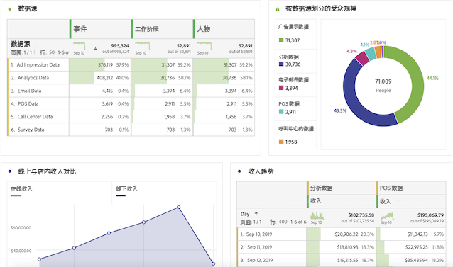
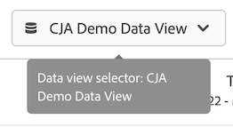

# 适用于 Adobe Analytics 用户的用户指南

如果贵组织开始使用Customer Journey Analytics(CJA)，您可能会注意到传统Analytics与CJA之间的一些相似之处和差异。本页旨在解释这些差异，以帮助贵组织适应新的实施和报告工作流程。本页还提供了有关新概念的其他资源，以及进一步的步骤，帮助您作为分析师，更轻松、更成功。

CJA中的几项功能已重命名和重新设计，以符合行业标准。一些更新的术语包括区段、虚拟报表包、分类、客户属性和容器名称。eVar 和 prop 的限制已不复存在，取而代之的是灵活的自定义维度和量度。

## 未更改的内容

您在报表端所熟悉的许多内容并未发生更改。

* 您仍然可以使用[分析工作区](/help/analysis-workspace/home.md)分析数据。工作区的操作方式与在传统Adobe Analytics中相同。
* 相同版本 [Adobe Analytics 功能板](/help/mobile-app/home.md)可用，且在 CJA 与传统 Analytics 中的工作方式类似。
* [Report Builder](/help/report-builder/report-buider-overview.md) 具有新界面，并可在 MS Windows、MacOS 和 Web 版本的 Excel 上运行。（在此版本的 Report Builder 之前，除非在 VMware 上运行 Mac，否则无法在中使用。） 此版本尚不支持传统的 AA 数据请求。

## 对报表的更改

您可以访问更多要分析的跨渠道数据。例如，您可以创建一个工作区项目来分析多个渠道的性能，前提是您的组织摄取的数据集包含在CJA使用的数据视图中（请参阅下面的“数据架构的更改”）。

## 数据架构的更改 {#architecture}

CJA从Adobe Experience Platform获取数据。Experience Platform 可让您集中和标准化来自任何系统或渠道的客户数据和内容，并应用数据科学和机器学习来改进个性化体验的设计和交付。

Experience Platform 中的客户数据存储为数据集，其中包含[架构](https://experienceleague.adobe.com/docs/platform-learn/tutorials/schemas/schemas-and-experience-data-model.html?lang=zh-Hans)和批量数据。有关 Platform 的更多详细信息，请参阅 [Adobe Experience Platform 体系架构概述](https://experienceleague.adobe.com/docs/platform-learn/tutorials/intro-to-platform/basic-architecture.html?lang=zh-Hans)。

您的CJA管理员已建立 [连接](/help/connections/create-connection.md) 到Experience Platform中的数据集。 然后，他们构建[数据视图](/help/data-views/data-views.md)使用这些连接。数据视图在概念上与虚拟报表包类似，是CJA中报表的基础。由于Experience Platform为报表收集所有数据，因此报表包不再作为数据容器存在。

通过建立连接，Analytics管理员可以将来自Adobe Experience Platform的数据集集成到CJA中，该数据集包含在以下视频中：

>[!VIDEO](https://video.tv.adobe.com/v/35111/?quality=12)

Adobe 提供了多种将数据导入 Adobe Experience Platform 的方法，包括通过 Adobe Analytics Source Connector 或 Web SDK 导入报表包数据。多个报表包中的现有实施可以合并为Experience Platform。基于这些数据集的连接和数据视图可以合并之前存在于单独报表包中的数据。

## 对虚拟报表包概念的更改 {#data-views}

[!UICONTROL 数据视图] 采用虚拟报表包当前存在的概念，并将其扩展到[对数据启用其他控制](/help/data-views/create-dataview.md)由连接提供。这些更改使常规设置（如时区和会话超时间隔）可进行配置并具有可回溯性。还可以在报表或数据视图级别自定义各个变量设置，如归因和过期时间。这些设置是非破坏性的，具有追溯性。

请注意，现在通过右上方的报表包选择器，您可以从可用的数据视图中进行选择：

请参阅[数据视图用例](/help/use-cases/data-views/data-views-usecases.md)以了解有关此概念的更多信息。

## 对eVar和prop概念的更改

传统 Adobe Analytics 中的 [!UICONTROL eVars]、[!UICONTROL props] 和 [!UICONTROL 事件] 的概念在 [!UICONTROL Customer Journey Analytics] 中不再存在。在Adobe Analytics中，eVar和prop存储了内容、客户、营销活动等的描述。和事件会计入收入、订阅或产生的商机。Customer Journey Analytics 会保留这两种类型的数据，您可以以相同的方式访问它们 — 分别从分析工作区的左边栏中的“维度”或“量度”下。

在CJA中，可以使用无限的架构元素，包括维度、量度和列表字段。这些量度可映射到无限的架构元素，包括Experience Platform中的维度、量度和列表字段。现在，在 Adobe Analytics 中处理规则后应用的所有访问和归因设置都会在 Customer Journey Analytics 中的查询时应用。

凭借这种灵活性，您可能会遇到以下情况：单个架构字段既可用作维度，也可用作量度，以支持不同的跟踪需求。

## 区段概念的更改

Adobe已将“区段”组件重命名为“过滤器”，以更好地符合行业标准，并更好地区分Adobe Experience Platform中的区段。

[!UICONTROL Customer Journey Analytics] 不再使用 eVar、prop 或事件，而是使用它们已映射到的 Experience Platform 架构字段名称。此更改意味着 Adobe Analytics中 的任何现有区段都与 [!UICONTROL Customer Journey Analytics] 不兼容。如果要将现有Adobe Analytics区段移动到Customer Journey Analytics，请观看以下视频：

>[!VIDEO](https://video.tv.adobe.com/v/31982/?quality=12)

虽然您还不能从 [!DNL Customer Journey Analytics] 共享或发布[!UICONTROL 过滤器]（[!UICONTROL 区段]）到 Experience Platform Unified Profile，但此功能正在开发中。

除了区段更改的概念之外，区段容器也会更新。

* **命中容器现在是[!UICONTROL 事件]容器**。通过[!UICONTROL 事件]容器，可根据个别页面查看/点击量划分访客信息。
* **访问容器现在是[!UICONTROL 会话]容器**。通过[!UICONTROL 会话]容器可以识别页面交互、营销活动或特定会话的转化。
* **现在，访客容器为 [!UICONTROL 人员] 容器**。[!UICONTROL 人员]容器包括访客在指定的时间范围内的每个会话和事件。

## 对计算量度概念的更改

计算量度在传统Analytics和CJA中的名称类似。但是， [!UICONTROL Customer Journey Analytics] 不再使用 eVar、props 或事件，而是使用任何 Experience Platform 架构元素。这一根本变化意味着，任何现有的计算量度都与 [!UICONTROL Customer Journey Analytics] 不兼容。如果要将Adobe Analytics计算量度移动到Customer Journey Analytics，请观看以下视频：

>[!VIDEO](https://video.tv.adobe.com/v/31788/?quality=12)

## 变量归因和到期设置的更改

[!UICONTROL Customer Journey Analytics] 在报告时应用所有变量设置，包括归因和到期。这些设置现在位于[数据视图](/help/data-views/component-settings/persistence.md)中，以及某些变量设置（如归因）可在工作区项目中进行更改。

同一数据视图中可以有同一变量的多个版本。例如，您可以有一个“跟踪代码”维度，该维度在30天后过期，另一个维度在会话结束时过期。这两个跟踪代码维度使用相同的源数据，但使用不同的归因设置。

您还可以基于同一连接拥有多个数据视图。例如，您可以有一个数据视图，其会话超时为30分钟，另一个数据视图的会话超时为15分钟。两个数据视图都显示在右上方选择器中，因此您可以在它们之间无缝过渡。

## 对分类概念的更改

“分类”现在称为“查找数据集”。查找数据集用于查找在您的事件或个人资料数据中找到的值或键。例如，您可以上传将事件数据中的数字 ID 映射到产品名称的查找数据。有关示例用例，请参阅[将帐户级别的数据添加为查询数据集](/help/use-cases/b2b/b2b.md)。

## 对客户属性概念的更改

“客户属性”现在称为“个人资料数据集”。配置文件数据集包含应用于[!UICONTROL 事件]数据中的访问者、用户或客户的数据。例如，它允许您上传有关客户的 CRM 数据。您可以选择想要包含的人员 ID。[!DNL Experience Platform] 中定义的每个数据集都有自己的一组定义的一个或多个人员 ID。

## 更改了Adobe识别访客的方式

CJA扩展了ECID之外的身份概念，以包含您要使用的任何ID，包括客户ID、Cookie ID、拼接ID、用户ID、跟踪代码等。跨数据集使用通用命名空间ID，或使用[跨渠道分析](/help/cca/overview.md)可帮助将不同数据集中的人员关联在一起。在CJA中设置工作区项目的任何用户都必须了解跨数据集使用的ID。请观看以下视频，重点介绍CJA中标识的使用：

>[!VIDEO](https://video.tv.adobe.com/v/30750/?quality=12)

## 对低流量维度项目概念的更改

在传统Adobe Analytics中，接收过多唯一值的变量会开始将维度项存储在[!UICONTROL 低流量]下。CJA 对高基数字段的限制较少。对报表模式所做的更改允许 Analysis Workspace 报告更多独特维度项目。请参阅[长尾](../analysis-workspace/workspace-faq/long-tail.md)以了解有关 CJA 如何优化具有许多唯一值的维度报表的更多信息。
