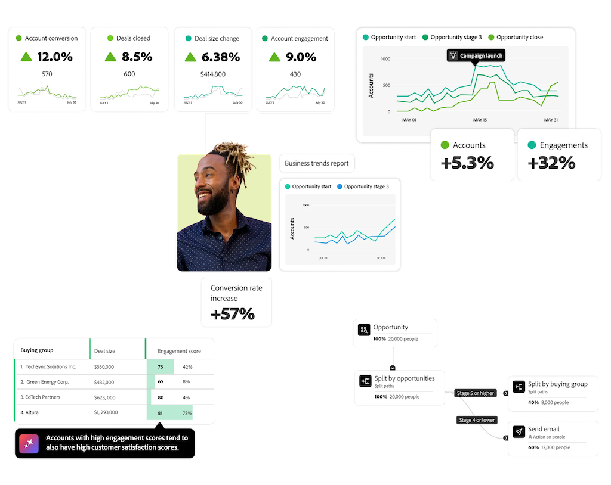

# Customer Journey Analytics B2B Edition

{{b2b-edition}}

Adobe Analytics 最初是作为营销人员的网络及数字分析工具而推出的，而 Customer Journey Analytics 则将此范围扩大到包括多渠道、离线和跨平台的数据。这两种工具都可以帮助”企业对消费者“（B2C）类型公司分析和优化其营销工作和客户体验。并重点关注&#x200B;**基于人员的报告和分析**：了解客户历程，这里的客户是指通过多种渠道与您的品牌互动的人。

Customer Journey Analytics B2B edition添加了**基于帐户的报表和分析**。 在 B2B（企业对企业）销售中，购买历程涉及到多方、线上和线下接触点以及达成交易前的一些关键阶段。B2B 公司需要在统一的历程视图中跟踪所有这些交互，以有效地分析和优化他们的营销工作和帐户体验。

典型的 B2B 销售特征包括：

* 交易金额大
* 销售周期长
* 有多个决策者和影响因素，通常组成一个“购买群组”
* 受教育程度更高的买家
* 客户维系和追加销售更重要
* 千禧一代 B2B 买家期望获得更顺滑无缝的“数字消费”，如购买体验

B2B 营销专注于优化接触点，缩短购买和考虑周期。由于 B2B 销售周期在很大程度上依赖于面对面交谈、现场活动等线下互动以及与购买群组的合作，因此仅靠基于人员的数字数据是不够的。B2B 组织使用来自 CRM 系统和专门解决方案的数据进行补充。然而，传统的 B2C 营销组件，例如广告、营销活动、渠道和网站访客，在 B2B 营销中仍然发挥着至关重要的作用。

B2B 销售和营销超越了传统的商机开发漏斗，更加关注客户生命周期和购买群组。这种转变反映了 B2B 采购性质的变化，也就是决策涉及到各种接触点的多个利益相关者。当今的 B2B 买家采用一种非线性的复杂决策过程。与 B2C 客户一样，他们更倾向于在与销售团队接触之前进行独立研究。口碑和社交媒体现在对于影响他们的购买决策起着关键作用。

B2B 营销人员面临着越来越大的压力，需要展示他们采取的活动如何促进营收。使营销工作符合业务目标以及衡量收入影响都至关重要，但许多衡量工具都是针对 B2C 场景设计的。因此，B2B 营销人员寻求能够提供准确见解并符合其特定目标的专用工具。

Customer Journey Analytics B2B Edition 提供有助于推动收入增长的可操作的帐户洞察，帮助 B2B 公司协调其营销活动、销售和产品团队。帐户是数据模型的中心，因此所有分析都集中在帐户历程上。在基于人员及时间的事件之上添加一层新实体（帐户、机会和购买群组），可以创建 B2B 营销活动和收入生命周期的完整图景。

>[!MORELIKETHIS]
>
>[B2B 概念和特点](cja-b2b-concepts-features.md)
>>[B2B 快速入门指南](cja-b2b-quick-start-guide.md)
>>[B2B 过渡指南](cja-b2b-transition.md)
>>[B2B 用例](/help/use-cases/b2b/b2b-edition/use-cases-overview.md)
>
