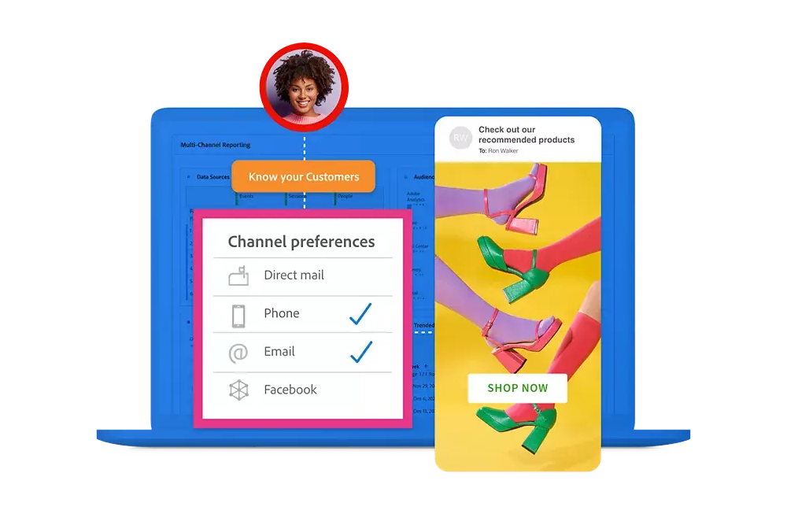
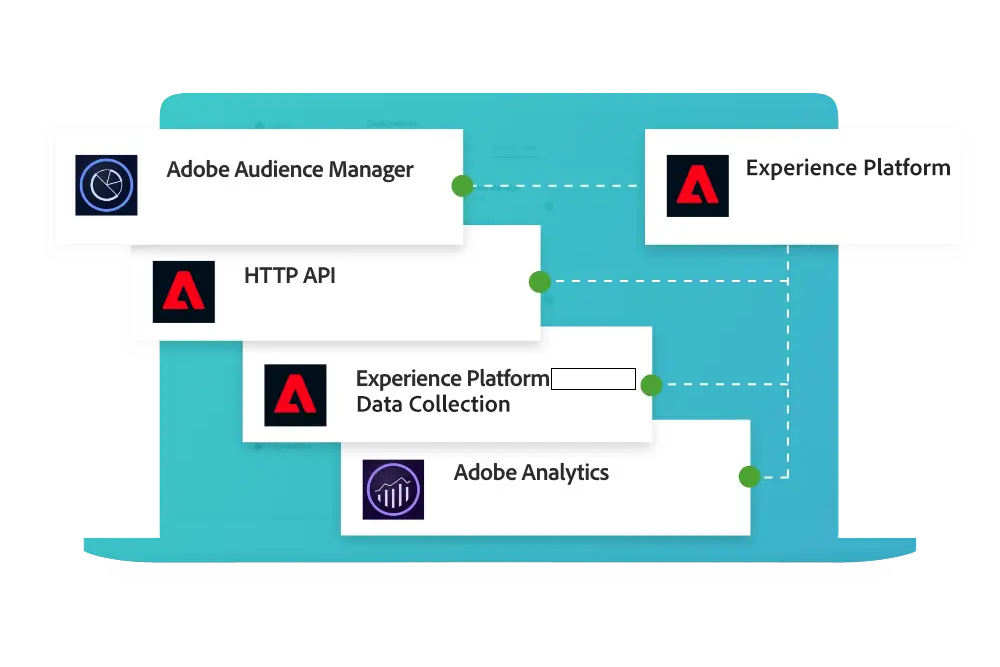
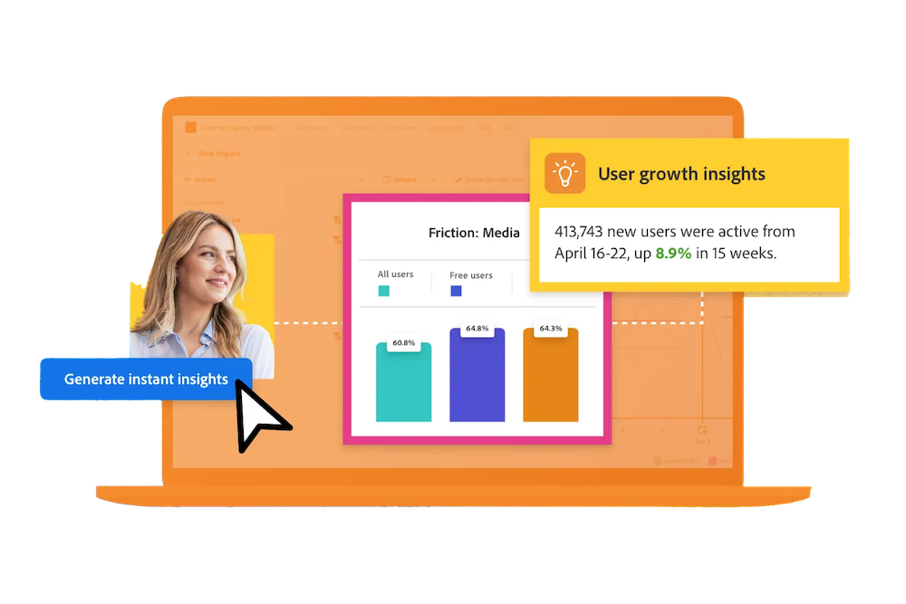
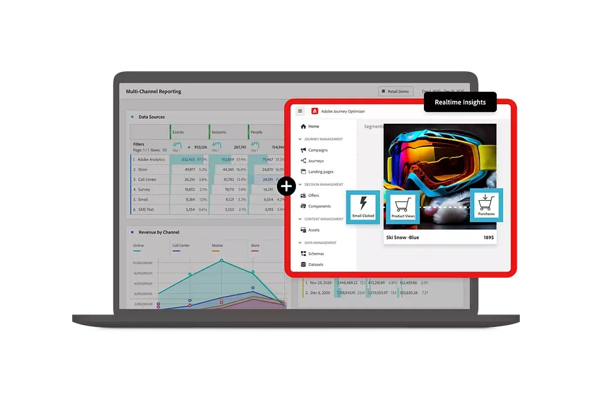
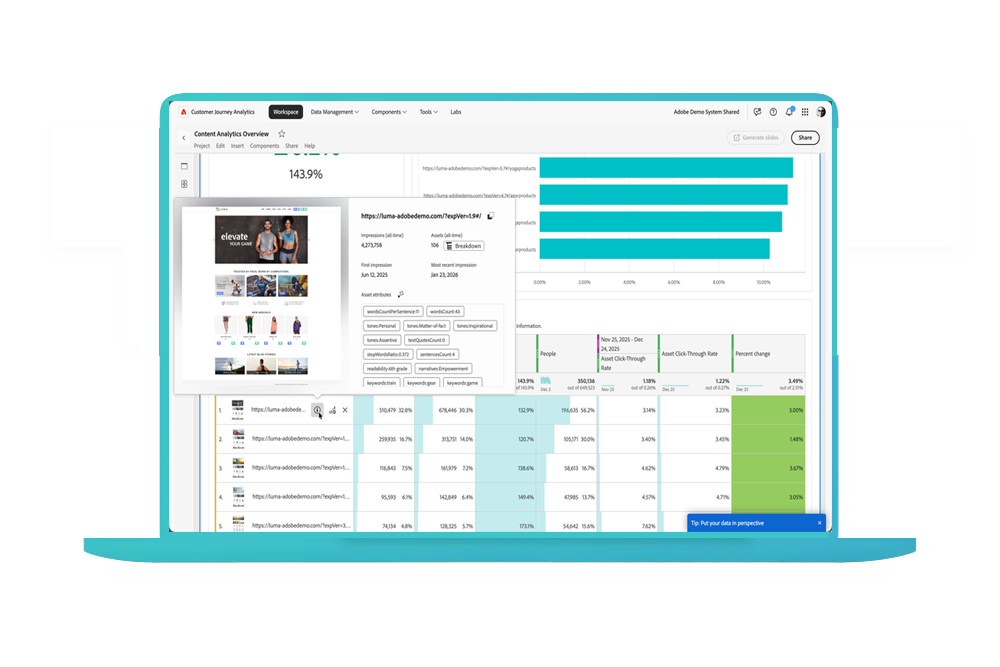

# Customer Journey Analytics 指南

本技术文档指南为 Customer Journey Analytics 提供了自助服务。 通过 Customer Journey Analytics，您可以将客户数据从您选择的任何渠道（在线和离线）带入 Adobe Experience Platform。 然后，就像现在使用 Analysis Workspace 分析现有数字数据一样分析这些数据。

通过Customer Journey Analytics，您可以控制如何在Analysis Workspace中将任何通用客户ID上的在线和离线数据进行关联，

## 新增功能

大致了解 Customer Journey Analytics 产品和文档中的最新增强！ 有关功能、改进和修复的完整列表，请查看详细的[发行说明](../release-notes/latest.md)。 访问[文档更新页面](../release-notes/doc-changes.md)以及时了解最新的文档更新。

>[!BEGINTABS]

>[!TAB 划分面板]

您现在可以在Analysis Workspace中划分面板。 在某些情况下，在将区段应用于面板之前，首选在面板中划分数据和可视化。

>[!TAB 多个维度列]

在自由格式表中最多可包含5个维度列，这样您可以并排查看多个维度项目。 每一行的维度项将作为一个拼接后的单一维度项进行处理。

>[!TAB 连接中的拼接]

您现在可以直接在Customer Journey Analytics连接UI中配置和启用事件数据集的拼合。

*必须至少具有Select包才能启用拼接。*

>[!TAB 受众分析]

利用Audience Analysis，可将受众成员资格数据从Experience Platform配置文件数据集摄取到Customer Journey Analytics连接。

>[!TAB 实时报告]

Customer Journey Analytics 中的实时报告功能可以实时显示并更新 Analysis Workspace 的一个或多个面板中的数据和可视化图表。

*您必须具有 Ultimate 包才能进行实时报告。*

>[!TAB B2B Edition]

Customer Journey Analytics B2B Edition 提供有助于推动收入增长的可操作的帐户洞察，帮助 B2B 公司协调其营销活动、销售和产品团队。 帐户是数据模型的中心，因此所有分析都集中在帐户历程上。

>[!TAB Content Analytics]

Content Analytics 可让您快速轻松地调查大量内容数据，以了解趋势、发现异常、识别内容疲劳并从内容曝光度中获取洞察。

>[!ENDTABS]

## 从基础知识开始

首先阅读以下链接上的材料以熟悉 Customer Journey Analytics 的功能。

<table style="table-layout:fixed">
  <tr style="border: 0;">
    <td>
    
    
<strong>不只是在线数据</strong> 了解 Customer Journey Analytics 与 Adobe Analytics 的比较情况、共享哪些功能以及如何使用 Analytics 数据。

    </td>
    <td>
    
    
<strong>摄取和使用数据</strong> 了解将数据摄取到Experience Platform并使用它进行分析和报告的选项。

    </td>
    <td>
    
    
<strong>引导式分析</strong> 了解如何使用工作流获取有关客户产品体验的数据和洞察。 通过引导式分析了解Product Analytics。
    

    </td>
    <td>
    
    
<strong>Analysis Workspace</strong> 使用 Analysis Workspace 执行基本和高级分析，例如归因、流量图和流失图、维度细分。

    </td>
    <td>
    
    
<strong>Content Analytics</strong> 了解内容（位于行为旁）如何影响关键绩效指标。 获得有关客户历程数据的更深入见解。

    </td>
  </tr>
  <tr style="border: 0;">
    <td align="center"></td>
    <td align="center"></td>
    <td align="center"></td>
    <td align="center"></td>
    <td align="center"></td>
    </tr>
</table>

## 浏览文档

了解 Customer Journey Analytics 怎样与 Adobe Analytics 相比较。 以及如何将数据放入解决方案中，然后准备、查看、分析和民主化这些数据以及由此产生的分析和报告。

<table style="table-layout:fixed">
  <tr style="border: 0;">
    <td>
       
      <strong>与Adobe Analytics比较</strong> <a href="/help/getting-started/aa-vs-cja/overview.md">概述</a> - <a href="/help/getting-started/aa-to-cja.md">演变</a> - <a href="/help/getting-started/cja-upgrade/cja-upgrade-recommendations.md">升级</a> - <a href="/help/getting-started/aa-vs-cja/aa-data-in-cja.md">使用Adobe Analytics数据</a> - <a href="/help/getting-started/aa-vs-cja/cja-aa.md">功能支持</a> - <a href="/help/getting-started/aa-vs-cja/terminology.md">术语</a> - <a href="/help/getting-started/aa-vs-cja/data-processing-comparisons.md">数据处理</a>
    </td>
    <td>
       
      <strong>连接</strong> <a href="/help/connections/overview.md">概述</a> - <a href="/help/connections/create-connection.md">创建</a> - <a href="/help/connections/manage-connections.md">管理</a> - <a href="/help/stitching/overview.md">拼合</a> - <a href="/help/connections/combined-dataset.md">合并事件数据集</a> - <a href="/help/connections/standard-lookups.md">标准查找</a>
    </td>
     <td>
       
      <strong>数据视图</strong> <a href="/help/data-views/data-views.md">概述</a> - <a href="/help/data-views/create-dataview.md">创建或编辑</a> - <a href="/help/data-views/session-settings.md">会话设置</a> - <a href="/help/data-views/derived-fields/derived-fields.md">派生字段</a> - <a href="/help/data-views/summary-data.md">摘要数据</a> - <a href="/help/data-views/component-reference.md">组件参考</a>
    </td>

</tr>
  <tr style="border: 0;">
    <td>
       
      <strong>Workspace 项目</strong> <a href="/help/analysis-workspace/home.md">Analysis Workspace</a> - <a href="/help/analysis-workspace/perform-basic-analysis.md">基本</a>和<a href="/help/analysis-workspace/perform-adv-analysis.md">高级分析</a> - <a href="/help/analysis-workspace/build-workspace-project/freeform-overview.md">项目</a> - <a href="/help/analysis-workspace/visualizations/freeform-analysis-visualizations.md">可视化</a> - <a href="/help/analysis-workspace/c-panels/freeform-panel.md">面板</a>
    </td>
        <td>
       
      <strong>共享、导出、集成</strong> <a href="/help/analysis-workspace/curate-share/share-projects.md">项目</a> - <a href="/help/mobile-app/home.md">Analytics 功能板 </a> - <a href="/help/report-builder/rb-overview.md">Report Builder</a>  - <a href="/help/components/exports/manage-exports.md">云导出</a> - <a href="/help/integrations/overview.md">集成</a>
    </td>
    <td>
       
      <strong>等……</strong> <a href="/help/guided-analysis/overview.md">引导式分析</a> - <a href="/help/content-analytics/content-analytics.md">Content Analytics</a> - <a href="/help/getting-started/cja-b2b-edition.md">B2B edition</a> 
    </td>
  </tr>
</table>

## 其他资源

<table style="table-layout:fixed"><tr style="border: 0;">
<td><strong>Customer Journey Analytics</strong> 
<a href="https://experienceleague.adobe.com/zh-hans/docs/customer-journey-analytics-learn/tutorials/overview" target="_blank">教程</a> - <a href="https://helpx.adobe.com/cn/legal/product-descriptions/customer-journey-analytics.html" target="_blank">Customer Journey Analytics产品说明</a> - <a href="https://helpx.adobe.com/cn/legal/product-descriptions/adobe-analytics-addon-customer-journey-analytics.html" target="_blank">Adobe Analytics （Customer Journey Analytics附加组件）产品说明</a> - <a href="https://helpx.adobe.com/cn/legal/product-descriptions/customer-journey-analytics-b2b.html" target="_blank">Customer Journey Analytics B2B edition产品说明</a> - <a href="https://developer.adobe.com/cja-apis/docs/" target="_blank">Customer Journey Analytics API</a> - <a href="/help/ai-assistant.md">AI助手</a>
</td>
<td><strong>数据摄取</strong> <a href="/help/data-ingestion/data-ingestion.md">概述</a> - <a href="/help/data-ingestion/analytics.md">Analytics</a> - <a href="/help/data-ingestion/aepwebsdk.md">Web SDK</a> - <a href="/help/data-ingestion/aepmobilesdk.md">Mobile SDK</a> - <a href="/help/data-ingestion/batch.md">批处理</a> - <a href="/help/data-ingestion/streaming.md">流式处理</a> - <a href="/help/data-ingestion/sources.md">源</a> - <a href="/help/data-ingestion/serverapi.md">服务器 API</a>
</td>
</tr>
</table>

<table style="table-layout:auto" class="tablelayout-is-fixed"><tbody><tr style="border: 0;"><td></td><td>
<b>了解最新信息，为社区贡献力量，提升您的Customer Journey Analytics体验！</b> 请访问Adobe Analytics社区，与业内同行讨论该功能。 <a href="https://experienceleaguecommunities.adobe.com/t5/adobe-analytics/ct-p/adobe-analytics-community?profile.language=zh-Hans">立即加入社区！</a></td></tr></tbody></table>
