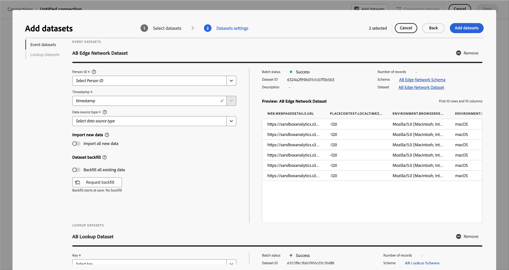

# 创建并配置连接以用于Customer Journey Analytics

>[!NOTE]
> 
>只有在完成所有先前的升级步骤后，才应执行本页上的步骤。 您可以按照[推荐的升级步骤](/help/getting-started/cja-upgrade/cja-upgrade-recommendations.md#recommended-upgrade-steps-for-most-organizations)进行操作，也可以按照[Adobe Analytics为您的组织动态生成的升级步骤来Customer Journey Analytics升级调查表](https://gigazelle.github.io/cja-ttv/)。
>
>完成此页面上的步骤后，请继续执行建议的升级步骤或动态生成的升级步骤。

<!-- Should we single source this instead of duplicate it? The following steps were copied from: /help/connections/create-connection.md -->

以下信息介绍如何创建和配置连接，以及如何将Experience Platform数据集添加到您创建的连接。 有关创建和配置连接的其他信息，请参阅[创建或编辑连接](/help/connections/create-connection.md)。

## 创建和配置连接 {#create-connection}

1. 在 Customer Journey Analytics 中，选择&#x200B;**[!UICONTROL 连接]**&#x200B;选项卡。
1. 选择&#x200B;**[!UICONTROL 创建新连接]**。

   

1. 配置连接设置。

   | 设置 | 描述 |
   | --- | --- |
   | **[!UICONTROL 连接名称]** | 输入连接的唯一名称。 |
   | **[!UICONTROL 连接说明]** | 描述这种连接的目的。 |
   | **[!UICONTROL 沙盒]** | 在 Experience Platform 中选择一个沙盒，其中包含要创建连接的数据集。
Adobe Experience Platform 提供了可将单个 Platform 实例划分为多个单独的虚拟环境的[沙盒](https://experienceleague.adobe.com/zh-hans/docs/experience-platform/sandbox/home)，以帮助开发和改进数字体验应用程序。您可以将沙盒视为包含数据集的“数据孤岛”。沙盒可用于控制对数据集的访问。
选择沙盒后，左边栏会显示可从该沙盒中提取的所有数据集。 |
   | **[!UICONTROL 启用滚动数据窗口]** | 如果选中此复选框，那么您可以在连接级别将 Customer Journey Analytics 数据保留定义为以月计的时段（1 个月、3 个月、6 个月等）。
数据保留基于事件数据集时间戳并且仅适用于事件数据集。由于没有适用的时间戳，因此配置文件或查找数据集不存在滚动数据窗口设置。但是，如果您的连接包括任何配置文件或查找数据集（一个或多个事件数据集除外），则该数据会在相同的时段内进行保存。
 主要好处是，您只需存储或报告适用且有用的数据，并且可删除不再有用的旧数据。它可以帮助您保持在合同限制范围内，并减少超出预期成本的风险。
如果您保留默认值（未选中），Adobe Experience Platform 数据保留设置将取代保留期。如果您在 Experience Platform 中有 25 个月的数据，那么 Customer Journey Analytics 会通过回填获取 25 个月的数据。如果您在 Platform 中删除了其中的 10 个月，则 Customer Journey Analytics 将会保留剩余的 15 个月。 |
   | **[!UICONTROL 添加数据集]**（见下文） | 如果您的数据集列表中没有数据集，请添加数据集。 |
   | **[!UICONTROL 数据集名称]** | 选择您要提取到 Customer Journey Analytics 的一个或多个数据集，并选择&#x200B;**[!UICONTROL 添加。]**
（如果您有许多数据集可供选择，可以使用数据集列表上方的搜索数据集搜索栏搜索正确的数据集。） |
   | **[!UICONTROL 上次更新时间]** | 仅对于事件数据集，此设置会自动设置为 Experience Platform 中基于事件的架构的默认时间戳字段。“N/A”表示该数据集不包含数据。 |
   | **[!UICONTROL 记录数]** | Experience Platform 中数据集上个月的总记录数。 |
   | **[!UICONTROL 架构]** | 在 Adobe Experience Platform 中创建数据集所依据的[架构。](https://experienceleague.adobe.com/zh-hans/docs/experience-platform/xdm/schema/composition) |
   | **[!UICONTROL 数据集类型]** | 对于您添加到此连接的每个数据集，Customer Journey Analytics 会根据传入的数据自动设置数据集类型。有 3 种不同的数据集类型：事件数据、配置文件数据和查找数据。有关数据集类型的说明，请参见下表。 |
   | **[!UICONTROL 粒度]** | 数据集中数据的粒度；仅适用于摘要数据集。 |
   | **[!UICONTROL 数据源类型]** | 数据集的数据源类型。不适用于摘要数据集。 |
   | **[!UICONTROL 人员 ID]** | 从可用标识的下拉列表中选择人员 ID。这些标识已在 Experience Platform 的数据集架构中定义。有关如何将标识映射用作人员 ID 的信息，请参见下文。
重要提示：如果没有可供选择的人员 ID，则意味着未在模式中定义一个或多个人员 ID。请查看[这个视频](https://www.youtube.com/watch?v=G_ttmGl_LRU)，以了解如何在 Experience Platform 中定义标识。 |
   | **[!UICONTROL 键]** | 仅用于查找数据集（例如 _id）。 |
   | **[!UICONTROL 匹配键]** | 仅用于查找数据集（例如 _id）。 |
   | **[!UICONTROL 导入新数据]** | 设置为开或关。 |
   | **[!UICONTROL 回填数据]** | 您可以请求补填数据集中的数据。例如，您可以请求补填过去 7 天的数据。配置正确的数据集并测试您的连接。如果一切看起来正常，您可以轻松回填所有剩余数据。
此外，您还可启用按数据集导入新数据。 |
   | **[!UICONTROL 回填状态]** | 状态指示是否正在处理任何回填数据。 |

   {style="table-layout:auto"}

## 添加和配置数据集 {#add-dataset}

您可以在创建连接时添加Experience Platform数据集。

1. 在“连接设置”对话框中，选择&#x200B;**[!UICONTROL 添加数据集]**。

1. 在 [!UICONTROL 选择数据集] 步骤中，您会看到 Experience Platform 数据集的列表。

   

   对于每个数据集，列表显示：

   | 列 | 描述 |
   |---|---|
   | 数据集 | 数据集的名称。选择名称即可将您定向到 Experience Platform 中的数据集。选择  以显示一个包含数据集更多详细信息的弹出窗口。您可以选择 **[!UICONTROL 在平台中编辑]** 以直接在 Experience Platform 中编辑数据集。 |
   | 数据集类型 | 数据集的类型：事件、轮廓、查找或摘要。 |
   | 记录数 | Experience Platform 中数据集上个月的总记录数。 |
   | 架构 | 数据集的模式。选择名称即可将您定向到 Experience Platform 中的模式。 |
   | 上一批次 | Experience Platform 中最后提取的批次的状态。查看 [批次状态](https://experienceleague.adobe.com/zh-hans/docs/experience-platform/ingestion/batch/troubleshooting#batch-states) 更多信息。 |
   | 数据集 ID | 数据集 ID 的名称。 |
   | 上次更新时间 | 数据集的最后更新时间戳。 |

1. 选择一个或多个数据集并选择&#x200B;**[!UICONTROL 下一个]**。必须有至少一个事件数据集是该连接的一部分。
   * 要更改为数据集列表显示的列，请选择 ，然后选择要在[!UICONTROL 自定义表]对话框中显示的列。
   * 要搜索特定数据集，请使用  搜索字段。
   * 要在显示或隐藏所选数据集之间切换，请选择  **[!UICONTROL 隐藏所选项]**&#x200B;或&#x200B;**[!UICONTROL 显示所选项]**。
   * 要从所选数据集的列表中删除数据集，请使用 。要删除所有所选的数据集，请选择&#x200B;**[!UICONTROL 全部清除]**。

1. 现在，逐一配置数据集。

   

   | 设置 | 描述 |
   | --- | --- |
   | **[!UICONTROL 人员 ID]** | 仅适用于事件和配置文件数据集。从可用标识的下拉列表中选择人员 ID。这些标识已在 Experience Platform 的数据集架构中定义。有关如何将标识映射用作人员 ID 的信息，请参见下文。
如果没有可供选择的人员 ID，则意味着架构中尚未定义一个或多个人员 ID。请参阅[在 UI 中定义标识字段](https://experienceleague.adobe.com/zh-hans/docs/experience-platform/xdm/ui/fields/identity)以了解更多信息。 
所选人员 ID 的值区分大小写。例如，`abc123` 和 `ABC123` 是两个不同的值。 |
   | **[!UICONTROL 时间戳]** | 仅对事件和摘要数据集，此设置会自动设置为 Experience Platform 中基于事件的模式的默认时间戳字段。 |
   | **[!UICONTROL 键]** | 仅适用于查找数据集。用于查找数据集的键。 |
   | **[!UICONTROL 匹配键]** | 仅适用于查找数据集。某个事件数据集中要按其连接在一起的匹配键。如果此列表为空，则可能尚未添加或配置事件数据集。 |
   | **[!UICONTROL 时区]** | 仅适用于摘要数据。为时间序列摘要数据选择适当的时区。 |
   | **[!UICONTROL 数据源类型]** | 选择数据源类型。 数据源的类型包括： <ul><li>[!UICONTROL Web 数据]</li><li>[!UICONTROL 移动应用程序数据]</li><li>[!UICONTROL POS 数据]</li><li>[!UICONTROL CRM 数据]</li><li>[!UICONTROL 调查数据]</li><li>[!UICONTROL 呼叫中心数据]</li><li>[!UICONTROL 产品数据]</li><li> [!UICONTROL 帐户数据]</li><li> [!UICONTROL 事务数据]</li><li>[!UICONTROL 客户反馈数据]</li><li> [!UICONTROL 其他]</li></ul>该字段用于调查正在使用的数据源的类型。 |
   | **[!UICONTROL 导入新数据]** | 如果您想建立持续连接，请启用此选项。通过持续的连接，添加到数据集的新数据批次会自动在 Workspace 中提供。 |
   | **[!UICONTROL 数据集回填]** | 启用 **[!UICONTROL 回填所有现有数据]** 以确保所有现有数据均已回填。  选择 **[!UICONTROL 请求补填]** 填充特定时期的历史数据。您最多可以定义 10 个数据集回填期。<ol><li>通过输入开始和结束数据或使用选择日期来定义期间。</li><li>选择 **[!UICONTROL 队列补填]** 将回填内容添加到列表中，或 **[!UICONTROL 取消]** 取消。</li></ol>对于每个条目，选择  编辑时段，或选择  删除该条目。  在回填上：<ul><li>您可以单独回填每个数据集。</li><li>您会优先处理新添加到此连接中数据集的新数据，因此这些新数据的滞后时间最短。</li><li>任何回填（历史）数据的导入速度都会比较慢。历史数据的数量会影响延迟。</li><li>Analytics Source Connector 会为生产沙盒导入最多 13 个月的数据（无论大小）。非生产沙盒的回填期限为 3 个月。</li></ul> |
   | **[!UICONTROL 转换数据集]** | 对于特定的B2B查找数据集，您可以为适当的基于B2B人员的报表方案启用数据集转换。 |
   | **[!UICONTROL 回填状态]** | 可能的状态指示符有：<ul><li>成功</li><li>X 回填处理</li><li>关</li></ul> |
   | **[!UICONTROL 数据集 ID]** | 此 ID 是自动生成的。 |
   | **[!UICONTROL 描述]** | 创建此数据集时给出的描述。 |
   | **[!UICONTROL 数据集大小]** | 数据集的大小。 |
   | **[!UICONTROL 架构]** | 在 Adobe Experience Platform 中创建数据集所依据的架构。 |
   | **[!UICONTROL 数据集]** | 数据集的名称。 |
   | **[!UICONTROL 预览：*数据集名称&#x200B;*]** | 使用日期、我的 ID 和标识符列预览数据集。 |
   | **[!UICONTROL 删除]** | 您可以删除或移除数据集并更改人员 ID 而不删除整个连接。删除或移除会降低数据引入以及重新创建整个连接和相关数据视图这一繁琐过程所涉及的成本。 |

   {style="table-layout:auto"}

1. 继续执行[建议的升级步骤](/help/getting-started/cja-upgrade/cja-upgrade-recommendations.md#recommended-upgrade-steps-for-most-organizations)或[动态生成的升级步骤](https://gigazelle.github.io/cja-ttv/)。

