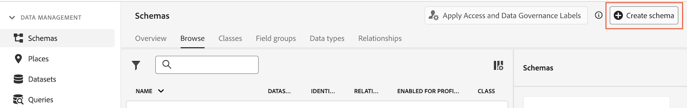

# 创建查找数据集以对Customer Journey Analytics中的数据分类 {#upgrade-lookup-dataset}

<!-- markdownlint-disable MD034 -->

>[!CONTEXTUALHELP]
>id="cja-upgrade-lookup-dataset-create"
>title="为包含分类数据的每个维度创建查找数据集"
>abstract="与Adobe Analytics中的分类数据类似，查找数据集是在Customer Journey Analytics中对数据进行分类的方法。"

<!-- markdownlint-enable MD034 -->

>[!NOTE]
> 
>只有在完成所有先前的升级步骤后，才应执行本页上的步骤。 您可以按照[推荐的升级步骤](/help/getting-started/cja-upgrade/cja-upgrade-recommendations.md#recommended-upgrade-steps-for-most-organizations)进行操作，也可以按照[Adobe Analytics为您的组织动态生成的升级步骤来Customer Journey Analytics升级调查表](https://gigazelle.github.io/cja-ttv/)。
>
>完成此页面上的步骤后，请继续执行建议的升级步骤或动态生成的升级步骤。

与Adobe Analytics中的分类数据类似，查找数据集是在Customer Journey Analytics中对数据进行分类的方法。

使用Analytics Source Connector时，某些标准查找数据集会在报告时自动应用。 有关详细信息，请参阅[向数据集添加标准查找](/help/connections/standard-lookups.md)。

在使用Experience PlatformWeb SDK时，为了对Customer Journey Analytics中的数据分类，您需要为包含要分类的数据的每个维度创建自定义架构和查找数据集。

## 创建要用于查找数据集的自定义架构

为每个维度创建一个新的自定义架构，这些维度包含您要在Customer Journey Analytics中分类的数据。 在后续步骤中创建查找数据集时，它将引用此架构。

对包含要分类的数据的每个维度重复此过程。

要创建架构以用于Customer Journey Analytics中的查找数据集，请执行以下操作：

1. 在Adobe Experience Platform中，在左边栏的&#x200B;**[!UICONTROL 数据管理]**&#x200B;部分中选择&#x200B;**[!UICONTROL 架构]**。

1. 选择&#x200B;**[!UICONTROL 创建架构]**。

   

1. 选择&#x200B;**[!UICONTROL 手动]**。 这样，您就可以手动将字段和字段组添加到架构中。 选择&#x200B;**[!UICONTROL 选择]**&#x200B;以继续创建向导的下一页。

1. 在&#x200B;**[!UICONTROL 架构详细信息]**&#x200B;页面上，选择&#x200B;**[!UICONTROL 其他]**，然后选择&#x200B;**[!UICONTROL 自定义]**。

   

1. 选择&#x200B;**[!UICONTROL 创建类]**。

   <!-- add screenshot -->

1. 在&#x200B;**[!UICONTROL 创建类]**&#x200B;对话框中，指定架构的名称和描述，选择&#x200B;**[!UICONTROL 记录]**，然后选择&#x200B;**[!UICONTROL 创建]**。

1. 继续[创建查询数据集](#create-a-lookup-dataset)。

## 创建查询数据集

在您[创建自定义架构](#create-a-custom-schema-to-use-with-the-lookup-dataset)以用于查询数据集后，您需要创建查询数据集并将其映射到您的架构。

对包含要分类的数据的每个维度重复此过程。

要创建查询数据集以用于Customer Journey Analytics中的架构，请执行以下操作：

>[!NOTE]
>
>以下流程使用CSV文件创建数据集。 您也可以使用任何其他可用于将数据导入Experience Platform的方法，例如设置数据流。

1. 在Adobe Experience Platform的左边栏中选择&#x200B;**[!UICONTROL 工作流]**。

   

1. 选择&#x200B;**[!UICONTROL 将CSV映射到XDM架构]**，然后选择&#x200B;**[!UICONTROL 启动]**。

1. 在&#x200B;**[!UICONTROL 数据集详细信息]**&#x200B;部分中，选择&#x200B;**[!UICONTROL 新建数据集]**。

1. 指定数据集的名称和描述。

1. 在&#x200B;**[!UICONTROL 架构]**&#x200B;字段中，选择您为查找数据集创建的架构，如[为查找数据集创建架构](#create-a-schema-for-lookup-datasets)中所述。

1. 选择&#x200B;**[!UICONTROL 下一步]**。

1. 在&#x200B;**[!UICONTROL 将CSV映射到XDM架构页面]**&#x200B;的&#x200B;**[!UICONTROL 上载文件]**&#x200B;部分中，选择&#x200B;**[!UICONTROL 选择文件]**，然后浏览文件系统，找到包含要应用分类数据的维度的分类信息的文件。 例如，这可能是一个列出了字段ID和相应字段名称的电子表格。<!-- correct? How can I better explain what this file is?-->

   

1. 选择&#x200B;**[!UICONTROL 下一步]**

1. 文件上传后，查看映射以确保其准确性。 CSV文件的列列列在&#x200B;**[!UICONTROL Source数据]**&#x200B;下，其对应的XDM架构字段列在&#x200B;**[!UICONTROL 目标字段]**&#x200B;下。

   Platform会根据您选择的目标架构或数据集，自动为自动映射的字段提供智能推荐。 您可以手动调整映射规则以适合您的用例。

   有关映射过程的详细信息，请参阅Experience Platform文档中的[将CSV文件映射到现有XDM架构](https://experienceleague.adobe.com/en/docs/experience-platform/ingestion/tutorials/map-csv/existing-schema)。

1. 选择&#x200B;**[!UICONTROL 完成]**。

1. 继续[将查找数据集添加到Customer Journey Analytics](#add-the-lookup-dataset-to-your-connection-in-customer-journey-analytics)中的连接。

## 在Customer Journey Analytics中将查找数据集添加到您的连接

在您[创建自定义架构](#create-a-custom-schema-to-use-with-the-lookup-dataset)并[创建查询数据集](#create-a-lookup-dataset)之后，您需要在Customer Journey Analytics中将查询数据集添加到您的连接。

对包含要分类的数据的每个维度重复此过程。

要将查找数据集添加到Customer Journey Analytics中的连接，请执行以下操作：

1. 在 Customer Journey Analytics 中，选择&#x200B;**[!UICONTROL 连接]**&#x200B;选项卡。

1. 选择您要添加查找数据集的连接旁边的，然后选择&#x200B;**[!UICONTROL 编辑]**。

   <!-- add screenshot -->

1. 选择&#x200B;**[!UICONTROL 添加数据集]**。

1. 在&#x200B;**[!UICONTROL 添加数据集]**&#x200B;对话框中，选择您创建的查询数据集，然后选择&#x200B;**[!UICONTROL 下一步]**。

1. 在&#x200B;**[!UICONTROL 人员ID]**&#x200B;字段中，从您在Experience Platform中配置的数据集架构中定义的可用标识中选择人员ID。<!-- fill out other fields? -->

1. 选择&#x200B;**[!UICONTROL 添加数据集]**，然后选择&#x200B;**[!UICONTROL 保存]**。

   <!-- is there a step right in between here where you select the dataset -->

1. 使用&#x200B;**[!UICONTROL 键]**&#x200B;字段和&#x200B;**[!UICONTROL 匹配键]**&#x200B;字段，在查询数据集中的字段与事件或摘要数据集中的字段之间建立关联。

1. 在Customer Journey Analytics中将所有查找数据集添加到连接后，继续执行[建议的升级步骤](/help/getting-started/cja-upgrade/cja-upgrade-recommendations.md#recommended-upgrade-steps-for-most-organizations)或[动态生成的升级步骤](https://gigazelle.github.io/cja-ttv/)。

