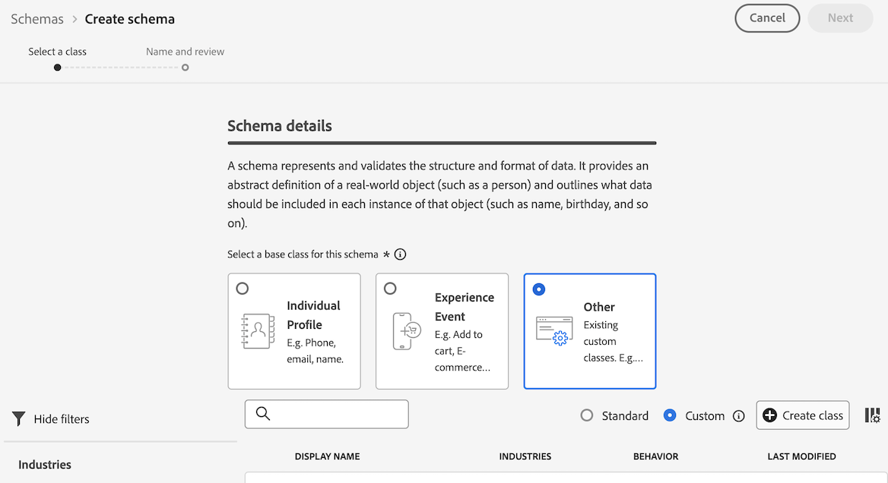

# 创建查找数据集，以对 Customer Journey Analytics 中的数据进行分类 {#upgrade-lookup-dataset}

<!-- markdownlint-disable MD034 -->

>[!CONTEXTUALHELP]
>id="cja-upgrade-lookup-dataset-create"
>title="为包含分类数据的每个维度创建一个查找数据集"
>abstract="与 Adobe Analytics 中的分类数据类似，查找数据集是 Customer Journey Analytics 中的数据分类的方法。"

<!-- markdownlint-enable MD034 -->

{{upgrade-note-step}}

与 Adobe Analytics 中的分类数据类似，查找数据集是 Customer Journey Analytics 中的数据分类的方法。

使用 Analytics 源连接器时，一些标准查找数据集会在报告时自动应用。有关详细信息，请参阅[向数据集添加标准查找](/help/connections/standard-lookups.md)。

为了在使用 Experience Platform Web SDK 时对 Customer Journey Analytics 中的数据进行分类，您需要为包含要分类的数据的每个维度创建一个自定义架构和一个查找数据集。

## 创建用于查找数据集的自定义架构

为包含您想要在 Customer Journey Analytics 中分类的数据的每个维度创建一个新的自定义架构。当您在后续步骤中创建查找数据集时，它将会引用此架构。

对包含要分类的数据的每个维度重复此过程。

要创建用于 Customer Journey Analytics 中的查找数据集的架构，请执行以下操作：

1. 在 Adobe Experience Platform 中，选择左侧边栏中&#x200B;**[!UICONTROL 数据管理]**&#x200B;内的&#x200B;**[!UICONTROL 架构]**。

1. 选择&#x200B;**[!UICONTROL 创建架构]**。

   

1. 选择&#x200B;**[!UICONTROL 手动]**。这允许您手动将字段和字段组添加到您的架构中。选择&#x200B;**[!UICONTROL 选择]**&#x200B;以继续前往创建向导的下一页。

1. 在&#x200B;**[!UICONTROL 架构详细信息]**&#x200B;页面上，选择&#x200B;**[!UICONTROL 其他]**，然后选择&#x200B;**[!UICONTROL 自定义]**。

   

1. 选择&#x200B;**[!UICONTROL 创建类]**。

   <!-- add screenshot -->

1. 在&#x200B;**[!UICONTROL 创建类]**&#x200B;对话框中，指定架构的名称和描述，选择&#x200B;**[!UICONTROL 记录]**，然后选择&#x200B;**[!UICONTROL 创建]**。

1. 继续[创建查找数据集](#create-a-lookup-dataset)。

## 创建查找数据集

在[创建用于查找数据集的自定义架构](#create-a-custom-schema-to-use-with-the-lookup-dataset)后，您需要创建该查找数据集，并将其映射到您的架构。

对包含要分类的数据的每个维度重复此过程。

要创建用于 Customer Journey Analytics 中的架构的查找数据集，请执行以下操作：

>[!NOTE]
>
>以下流程使用 CSV 文件创建数据集。您还可以使用任何其他可用的方法将数据导入 Experience Platform，例如设置一个数据流。

1. 在 Adobe Experience Platform 中，选择左边栏中的&#x200B;**[!UICONTROL 工作流]**。

   

1. 选择&#x200B;**[!UICONTROL 将 CSV 映射到 XDM 架构]**，然后选择&#x200B;**[!UICONTROL 启动]**。

1. 在&#x200B;**[!UICONTROL 数据集详细信息]**&#x200B;部分中，选择&#x200B;**[!UICONTROL 新数据集]**。

1. 为您的数据集指定名称和描述。

1. 在&#x200B;**[!UICONTROL 架构]**&#x200B;字段中，选择您为查找数据集创建的架构，如[为查找数据集创建架构](#create-a-schema-for-lookup-datasets)中所述。

1. 选择&#x200B;**[!UICONTROL 下一步]**。

1. 在&#x200B;**[!UICONTROL 将 CSV 映射到 XDM 架构页面]**&#x200B;上，在&#x200B;**[!UICONTROL 上传文件]**&#x200B;部分，选择&#x200B;**[!UICONTROL 选择文件]**，然后浏览文件系统，以查找包含要应用分类数据的维度的分类信息的文件。例如，这可能是一个列有字段 ID 和相应字段名称的电子表格。<!-- correct? How can I better explain what this file is?-->

   

1. 选择&#x200B;**[!UICONTROL 下一步]**

1. 文件上传后，检查映射以确保其准确无误。CSV 文件的列在&#x200B;**[!UICONTROL 源数据]**&#x200B;下列出，其对应的 XDM 架构字段在&#x200B;**[!UICONTROL 目标字段]**&#x200B;下列出。

   Platform 会根据您选择的目标架构或数据集自动为自动映射的字段提供智能建议。您可以手动调整映射规则，以适应您的用例。

   有关映射流程的更多信息，请参阅 Experience Platform 文档中的[将 CSV 文件映射到现有 XDM 架构](https://experienceleague.adobe.com/zh-hans/docs/experience-platform/ingestion/tutorials/map-csv/existing-schema)。

1. 选择&#x200B;**[!UICONTROL 完成]**。

1. 继续[将查找数据集添加到 Customer Journey Analytics 中的连接](#add-the-lookup-dataset-to-your-connection-in-customer-journey-analytics)。

## 将查找数据集添加到 Customer Journey Analytics 中的连接

在您[创建自定义架构](#create-a-custom-schema-to-use-with-the-lookup-dataset)并[创建查找数据集](#create-a-lookup-dataset)后，您需要将查找数据集添加到 Customer Journey Analytics 中的连接。

对包含要分类的数据的每个维度重复此过程。

要将查找数据集添加到 Customer Journey Analytics 中的连接：

1. 在 Customer Journey Analytics 的顶部菜单中选择&#x200B;**[!UICONTROL 连接]**，也可以从&#x200B;**[!UICONTROL 数据管理]**&#x200B;中选择。

1. 选择要添加查找数据集的连接旁边的 ，然后选择&#x200B;**[!UICONTROL 编辑]**。

   <!-- add screenshot -->

1. 选择&#x200B;**[!UICONTROL 添加数据集]**。

1. 在&#x200B;**[!UICONTROL 添加数据集]**&#x200B;对话框中，选择您创建的查找数据集，然后选择&#x200B;**[!UICONTROL 下一步]**。

1. 在&#x200B;**[!UICONTROL 人员 ID]** 字段中，从您在 Experience Platform 中配置的数据集架构中定义的可用身份标识中选择一个人员 ID。<!-- fill out other fields? -->

1. 选择&#x200B;**[!UICONTROL 添加数据集]**，然后选择&#x200B;**[!UICONTROL 保存]**。

   <!-- is there a step right in between here where you select the dataset -->

1. 使用&#x200B;**[!UICONTROL 键]**&#x200B;字段和&#x200B;**[!UICONTROL 匹配键]**&#x200B;字段，在查找数据集中的字段和事件或摘要数据集中的字段之间建立关联。

1. 重复此过程，直到所有查找数据集都被添加到 Customer Journey Analytics 的连接中。

{{upgrade-final-step}}

