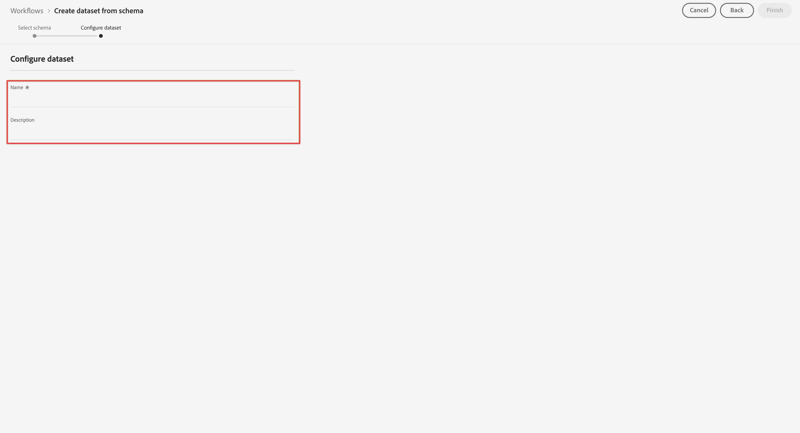
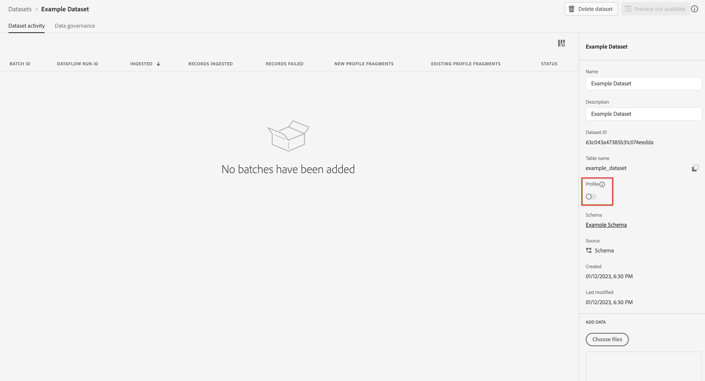

# 创建与 Customer Journey Analytics 使用的数据集 {#upgrade-create-dataset}

<!-- markdownlint-disable MD034 -->

>[!CONTEXTUALHELP]
>id="cja-upgrade-dataset-create"
>title="在 Adobe Experience Platform 中创建数据集"
>abstract="数据集是已收集数据所在的位置。 在 Adobe Experience Platform 中创建此位置。  基于既定架构创建数据集仅需几分钟。"

<!-- markdownlint-enable MD034 -->

{{upgrade-note-step}}

<!-- Should we single source this instead of duplicate it? The following steps were copied from: /help/data-ingestion/aepwebsdk.md-->

数据集是用于存储和管理您在 Adobe Experience Platform 中收集的数据的结构。

要创建数据集：

1. 在 Adobe Experience Platform 的左边栏中，选择[!UICONTROL 数据管理]中的&#x200B;**[!UICONTROL 数据集]**。

1. 选择&#x200B;**[!UICONTROL 创建数据集]**。

   

1. 选择&#x200B;**[!UICONTROL 使用架构创建数据集]**。

   。

1. 选择您之前创建的架构，然后选择 **[!UICONTROL 下一个]**。

1. 为您的数据集命名并（可选）提供描述。

   

1. 选择&#x200B;**[!UICONTROL 完成]**。

1. 选择&#x200B;**[!UICONTROL 轮廓]**&#x200B;开关

   系统会提示您启用轮廓的数据集。 启用后，数据集会使用其摄取的数据丰富实时客户轮廓。

   >[!IMPORTANT]
   >
   >    只有当数据集所依附的架构也为轮廓启用时，您才能为轮廓启用数据集。

   

   有关如何查看、预览、创建和删除数据集的更多信息，请参阅[数据集 UI 指南](https://experienceleague.adobe.com/docs/experience-platform/catalog/datasets/user-guide.html)。 您还可以了解如何为实时客户轮廓启用数据集。

{{upgrade-final-step}}
