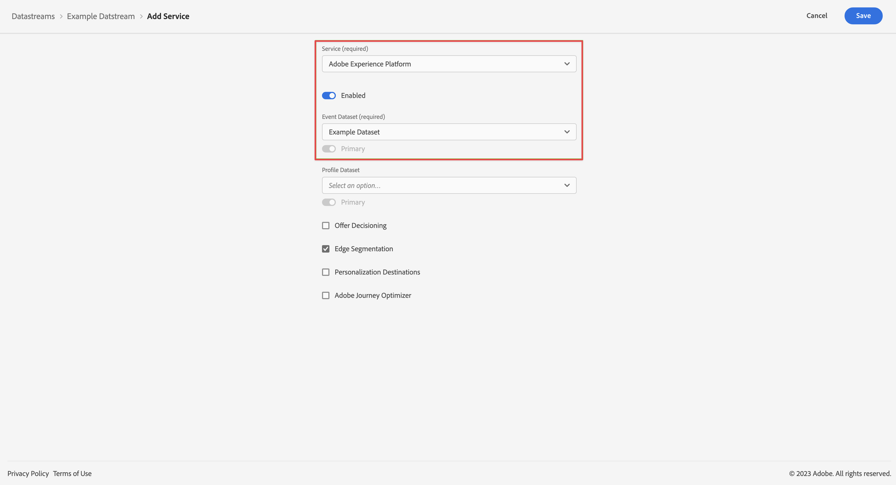

# 将 Platform as a Service 添加到您的数据流 {#upgrade-addplatform-datastream}

<!-- markdownlint-disable MD034 -->

>[!CONTEXTUALHELP]
>id="cja-upgrade-addplatform-datastream"
>title="将 Adobe Experience Platform 即服务添加到数据流"
>abstract="数据流需要一个或多个服务来向其发送数据。 在您的数据流中设置 Adobe Experience Platform 即服务。  将服务添加到数据流是一个简单的过程，只需几分钟即可完成。"

<!-- markdownlint-enable MD034 -->

{{upgrade-note-step}}

<!-- Should we single source this instead of duplicate it? The following steps were copied from: /help/data-ingestion/aepwebsdk.md-->

在完成本节中的步骤之前，数据流应该已经存在。 数据流的创建时间和方式取决于您的 Adobe Analytics 实施，如下所示：

* 如果您的 Adobe Analytics 实施使用的是 Web SDK 或 Web SDK 扩展，则在升级过程开始之前，数据流在您的 Adobe Analytics 环境中就已经可用。

* 对于其他 Adobe Analytics 实施，创建数据流是升级过程的一部分，如[创建用于 Customer Journey Analytics 的数据流](/help/getting-started/cja-upgrade/cja-upgrade-datastream.md)中所述。

在数据流可用的情况下，您需要添加 Platform as a Service：

1. 在 Adobe Experience Platform UI 中，选择左边栏内[!UICONTROL 数据收藏集]中的&#x200B;**[!UICONTROL 数据流]**。

1. 选择之前配置的数据流。<!--true?-->

1. 选择 **[!UICONTROL 添加服务]**。

1. 在 [!UICONTROL 添加服务屏幕]：

   1. 从 [!UICONTROL 服务] 列表中选择 **[!UICONTROL Adobe Experience Platform]**。

   1. 确保选择 **[!UICONTROL Enabled]**。

   1. 从 [!UICONTROL 事件数据集] 列表中选择您的数据集。

      

   1. 保留其他设置并选择 **[!UICONTROL 保存]** 以保存数据流。

   您的数据流现已配置为将从您的网站收集的数据转发到 Adobe Experience Platform 中的数据集。

   有关如何配置数据流和如何处理敏感数据的更多信息，请参阅[数据流概述](https://experienceleague.adobe.com/docs/experience-platform/datastreams/overview.html)。

{{upgrade-final-step}}
