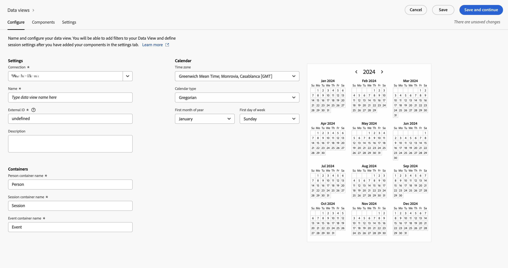

# 在 Customer Journey Analytics 中创建数据视图 {#upgrade-create-dataview}

<!-- markdownlint-disable MD034 -->

>[!CONTEXTUALHELP]
>id="cja-upgrade-dataview"
>title="在 Customer Journey Analytics 中创建数据视图"
>abstract="数据视图是 Customer Journey Analytics 专属的容器，通过它，可决定如何解释来自连接的数据。  初次创建数据视图只需几分钟，而使用所需的组件设置来配置每个维度和量度可能需要几天的时间。调整这些设置可以追溯性生效，因此您的组织可以渐渐地将其完善。"

<!-- markdownlint-enable MD034 -->

{{upgrade-note-step}}

<!-- Should we single source this instead of duplicate it? The following steps were copied from: /help/data-views/create-dataview.md -->

创建数据视图涉及从架构元素创建量度和维度或利用标准组件。大多数架构元素既可为维度，也可为量度，具体取决于您的业务要求。将架构元素拖入数据视图后，右侧即显示选项，从中可调整维度或量度在 Customer Journey Analytics 中的操作方式。

若要创建数据视图：

1. 登录 [Customer Journey Analytics](https://analytics.adobe.com)，在顶部菜单中选择&#x200B;**[!UICONTROL 数据视图]**，也可以从&#x200B;**[!UICONTROL 数据管理]**&#x200B;中选择。

1. 选择&#x200B;**[!UICONTROL 创建新的数据视图]**。或者，您可以从数据视图列表中选择现有数据视图进行编辑。

1. 在&#x200B;[!UICONTROL **配置**]&#x200B;选项卡上，指定数据视图的名称，并配置其基本设置、组件和日程表选项。

   有关每个字段的详细信息，请参阅[创建或编辑数据视图](/help/data-views/create-dataview.md#configure)中的[配置](/help/data-views/create-dataview.md)。

   

1. 选择&#x200B;[!UICONTROL **组件**]&#x200B;选项卡。

   您可以在&#x200B;[!UICONTROL **组件**]&#x200B;选项卡中设置数据视图的组件，也就是说您可以从架构元素创建量度和维度。您也可以使用标准组件。

   

1. 在&#x200B;[!UICONTROL **组件**]&#x200B;选项卡中，将架构元素从左侧边栏拖放到&#x200B;[!UICONTROL **量度**]&#x200B;部分或&#x200B;[!UICONTROL **维度**]&#x200B;部分。您添加的架构元素将会成为数据视图中的量度或维度。

   有关向数据视图添加组件时可用选项的详细信息，请参阅[创建或编辑数据视图](/help/data-views/create-dataview.md#components)中的[组件](/help/data-views/create-dataview.md)。

1. 选择&#x200B;[!UICONTROL **设置**]&#x200B;选项卡。从这里，您可以配置区段并将其应用于整个数据视图，还可以配置会话超时和量度。

   有关配置数据视图设置时可用选项的详细信息，请参阅[创建或编辑数据视图](/help/data-views/create-dataview.md#settings)中的[设置](/help/data-views/create-dataview.md)。

1. 选择&#x200B;**[!UICONTROL 保存]**，以保存数据视图的配置。

1. 在指定所有需要的设置后，选择&#x200B;**[!UICONTROL 保存并完成]**。

{{upgrade-final-step}}
