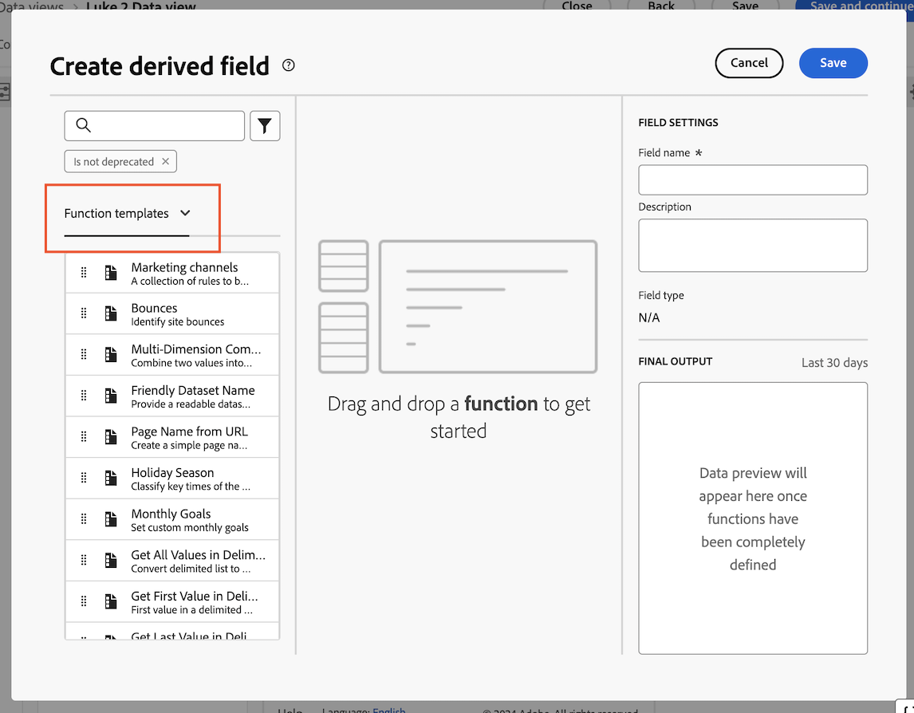

# 创建 Customer Journey Analytics 的营销渠道派生字段 {#create-marketing-channel-derived-field}

<!-- markdownlint-disable MD034 -->

>[!CONTEXTUALHELP]
>id="cja-upgrade-marketing-channel"
>title="创建营销渠道派生字段"
>abstract="派生字段在数据视图中创建。  使用默认营销渠道设置只需几分钟；创建高度自定义的营销渠道设置可能需要几个小时。"

<!-- markdownlint-enable MD034 -->

{{upgrade-note-step}}

使用 Analytics Source Connector 时，“营销渠道”数据会通过该连接器流入 Customer Journey Analytics。在传统的 Adobe Analytics 中配置营销渠道规则，其中不支持某些规则。如需了解更多信息，请参阅[使用营销渠道维度](/help/use-cases/aa-data/marketing-channels.md)。

为了在使用 Experience Platform Web SDK 时使用 Customer Journey Analytics 中的营销渠道，您可以使用数据视图中的派生字段为 Customer Journey Analytics 重新创建相同的营销渠道和处理规则。

1. 在 Customer Journey Analytics，选择您想要添加营销渠道的数据视图。

1. 在数据视图中，选择&#x200B;**[!UICONTROL 组件]**&#x200B;选项卡。

1. 在左边栏中选择&#x200B;**[!UICONTROL 创建派生字段]**。

1. 在&#x200B;**[!UICONTROL 创建派生字段]**&#x200B;对话框中，从下拉菜单中选择&#x200B;**[!UICONTROL 函数模板]**。

   

1. 将&#x200B;**[!UICONTROL 营销渠道]**&#x200B;模板拖到空白画布上。

1. 自定义每个营销渠道的逻辑，以确保它与您在 Adobe Analytics 环境中识别每个渠道所使用的逻辑相匹配。

   您可以通过修改输出渠道名称或添加逻辑来识别特定于您的组织的其他渠道。

1. 在右侧列中，指定营销渠道的名称和描述。

1. 选择&#x200B;**[!UICONTROL 保存]**。

   您的新派生字段将会被添加到派生字段 > 容器中，作为数据视图左边栏中架构字段的一部分。

{{upgrade-final-step}}
