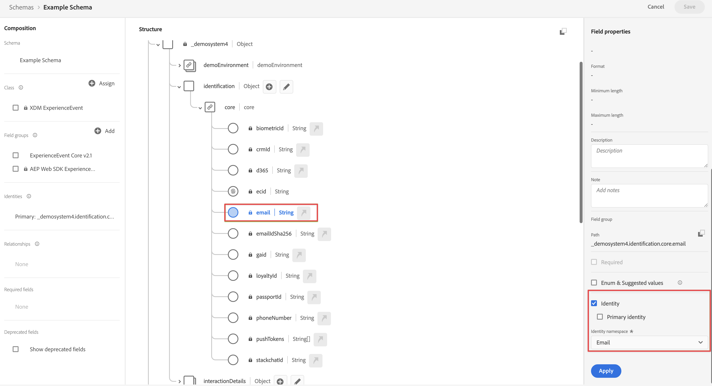

# 创建与 Customer Journey Analytics 使用的自定义架构 {#create-custom-schema}

<!-- markdownlint-disable MD034 -->

>[!CONTEXTUALHELP]
>id="cja-upgrade-schema-create"
>title="在 Adobe Experience Platform 中创建所需的自定义架构"
>abstract="使用 Adobe Experience Platform UI 创建一个架构，以便 Adobe 知道正确的数据存储格式。  此步骤将实际创建您的组织已同意的架构。在 Adobe Experience Platform 界面中创建架构的预计时间约为一周，具体取决于需要创建的维度及量度的数量。"

<!-- markdownlint-enable MD034 -->

<!-- markdownlint-disable MD034 -->

>[!CONTEXTUALHELP]
>id="cja-upgrade-schema-create-default-aa"
>title="使用 Adobe Analytics ExperienceEvent 字段组创建架构"
>abstract="使用“Adobe Analytics ExperienceEvent”字段组在 Adobe Experience Platform 中创建一个包含 Adobe Analytics 使用的所有字段的架构。  根据 Adobe Analytics ExperienceEvent 字段组创建架构很简单，只需几分钟即可完成。"

<!-- markdownlint-enable MD034 -->

<!-- markdownlint-disable MD034 -->

>[!CONTEXTUALHELP]
>id="cja-upgrade-schema-profile"
>title="为个人资料启用您的架构"
>abstract="在您的架构中启用个人资料以供 Adobe Real-time CDP 使用。出现此步骤是因为您选择了希望与 Adobe Real-time CDP 集成。  此步骤只需单击一个复选框，因此仅需几分钟。"

<!-- markdownlint-enable MD034 -->

{{upgrade-note-step}}

>[!IMPORTANT]
>
>在开始创建自定义架构之前，请与您的数据团队和整个组织中的其他利益相关者合作，确定贵组织适用于Customer Journey Analytics和您使用的其他Adobe Experience Platform应用程序的理想架构设计。 有关详细信息，请参阅[架构您的架构以用于Customer Journey Analytics](/help/getting-started/cja-upgrade/cja-upgrade-schema-architect.md)。

以下部分介绍了如何创建可与Customer Journey Analytics一起使用的架构。 可以使用以下架构选项：

* **自定义XDM架构：**（推荐）允许根据您的组织和您使用的特定Platform应用程序的需求定制简化的架构。 任何所需的未来更改都非常简单。

* **使用Adobe Analytics ExperienceEvent字段组的Adobe Analytics架构：**&#x200B;需要添加数千个不需要的字段。 将来要进行任何必要的更改都比较困难。

有关这些架构选项的更多信息，请参阅[选择您的Customer Journey Analytics架构](/help/getting-started/cja-upgrade/cja-upgrade-schema-existing.md)。

## 创建架构

您为Web SDK实施定义的自定义架构表示您收集到Adobe Experience Platform中的数据模型。

要创建自定义架构，请执行以下操作：

<!-- Should we single source this instead of duplicate it? The following steps were copied from: /help/data-ingestion/aepwebsdk.md-->

1. 在Adobe Experience Platform的左边栏中，选择[!UICONTROL 数据管理]中的&#x200B;**[!UICONTROL 架构]**。

1. 选择&#x200B;**[!UICONTROL 创建架构]**。

1. 在创建架构向导的&#x200B;**[!UICONTROL 选择类]**&#x200B;步骤中：

   1. 选择&#x200B;**[!UICONTROL 体验事件]**。

      

      >[!INFO]
      >
      >    体验事件架构用于为配置文件的&#x200B;_行为_&#x200B;建模（如场景名称、要添加到购物车的按钮）。 个人轮廓架构用于对轮廓&#x200B;_属性_（如姓名、电子邮件、性别）建模。

   1. 选择&#x200B;**[!UICONTROL 下一步]**。

1. 在[!UICONTROL 创建架构]向导的[!UICONTROL 名称和审核步骤]中：

   1. 为您的架构输入&#x200B;**[!UICONTROL 架构显示名称]**&#x200B;和（可选）**[!UICONTROL 描述]**。

      

   1. 选择&#x200B;**[!UICONTROL 完成]**。

1. 添加所有字段组，这些字段组包含您要包含在架构中的任何字段。

   字段组是可重用的对象和属性集合，可让您轻松扩展架构。

   1. 在&#x200B;**[!UICONTROL 字段组]**&#x200B;部分中，选择&#x200B;**[!UICONTROL +添加]**。

      

   1. 在[!UICONTROL 添加字段组]对话框中，从列表中选择 **[!UICONTROL AEP Web SDK ExperienceEvent]** 字段组。

      

      您可以选择预览按钮，以查看属于该字段组的字段的预览，例如 `web > webPageDetails > name`。

      

      选择&#x200B;**[!UICONTROL 返回]**&#x200B;关闭预览。

   1. （可选）选择要包含的任何其他字段组。

      如果您选择使用默认的Adobe Analytics架构而不是创建自定义XDM架构，则可以立即添加Adobe Analytics ExperienceEvent字段组。 但是，Adobe建议创建自定义XDM架构，而不是添加此字段组。

      有关这些架构选项的更多信息，请参阅[选择您的Customer Journey Analytics架构](/help/getting-started/cja-upgrade/cja-upgrade-schema-existing.md)。

   1. 选择&#x200B;**[!UICONTROL 添加字段组]**。

1. （可选）如果您要在架构中包含自定义字段，请创建自定义字段组并将自定义字段添加到字段组。

   1. 在&#x200B;**[!UICONTROL 字段组]**&#x200B;部分中，选择&#x200B;**[!UICONTROL +添加]**。

      

   1. 在[!UICONTROL 添加字段组]对话框中，选择&#x200B;**[!UICONTROL 新建字段组]**。

   1. 指定显示名称和可选说明，然后选择&#x200B;**[!UICONTROL 添加字段组]**。

1. 在[!UICONTROL 结构]面板中选择架构名称旁边的 **[!UICONTROL +]**。

   

1. 在 [!UICONTROL  字段属性 ] 面板中，输入 `Identification`作为名称，**[!UICONTROL Identification]** 作为 [!UICONTROL Display name]，选择 **[!UICONTROL Object]** 作为 [!UICONTROL Type] 和选择 **[!UICONTROL ExperienceEvent Core v2.1]** 作为 [!UICONTROL Field Group]。

   >[!NOTE]
   >
   >如果该字段组不可用，请查找另一个包含标识字段的字段组。 或者[创建新的字段组](https://experienceleague.adobe.com/docs/experience-platform/xdm/ui/resources/field-groups.html)和[将新的标识字段](https://experienceleague.adobe.com/docs/experience-platform/xdm/ui/fields/identity.html#define-a-identity-field)（如`ecid`、`crmId`和其他您需要的字段）添加到该字段组，并选择该新字段组。

   

   标识对象将标识功能添加到架构中。 对于您自己的网站，您需要使用Experience Cloud ID和电子邮件地址来识别访问您网站的用户档案。 还有许多其他属性可用于跟踪您的人员标识（例如客户ID、忠诚度ID）。

   选择&#x200B;**[!UICONTROL 应用]**&#x200B;将此对象添加到您的架构中。

1. 选择刚刚添加的身份标识对象中的&#x200B;**[!UICONTROL ecid]**&#x200B;字段，选择&#x200B;**[!UICONTROL 身份标识]**&#x200B;和&#x200B;**[!UICONTROL 主要身份标识]** 和 **[!UICONTROL ECID]** 来自右侧面板中的 [!UICONTROL 身份标识命名空间] 列表。

   

   您将 Experience Cloud Identity 指定为 Adobe Experience Platform Identity 服务可用于组合（缝合）具有相同 ECID 的轮廓行为的主要身份。

   选择 **[!UICONTROL 应用]**。您会看到 ecid 属性中出现指纹图标。

1. 选择刚刚添加的身份标识对象中的&#x200B;**[!UICONTROL 邮件]**&#x200B;字段，选择&#x200B;**[!UICONTROL 身份标识]**&#x200B;和&#x200B;**[!UICONTROL 邮件]** 和 [!UICONTROL 身份标识命名空间] 列表中的 [!UICONTROL 字段属性] 面板。

    

   您将电子邮件地址指定为 Adobe Experience Platform Identity 服务可用于组合（拼接）轮廓行为的另一个标识。

   选择 **[!UICONTROL 应用]**。您会看到电子邮件属性中显示指纹图标。

   选择&#x200B;**[!UICONTROL 保存]**。

1. （可选）如果要将Customer Journey Analytics与RTCDP集成，请选择显示架构名称的架构根元素，然后选择&#x200B;**[!UICONTROL 配置文件]**&#x200B;开关。

   系统会提示您启用轮廓的架构。一旦启用，当数据被引入基于此架构的数据集中时，该数据将合并到实时客户轮廓。

   有关详细信息，请参阅[启用架构以在实时客户轮廓中使用](https://experienceleague.adobe.com/docs/experience-platform/xdm/tutorials/create-schema-ui.html#profile)。

   >[!IMPORTANT]
   >
   >为配置文件启用架构后，无法为配置文件禁用该架构。

   

1. 选择&#x200B;**[!UICONTROL 保存]**&#x200B;以保存架构。

   您已经创建了一个最小架构，用于对您可以从您的网站捕获的数据进行建模。该架构允许使用 Experience Cloud Identity 和电子邮件地址来识别轮廓。通过启用轮廓架构，您可以确保从您的网站捕获的数据被添加到实时客户轮廓中。

   除了行为数据之外，您还可以从您的站点捕获轮廓属性数据（例如订阅时事通讯的轮廓的详细信息）。

   要捕获此轮廓数据，您需要：

   * 基于 XDM 个人轮廓类创建架构。

   * 将 Profile Core v2 字段组添加到架构中。

   * 添加基于 Profile Core v2 字段组的标识对象。

   * 将Experience Cloud ID定义为主标识符，将电子邮件定义为标识符。

   * 为轮廓启用架构

   请参阅[在 UI 中创建和编辑架构](https://experienceleague.adobe.com/docs/experience-platform/xdm/ui/resources/schemas.html)，了解有关向架构添加和删除字段组和单个字段的更多信息。

{{upgrade-final-step}}
