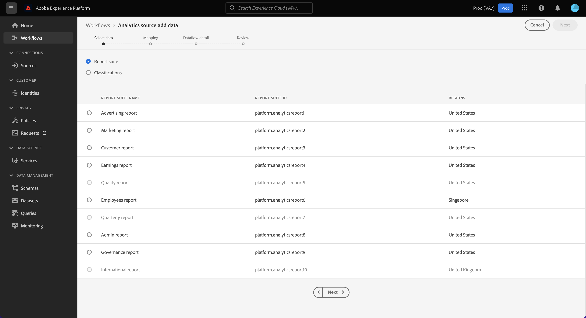
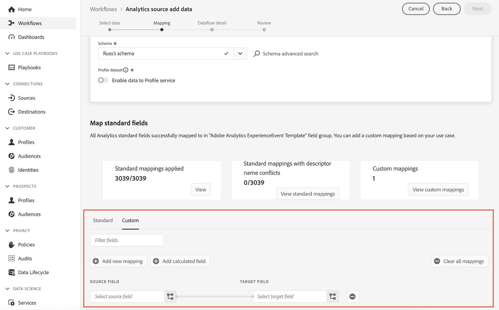
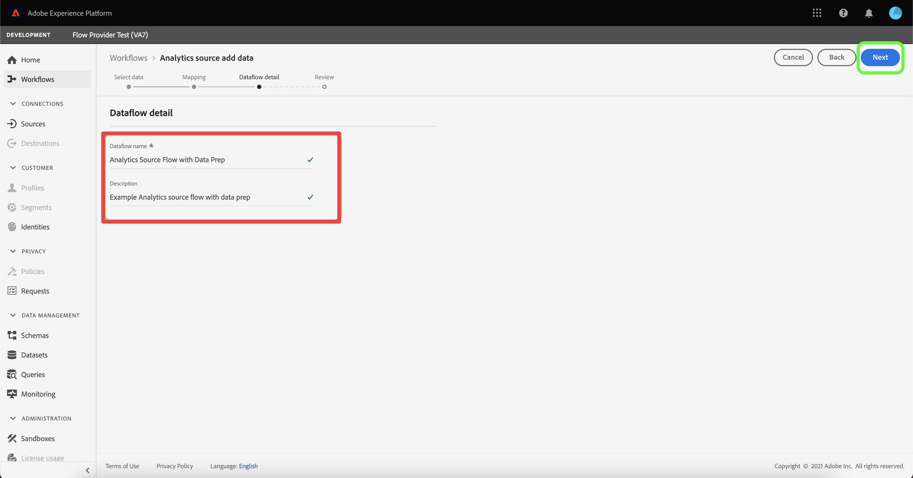
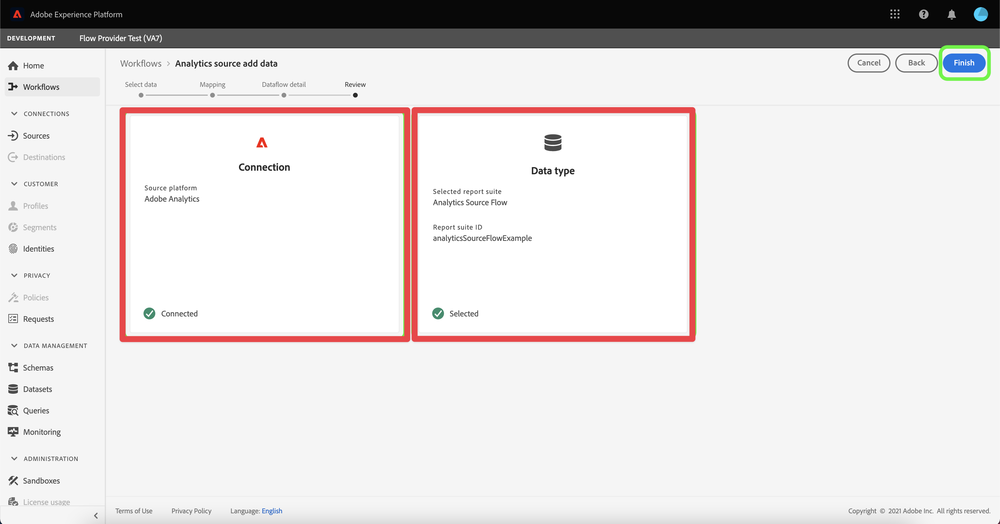

# 创建 Analytics 源连接器并映射字段 {#create-source-connector}

<!-- markdownlint-disable MD034 -->

>[!CONTEXTUALHELP]
>id="cja-upgrade-source-connector-create"
>title="创建 Analytics 源连接器"
>abstract="使用 Analytics 源连接器摄取报表包数据，以供 Customer Journey Analytics 使用。  使用默认设置创建 Analytics 源连接器仅需几分钟。"

<!-- markdownlint-enable MD034 -->

<!-- markdownlint-disable MD034 -->

>[!CONTEXTUALHELP]
>id="cja-upgrade-source-connector-map-fields"
>title="创建 Analytics 源连接器并映射架构字段"
>abstract="源连接器需要知道如何将 Adobe Analytics 字段映射到您组织的架构。 使用此界面向源连接器提供该映射。 此步骤属于向 Customer Journey Analytics 添加历史数据的一部分。  完成此步骤所需时间在很大程度上取决于需要映射的维度和量度数量。 这一步并不难，但是它很繁琐且重复。 预计数据流映射大约需要一周的时间才能完成。"

<!-- markdownlint-enable MD034 -->

{{upgrade-note-step}}

## 了解 Analytics 源连接器如何将历史数据带入 Customer Journey Analytics

您可以使用 Analytics 源连接器将 Adobe Analytics 报告套件数据导入到 Adobe Experience Platform。 然后，这些数据可以用作 Customer Journey Analytics 中的历史数据。

此过程假设您希望[创建一个自定义架构，以便与您的 Customer Journey Analytics Web SDK 实施一起使用](/help/getting-started/cja-upgrade/cja-upgrade-schema-create.md)，因为您需要一个根据您的组织需求和您使用的特定 Platform 应用程序量身定制的精简模式。

要使用 Analytics 源连接器将历史数据引入 Customer Journey Analytics，您需要：

1. [为 Analytics 源连接器创建一个自定义架构](/help/getting-started/cja-upgrade/cja-upgrade-source-connector-schema.md)

1. 如果您还没有 Analytics 源连接器，请创建 Analytics 源连接器并将字段映射到您的自定义 Web SDK 架构中，如下所述。

   或

   如果您已拥有 Analytics 源连接器，[则将字段从源连接器映射到您的自定义 Web SDK 架构中](/help/getting-started/cja-upgrade/cja-upgrade-from-source-connector.md)。

1. [将 Analytics 源连接器数据集添加到连接](/help/getting-started/cja-upgrade/cja-upgrade-source-connector-dataset.md)

## 创建 Analytics 源连接器并映射字段

创建自定义架构后，您需要创建 Adobe Analytics 源连接器，以用于历史数据。 （有关创建源连接器的更全面的通用准则，请参阅[在 UI 中创建 Adobe Analytics 源连接](https://experienceleague.adobe.com/docs/experience-platform/sources/ui-tutorials/create/adobe-applications/analytics.html?lang=zh-Hans)。）

要创建用于历史数据的 Adobe Analytics 源连接器，请执行以下操作：

1. 在 Platform UI 中，在左边栏的&#x200B;**[!UICONTROL 连接]**&#x200B;部分，选择&#x200B;**[!UICONTROL 源]**。

1. 从[!UICONTROL 分类]列表中选择 **[!UICONTROL Adobe 应用程序]**

1. 在 Adobe Analytics 互动程序中选择&#x200B;**[!UICONTROL 添加数据]**。

   

1. 选择&#x200B;**[!UICONTROL 报告包]**，然后从报告包列表中选择包含要在 Customer Journey Analytics 中使用的历史数据的报告包。

   

1. 选择屏幕右上角的&#x200B;**[!UICONTROL 下一步]**。

1. 选择&#x200B;**[!UICONTROL 自定义架构]**，然后选择您在[创建包含 Adobe Analytics 字段组的自定义架构](/help/getting-started/cja-upgrade/cja-upgrade-source-connector-schema.md)中创建的架构。<!-- Deleted this, because I changed this from choosing the default schemawe're pointing them now at the schema they just created: "Adobe Experience Platform  automatically creates the schema and the corresponding dataset to map all standard fields from the selected Adobe Analytics report suite." -->

   <!-- add screenshot -->

1. 将每个 Adobe Analytics 维度映射到一个自定义架构维度。

   1. 在&#x200B;**[!UICONTROL 映射标准字段]**&#x200B;部分中，选择&#x200B;**[!UICONTROL 自定义]**&#x200B;选项卡。

   1. 选择&#x200B;**[!UICONTROL 添加新映射]**。

   

   1. 在&#x200B;**[!UICONTROL 源字段]**&#x200B;中，从 Adobe Analytics ExperienceEvent 模板字段组中选择一个 Adobe Analytics 字段。 然后，在&#x200B;**[!UICONTROL 目标字段]**&#x200B;中，选择要将其映射到的 XDM 架构中的自定义字段。

      由于 AppMeasurement 和 XDM 之间存在固有的架构差异，因此并非所有 Adobe Analytics 字段在 XDM 中都有对应的字段。

   1. 对用于在 Adobe Analytics 中收集数据的 Adobe Analytics ExperienceEvent 模板字段组中的每个字段重复此过程。

1. 选择屏幕右上角的&#x200B;**[!UICONTROL 下一步]**。

1. 命名数据流并（可选）提供描述。

   

1. 选择屏幕右上角的&#x200B;**[!UICONTROL 下一步]**。

1. 检查连接，然后选择&#x200B;**[!UICONTROL 完成]**。

   

   创建连接后，将自动创建数据流，以使用报告包中的 Adobe Analytics 数据填充数据集。 数据流会为生产沙盒摄取最多 13 个月的历史数据。 非生产沙盒的回填期限为三个月。

   如果您使用 Analytics 源连接器将历史数据带入您的 Customer Journey Analytics Web SDK 实施，那么您需要将此自动创建的数据集添加到您为 Web SDK 实施创建的连接中。

{{upgrade-final-step}}
