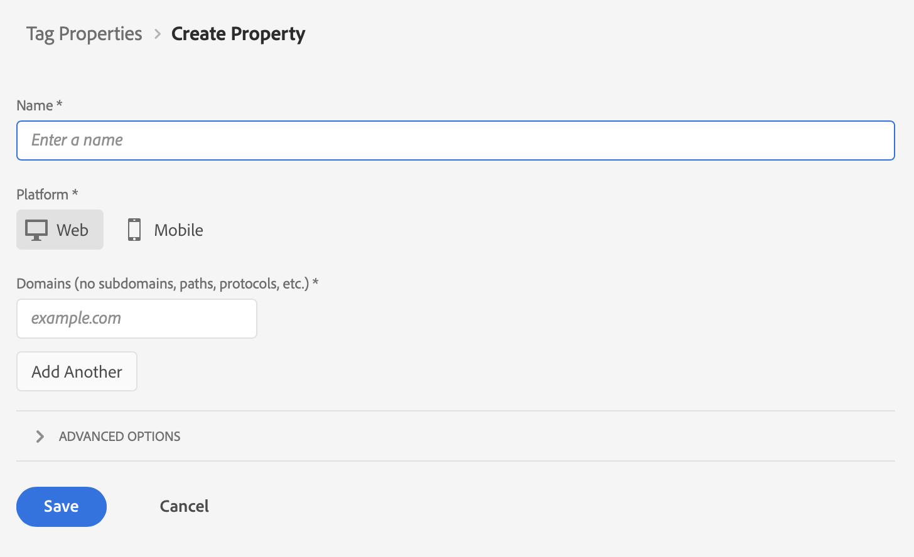

# 为您的属性创建标记

>[!NOTE]
> 
>只有在完成所有先前的升级步骤后，才应执行本页上的步骤。 您可以按照[推荐的升级步骤](/help/getting-started/cja-upgrade/cja-upgrade-recommendations.md#recommended-upgrade-steps-for-most-organizations)进行操作，也可以按照[Adobe Analytics为您的组织动态生成的升级步骤来Customer Journey Analytics升级调查表](https://gigazelle.github.io/cja-ttv/)。
>
>完成此页面上的步骤后，请继续执行建议的升级步骤或动态生成的升级步骤。

您可以使用Adobe Experience Platform中的标记功能在您的网站上实施代码以收集数据。 这一款标记管理解决方案，可让您在满足其他标记要求的同时部署代码。标签使用 Adobe Experience Platform Web SDK 扩展提供与 Adobe Experience Platform 的无缝集成。

以下信息介绍了如何为资产创建标记。 有关补充信息，请参阅Experience Platform文档中的[配置Web SDK标记扩展](https://experienceleague.adobe.com/en/docs/experience-platform/tags/extensions/client/web-sdk/web-sdk-extension-configuration)。 Web SDK本身包含[!UICONTROL Adobe Experience Cloud ID服务]，因此您无需将ID服务扩展添加到标记中。

资产基本上就是一个容器，在将标记部署到网站时可在其中填充扩展、规则、数据元素和库。很多人会为想要部署同一组标记的每个网站（或一组密切相关的网站）创建一个资产。 有关属性的详细信息，请参阅Experience Platform数据收集文档中的[属性](https://experienceleague.adobe.com/en/docs/experience-platform/tags/admin/companies-and-properties)。

要为资产创建标记，请执行以下操作：

1. 使用您的Adobe ID凭据登录experience.adobe.com 。

1. 在Adobe Experience Platform中，转到&#x200B;**[!UICONTROL 数据收集]** > **[!UICONTROL 标记]**。

1. 选择&#x200B;**[!UICONTROL 新属性]**。

   为标签命名，选择 **[!UICONTROL Web]** 并输入域名。选择&#x200B;**[!UICONTROL 保存]**&#x200B;继续。

   

1. 继续执行[建议的升级步骤](/help/getting-started/cja-upgrade/cja-upgrade-recommendations.md#recommended-upgrade-steps-for-most-organizations)或[动态生成的升级步骤](https://gigazelle.github.io/cja-ttv/)。
