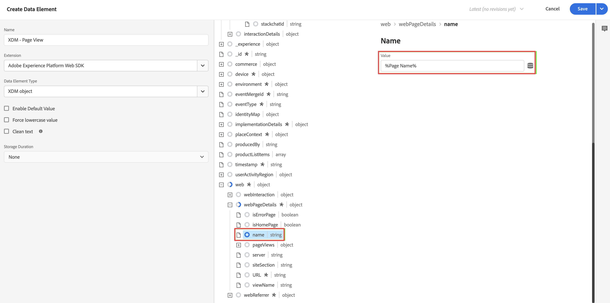

# 将 XDM 数据收集逻辑添加到您的标记中 {#upgrade-tag-xdm}

<!-- markdownlint-disable MD034 -->

>[!CONTEXTUALHELP]
>id="cja-upgrade-tag-xdm"
>title="将 XDM 数据收集逻辑添加到您的标记中"
>abstract="在您的网站上安装加载器标记后，您可以添加规则和数据元素来填充 XDM 对象，然后发送给 Adobe。Adobe 建议维护一个解决方案设计文档来跟踪标记的配置方式。  这一步工作量很大，因为要为您的属性设置所有分析逻辑。预计需要花费一个月或更长的时间来建立正确的标记规则、测试它们并将它们部署到您的网站上。"

<!-- markdownlint-enable MD034 -->

{{upgrade-note-step}}

[在创建标记并添加 Web SDK 扩展后](/help/getting-started/cja-upgrade/cja-upgrade-tag-property.md)，您必须根据您希望跟踪网站并将数据发送到 Adobe Experience Platform 的方式，使用数据元素和规则对其进行配置。配置标记的数据元素和规则后，即可构建和发布该标记。

## 配置数据元素

数据元素是数据字典（或数据映射）的构建块。使用数据元素可跨市场营销和广告技术收集、组织和交付数据。您可以在标记中设置从数据层读取的数据元素，并可用于将数据传送到 Adobe Experience Platform。（有关数据元素的更多信息，请参阅标记文档中的[数据元素](https://experienceleague.adobe.com/zh-hans/docs/experience-platform/tags/ui/data-elements)。）

以下部分描述了建议配置的数据元素，以及您可以配置的其他常见数据元素。

有各种类型的数据元素。建议您配置以下两个常见数据元素：一个用于捕获人们在您的网站上查看的页面名称，另一个用于捕获访问您网站的每个人的 Experience Cloud ID。

配置完这两个数据元素后，您可以为想要捕获的特定数据配置其他数据元素。

最后，在定义了所有所需的数据元素后，您需要将数据元素分配给[您之前创建的架构](/help/getting-started/cja-upgrade/cja-upgrade-schema-create.md)。为此，您需要定义一个 XDM 数据元素，它提供了 XDM 架构的表示。

<!-- Assigning data elements to an XDM object. All of the available XDM objects are based on the schema -->

### 创建建议的数据元素

以下部分将会介绍如何创建适用于大多数组织的通用数据元素。

#### 页面名称数据元素

适用于大多数组织的常见数据元素是捕获人们正在查看的页面名称的数据元素。

若要创建页面名称数据元素：

1. 使用您的 Adobe ID 凭据登录 experience.adobe.com。

1. 在 Adobe Experience Platform 中，前往&#x200B;**[!UICONTROL 数据收集]** > **[!UICONTROL 标记]**。

1. 在&#x200B;**[!UICONTROL 标记属性]**&#x200B;页面上，从属性列表中选择您新创建的标记，以将其打开。

1. 选择左边栏中的&#x200B;**[!UICONTROL 数据元素]**。

1. 选择&#x200B;**[!UICONTROL 添加数据元素]**。

1. 在&#x200B;**[!UICONTROL 创建数据元素]**&#x200B;对话框中，指定以下信息：

   * **[!UICONTROL 名称]**：数据元素的名称。例如：`Page Name`。

   * **[!UICONTROL 扩展]**：从列表中选择&#x200B;**[!UICONTROL 核心]**

   * **[!UICONTROL 数据元素类型]**：从列表中选择&#x200B;**[!UICONTROL 页面信息]**。

   * **[!UICONTROL 属性]**：从列表中选择&#x200B;**[!UICONTROL 标题]**。

     

     或者您可以使用数据层变量中的值，例如 `pageName` 和 [!UICONTROL JavaScript 变量]数据元素类型来定义数据元素。

     

1. 选择&#x200B;**[!UICONTROL 保存]**。

   您现在想要设置一个引用 Experience Cloud ID 的数据元素，该 ID 由 Adobe Experience Platform Web SDK 自动提供，可通过 Experience Cloud ID 服务扩展使用。

1. 继续使用 [ECID 数据元素](#ecid-data-element)。

#### ECID 数据元素

适用于大多数组织的常见数据元素是捕获访问您网站的每个人的 Experience Cloud ID 的数据元素。

若要创建 ECID 数据元素：

1. 使用您的 Adobe ID 凭据登录 experience.adobe.com。

1. 在 Adobe Experience Platform 中，前往&#x200B;**[!UICONTROL 数据收集]** > **[!UICONTROL 标记]**。

1. 从[!UICONTROL 标记属性]列表中选择您新创建的标记，以将其打开。

1. （视情况而定）如果尚未安装 Experience Cloud ID 服务扩展，请安装它：

   1. 选择左边栏中的&#x200B;**[!UICONTROL 扩展]**。

   1. 默认情况下，**[!UICONTROL 已安装]** 选项卡处于选中状态。如果其中列出了 **[!UICONTROL Experience Cloud ID 服务]**&#x200B;图块，请跳至步骤 5。

   1. 如果未列出 **[!UICONTROL Experience Cloud ID 服务]**&#x200B;图块，请选择&#x200B;**[!UICONTROL 目录]**&#x200B;选项卡。

   1. 在搜索字段中，搜索 **[!UICONTROL Experience Cloud ID 服务]**，然后在出现图块时选择它

   1. 选择&#x200B;**[!UICONTROL 安装]** > **[!UICONTROL 保存]**。

1. 选择左边栏中的&#x200B;**[!UICONTROL 数据元素]**。

1. 选择&#x200B;**[!UICONTROL 添加数据元素]**。

1. 在&#x200B;**[!UICONTROL 创建数据元素]**&#x200B;对话框中，指定以下信息：

   * **[!UICONTROL 名称]**：数据元素的名称。例如：`ECID`。

   * **[!UICONTROL 扩展]**：从列表中选择 **[!UICONTROL Experience Cloud ID 服务]**。

   * **[!UICONTROL 数据元素类型]**：从列表中选择 **[!UICONTROL ECID]**。

     

1. 选择&#x200B;**[!UICONTROL 保存]**。

1. 继续[创建其他数据元素](#create-additional-data-elements)。

### 创建其他数据元素

为您想要收集的每种类型的数据创建一个数据元素。使用[页面名称数据元素](#page-name-data-element)和 [ECID 数据元素](#ecid-data-element)中描述的相同流程来创建每个附加数据元素。

您创建的数据元素应该在您的架构中有一个相关字段。

常见数据元素因行业和业务需求而异。考虑以下按行业组织的常见数据元素：

**零售数据元素**

* 产品

* 购物车加货

* 结账

**财务数据元素**

* 交易 ID

* 交易日期

* 服务类型

**医疗保健数据元素**

* 提供商 ID

* 访问日期

* 处理类型

在创建您的组织进行实施所需的所有数据元素后，继续使用 [XDM 对象数据元素](#xdm-object-data-element)。

### XDM 对象数据元素

最后，您需要将创建的任何数据元素映射到[您之前创建的架构](/help/getting-started/cja-upgrade/cja-upgrade-schema-create.md)。为此，定义一个 XDM 对象数据元素，该元素提供 XDM 架构的表示。

要定义 XDM 对象数据元素：

1. 使用您的 Adobe ID 凭据登录 experience.adobe.com。

1. 在 Adobe Experience Platform 中，前往&#x200B;**[!UICONTROL 数据收集]** > **[!UICONTROL 标记]**。

1. 从[!UICONTROL 标记属性]列表中选择您新创建的标记，以将其打开。

1. 选择左边栏中的&#x200B;**[!UICONTROL 数据元素]**。

1. 选择&#x200B;**[!UICONTROL 添加数据元素]**。

1. 在&#x200B;**[!UICONTROL 创建数据元素]**&#x200B;对话框中，指定以下信息：

   * **[!UICONTROL 名称]**：数据元素的名称。例如：`XDM - Page View`。

   * **[!UICONTROL 扩展]**：从列表中选择 **[!UICONTROL Adobe Experience Platform Web SDK]**。

   * **[!UICONTROL 数据元素类型]**：从列表中选择 **[!UICONTROL XDM 对象]**。

   * **[!UICONTROL 沙盒]**：从列表中选择沙盒。

   * **[!UICONTROL 架构]**：从列表中选择架构。

1. 将架构中定义的 `identification > core > ecid` 属性映射到 ECID 数据元素。选择圆柱体图标可以轻松地从数据元素列表中拾取 ECID 数据元素。

   

   

1. 将架构中定义的`web > webPageDetails > name` 属性映射到页面名称数据元素。

   

1. 选择&#x200B;**[!UICONTROL 保存]**。

1. 继续[配置规则](#configure-rules)。

## **配置规则**

Adobe Experience Platform 中的标签遵循基于规则的系统。他们寻找用户交互和相关数据。如果满足您的规则中所列的标准，则规则会触发您已识别的扩展、脚本或客户端代码。您可以使用规则使用 Adobe Experience Platform Web SDK 扩展将数据（如 XDM 对象）发送到 Adobe Experience Platform。

去定义规则

>[!NOTE]
>
>以下步骤是定义规则的示例，该规则会将包含来自其他数据元素的值的 XDM 数据发送到 Adobe Experience Platform。
>
>您可以在标记中以各种方式使用规则来操作变量（使用数据元素）。
>
>有关详细信息，请参阅[规则](https://experienceleague.adobe.com/docs/experience-platform/tags/ui/rules.html?lang=zh-Hans)。

1. 使用您的 Adobe ID 凭据登录 experience.adobe.com。

1. 在 Adobe Experience Platform 中，前往&#x200B;**[!UICONTROL 数据收集]** > **[!UICONTROL 标记]**。

1. 从[!UICONTROL 标记属性]列表中选择您新创建的标记，以将其打开。

1. 选择左边栏中的&#x200B;**[!UICONTROL 规则]**。

1. 选择&#x200B;**[!UICONTROL 添加规则]**。

1. 在&#x200B;**[!UICONTROL 创建规则]**&#x200B;对话框中，指定以下信息：

   * **[!UICONTROL 名称]**：规则的名称。例如：`Page View`。

   * **[!UICONTROL 事件]**：选择&#x200B;**[!UICONTROL + 添加]**。然后，在&#x200B;**[!UICONTROL 事件配置]**&#x200B;对话框中，指定以下信息。完成后，选择&#x200B;**[!UICONTROL 保留更改]**。

      * **[!UICONTROL 扩展]**：从列表中选择&#x200B;**[!UICONTROL 核心]**

      * **[!UICONTROL 事件类型]**：从列表中选择&#x200B;**[!UICONTROL 加载的窗口]**。

        

   * **[!UICONTROL 操作]**：选择&#x200B;**[!UICONTROL + 添加]**。然后，在[!UICONTROL 操作配置]对话框中，指定以下信息。完成后，选择&#x200B;**[!UICONTROL 保留更改]**。

      * **[!UICONTROL 扩展]**：从列表中选择 **[!UICONTROL Adobe Experience Platform Web SDK]**。

      * **[!UICONTROL 操作类型]**：从列表中选择&#x200B;**[!UICONTROL 发送事件]**

      * **[!UICONTROL 类型]**：从列表中选择 **[!UICONTROL Web Webpagedetails 页面浏览量]**。

      * **[!UICONTROL XDM 数据]**：选择圆柱体图标，然后从数据元素列表中选择 **[!UICONTROL XDM - 页面浏览量]**。

        

        您的规则应如下所示：

        

1. 选择&#x200B;**[!UICONTROL 保存]**。

1. 对要添加到网站的每条规则重复此过程。

   有关规则的更多信息，请参阅标记文档中的[规则](https://experienceleague.adobe.com/zh-hans/docs/experience-platform/tags/ui/rules)。

1. 继续[构建并发布您的标记](#build-and-publish-your-tag)。

## 生成并发布标记

在定义了数据元素和规则之后，您必须构建和发布该标记。创建库生成时，必须将其分配给环境。然后，将会编译该内部版本的扩展、规则和数据元素，并将这些内容放入分配的环境。每个环境都提供了一个唯一的嵌入代码，从而允许您将其分配的内部版本集成到网站中。

Adobe Experience Platform 标记功能支持简单到复杂的发布工作流，这些工作流应适合您部署 Adobe Experience Platform Web SDK。有关详细信息，请参阅[发布概述](https://experienceleague.adobe.com/docs/experience-platform/tags/publish/overview.html?lang=zh-Hans)。

要生成并发布您的标记：

1. 使用您的 Adobe ID 凭据登录 experience.adobe.com。

1. 在 Adobe Experience Platform 中，前往&#x200B;**[!UICONTROL 数据收集]** > **[!UICONTROL 标记]**。

1. 从[!UICONTROL 标记属性]列表中选择您新创建的标记，以将其打开。

1. 从左边栏中选择&#x200B;**[!UICONTROL 发布流]**。

1. 选择&#x200B;**[!UICONTROL 添加库]**。

1. 在&#x200B;**[!UICONTROL 创建库]**&#x200B;对话框中，指定以下信息：

   * **[!UICONTROL 名称]**：库的名称。

   * **[!UICONTROL 环境]**：从列表中选择&#x200B;**[!UICONTROL 开发（开发）]**。

1. 选择&#x200B;**[!UICONTROL + 添加所有更改的资源]**。

   

1. 选择&#x200B;**[!UICONTROL 保存并生成到开发]**。

   您的标记已保存，并为您的开发环境构建。绿色圆点表示在开发环境中成功构建了标记。

1. 您可以选择&#x200B;**[!UICONTROL ...]** 重建库或将库移动到临时或生产环境。

   

{{upgrade-final-step}}

