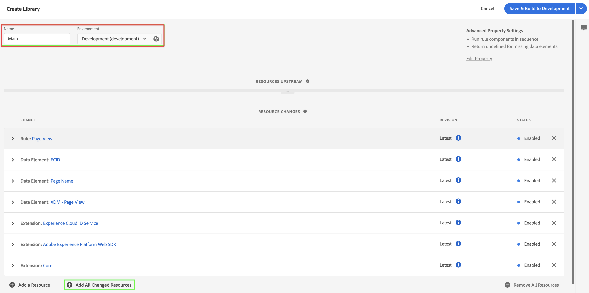

# 将XDM数据收集逻辑添加到标记

>[!NOTE]
> 
>只有在完成所有先前的升级步骤后，才应执行本页上的步骤。 您可以按照[推荐的升级步骤](/help/getting-started/cja-upgrade/cja-upgrade-recommendations.md#recommended-upgrade-steps-for-most-organizations)进行操作，也可以按照[Adobe Analytics为您的组织动态生成的升级步骤来Customer Journey Analytics升级调查表](https://gigazelle.github.io/cja-ttv/)。
>
>完成此页面上的步骤后，请继续执行建议的升级步骤或动态生成的升级步骤。

在[创建标记并添加Web SDK扩展](/help/getting-started/cja-upgrade/cja-upgrade-tag-property.md)后，您必须根据您希望跟踪网站并将数据发送到Adobe Experience Platform的方式，使用数据元素和规则对其进行配置。 为标记配置数据元素和规则后，即可构建和发布该标记。

## 配置数据元素

数据元素是数据词典（或数据映射）的构建块。使用数据元素可跨市场营销和广告技术收集、组织和交付数据。您可以在标记中设置从数据层读取的数据元素，并可用于将数据传送到 Adobe Experience Platform。

有不同类型的数据元素。首先，设置一个数据元素以捕获访客在您的网站上查看的页面名称。 然后，设置引用Experience CloudID的数据元素。 最后，定义XDM对象数据元素。

### Page name数据元素

定义页面名称数据元素：

1. 使用您的Adobe ID凭据登录experience.adobe.com 。

1. 在Adobe Experience Platform中，转到&#x200B;**[!UICONTROL 数据收集]** > **[!UICONTROL 标记]**。

1. 从 [!UICONTROL 标签属性] 列表中选择您新创建的标签以将其打开。

1. 选择左边栏中的&#x200B;**[!UICONTROL 数据元素]**。

1. 选择&#x200B;**[!UICONTROL 添加数据元素]**。

1. 在[!UICONTROL 创建数据元素]对话框中，指定以下信息：

   * **[!UICONTROL 名称]**：数据元素的名称。 例如：`Page Name`。

   * **[!UICONTROL 扩展]**：从列表中选择&#x200B;**[!UICONTROL 核心]**。

   * **[!UICONTROL 数据元素类型]**：从列表中选择&#x200B;**[!UICONTROL 页面信息]**。

   * **[!UICONTROL 属性]**：从列表中选择&#x200B;**[!UICONTROL 标题]**。

     

     或者您可以使用数据层变量中的值，例如 `pageName` 和 [!UICONTROL JavaScript 变量]数据元素类型来定义数据元素。

     

1. 选择&#x200B;**[!UICONTROL 保存]**。

   您现在想要设置一个引用 Experience Cloud ID 的数据元素，该 ID 由 Adobe Experience Platform Web SDK 自动提供，可通过 Experience Cloud ID 服务扩展使用。

1. 继续使用[ECID数据元素](#ecid-data-element)。

### ECID数据元素

要定义 ECID 数据元素：

1. 使用您的Adobe ID凭据登录experience.adobe.com 。

1. 在Adobe Experience Platform中，转到&#x200B;**[!UICONTROL 数据收集]** > **[!UICONTROL 标记]**。

1. 从 [!UICONTROL 标签属性] 列表中选择您新创建的标签以将其打开。

1. 选择左边栏中的&#x200B;**[!UICONTROL 数据元素]**。

1. 选择&#x200B;**[!UICONTROL 添加数据元素]**。

1. 在[!UICONTROL 创建数据元素]对话框中，指定以下信息：

   * **[!UICONTROL 名称]**：数据元素的名称。 例如：`ECID`。

   * **[!UICONTROL 扩展]**：从列表中选择&#x200B;**[!UICONTROL Experience CloudID服务]**。

   * **[!UICONTROL 数据元素类型]**：从列表中选择&#x200B;**[!UICONTROL ECID]**。

     

1. 选择&#x200B;**[!UICONTROL 保存]**。

1. 继续使用[XDM对象数据元素](#xdm-object-data-element)。

### XDM对象数据元素

最后，您现在希望将任何特定的数据元素映射到先前定义的模式。您可以定义另一个数据元素，它提供 XDM 模式的表示。

要定义 XDM 对象数据元素：

1. 使用您的Adobe ID凭据登录experience.adobe.com 。

1. 在Adobe Experience Platform中，转到&#x200B;**[!UICONTROL 数据收集]** > **[!UICONTROL 标记]**。

1. 从 [!UICONTROL 标签属性] 列表中选择您新创建的标签以将其打开。

1. 选择左边栏中的&#x200B;**[!UICONTROL 数据元素]**。

1. 选择&#x200B;**[!UICONTROL 添加数据元素]**。

1. 在[!UICONTROL 创建数据元素]对话框中，指定以下信息：

   * **[!UICONTROL 名称]**：数据元素的名称。 例如：`XDM - Page View`。

   * **[!UICONTROL 扩展]**：从列表中选择&#x200B;**[!UICONTROL Adobe Experience Platform Web SDK]**。

   * **[!UICONTROL 数据元素类型]**：从列表中选择&#x200B;**[!UICONTROL XDM对象]**。

   * **[!UICONTROL 沙盒]**：从列表中选择您的沙盒。

   * **[!UICONTROL 架构]**：从列表中选择您的架构。

1. 将模式中定义的 `identification > core > ecid` 属性映射到 ECID 数据元素。选择圆柱体图标可以轻松地从数据元素列表中拾取 ECID 数据元素。

   

   

1. 将模式中定义的`web > webPageDetails > name` 属性映射到页面名称数据元素。

   

1. 选择&#x200B;**[!UICONTROL 保存]**。

1. 继续[配置规则](#configure-rules)。

## **配置规则**

Adobe Experience Platform 中的标签遵循基于规则的系统。他们寻找用户交互和相关数据。如果满足您的规则中所列的标准，则规则会触发您已识别的扩展、脚本或客户端代码。您可以使用规则使用 Adobe Experience Platform Web SDK 扩展将数据（如 XDM 对象）发送到 Adobe Experience Platform。

去定义规则

>[!NOTE]
>
>以下步骤是定义规则的示例，该规则会将XDM数据（包含来自其他数据元素的值）发送到Adobe Experience Platform。
>
>您可以在标记中以各种方式使用规则来操作变量（使用数据元素）。
>
>有关详细信息，请参阅[规则](https://experienceleague.adobe.com/docs/experience-platform/tags/ui/rules.html?lang=zh-Hans)。

1. 使用您的Adobe ID凭据登录experience.adobe.com 。

1. 在Adobe Experience Platform中，转到&#x200B;**[!UICONTROL 数据收集]** > **[!UICONTROL 标记]**。

1. 从 [!UICONTROL 标签属性] 列表中选择您新创建的标签以将其打开。

1. 选择左边栏中的&#x200B;**[!UICONTROL 规则]**。

1. 选择&#x200B;**[!UICONTROL 创建新规则]**。

1. 在[!UICONTROL 创建规则]对话框中，指定以下信息：

   * **[!UICONTROL 名称]**：规则的名称。 例如：`Page View`。

   * **[!UICONTROL 事件]**：选择&#x200B;**[!UICONTROL +添加]**。 然后，在[!UICONTROL 事件配置]对话框中，指定以下信息。 完成后，选择&#x200B;**[!UICONTROL 保留更改]**。

      * **[!UICONTROL 扩展]**：从列表中选择&#x200B;**[!UICONTROL 核心]**。

      * **[!UICONTROL 事件类型]**：从列表中选择&#x200B;**[!UICONTROL 已加载窗口]**。

        

   * **[!UICONTROL 操作]**：选择&#x200B;**[!UICONTROL +添加]**。 然后，在[!UICONTROL 操作配置]对话框中，指定以下信息。 完成后，选择&#x200B;**[!UICONTROL 保留更改]**。

      * **[!UICONTROL 扩展]**：从列表中选择&#x200B;**[!UICONTROL Adobe Experience Platform Web SDK]**。

      * **[!UICONTROL 操作类型]**：从列表中选择&#x200B;**[!UICONTROL 发送事件]**。

      * **[!UICONTROL 类型]**：从列表中选择&#x200B;**[!UICONTROL web.webpagedetails.pageViews]**。

      * **[!UICONTROL XDM数据]**：选择圆柱体图标，然后从数据元素列表中选择&#x200B;**[!UICONTROL XDM — 页面视图]**。

        

        您的规则应如下所示：

        

1. 选择&#x200B;**[!UICONTROL 保存]**。

## 构建和发布您的标记

定义数据元素和规则后，必须构建和发布标记。 创建库生成时，必须将其分配给环境。然后，将会编译该内部版本的扩展、规则和数据元素，并将这些内容放入分配的环境。每个环境都提供了一个唯一的嵌入代码，从而允许您将其分配的内部版本集成到网站中。

Adobe Experience Platform标记支持从简单到复杂的发布工作流程，这些工作流程应该可以适应Adobe Experience Platform Web SDK的部署。 有关详细信息，请参阅 [发布概述](https://experienceleague.adobe.com/docs/experience-platform/tags/publish/overview.html) 。

要生成并发布您的标签：

1. 使用您的Adobe ID凭据登录experience.adobe.com 。

1. 在Adobe Experience Platform中，转到&#x200B;**[!UICONTROL 数据收集]** > **[!UICONTROL 标记]**。

1. 从 [!UICONTROL 标签属性] 列表中选择您新创建的标签以将其打开。

1. 从左边栏中选择&#x200B;**[!UICONTROL 发布流]**。

1. 选择 **[!UICONTROL 选择工作库]**，然后选择&#x200B;**[!UICONTROL 添加库…]**。

1. 在[!UICONTROL 创建库]对话框中，指定以下信息：

   * **[!UICONTROL 名称]**：库的名称。

   * **[!UICONTROL 环境]**：从列表中选择&#x200B;**[!UICONTROL 开发（开发）]**。

1. 选择&#x200B;**[!UICONTROL + 添加所有更改的资源]**。

   

1. 选择&#x200B;**[!UICONTROL 保存并生成到开发]**。

   您的标记已保存，并为开发环境构建。 绿色圆点表示在开发环境中成功构建了标记。

1. 您可以选择&#x200B;**[!UICONTROL ...]** 重建库或将库移动到临时或生产环境。

   

