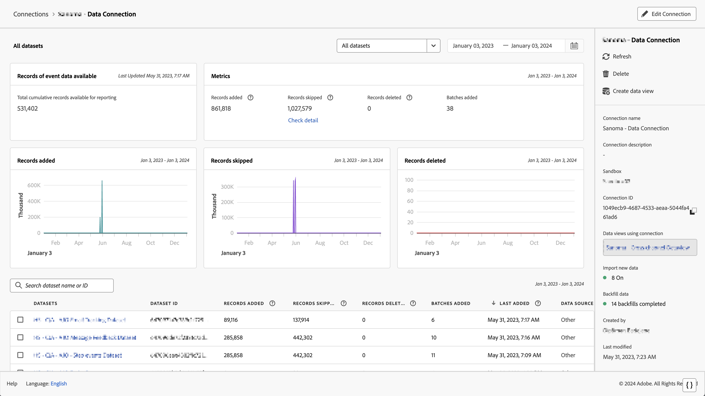

# 验证数据是否流向 Customer Journey Analytics {#validate-data}

<!-- markdownlint-disable MD034 -->

>[!CONTEXTUALHELP]
>id="cja-upgrade-data-validate"
>title="验证数据是否流动"
>abstract="使用连接详细信息验证数据是否已流入 Customer Journey Analytics。  如果所有步骤均正确无误完成，此步骤可在一天内完成。 如果存在多个数据收集问题，修正错误可能需要更长的时间。"

<!-- markdownlint-enable MD034 -->

{{upgrade-note-step}}

您可以验证连接是否处于活动状态，以及数据是否流向 Customer Journey Analytics 中的数据视图。

1. 在 Customer Journey Analytics 中，选择连接选项卡。

   

1. 选择[您配置的连接](/help/getting-started/cja-upgrade/cja-upgrade-connection.md)。

   

1. 请参阅[管理连接](/help/connections/manage-connections.md)中的[连接详细信息](/help/connections/manage-connections.md#manage-connections)，了解有关每个连接的详细信息。

{{upgrade-final-step}}

<!-- Should we duplicate the content here or single source it with /help/connections/manage-connections.md -->
