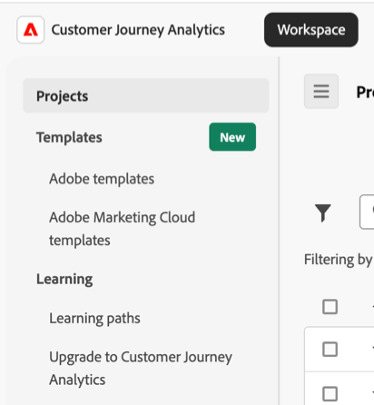
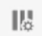
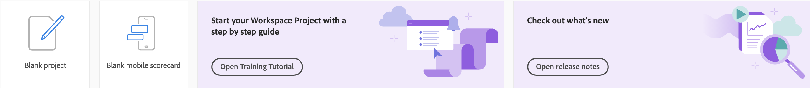

# Customer Journey Analytics 登陆页面

Customer Journey Analytics登陆页面包含以下子选项卡：

**[!UICONTROL 项目]**：自定义设计，这些设计结合了您构建的数据组件、表和可视化图表或其他人构建并与您共享的数据组件、表和可视化图表。 [!UICONTROL 项目]还指空白项目和空白移动记分卡。

**[!UICONTROL 模板]**：包含Adobe提供的模板以及特定于贵组织的任何模板。

**[!UICONTROL 学习]**：包含实践视频导览、教程和文档链接。 它还包含有关从Adobe Analytics升级到Customer Journey Analytics的信息，以及用于动态生成特定于贵组织的升级步骤的工具。

>[!BEGINSHADEBOX]

请参阅  [Analysis Workspace 中的登陆页面](https://experienceleague.adobe.com/zh-hans/docs/customer-journey-analytics-learn/tutorials/cja-basics/customer-journey-analytics-landing-page){target="_blank"}以获取演示视频。

{{videoaa}}

>[!ENDSHADEBOX]

## 项目

左边栏中的&#x200B;**[!UICONTROL 项目]**&#x200B;部分用作&#x200B;[!UICONTROL **Workspace**]&#x200B;选项卡的主页。

要在Customer Journey Analytics中访问项目，请执行以下操作：

1. 选择&#x200B;[!UICONTROL **Workspace**]&#x200B;选项卡。

1. 在左边栏中选择&#x200B;[!UICONTROL **项目**]。

项目部分显示公司文件夹、您创建的所有个人文件夹、您的Workspace项目以及移动记分卡。 使用此页面可查看、创建和修改文件夹、项目和移动记分卡。 有关更多信息，请参阅[项目](/help/analysis-workspace/build-workspace-project/freeform-overview.md)。

**[!UICONTROL 项目]**&#x200B;是自定义的设计，结合了您构建的或其他人构建并与您共享的数据组件、表格和可视化内容。 [!UICONTROL 项目]还指空白项目和空白移动记分卡。

>[!NOTE]
>
>以下几种设置会跨会话保留。 例如，您选择的选项卡、选择的区段、选择的列以及列排序方向。 搜索结果不会保留。

有关更多信息，请参阅[项目](/help/analysis-workspace/build-workspace-project/freeform-overview.md)。

## 模板

要在Customer Journey Analytics中访问模板，请执行以下操作：

1. 选择&#x200B;[!UICONTROL **Workspace**]&#x200B;选项卡。

1. 在左边栏的&#x200B;[!UICONTROL **模板**]&#x200B;部分中，您可以选择Adobe模板或公司模板。

有关使用模板的信息，请参阅以下资源：

* [使用模板](/help/analysis-workspace/templates/use-templates.md)

* [创建和管理模板](/help/analysis-workspace/templates/create-templates.md)

<!--

### Customize table columns

To customize column widths, drag the vertical bar that separates each column. 

To add or remove columns from the list of projects, click the column icon ( ) in the top-right, then select or deselect column titles. 

The available columns are:

| Column name | Description |
|---------|----------|
| [!UICONTROL **Name**] | Identifies the name of the project. |
| [!UICONTROL **Type**] | Indicates whether this type is a Workspace project, a Mobile scorecard, or a folder. |
| [!UICONTROL **Tags**] | Tags projects to organize them into groups. |
| [!UICONTROL **Scheduled**] | Set to [!UICONTROL On] when a project is scheduled or [!UICONTROL Off] when it is not. Clicking the [!UICONTROL On] link lets you see information about the scheduled project. You can also [edit the project schedule](/help/analysis-workspace/export/t-schedule-report.md) if you are the project owner. |
| [!UICONTROL **Project role**] | Identifies the project roles: whether you are the project Owner and whether you have permissions to Edit or Duplicate the project. |
| [!UICONTROL **Report suite**] | Identifies the Report Suites that are associated with the project. Tables and visualizations within a panel derive data from the report suite selected in the top right of the panel. The report suite also determines what components are available in the left rail. Within a project, you can use one or many report suites depending on your analysis use cases. The list of report suites is sorted on relevance. Adobe defines relevance based on how recently and frequently the suite has been used by the current user, and how frequently the suite is used within the organization. |
| [!UICONTROL **Owner**] | Identifies the person who created the project. |
| [!UICONTROL **Shared With**] | Shows who the project is currently shared with. |
| [!UICONTROL **Last Modified**] | The date and time when the project was last modified. |
| [!UICONTROL **Last Opened**] | Identifies the date that a project was last opened by the user who is currently viewing the Projects page. |
| [!UICONTROL **Last Used**] | Helps determine whether a project is valuable to users in your organization by showing the date and time when the project was last opened by any user within the organization.
Consider the following when viewing this column:
<ul><li>Usage information is available starting in September 2023.</li><li>This column is available only to system administrators.</li></ul> |
| [!UICONTROL **Project ID**] | Can be used for debugging projects. |
| [!UICONTROL **Longest Date Range**] | Longer date ranges increase project complexity and may increase processing and load times. |
| [!UICONTROL **Number of queries**] | The total number of requests made to Analytics when the project loads. A higher number of project queries increases project complexity and may increase processing and load times. This data is available only after a project has loaded or a scheduled project was sent. |
| [!UICONTROL **Location**] | Shows the folder where the project is located. |

### Other UI elements on the Projects page

| UI element | Definition |
| --- | --- |
| Edit preferences | Lets you [!UICONTROL View Tutorials], and [Edit user preferences](/help/analysis-workspace/user-preferences.md). |
| [!UICONTROL Create new] | Opens the project modal where you can create a Workspace project or a Mobile scorecard or open a company template.  |
| [!UICONTROL Show less  Show more] | Toggles between not showing and showing the banner:  |
| [!UICONTROL Workspace project] | Creates a blank [Workspace project](/help/analysis-workspace/home.md) for you to  design and build. |
| [!UICONTROL Mobile scorecard] | Creates a blank [mobile scorecard](https://experienceleague.adobe.com/docs/analytics/analyze/mobapp/curator.html?lang=zh-Hans) for you to design and build. |
| [!UICONTROL Open Training Tutorial] | Opens the Workspace training tutorial that guides you through the process of building a new starter project in a step-by-step tutorial.|
| [!UICONTROL Open release notes] | Opens the Adobe Analytics section of the latest CX Enterprise release notes. |
| Filter icon | Filters by tags, report suites, owners, types, and other filters (Mine, Shared with me, Favorites, and Approved)  |
| Search bar | Searches all columns in the table. |
| Selection box | Selects one or more projects to display the project management actions you can perform: **Delete**, **Share**, **Rename**, **Copy**, **Unpin**, **Move Up**, **Move Down**, **Tag**, **Approve**, **Export CSV**, and **Move to**. You may not have permissions to perform all listed actions. |
| [!UICONTROL Favorites] | Adds a star next to a favorite project or folder that can be used as a filter. |
| [!UICONTROL Name] | Identifies the name of the project. |
| Pin icon | Pins items so they always appear at the top of your list but you can re-adjust the order by moving them up or down in the order. Use the ellipsis option menu and select **Move Up** or **Move down** in the list. |
| Info (i) icon | Displays the following information about a project: Type, Project Role, Owner, Description, and who it is shared with. It also indicates who can [edit or duplicate](/help/analysis-workspace/curate-share/share-projects.md) this project. |
| Ellipsis (...) | Displays the project management actions you can perform: **Delete**, **Share**, **Rename**, **Copy**, **Unpin**, **Move Up**, **Move Down**, **Tag**, **Approve**, **Export CSV**, and **Move to**. You may not have permissions to perform all listed actions. |
| SHOW: Folders & Projects or All Projects | Changes the view setting on the table to show folders and projects according to your folder organization **or** show all of your projects in an unorganized list. |
| < (Back button) | Returns you to your most recent landing page configuration in a Workspace project or a report. The page configuration you had when you left the landing page will persist when you return. |

-->

## 学习

[!UICONTROL **Workspace**]&#x200B;选项卡上的&#x200B;**[!UICONTROL 学习]**&#x200B;部分提供了有关Customer Journey Analytics中的初级、中间或高级功能和用例的信息。 它还提供了有关如何从Adobe Analytics升级到Customer Journey Analytics的信息。

### 学习路径

要在Customer Journey Analytics中访问有关学习路径的信息，请执行以下操作：

1. 选择&#x200B;[!UICONTROL **Workspace**]&#x200B;选项卡。

1. 在左边栏的&#x200B;[!UICONTROL **学习**]&#x200B;部分中，选择&#x200B;[!UICONTROL **学习路径**]。

   本页包含实践视频导览、教程和文档链接。

[!UICONTROL **学习路径**]&#x200B;页面提供以下功能：

* **过滤内容：**&#x200B;使用按&#x200B;**[!UICONTROL 类型]**（**[!UICONTROL 文档]**、**[!UICONTROL 视频]**&#x200B;和&#x200B;**[!UICONTROL 导览和教程]**）以及&#x200B;**[!UICONTROL 经验级别]**（**[!UICONTROL 初级]**、**[!UICONTROL 中级]**&#x200B;或&#x200B;**[!UICONTROL 高级]**）过滤学习内容。
* **跟踪进度**：选择一段内容后，系统会显示  **[!UICONTROL 已查看]**&#x200B;标记。 此标记有助于跟踪您在整个学习内容中的进度。 您可以选择  **[!UICONTROL 已查看]**&#x200B;标记，以将其从一段内容中删除。
* **查看附加内容：**&#x200B;在观看任何视频时，选择&#x200B;**[!UICONTROL 了解更多]**&#x200B;以查看 Experience League 的相关文档内容。 或者，从“学习”页面中，选择下列选项之一以查看其他内容：
   * **[!UICONTROL 访问 YouTube]：**&#x200B;查看完整的 Analysis Workspace YouTube 播放列表。
   * [!UICONTROL **访问 Experience League**]：查看 Experience League 上的完整 Customer Journey Analytics 文档集。
* **面向新用户的基础知识：**&#x200B;建议新用户使用[!UICONTROL 学习 Workspace 基础知识]导览。 此导览会将您直接转到 Workspace 并向您介绍最常用操作。 也可以随时通过[自由格式面板](/help/analysis-workspace/c-panels/freeform-panel.md)或[空白面板](/help/analysis-workspace/c-panels/blank-panel.md)标题中的工具提示在 Workspace 中重新启动此导览。

### 升级到 Customer Journey Analytics

要访问有关升级到Customer Journey Analytics的信息，请执行以下操作：

1. 选择&#x200B;[!UICONTROL **Workspace**]&#x200B;选项卡。

1. 在左边栏的&#x200B;[!UICONTROL **学习**]&#x200B;部分中，选择&#x200B;[!UICONTROL **升级到Customer Journey Analytics**]。

本页面向尚未完全从Adobe Analytics升级到Customer Journey Analytics的客户。 它提供调查表，根据贵组织的独特环境动态生成升级步骤。

有关详细信息，请参阅[从Adobe Analytics升级到Customer Journey Analytics](/help/getting-started/cja-upgrade/cja-upgrade-recommendations.md)中的[为您的组织动态生成升级步骤](/help/getting-started/cja-upgrade/cja-upgrade-recommendations.md#dynamically-generate-upgrade-steps-for-your-organization)。

## 首选登陆页面

您可以设置您喜欢的登陆页面。 有关更多信息，请参阅[用户偏好设置](/help/analysis-workspace/user-preferences.md#general-preferences)。

<!--
## Landing page FAQ {#landing-faq}

| Question | Answer |
| --- | --- |
| Does the work I do in the beta program UI carry over to the production [!UICONTROL Workspace] experience? | Yes, any work done in the beta carries over to the old/current [!UICONTROL Workspace] experience. |
| Is there a maximum number of projects I can pin? | No, there is no limit on the number of projects you can pin. |
| Can admins designate this landing page for their users? | No, admins cannot designate the landing page on behalf of users. Individual users must turn on the toggle themselves. |
| Are all reports that currently exist in [!DNL Reports & Analytics] still available? | No, the following reports were phased out, based on overall usage data: <ul><li>Any custom eVars/props/events/classifications<li>My Recommended Reports</li><li>Hourly/Daily/Weekly/Monthly/Quarterly/Yearly unique visitors</li><li>DailyWeekly/Monthly/Quarterly/Yearly unique customers</li><li>Action name depth</li><li>Action name summary</li><li>Add dashboard</li><li>Age</li><li>Audio support</li><li>Billing information</li><li>Clicks to page</li><li>Color depth</li><li>Cookie support</li><li>Cookies</li><li>Connection types</li><li>Creative elements</li><li>Credit card type</li><li>Cross sell</li><li>Custom event funnels</li><li>Custom links</li><li>Customer ID</li><li>Day of week</li><li>Entry action name</li><li>Exit action name</li><li>Exit links</li><li>Fallout</li><li>File downloads</li><li>Find in store</li><li>Full paths</li><li>Gender</li><li>Hit ype VISTA rule</li><li>Image support</li><li>Java</li><li>JavaScript</li><li>JavaScript version</li><li>Manage bookmarks</li><li>Manage dashboards</li><li>Monitor color depth</li><li>Monitor resolutions</li><li>Newsletter signups</li><li>Next action name</li><li>Next action name flow</li><li>Null searches</li><li>Operating system</li><li>Order review</li><li>Page of day</li><li>Pages not found</li><li>Pathfinder</li><li>Path length</li><li>Previous action name</li><li>Previous action name flow</li><li>Product activity</li><li>Product cost</li><li>Product department</li><li>Product inventory category</li><li>Product name</li><li>Product reviews</li><li>Product season</li><li>Product shares</li><li>Product zooms</li><li>Reload</li><li>Searches</li><li>Servers</li><li>Single page visits</li><li>Shipping information</li><li>Site hierarchy</li><li>Social mentions</li><li>Time of day</li><li>Time spent on action name</li><li>Video support</li><li>Visitor state</li></ul> |
-->
