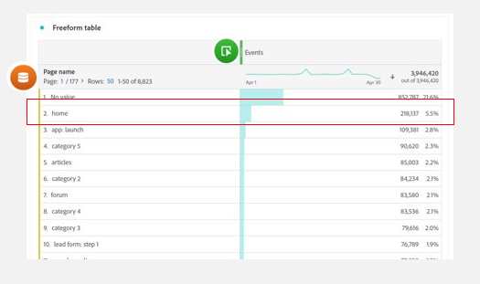

# 引导式分析常见问题

引导式分析的常见问题。

+++**我的组织是否可以访问引导式分析？**

所有 Customer Journey Analytics 包均包含引导分析视图。 请参阅概述页面上的 [配置](overview.md#provisioning) 部分，了解有关 CJA 包解锁的视图的更多信息。

+++

+++**使用引导式分析需要更改哪些实施？**

如果您现在已经在使用 Customer Journey Analytics，则无需进行其他实施更改。 引导式分析使用与其他 CJA 界面（例如 [Analysis Workspace](../analysis-workspace/home.md)）相同的[数据视图](../data-views/data-views.md)和[连接](../connections/overview.md)。

为了使您的最终用户能够最大限度地利用引导式分析，建议您在 Adobe Experience Platform 和[数据视图](../data-views/data-views.md)中制定强大的事件架构和管理策略。

+++

+++**什么时候应该使用引导式分析或 Analysis Workspace？**

**引导式分析**&#x200B;可以帮助用户快速获得高质量的洞察。 它对于产品团队、希望更自信地处理数据的用户，甚至对于分析师来说都是非常有用的，可以作为更深入分析的开端。

**[Analysis Workspace](../analysis-workspace/home.md)** 是一个格式更加自由的空间，可让您进一步挖掘数据，以发现更多洞察。 对于十分了解数据并想要深入研究数据的分析师和高级用户来说，这非常有用。

+++

+++**引导式分析和 Analysis Workspace 之间的术语有何差异？**

引导式分析和 [Analysis Workspace](../analysis-workspace/home.md) 在大多数关键术语上保持一致，但存在一些细微差别。

| 引导式分析术语 | Analysis Workspace 术语 |
| --- | --- |
| 事件（二进制 1/0 量度） | 量度 |
| 用户 | 人员 |
| 维度 | 维度 |
| 维度项 | 维度项 |
| 区段 | 区段 |
| 筛选 | 报告过滤器 |
| 计算量度，Metrics | 计算量度 |

{style="table-layout:auto"}

+++

+++**引导式分析和 Analysis Workspace 处理报告的方式有哪些差异？**

虽然 [Analysis Workspace](../analysis-workspace/home.md) 和引导式分析使用相同的基础数据，但每个工具支持您生成数据查询的方式是不同的。

* **Analysis Workspace是以维度为中心的体验。** 表通常由维行组成，而列通常为量度。 可以在行和列中应用区段以获得所需的数据。

* **引导式分析是一种以事件和用户为中心的体验。** 每个分析都从选择事件开始，然后可以添加维度和区段来优化该事件数据。

{style="border:1px solid gray"}

请考虑以下示例，其中重点关注与网站主页相关的数据。 团队会提出类似的问题，但分析方法可能不同。

* 典型的以维度为中心的 Analysis Workspace 方法是：“让我们看看主页，看看它收到了多少页面浏览次数。”

  {style="border:1px solid gray"}

* 典型的事件和以用户为中心的引导式分析方法会提出的问题是“有多少用户访问过主页？”

  {style="border:1px solid gray"}

+++
