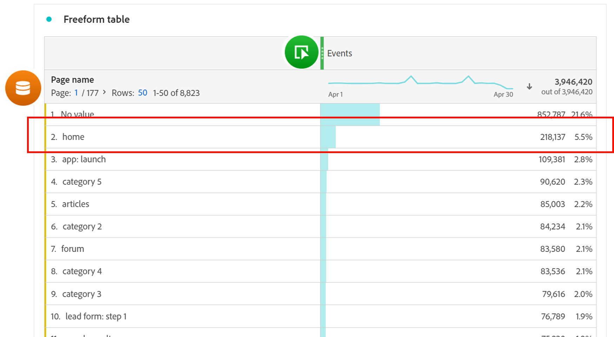

# 引导式分析常见问题

引导式分析的常见问题解答。

+++**我的组织是否有权访问引导式分析？**

指导性分析视图包含在所有Customer Journey Analytics包中。 请参阅概述页面上的[配置](overview.md#provisioning)部分，了解有关CJA包解锁的视图的更多信息。

+++

+++**使用引导式分析需要更改哪些实施？**

如果您现在已经在使用 Customer Journey Analytics，则无需进行其他实施更改。引导式分析使用与其他 CJA 界面（例如 [Analysis Workspace](../analysis-workspace/home.md)）相同的[数据视图](../data-views/data-views.md)和[连接](../connections/overview.md)。

为了让最终用户在引导式分析方面获得最大成功，建议您在Adobe Experience Platform和[数据视图](../data-views/data-views.md)中制定强有力的事件架构和管理策略。

+++

+++**什么时候应该使用引导式分析或 Analysis Workspace？**

**引导式分析**&#x200B;可以帮助用户快速获得高质量的见解。它对于产品团队、希望更自信地处理数据的用户，甚至对于分析师来说都是非常有用的，可以作为更深入分析的开端。

**[Analysis Workspace](../analysis-workspace/home.md)** 是一个格式更加自由的空间，可让您进一步挖掘数据，以发现更多见解。对于十分了解数据并想要深入研究数据的分析师和高级用户来说，这非常有用。

+++

+++**引导式分析与Analysis Workspace的术语有何异同？**

引导式分析会使用在产品团队中更常用的术语。在引导式分析和 [Analysis Workspace](../analysis-workspace/home.md) 之间切换时，您可以参考此表。

| 引导式分析术语 | Analysis Workspace 术语 |
| --- | --- |
| 事件 | 量度 |
| 用户 | 人员 |
| 属性 | 维度 |
| 值 | 维度项 |
| 区段 | 过滤器 |

{style="table-layout:auto"}

+++

+++**引导式分析与Analysis Workspace方法报告有哪些区别？**

虽然 [Analysis Workspace](../analysis-workspace/home.md) 和引导式分析使用相同的基础数据，但每个工具支持您生成数据查询的方式是不同的。

* **Analysis Workspace 是一种以维度为中心的体验。** 表格通常由维度行组成，而列则通常是量度。可以在行和列中应用过滤器以获得所需的数据。

* **引导式分析是一种以事件和用户为中心的体验。** 每次分析都从选择事件开始，然后可以添加维度和过滤器来细化事件数据。

{style="border:1px solid gray"}

请考虑以下示例，其中重点关注与网站主页相关的数据。团队会提出类似的问题，但分析方法可能不同。

* 典型的以维度为中心的 Analysis Workspace 方法是：“让我们看看主页，看看它收到了多少页面浏览量。”

  {style="border:1px solid gray"}

* 一种以事件和用户为中心的引导式分析方法是这样的：“有多少用户访问过主页？”

  {style="border:1px solid gray"}

+++
