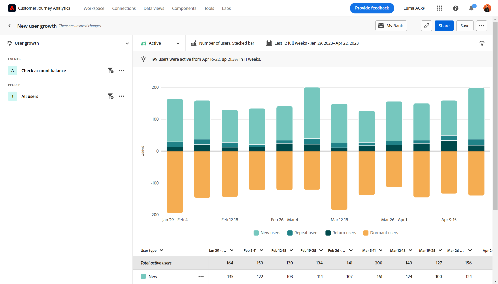
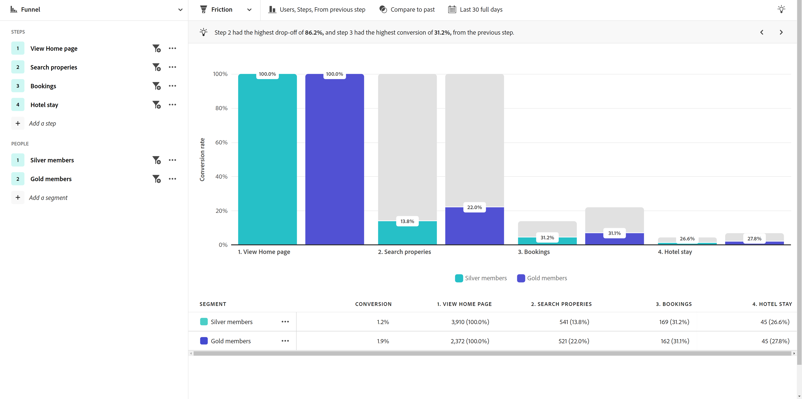
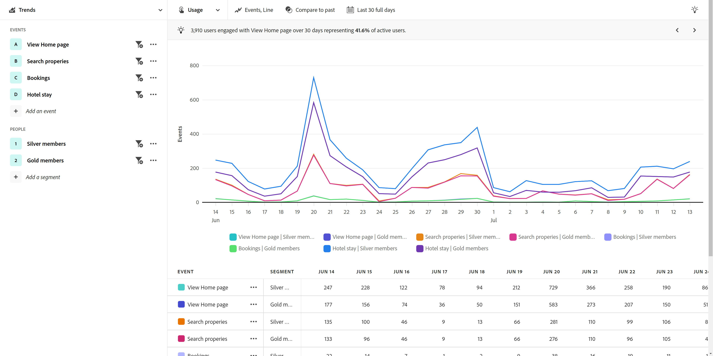
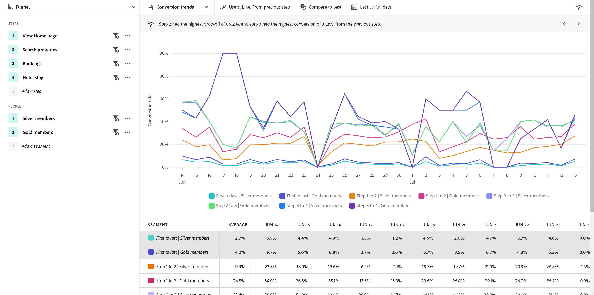
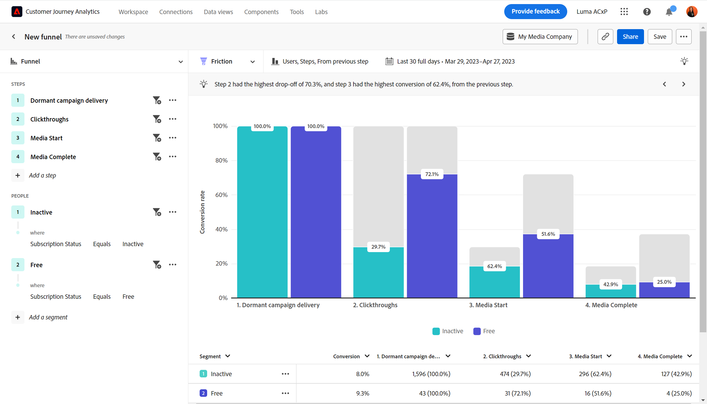
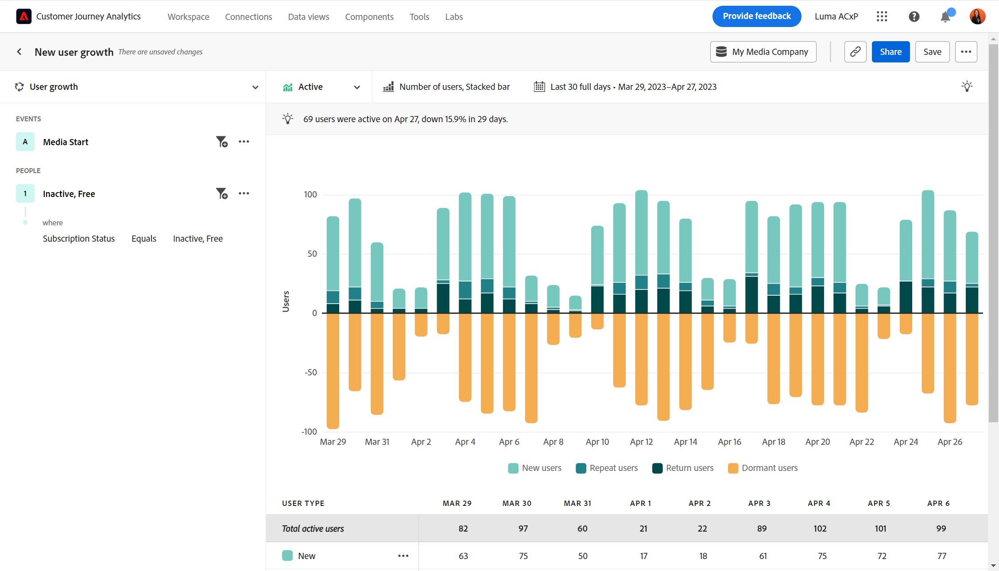
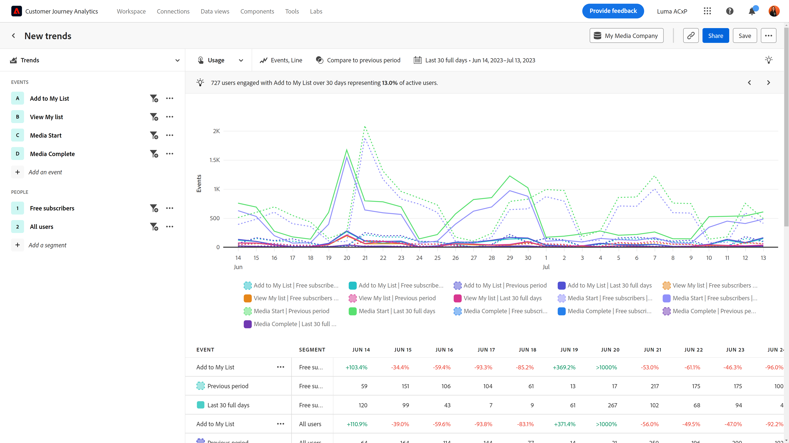

# 行业用例

本页提供了一些行业示例，说明客户体验团队（从分析师到产品团队再到营销人员）可以通过引导分析完成的工作。

+++**零售**

| 用例 | 示例 | 影响 | 分析 |
| --- | --- | --- | --- |
| **优化移动购物应用程序** | 许多客户下载了某个组织的移动应用程序，但再也没有使用过。 该公司发现，客户使用它只是为了最初的产品建议。 他们重新吸引那些不活跃的客户。 | **增加移动用户的LTV。** 衡量并提高应用程序使用率，从而开发更加“快乐的路径”的用户体验。 | [主动增长分析](types/active-growth.md) [净增长分析](types/net-growth.md) |
| **量化新结帐功能的影响** | 一家杂货店正在尝试进军网上购物领域。 他们快速衡量新结账功能（例如产品推荐或路边取货）的影响。 | **提高转化率。** 衡量业务影响，而不仅仅是功能使用情况。 | [发布影响分析](types/release-impact.md) [首次使用影响分析](types/first-use-impact.md) |
| **减少会员流失** | 组织发现客户历程中导致客户流失的阻力点。 这使他们能够审阅会员资格计划，并分析存在风险的会员的行为。 | **减少流失。** 确定培养和培养客户关系的方法，以防止流失和减少流失。 | [主动增长分析](types/active-growth.md) [漏斗分析](types/funnel.md) |
| **发现低效的销售历程** | 一家组织发现店内销售人员在离开客户的过程中效率低下。 他们调整流程，为顾客提供更愉快的店内购物体验。 | **改进销售响应。** 减少效率低下的流程，这些流程会改善内部历程并提供良好的客户体验。 | [漏斗分析](types/funnel.md) |

{style="table-layout:auto"}

{style="border:1px solid gray"}

{style="border:1px solid gray"}

+++

+++**金融服务**

| 用例 | 示例 | 影响 | 分析 |
| --- | --- | --- | --- |
| **量化新功能的影响** | 一家金融机构通过 Zelle 推出银行转账功能，并希望了解新功能对完成转账的影响。 引导式分析使他们能够了解客户的反应，以便营销团队能够相应地推出该功能。 | **提高转化率。** 衡量新功能对传输转换的影响。 | [发布影响分析](types/release-impact.md) [首次使用影响分析](types/first-use-impact.md) |
| **转移呼叫中心电话** | 引导式分析表明，一家组织的五步移动索赔流程会导致呼叫电话转入其呼叫中心。 他们创建受众并向这些客户发送电子邮件，以更好地了解他们的体验。 | **隔离体验中的摩擦。** 改进“快乐路径”历程并减少致电。 | [漏斗分析](types/funnel.md) [转化趋势分析](types/conversion-trends.md) |
| **减少客户流失** | 一家组织了解到，每月登录银行移动应用程序一次的客户成为忠实客户的时间更长。 引导式分析使他们能够识别谁有流失的风险，并制定赢回策略。 | **减少流失。** 保持客户水平，同时支出购买实际的新客户。 | [主动增长分析](types/active-growth.md) [净增长分析](types/net-growth.md) |
| **推荐新功能** | 某个组织注意到近几个月来线上取款有所减少。 致电财务顾问的次数有所增加。 引导式分析可以帮助组织与指导委员会一起确定对数字流程进行优化的优先顺序。 | **创建数据驱动路线图。** 使用数据来规划和实施优化。 | [趋势分析](types/trends.md) |

{style="table-layout:auto"}

{style="border:1px solid gray"}

{style="border:1px solid gray"}

{style="border:1px solid gray"}

+++

+++**旅游和酒店业**

| 用例 | 示例 | 影响 | 分析 |
| --- | --- | --- | --- |
| **量化新预订流程功能的影响** | 组织使用引导式分析快速查看新的预订步骤功能对转化率的影响。 他们确定体验中增益最大的部分。 | **提高预订率。** 衡量业务影响，而不仅仅是功能使用情况。 | [发布影响分析](types/release-impact.md) [漏斗分析](types/funnel.md) |
| **优化移动应用程序体验** | 组织可以快速轻松地了解一段时间内每月积极使用应用程序的用户，并确定相关版本的积极影响。 | **增加MAU。** 衡量和提高应用程序使用率，这与客户幸福感相关。 | [主动增长分析](types/active-growth.md) [净增长分析](types/net-growth.md) |
| **寻找移动登记流程中的摩擦** | 了解人们在预期的移动登记流程中获得成功或退出的地方，可以让组织轻松确定可以优化体验的领域。 | **增加CSAT并减少IROP。** 消除摩擦可带来更顺畅的“旅行日”体验。 | [漏斗分析](types/funnel.md) [转化趋势分析](types/conversion-trends.md) |
| **转移呼叫中心电话** | 在漏斗分析中查看用户体验会向用户显示访问者遇到阻碍的情况，从而导致呼叫中心业务量增加。 接下来要重点关注的步骤十分明确。 | **减少呼叫中心使用量。** 获得更多“快乐路径”用户体验并减少成本高昂的呼叫次数。 | [漏斗分析](types/funnel.md) [转化趋势分析](types/conversion-trends.md) |

{style="table-layout:auto"}

{style="border:1px solid gray"}

{style="border:1px solid gray"}

{style="border:1px solid gray"}

+++

+++**媒体和娱乐**

| 用例 | 示例 | 影响 | 分析 |
| --- | --- | --- | --- |
| **量化新节目或剧集的影响** | 流媒体服务可以分析用户观看新节目或剧集后对观看人数的影响，并更好地了解哪些内容能引起共鸣。 | **增加收视率。** 查找对收视率影响最大的内容。 | [首次使用影响分析](types/first-use-impact.md) |
| **识别流失风险** | 组织会看到，注册其平台观看季节性活动并在活动结束后立即取消的客户流失率很高。 快速识别这些用户可以让他们展示吸引客户与平台保持互动的推荐内容。 | **保留快乐的订阅者。** 查找让增长区段参与互动的内容，以便提出建议来进行干预。 | [主动增长分析](types/active-growth.md) [净增长分析](types/net-growth.md) |
| **寻找追加销售的机会** | 组织收入增长的一个重要部分是了解哪些应用内产品建议对在体育场的球迷最有吸引力。 引导式分析使他们能够准确地了解哪些产品建议最有效。 | **增加辅助收入。** 了解应用程序内优惠对推动购买行为的影响。 | [首次使用](types/first-use-impact.md) [影响分析](types/funnel.md)漏斗分析 |
| **优化跨设备体验** | 某个组织想要分析订阅者如何与多个设备/应用程序进行交互。 这些知识有助于他们了解内容消费模式，并确定最适合对这些受众进行重新定向的位置。 | **个性化体验。** 了解哪些内容最能引发每台设备上的订阅者的共鸣。 | [趋势分析](types/trends.md) |
| **转移呼叫中心电话** | 一家组织使用引导式分析来识别自动付款失败的问题，这导致沮丧的客户打电话给他们的支持中心取消其套餐。 | **减少支持呼叫。** 创造更好的客户体验并减少客户服务的呼叫。 | [漏斗分析](types/funnel.md) [转化趋势分析](types/conversion-trends.md) |

{style="table-layout:auto"}

{style="border:1px solid gray"}

{style="border:1px solid gray"}

{style="border:1px solid gray"}

+++

+++**医疗保健**

| 用例 | 示例 | 影响 | 分析 |
| --- | --- | --- | --- |
| **改善患者健康结果** | 某家组织拥有将其工作重点放在促进增长上的数据。 在使用引导式分析之前，他们并不清楚每周有多少健康计划会员会完全停止使用它。 | **减少看医生次数。** 快速识别休眠用户以重新参与。 | [主要增长分析](types/active-growth.md) |
| **增强患者体验** | 通过了解有多少患者为了简单的密码重置而联系呼叫中心，这让分析师重新燃起了专注于加强患者体验的热情。 | **降低总体服务成本。** 创造更好的患者体验，并减少呼叫患者服务的次数。 | [趋势分析](types/trends.md) [漏斗分析](types/funnel.md) |
| **按区段识别重复的跨渠道操作** | 组织希望了解符合 Medicare 资格的会员在使用计划方面的活跃程度，以便在其数字产品中向他们提供特定的消息。 从引导式分析中获得的洞察有助于提高营销效率。 | **个性化医疗保险注册选项。** 按我最活跃的计划成员比较常见的连续操作。 | [漏斗分析](types/funnel.md) [主动增长分析](types/active-growth.md) |
| **留住行业顶尖人才** | 某家组织的分析资源时间紧张。 引导式分析使组织能够快速获取领导层更新通话所需的产品使用数据。 | **减少分析人员工作负载。** 更快地获得答案。 在最关键的时候提供简明易懂的报告。 | [引导式分析](overview.md) |

{style="table-layout:auto"}

{style="border:1px solid gray"}

+++

+++**高科技和 B2B**

| 用例 | 示例 | 影响 | 分析 |
| --- | --- | --- | --- |
| **量化新功能的影响** | 组织可以分析新产品功能的使用量上升情况，并确定哪些区段效果最好。 这一分析有助于他们优先考虑将资源用于何处，以最大限度地提高用户参与度，并加强与营销部门的合作关系。 | **数据驱动优先顺序。** 在分配资源时做出明智的决策。 | [发布影响分析](types/release-impact.md) [首次使用影响分析](types/first-use-impact.md) |
| **确定未充分利用产品的角色** | 某家组织在设计供工程师、产品经理和营销人员使用的产品。 引导式分析表明，虽然产品经理和营销人员几乎每天都在使用它，但工程人员基本上没有采用它。 | **增加产品采用率。** 通过多种方式快速识别用户行为。 | [主动增长分析](types/active-growth.md) [净增长分析](types/net-growth.md) |
| **消除转换过程中的摩擦点** | 在购买流程中要求提供采购订单号会阻止喜欢使用信用卡的用户完成订单。 当该字段变为可选字段时，转化次数会增加。 | **改善客户体验。** 减少潜在的客户流失。 | [漏斗分析](types/funnel.md) [转化趋势分析](types/conversion-trends.md) |
| **解锁自助分析** | 获取洞察是一项挑战，组织内的一些用户没有接受过分析培训。 引导式分析使他们能够获得答案，并利用组织其他部门使用的相同数据，从而建立更牢固的合作伙伴关系，并实现真正的以数据驱动的决策。 | **跨组织的更密切的合作伙伴关系。** 让产品经理可以访问以前孤立的数据。 | [引导式分析](overview.md) |

{style="table-layout:auto"}

{style="border:1px solid gray"}

+++
