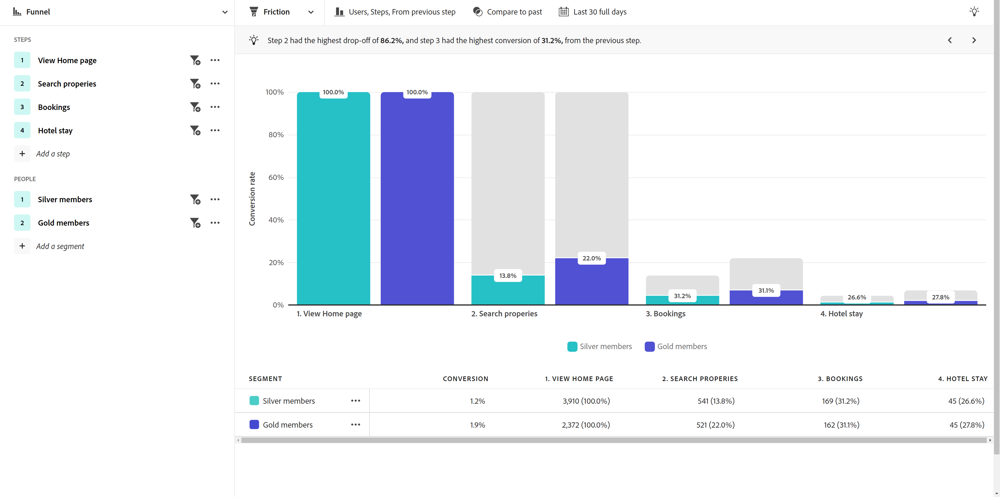

# 行业用例

引导式分析的用例因行业而异。 本页提供了一些说明性示例，说明产品团队可以通过引导式分析和Adobe Product Analytics功能完成哪些工作。

+++**零售业**

| 用例 | 示例 | 影响 | 分析 |
| --- | --- | --- | --- |
| **优化移动购物应用程序** | 许多客户下载了我们的移动应用程序，但再也没有回来。 我们发现他们只是将其用于初始优惠，并重新吸引这些休眠客户。 | **增加移动用户的LTV。** 衡量并提高应用程序使用率，从而开发更加“快乐的路径”的用户体验。 | [活跃用户增长视图](types/active.md) 

 [净增长视图](types/net-growth.md) |
| **量化新结账功能的影响** | 作为一家测试我们进军在线购物方式的杂货店，我们可以快速衡量新结账功能的影响，例如“您忘记了黄油吗？” 产品推荐或新的结账方法，如路边取车。 | **提高转化率。** 衡量业务影响，而不仅仅是功能使用情况。 | [发布影响视图](types/release.md) 

 [首次使用视图](types/first-use.md) |
| **减少成员流失率** | 我们在客户历程中发现了会导致客户流失的摩擦点。 这使我们有机会审查会员计划，并分析有风险会员的行为和信号。 | **减少流失。** 确定培养和培养客户关系的方法，以防止流失和减少流失。 | [活跃用户增长视图](types/active.md) 

 [摩擦视图](types/friction.md) |
| **查找效率低下的销售历程** | 我们发现店内销售伙伴在离开客户的过程中效率低下。 我们调整了他们的流程，让客户在店内购物时更加愉快。 | **改进销售响应。** 改善内部历程，减少低效流程，从而带来积极的客户体验。 | [摩擦视图](types/friction.md) |

{style="table-layout:auto"}

+++

+++**金融服务**

| 用例 | 示例 | 影响 | 分析 |
| --- | --- | --- | --- |
| **量化新功能的影响** | 我们最近与Zelle一起推出了银行转账，我们需要了解新功能对完成转账的影响。 现在，我们可以看到客户的反应，营销团队可以推出它了。 | **提高转化率。** 衡量新功能对传输转换的影响。 | [发布影响视图](types/release.md) 

 [首次使用视图](types/first-use.md) |
| **转移呼叫中心呼叫** | 我们的移动报销申请流程分五步，将电话打进呼叫中心。 我们迅速分析了这一点，创建了一个受众，并向这些客户发送了一封电子邮件以了解他们的体验。” | **隔离体验中的摩擦。** 改进“快乐路径”历程并减少致电。 | [摩擦视图](types/friction.md) 

 [转化趋势视图](types/conversion-trends.md) |
| **减少客户流失** | 我们知道，以每月频率登录银行移动应用程序的客户停留的时间更长。 当我们看到应用程序用户增长时，可以确定哪些用户面临流失风险，并制定回馈策略。 | **减少流失。** 保持客户水平，同时支出购买实际的新客户。 | [活跃用户增长视图](types/active.md) 

 [净增长视图](types/net-growth.md) |
| **推荐新功能** | 随着时间的推移，数字提款已减少，代替了致电财务顾问。 我们希望优化数字流程，数据趋势有助于我们通过指导委员会来确定优化的优先级。 | **创建数据驱动路线图。** 利用数据来规划和实施优化。 | [使用趋势视图](types/usage.md) |

{style="table-layout:auto"}

+++

+++**旅游和酒店业**

| 用例 | 示例 | 影响 | 分析 |
| --- | --- | --- | --- |
| **量化新预订流程功能的影响** | 我们快速分析了新的预订步骤功能对转化率的影响，找出了收益最大的部分。 | **提高预订率。** 衡量业务影响，而不仅仅是功能使用情况。 | [发布影响视图](types/release.md) 

 [摩擦视图](types/friction.md) |
| **优化移动应用程序体验** | 我们能够快速轻松地了解随时间变化的每月活动应用程序用户(MAU)，并通过版本识别积极影响。 | **增加MAU。** 衡量和提高应用程序使用率，这与客户幸福感相关。 | [活跃用户增长视图](types/active.md) 

 [净增长视图](types/net-growth.md) |
| **在移动设备签到流程中查找摩擦** | 通过查看人员在哪里取得成功或退出预期的移动设备登记流程，我们可以轻松识别需要优化体验的区域。 | **提高CSAT，减少IROP。** 消除摩擦可带来更顺畅的“旅行日”体验。 | [摩擦视图](types/friction.md) 

 [转化趋势视图](types/conversion-trends.md) |
| **转移呼叫中心呼叫** | 以漏斗视图查看我的用户体验时，我发现我们的用户遇到了一些问题，这会导致呼叫中心话务量过高。 我们知道下一步需要集中精力。 | **减少呼叫中心使用量。** 获得更多“快乐路径”用户体验并减少成本高昂的呼叫次数。 | [摩擦视图](types/friction.md) 

 [转化趋势视图](types/conversion-trends.md) |

{style="table-layout:auto"}

+++

+++**媒体和娱乐**

| 用例 | 示例 | 影响 | 分析 |
| --- | --- | --- | --- |
| **量化新节目或系列节目的影响** | 我们可以通过分析用户观看新节目或新系列节目后对收视率的影响，更好地了解哪些内容引起了共鸣。 | **增加收视率。** 查找对收视率影响最大的内容。 | [首次使用视图](types/first-use.md) |
| **识别客户流失风险** | 我们看到，注册使用我们平台观看季节性活动的客户流失率很高，当活动结束时，这些客户立即取消活动。 通过快速识别这些用户，我们可显示吸引他们继续参与平台的建议。 | **保留快乐的订阅者。** 查找让增长区段参与互动的内容，以便提出建议来进行干预。 | [活跃用户增长视图](types/active.md) 

 [净增长视图](types/net-growth.md) |
| **寻找追加销售机会** | 我们的收入增长得益于能够了解哪些应用程序内选件在球场内对我们的球迷最吸引。 | **增加附属收益。** 了解应用程序内优惠对推动购买行为的影响。 | [首次使用视图](types/first-use.md) 

 [摩擦视图](types/friction.md) |
| **优化跨设备体验** | 我希望能够分析我的订阅者如何与多个设备/应用程序进行交互，以便我能够了解内容使用模式并确定最适合他们的目标位置。 | **个性化体验。** 了解哪些内容最能引发每台设备上的订阅者的共鸣。 | [使用趋势视图](types/usage.md) |
| **转移呼叫中心呼叫** | 我发现了我们的自动付款功能无法正常运行的问题，该问题导致失望的客户致电我们的支持中心取消其计划。 | **减少支持呼叫。** 创造更好的客户体验并减少客户服务的呼叫。 | [摩擦视图](types/friction.md) 

 [转化趋势视图](types/conversion-trends.md) |

{style="table-layout:auto"}

+++

+++**医疗保健**

| 用例 | 示例 | 影响 | 分析 |
| --- | --- | --- | --- |
| **改善患者健康状况** | 我不清楚每周有多少健康计划成员干脆停止使用它。 我们现在有了数据，可以将工作重点放在增长上。 | **减少看医生。** 快速识别休眠用户以重新参与。 | [活跃用户增长视图](types/active.md) |
| **增强患者体验** | 直接了解有多少患者致电我们的呼叫中心进行简单的密码重置，这使我重新燃起了热忱，致力于降低我们公司的总体成本，提供服务和强化我们的患者体验。 | **降低总体服务成本。** 创造更好的患者体验，并减少呼叫患者服务的次数。 | [使用趋势视图](types/usage.md) 

 [摩擦视图](types/friction.md) |
| **按区段识别重复的跨渠道操作** | 我需要了解Medicare合格会员对其计划使用情况有多积极，以便在我们的数字产品中向他们提供特定信息。 产品信号有助于提高营销效率。 | **个性化设置医疗保险注册选项。** 按我最活跃的计划成员比较常见的连续操作。 | [摩擦视图](types/friction.md) 

 [活跃用户增长视图](types/active.md) |
| **留住业界顶尖人才** | 我们的分析资源非常紧张。 我需要快速获取领导力更新调用所需的产品使用数据。 | **减少分析人员的工作量。** 更快地获得答案。 可亲切地报告我最需要的时间。 | [引导式分析](overview.md) |

{style="table-layout:auto"}

+++

+++**高科技和B2B**

| 用例 | 示例 | 影响 | 分析 |
| --- | --- | --- | --- |
| **量化新功能的影响** | 我们可以分析新产品功能使用率的上升，并确定哪些区段效果最佳。 这有助于我们优先考虑在哪些方面投入资源，以最大限度地提高用户参与度并加强与营销的合作伙伴关系。 | **数据驱动优先顺序。** 在分配资源时做出明智的决策。 | [发布影响视图](types/release.md) 

 [首次使用视图](types/first-use.md) |
| **确定未充分利用产品的角色** | 我们的产品旨在供工程师、产品经理和营销人员使用。 分析显示，虽然项目经理和营销人员几乎每天都在使用它，但工程人员基本上没有采用它。 | **增加产品采用率。** 通过多种方式快速识别用户行为。 | [活跃用户增长视图](types/active.md) 

 [净增长视图](types/net-growth.md) |
| **删除转换过程中的摩擦点** | 用户数据表明，在我们的购买流程中要求提供采购订单编号，这会阻止更喜欢使用信用卡购买的用户完成订单。 通过使该字段可选，转化率得以提高。 | **改善客户体验。** 减少潜在的客户流失。 | [摩擦视图](types/friction.md) 

 [转化趋势视图](types/conversion-trends.md) |
| **解锁自助分析** | 尝试获取见解具有挑战性，并且我们的用户未接受过分析培训。 他们需要能够获得答案并控制整个组织正在使用的相同数据，从而建立更牢固的合作伙伴关系，做出真正的数据驱动型决策。 | **在整个组织内建立更密切的伙伴关系。** 让产品经理可以访问以前孤立的数据。 | [引导式分析](overview.md) |

{style="table-layout:auto"}

+++
