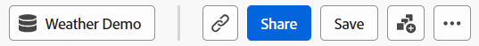

# 指导分析概述

{{release-limited-testing}}

引导式分析是一种报告格式，它允许产品团队快速自助满足其数据需求，以便他们可以做出更多由数据驱动的产品决策。 跨职能团队可以实时连接以使用和了解这些报告。

与Analysis Workspace和移动记分卡类似，引导式分析报表使用来自 [数据视图](../data-views/data-views.md)，通过Adobe Experience Platform中的引用数据 [连接](../connections/overview.md). 在引导式分析中创建的所有报告都可以无缝地传输到Analysis Workspace以供进一步研究。

引导式分析提供多种分析数据的方法。 这些视图类型可以以不同的方式显示相同的数据，从而导致使用相同的事件和区段获得不同的见解。 根据您选择的视图类型，您会获得不同的查询边栏和可视化图表选项。 您可以在视图类型之间自由切换，如果视图类型支持任何适用的查询边栏组件，则可以结转。

引导式分析将视图类型分类为 **分析类型**. 可以使用以下分析和视图类型：

| 分析类型 | 视图类型 | 描述 |
| --- | --- | --- |
| 影响 | [版本](types/release.md) | 比较发布前和发布后相同时期的性能. |
| 影响 | [首次使用](types/first-use.md) | 衡量首次功能使用对关键指标的影响. |
| 漏斗 | [摩擦](types/friction.md) | 比较步骤之间的转化率. |
| 漏斗 | [转化趋势](types/conversion-trends.md) | 跟踪转化率随时间发生的变化. |
| 用户增长 | [活动](types/active.md) | 衡量用户群的增长. |
| 用户增长 | [净增长](types/net-growth.md) | 使用户的收益和损失达到平衡. |
| 趋势 | [使用情况](types/usage.md) | 随着时间的推移衡量用户参与度. |

{style="table-layout:auto"}

## 界面

无论分析类型如何，引导式分析的界面都包含以下主要UI元素：

1. **查询边栏**：使用左侧的此边栏构建分析。
1. **图表**：选择所需的事件、人员或步骤后，右侧会显示一个图表，用于可视化数据。
1. **表**：图表下方的表格，其中显示可视化图表中使用的数字。
1. **设置和分析**：图表上方的几个UI元素，它们允许您自定义返回的数据。

[UI屏幕快照]

引导式分析包含以下界面部分：

| 界面预览 | UI 元素 | 描述 |
| --- | --- | --- |
|  | 查询边栏 | 配置构成报表的所需组件。 不同的分析类型共享多个查询选项；如果两个分析类型共享查询选项，则它们在切换分析类型时延续。 |
|  | 图表 | 根据从查询边栏和设置输入的内容，显示返回的数据。 您看到的可视化图表取决于图表上方的视图类型。 可用的视图类型取决于查询边栏上方的Analysis类型。 |
|  | 表格 | 基于从查询边栏和设置输入的返回数据的表表示形式。 表中的列取决于图表上方的视图类型。 可用的视图类型取决于查询边栏上方的Analysis类型。 |
|  | 可视化设置 | 图表上方的多个选项允许您自定义图表和表返回数据的方式。<ul><li>**视图类型**：一个下拉选择器，允许您以不同的方式显示给定分析类型的数据。 每个分析类型至少具有两种视图类型。</li><li>**图表设置**：微调图表的外观以及您希望图表使用的事件。 可用选项取决于所选的视图类型。</li><li>**日期范围**：日历选择器，用于确定报表的日期范围。 某些分析类型还允许设置间隔，例如每日、每周或每月。</li><li>**分析**：根据您查看的报表提供上下文分析。 您可以使用右上角的灯泡图标来显示或隐藏这些见解。</li></ul> |
|  | “分析”菜单 | 引导式分析右上角的命令提供了总体操作。<ul><li>**数据视图选择器**：更改此分析使用的数据视图。 当您更改数据视图时，查询边栏中的可用组件也会更改。</li><li>**保存**：保存分析。 如果要保存新分析，则会显示一个请求名称和说明的模式窗口。</li><li>**另存为**：将分析与当前分析分开保存，并创建一个副本。 此时将显示一个模式窗口，请求提供新的名称和说明。</li><li>**在工作区中打开**：在Analysis Workspace中重新创建当前的引导式分析。 Workspace项目是在新选项卡中创建的，可防止在引导式分析中工作时发生中断。 当引导式分析不能为您提供所需的灵活性或特定洞察时，请使用此命令。 例如，您希望 [使用情况](types/usage.md) 一个区段使用会话，另一个区段使用人员的报表。</li><li>**下载PNG**：将图表图形下载为 `.png`. 查询边栏和表未包含在图形中。</li><li>**下载SVG**：将图表图形下载为 `.svg`. 查询边栏和表未包含在图形中。</li></ul> |

{style="table-layout:auto"}

## 配置

引导式分析是Adobe Product Analytics的一部分，是Customer Journey Analytics的付费附加功能。 如果您的组织希望开始使用此功能，请联系您的Adobe客户团队。

将您的组织配置为使用引导式分析后，产品配置文件管理员可以在Adobe Admin Console中授予对它的访问权限。

1. 登录到 [Adobe管理控制台](https://adminconsole.adobe.com).
1. 选择 **[!UICONTROL Customer Journey Analytics]** 在产品列表中。
1. 选择所需的产品配置文件以编辑权限。
1. 单击 **[!UICONTROL 权限]** 选项卡，然后单击 **[!UICONTROL 编辑]** 下 [!UICONTROL 报告工具].
1. 单击旁边的加号图标 **[!UICONTROL 引导式分析访问]** 在列表中 [!UICONTROL 可用权限项] 以将其添加到列表 [!UICONTROL 包含的权限项].
1. 单击&#x200B;**[!UICONTROL 保存]**。
