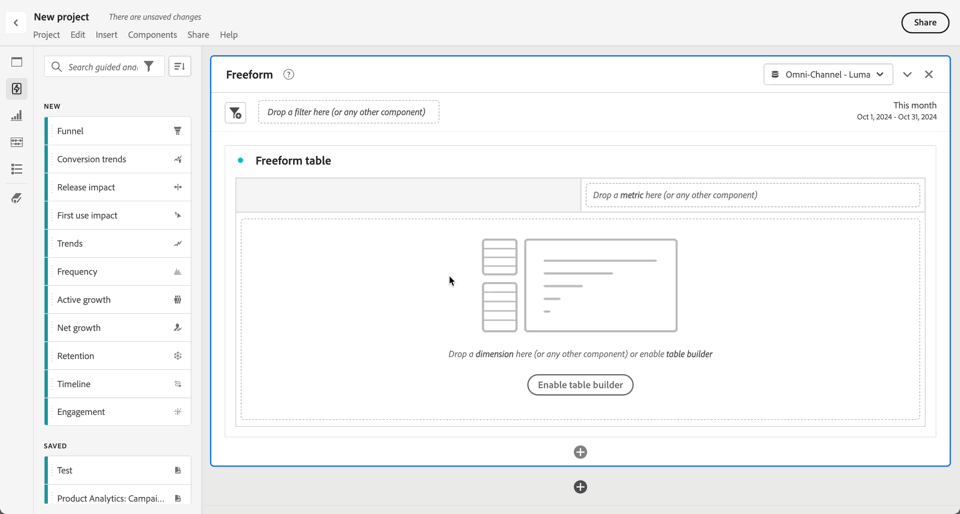

# 引导式分析概述

引导式分析使从营销到产品再到分析师的用户，能够通过基于 Customer Journey Analytics 的跨渠道数据构建的引导式工作流，自助提供有关客户历程的高质量数据和洞察。与 Analysis Workspace 和移动记分卡类似，引导式分析使用来自[数据视图](/help/data-views/data-views.md)中的数据，该视图通过[连接](../connections/overview.md)引用 Adobe Experience Platform 中的数据。在引导式分析中创建的许多报告均可以无缝传输到 Analysis Workspace 以进行其他研究。

以下引导式分析可供使用：

| 图标 | 分析 | 描述 |
| :----:|--- | --- |
|  | [积极增长](types/active-growth.md) | 确定新的、保留的、返回的或非活跃的用户。 |
|  | [转化趋势](types/conversion-trends.md) | 跟踪转化率随时间发生的变化。 |
|  | [参与度](types/engagement.md) | 了解功能参与的广度和深度。 |
|  | [首次使用影响](types/first-use-impact.md) | 衡量功能首次使用对关键量度的影响。 |
|  | [频率](types/frequency.md) | 按使用频率衡量参与度。 |
|  | [漏斗](types/funnel.md) | 比较步骤之间的转化率。 |
|  | [净增长](types/net-growth.md) | 您是在获得用户还是在失去用户？ |
|  | [发布影响](types/release-impact.md) | 比较发布前和发布后相同时期的性能。 |
|  | [保留](types/retention.md) | 衡量用户持续的返回习惯。 |
|  | [时间表](types/timeline.md) | 探索会话活动中的模式。 |
|  | [趋势](types/trends.md) | 随着时间的推移衡量用户参与度。 |

## 访问

您可以从 Customer Journey Analytics 主页访问引导式分析。

1. 通过选择主页上的&#x200B;**[!UICONTROL 引导式分析]**，您可以直接进入[趋势分析](types/trends.md)。

   {style="border:1px solid gray"}

1. 选择&#x200B;**[!UICONTROL 新建]**，查看不同的视图选项，并选择不同的分析起点。

   {style="border:1px solid gray"}

您还可以从 Analysis Workspace 项目访问引导式分析。

1. 从主页中选择&#x200B;**[!UICONTROL 空白项目]**&#x200B;来创建一个空的 Workspace 项目。

   {style="border:1px solid gray"}

1. 选择左侧边栏中的 **[!UICONTROL 引导式分析]**。

   {style="border:1px solid gray"}

1. 将任何新分析拖到 Workspace 画布上，然后选择&#x200B;**[!UICONTROL 创建]**，以生成所需的分析（例如：**[!UICONTROL 创建趋势]**）。您还可以将现有分析从&#x200B;**[!UICONTROL 已保存]**&#x200B;部分拖动到 Workspace 画布上。

   

## 界面

引导式分析的界面遵循问答格式。在查询边栏中生成您的问题，然后通过书面洞察、图表和表格获得答案。然后，您可以使用分析和可视化图表设置提出下一个问题。

引导式分析使用以下 UI 元素：

| 界面预览 | UI 元素 | 描述 |
| --- | --- | --- |
| {style="border:1px solid gray"} | **[!UICONTROL 查询边栏]** | 通过选择构成分析的所需组件（事件、属性和区段）来配置您的&#x200B;*“问题”*。以下选项适用于所有分析，并且每个视图都可以使用其他设置。 <ul><li>**查看**：从选项中选择以切换到新的分析。您的查询选择将保持在新分析允许的范围内。</li><li>**活动**：您要测量的事件。每个分析对您可以配置的事件数量实施不同的限制。事件有时被标记为 **[!UICONTROL 开始和返回事件]**、**[!UICONTROL 步骤]**&#x200B;或 **[!UICONTROL 关键指标]**。在分析中使用 1、2、... 来识别事件 选择  **[!UICONTROL 添加事件]** 来添加新事件。</li><li>**[!UICONTROL 因素]**：如果可用，允许您指定诸如自日期和首次事件等因素。</li><li>**计为**：要应用于所选事件的计数方法。从下拉菜单中选择。</li><li>**区段**：您要测量的区段。每种分析对您可以配置的区段数量实施不同的限制。在分析中使用 A、B、... 来识别区段 选择  **[!UICONTROL 添加区段]** 以添加新区段。</li><li>**[!UICONTROL 细分]**：如果可用，则为您想要应用于分析的细分。</li></ul>在某些设置上，可以进行额外的配置。<ul><li>**过滤器**：使用“事件”或“区段”部分中的按特定维度缩小范围。选择维度后，标准过滤条件（例如&#x200B;**[!UICONTROL 等于]**、**[!UICONTROL 包含]**&#x200B;或&#x200B;**[!UICONTROL 结束于]**）和前 1000 个维度值都可用。 选择  以添加其他过滤器。 选择  以删除过滤器。</li><li>**更多操作**：使用  选择操作，例如<ul><li> **[!UICONTROL 重命名]**：重命名事件或区段。</li><li> **[!UICONTROL 复制]**：复制事件或区段。</li><li> **[!UICONTROL 移除]**：移除事件、区段或细分。</li><li> **[!UICONTROL 编辑区段]**：在[区段生成器](/help/components/segments/seg-builder.md)中编辑区段。</li><li> **[!UICONTROL 添加到收藏夹]**：在[区段管理器](/help/components/segments/seg-manage.md)中将该区段添加到收藏区段列表。</li><li> **[!UICONTROL 另存为]**：将该段保存为新组件。在 **[!UICONTROL 将段保存到组件]** 对话框中，您可以指定段名称和描述。您可以选择  将新区段标记为收藏。选择&#x200B;**[!UICONTROL 保存]**，将该区段保存为新区段。</li><li> **[!UICONTROL 开始和返回事件]**。：在 [留存](types/retention.md) 分析中链接开始事件和返回事件。</li><li> **[!UICONTROL 取消链接开始和返回事件]**：在 [留存](types/retention.md) 分析中取消链接开始和返回事件。</li></ul></li></ul> |
| {style="border:1px solid gray"} | **[!UICONTROL 图表]** | 根据查询边栏和设置的输入返回的数据生成的可视化图表。您看到的可视化效果取决于图表上方的视图和设置。该图表还包括： <ul><li>**工具提示**：将鼠标悬停在任何图表数据点上可显示包含更多信息的工具提示。</li><li>**图例**：将鼠标悬停在图表图例系列上可查看可用的定义、关注该系列并暂时隐藏其他系列。选择图例中的一个系列以隐藏该系列。</li><li>**注释**：适用的[注释](../components/annotations/overview.md)在可视化和图例之间可见。它以注释的配置颜色显示为图标。随时间显示数据的分析将图标置于配置的日期或日期范围下。不随时间显示数据的分析在图表的右下角显示图标。</li><li>**选择操作**：通过选择任何数据点来显示下一步可用操作。选项包括&#x200B;**保存区段**。</li></ul> |
| {style="border:1px solid gray"} | **[!UICONTROL 表]** | 根据查询边栏和设置的输入内容返回的数据的表格表示形式。表中的行使用事件（1、2、...）和段标识符（A、B、...）作为参考。表中的列取决于图表上方的分析。该表的每一行还包括： <ul><li>**选择操作**：切换  以隐藏或显示某一行的图表系列。选择  以执行其他操作。选项包括&#x200B;**保存区段**。</li></ul> |
| {style="border:1px solid gray"} | **[!UICONTROL 可视化图表设置]** | 图表上方的选项允许您提出下一个问题，并自定义图表和表格返回数据的方式。以下选项适用于所有分析，并且每个分析都可以使用其他设置。 <ul><li> **图表设置**：微调图表和表格的显示内容。可用选项取决于所选分析。</li><li> **叠加设置**：添加叠加。可用选项取决于所选分析。</li><li> **[!UICONTROL 存储桶设置]**：自动存储桶或将自定义存储桶设置应用于数据。可用选项取决于所选分析。<li> **[!UICONTROL 比较设置]**：将数据与特定日期范围进行比较。可用选项取决于所选分析。</li><li> **[!UICONTROL 显示设置]**：选择如何显示数据。可用选项取决于所选分析。<li> **日期范围**：用于确定分析的日期范围的日程表选择器。您还可以选择趋势分析的时间间隔，例如每日、每周或每月。</li><li> **Insights**：上下文的洞察取决于您查看的分析。这些洞察为当前的分析提供了洞察结果。如果有多个洞察，您可以使用右侧的箭头查看它们。您可以使用右上角的灯泡图标切换此框的可见性。</li></ul> |
| {style="border:1px solid gray"} | **[!UICONTROL 菜单]** 可在引导分析项目中使用 | 引导分析项目右上角的命令为您的分析提供总体操作。<ul><li> ***数据视图名称***：更改分析使用的数据视图。当您更改数据视图时，查询边栏中的可用组件也会更改。</li><li> **复制链接**：将分析链接复制到剪贴板。系统会提示您在共享之前进行保存。</li><li>**共享**：打开共享模式，其中包含用于共享给个人用户或群组的更多选项。您可以与其他用户分享分析，或生成链接与任何人分享。</li><li>**保存**：保存分析。如果您要保存新的分析，则会出现&#x200B;**[!UICONTROL 保存分析]**&#x200B;对话框，要求输入名称和描述。保存后，您可以通过 **[!UICONTROL 已保存分析]** 对话框分享您的分析。</li><li> **[!UICONTROL 添加到 Workspace]**：显示可添加此分析的可用 Workspace 项目。选择一个 Workspace 项目会在新选项卡中打开该 Workspace 项目，并在项目底部添加分析。</li></ul>选择以进行更多操作，例如：<ul><li>**[!UICONTROL 另存为]**：将分析与当前分析分开保存，创建副本。将会出现一个对话框，要求输入新名称和描述。</li><li>**[!UICONTROL 导出至 Workspace]**：在 Analysis Workspace 中重新创建当前的引导式分析查询。Workspace 项目会在新选项卡中创建，以防止在引导式分析中出现中断。它是分析的副本，打开后不会与原始分析保持同步。当您想要交给分析团队，或者深入研究超出分析范围的数据时，请使用此命令。</li><li>**[!UICONTROL 复制到剪贴板]**：将图表图形复制到剪贴板，以便粘贴到其他的应用程序中。图形中不包含查询边栏和表格。</li><li>**[!UICONTROL 下载 PNG]**：将图表图形下载为  `.png`。图形中不包含查询边栏和表格。</li><li>**[!UICONTROL 下载 CSV]**：将表数据下载为  `.csv`。查询边栏和图表不包含在文件中。</li></ul> |
| {style="border:1px solid gray"} | **菜单** &#x200B;可在分析工作区的引导分析可视化中使用。 | 分析工作区中引导分析可视化中的命令。<ul><li> **[!UICONTROL Chart]**：仅显示分析的图表。</li><li> **[!UICONTROL 表格]**：仅显示分析的表格。</li><li> **[!UICONTROL 所有的]**：显示分析的图表和表格。</li><li> **[!UICONTROL 编辑]**：编辑分析的配置</li><li> **[!UICONTROL *日期范围&#x200B;*]**：配置分析的日期范围。</li></ul> |

## 设置

引导式分析通过以下方式包含在 Customer Journey Analytics 包中：

| 包 | 可用分析 |
| --- | --- |
| [!UICONTROL Customer Journey Analytics 插件] | 主动增长、转化趋势、频率、漏斗、净增长、留存率、趋势 |
| [!UICONTROL Customer Journey Analytics Foundation] | 趋势 |
| [!UICONTROL Customer Journey Analytics Select] | 基础浏览次数 + 活跃增长、转化趋势、频率、漏斗、净增长、留存率 |
| [!UICONTROL Customer Journey Analytics Prime] | 选择视图 + 参与度、首次使用影响、发布影响、时间线 |
| [!UICONTROL Customer Journey Analytics Ultimate] | 最佳视图 |

{style="table-layout:auto"}

产品配置文件管理员可以在 Adobe Admin Console 中添加或删除对引导式分析的访问权限。

1. 登录到 [Adobe Admin Console](https://adminconsole.adobe.com)。
1. 在产品列表中选择 **[!UICONTROL Customer Journey Analytics]**。
1. 为您要编辑的权限选择所需的产品配置文件。
1. 选择&#x200B;**[!UICONTROL 权限]**&#x200B;选项卡，然后单击[!UICONTROL 报告工具]下的&#x200B;**[!UICONTROL 编辑]**。
1. 在[!UICONTROL 可用权限项目]列表中，选择&#x200B;**[!UICONTROL 引导式分析访问权限]**&#x200B;旁边的 ，将其添加到[!UICONTROL 包含的权限项目]列表中。
1. 选择&#x200B;**[!UICONTROL 保存]**。

请参阅[用户级别的访问控制](/help/technotes/access-control.md#user-level-access)，了解更多信息。

>[!TIP]
>
>一些管理员更喜欢为 Customer Journey Analytics 的新用户启用引导式分析并禁用 Analysis Workspace。当这些用户熟悉了产品和您的组织数据后，您就可以启用对 Analysis Workspace 的访问权限。
