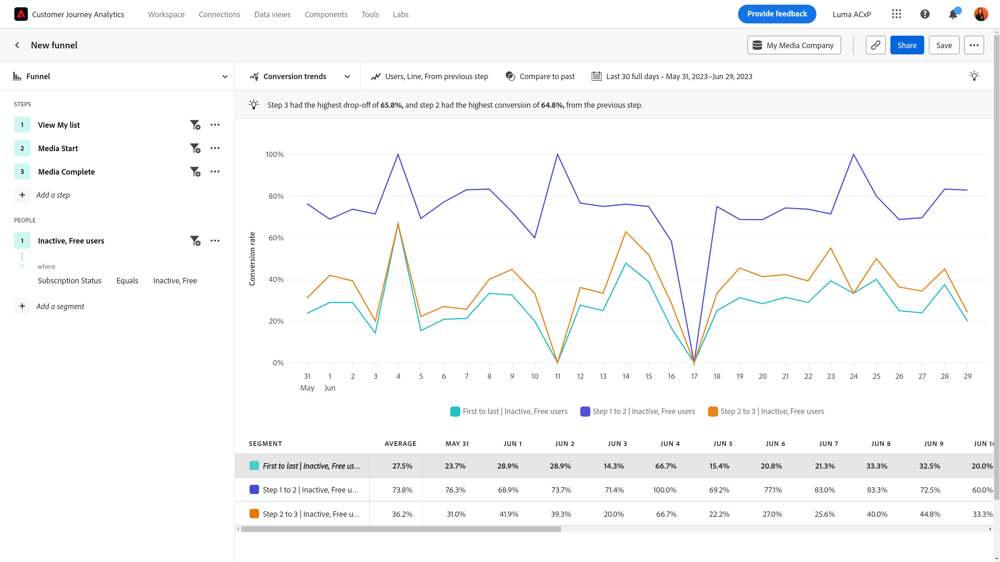

# 转化趋势

{{release-limited-testing}}

此 **转化趋势** 视图提供有关一段时间内转化率的趋势可视化。 水平轴是一个时间间隔，而垂直轴表示转化率。 此视图类型的用例包括：

* **跟踪优化工作**：在识别要改进的关键瓶颈之后，使用 [摩擦](friction.md)中，您可以使用此视图来跟踪这些优化如何随时间对转化率产生影响。
* **A/B测试评估**：评估在漏斗环境中执行的A/B测试或试验的有效性。 通过比较不同变体之间的转化率，您可以轻松确定哪些测试提供了较高的转化率，从而做出关于永久实施哪些变体的数据驱动型决策。
* **一段时间的营销活动评估**：衡量营销活动在一段时间内的有效性。 您可以创建一个区段，该区段重点关注接触了给定营销活动的用户，并将其转化率与其他营销活动进行比较。 您还可以将当前转化率与过去运行的类似促销活动进行比较。

## 查询边栏

利用查询边栏，可配置以下组件：

* **步骤**：要跟踪的事件接触点。 图表中的每个条形都表示一个步骤。 您最多可以包含十个步骤。
* **人员**：要跨区段比较漏斗。 所选的每个区段会将每个步骤拆分为多个条。 每种颜色表示不同的区段。 您最多可以包含三个区段。

## 图表设置

转化趋势视图提供了以下图表设置，可以在图表上方的菜单中调整这些设置：

* **量度**：要测量的量度。 选项包括“会话”和“用户”。
* **图表类型**：要使用的可视化图表类型。 选项包括Line。
* **转换自**：确定各步骤的百分比计算。 选项包括从第一步或上一步计算转化。

## 应用时间比较

{{apply-time-comparison}}

## 日期范围

分析所需的日期范围。 此设置包含两个组件：

* **间隔**：要查看趋势数据所依据的日期粒度。 有效选项包括每小时、每日、每周、每月和每季度。 同一日期范围可以有不同的间隔，这会影响图表中的数据点数和表中的列数。 例如，查看以每日粒度跨越三天的分析将只显示三个数据点，而以每小时粒度跨越三天的分析将显示72个数据点。
* **日期**：开始日期和结束日期。 滚动日期范围预设和以前保存的自定义范围可方便您使用，您也可以使用日历选择器来选择固定日期范围。
