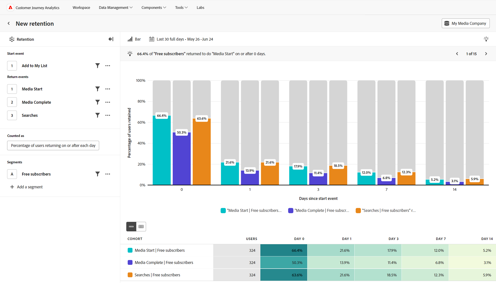

# 保留分析 {#retention}

<!-- markdownlint-disable MD034 -->

>[!CONTEXTUALHELP]
>id="workspace_guidedanalysis_retention_button"
>title="维系"
>abstract="衡量有多少用户继续使用您的产品。"

<!-- markdownlint-enable MD034 -->

 **[!UICONTROL 维系]**&#x200B;分析可衡量用户如何随着时间继续使用您的产品，这有助于您了解您的产品是否适合市场。 该分析基于两个重要事件计算用户：

* 开始事件：用于使用户有资格包含在您的分析中的事件。
* 返回事件：用户必须参与的一个或多个事件将计为分析中的返回用户。

在此分析中，图表的x轴表示自用户的初始开始事件以来的时间，y轴表示与一个或多个返回事件互动的用户百分比。 您可以跨持续时间查看保留和流失，显示的持续时间可通过查询设置进行自定义。 在图表下方，表格提供了汇总数据，并且可以选择显示单个同类群组，即一组在同一日期执行了开始事件的人员。

>[!VIDEO](https://video.tv.adobe.com/v/3430503/?quality=12&learn=on)

## 用例

此分析的用例包括：

* **同类群组分析**：根据用户采取的操作（例如注册或购买）将用户分组到同类群组。 您可以比较这些组的保留情况并确定如何改善每个组的用户体验。
* **产品市场拟合度**：测量产品的常规使用情况，并将其可视化为保留曲线。 留存率越高表示产品与市场契合度越高，曲线平坦的位置表示达到契合度需要多长时间。 从整体级别查看此分析，或按个别产品功能进行细分，以获得更深入的见解。
* **订阅服务分析**：如果您的产品使用订阅或其他类型的经常性收入模型，则可以查看充分利用产品的用户百分比。 您可以识别这些用户表现出来的某些品质和行为。
* **用户参与度**：评估特定类型的用户与您的产品的参与度，并排比较其返回频率。 与其他区段相比，具有较低维系率的给定区段可以让您深入了解如何改善他们可能拥有的潜在缺佳体验。

## 界面

有关引导式分析界面的概述，请参阅[界面](../overview.md#interface)。 以下设置特定于此分析：

### 查询边栏

利用查询边栏，可配置以下组件：

* **[!UICONTROL 开始事件]**：用户必须符合的事件条件才能包含在您的分析中。 参与开始事件的用户将被计入表的“用户”列中。 此事件将作为所显示保留率的分母。 支持一个事件，并且可以根据需要应用属性过滤器。 默认情况下，开始和返回事件是链接的，这意味着用户必须执行一次所选事件才能纳入同类群组，然后再次将其计为返回用户。 在更多菜单下，如果您希望返回操作与包含操作不同，可以取消开始和返回事件的链接。
* **[!UICONTROL 返回事件]**：用户必须与之参与以计为持续时间分段中的返回用户的事件条件。 您最多可以选择三个返回事件来比较维系率。
* **[!UICONTROL 计为]**：要应用于保留用户的计数方法。 选项包括：
   * **[!UICONTROL 量度]**：显示[!UICONTROL 用户数]或保留的用户的百分比[!UICONTROL 百分比]。 保留的用户百分比的分母是同类群组中包含的用户，在所有持续时间分段中均相同。
   * **[!UICONTROL 回访]**：允许您控制回访用户的计数方式。 选项包括：
      * **[!UICONTROL 在指定持续时间或之后]**：此选项通常称为“无限制”保留，如果用户在指定的持续时间或之后返回，则将此选项计为用户。 例如，在第7天或第7天之后的任何时间。 此选项有助于显示用户如何继续参与并最终生成更平滑的维系率曲线。
      * **[!UICONTROL 恰好在]**：此选项通常称为“有界”保留，如果用户恰好在指定的持续时间返回，则此选项将计算该用户。 例如，完全在第7天。 此选项有助于显示用户在特定时间范围内如何回访，并生成保留曲线，留存率曲线会因此产生更多波动。 注意：Analysis Workspace中的同类群组分析使用“确切”计数作为其分析的基础。
   * **[!UICONTROL Each]**：您希望每个持续时间分段对应的时间段。 选项包括：
      * **[!UICONTROL 天/周/月]**：可用选项取决于所选的日期范围。 这些选项与选择日期范围时设置的&#x200B;**[!UICONTROL 时间间隔]**&#x200B;相同，将自动更新该设置。
      * **[!UICONTROL 自定义括号]**：此选项仅适用于“On each”设置。 它允许您在更长的时间范围内对用户进行计数；例如，第7-10天，而不是仅第7天。
   * **[!UICONTROL 持续时间设置]**：允许您控制图表和表格上显示的持续时间分段。 持续时间是返回事件在开始事件之后发生的一段时间。 注意：符合持续时间分段资格的用户基于已用时间，而不是日历日。 例如，如果用户在9月6日晚上11:55符合某个事件的条件，然后在9月7日凌晨12:05符合返回事件的条件，则这些条件不会显示在1天持续时间分段中。 用户必须经过24小时才能符合1天持续时间段的条件。 可用持续时间分段取决于您设置的日期范围。
      * **[!UICONTROL 自动持续时间]**&#x200B;根据日期范围长度以及距日期范围当前日期的接近程度自动定义持续时间分段。
      * **[!UICONTROL 自定义持续时间]**&#x200B;允许您自定义图表和表格上显示的四个持续时间分段。
* **[!UICONTROL 区段]**：您要测量的区段。每个选定区段都会向同类群组表添加一行。 您最多可以包含三个区段。

### 图表设置

[!UICONTROL 维系]分析提供了以下图表设置，可在图表上方的菜单中调整这些设置：

* **[!UICONTROL 图表类型]**：要使用的可视化图表类型。 选项包括[!UICONTROL 栏]和[!UICONTROL 行]。

### 日期范围

分析所需的日期范围。 此设置包含两个组件：

* **[!UICONTROL 间隔]**：要查看保留数据的日期粒度。 有效选项包括“每日”、“每周”和“每月”。 同一日期范围可以具有不同的时间间隔，这会影响持续时间分段选项。
* **[!UICONTROL 日期]**：开始和结束日期。 您可以为方便起见，使用滚动日期范围预设和以前保存的自定义范围，也可以使用日历选择器来选择固定日期范围。

如果选择接近当天的日期范围，则不包括最初参与过于接近当天的用户。 此分析始终为所有用户提供包含在所有持续时间分段中的机会。 日历选择器下方的消息提供有关用户参与的日期范围以及仅为旧用户保留的间隔的信息：

* **[!UICONTROL 分析在[日期间隔]]**&#x200B;内执行了开始事件的用户：如果某个用户在此日期范围内参与该事件，则这些用户将包含在分析中。 此日期范围可确保所有用户有足够的时间符合所有持续时间段的条件。 如果此日期范围更接近当天，则该日期范围可能与您的选择不同。
* **[!UICONTROL 保留来自[日期间隔]的数据以完成分析]**：如果用户在此时间段内首次参与分析，则它们&#x200B;**不包括在分析中**。 对于最近的日期范围，这些用户将没有机会获得所有持续时间段的资格。 对于过去的日期范围，这些用户在选定日期范围之外处于活动状态。

<!--
## Example

See below for an example of the analysis.

-->