# 将归因人工智能与 CJA 集成

[归因人工智能](https://experienceleague.adobe.com/docs/experience-platform/intelligent-services/attribution-ai/overview.html?lang=zh-Hans)，作为 Adobe Experience Platform 智能服务的一部分，是一种多渠道、算法归因服务，用于计算客户交互对指定结果的影响和增量影响。借助归因人工智能，营销人员可以通过了解每个客户互动对客户旅程各个阶段的影响来衡量和优化营销和广告支出。

归因人工智能与 Customer Journey Analytics (CJA) 集成的程度是：归因人工智能针对客户的营销接触点和转化数据源运行模型。然后，CJA 将这些模型的输出作为数据集导入，或者输出可以与您的其他 CJA 数据集集成。然后，可以在CJA的数据视图和报表中利用启用Attribution AI的数据集。

归因人工智能支持 3 种 Experience Platform 模式：体验事件、Adobe Analytics 和消费者体验事件。

归因人工智能支持两个类别的分数：算法分数和基于规则的分数。

## 算法分数

算法分数包括增量分数和影响分数。

* **[!UICONTROL 影响]分数**&#x200B;在营销渠道之间划分 100% 的转化点数。
* **[!UICONTROL 增量]分数**&#x200B;首先考虑到即使没有营销也可以实现的转化基线。由于现有的品牌认知度、忠诚度和口碑，该基线取决于 AI 对模式、季节性等的观察。剩余的信用在营销渠道之间分配。

## 基于规则的分数

基于规则的分数包括

* **[!UICONTROL 首次接触]**&#x200B;将 100% 的点数分给在归因回顾时间范围中看到的首次接触点。
* **[!UICONTROL 最后接触]**&#x200B;将 100% 的点数分给转化前最近出现的接触点。
* **[!UICONTROL 线性]**&#x200B;将相同的点数分给促成转化的每个接触点。
* **[!UICONTROL U 型]**&#x200B;将 40% 的点数分给首次交互，40% 的点数分给最后交互，并将剩余 20% 的点数分给这两次交互之间的任意接触点。对于具有单一接触点的转化，它将分得 100% 的点数。对于具有两个接触点的转化，两个接触点各分得 50% 的点数。
* **[!UICONTROL 时间衰减]**&#x200B;采用具有自定义半衰期参数的指数衰减，默认值为 7 天。每个渠道的权重，取决于在接触点启动与最终转化之间流逝的时间。用于确定点数的公式是 `2^(-t/halflife)`，其中 `t` 是接触点与转化之间流逝的时间。然后，所有接触点均被标准化为 100%。

## 工作流程

在使用 CJA 中的输出之前，请在 Adobe Experience Platform 中执行某些步骤。输出包含一个应用了归因人工智能模型的数据集。

### 第 1 步：创建归因人工智能实例

在 Experience Platform 中，通过选择和映射数据、定义事件和训练数据来创建归因人工智能实例，如[此处](https://experienceleague.adobe.com/docs/experience-platform/intelligent-services/attribution-ai/user-guide.html)所述。

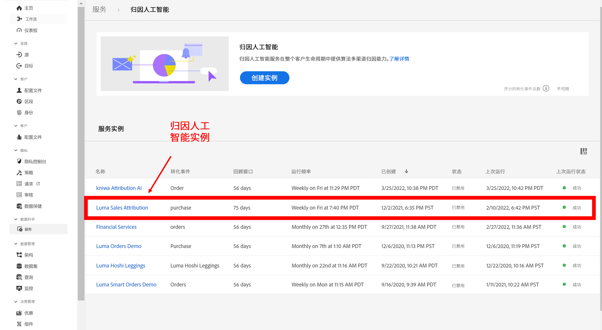

### 第 2 步：设置与归因人工智能数据集的 CJA 连接

在 CJA 中，您现在可以[创建一个或多个连接](/help/connections/create-connection.md)到已针对归因人工智能进行检测的 Experience Platform 数据集。这些数据集带有“归因人工智能分数”前缀，如下所示：

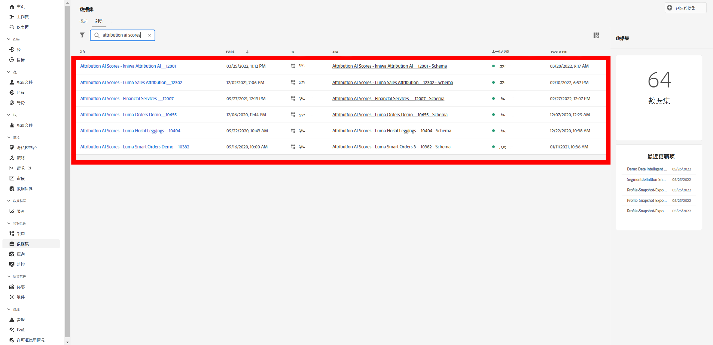

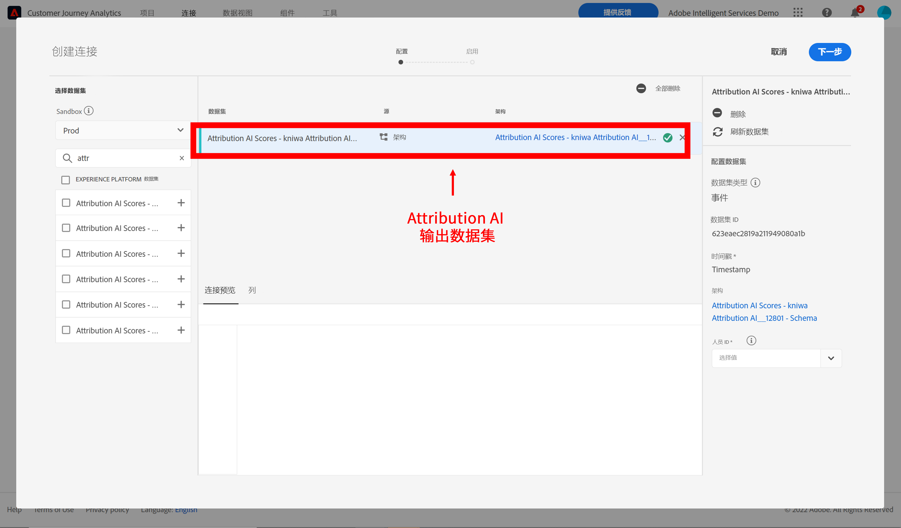

### 第 3 步：根据这些连接创建数据视图

在 CJA 中，[创建一个或多个包含归因人工智能 XDM 字段的数据视图](/help/data-views/create-dataview.md)。

以下是接触点的 XDM 架构字段：

以下是转化的 XDM 架构字段：

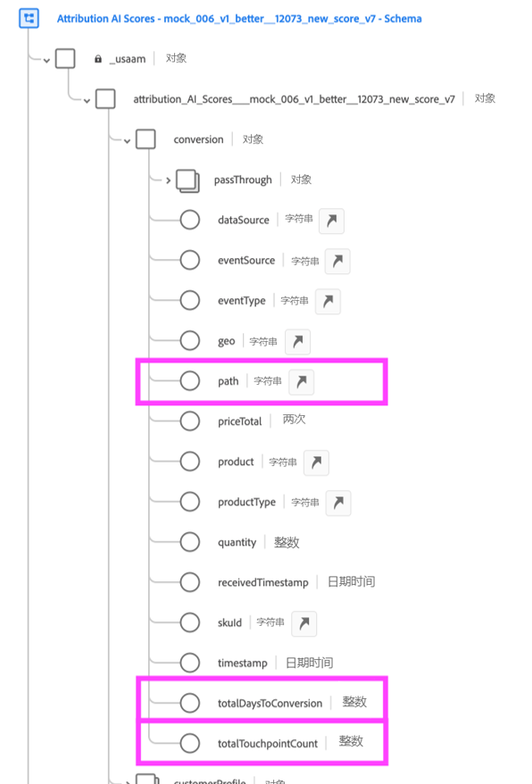

### 第 4 步：在 CJA 工作区中报告 AAI 数据

例如，在 CJA 工作区项目中，您可以提取“AAI 订单”等指标，以及“AAI 营销活动名称”或“AAI 营销渠道”等维度。

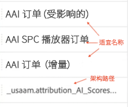

AAI中输出的原始分数具有嵌套模式，在该模式中，字段的路径可能足够长，以占用表或可视化中的大多数空格。 为了简洁， [!UICONTROL 显示名称] 会在CJA中按照以下规则自动生成和利用：

* 所有字段都具有“AAI”前缀
* 对于接触点字段：
   * 对于属于XDM分数的字段，它们在CJA中显示为 `AAI T {field name}`
   * 对于作为“传递”列包含的字段，它们将在CJA中显示为 `AAI T PT {field name}`
* 对于转化字段：
   * 对于属于XDM分数的字段，它们将在CJA中显示为 `AAI C {field name}`
   * 对于作为“传递”列包含的字段，它们将在CJA中显示为 `AAI C PT {field name}`

**包括影响分数和增量分数的订单**

在这里，我们看到一个带有 AAI 数据的工作区项目，该数据显示了具有影响和增量分数的订单。深入到任何维度以按以下各项了解归因：活动、产品组、用户区段、地理位置等。

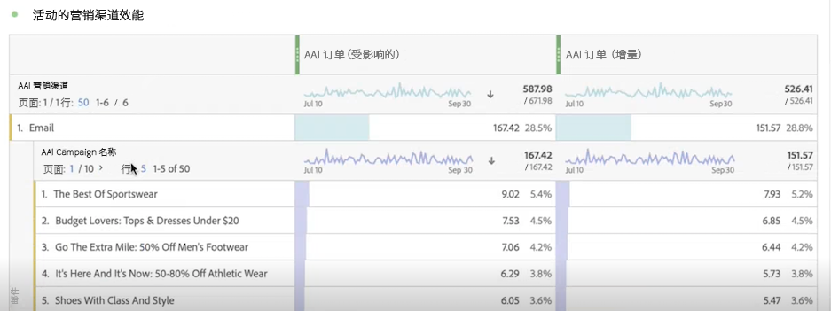

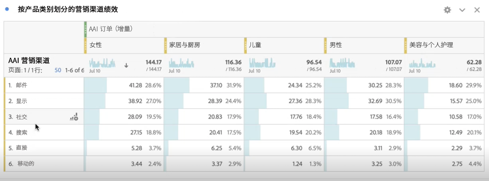

**营销绩效**

在不同归因模型之间比较和对比接触点归因：

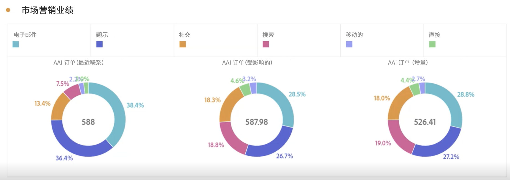

**渠道交互**

使用维恩图了解渠道交互以查看哪个渠道可以最有效地与其他渠道一起使用：

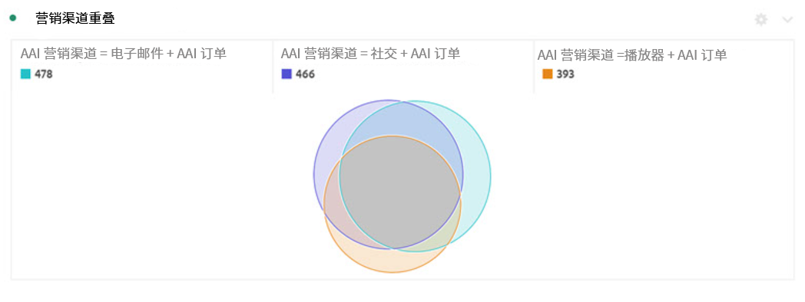

**主要转化路径**

下表显示了主要转化路径（进行了重复数据删除），以帮助您设计和优化接触点：

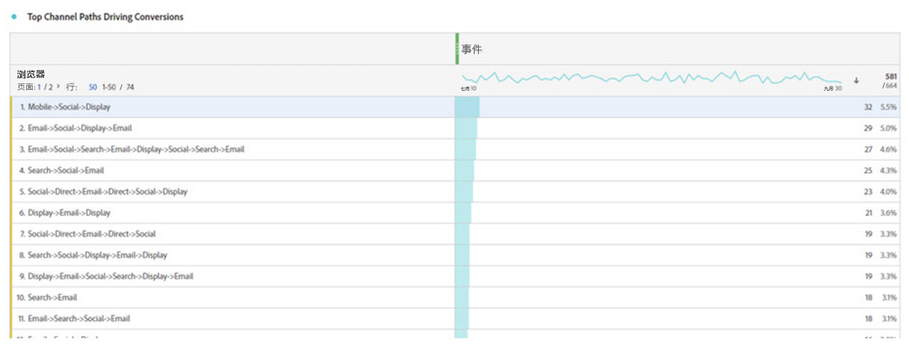

**转化的前置时间**

在此，我们看到了接触点混在其中时的转化前置时间。它有助于优化前置时间：

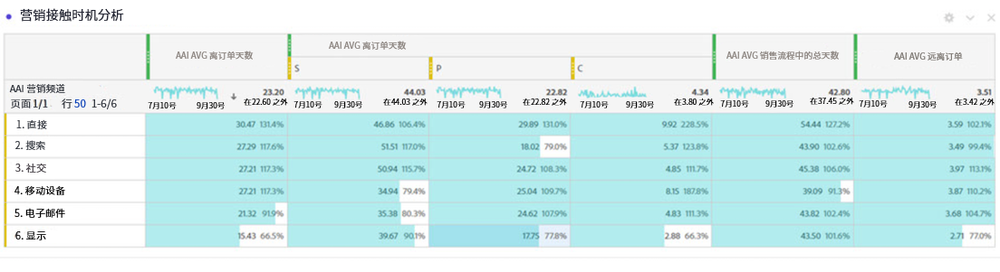

## 归因人工智能和 Attribution IQ 之间的差异

那么什么时候应该使用归因人工智能数据而非原生 CJA 功能 [Attribution IQ](/help/analysis-workspace/attribution/overview.md)？下表显示了一些功能差异：

| 功能 | 归因人工智能 | Attribution IQ |
| --- | --- | --- |
| 进行增量归因 | 是 | 否 |
| 允许用户调整模型 | 是 | 是 |
| 跨渠道进行归因（注意：AAI 不使用与 CJA 相同的拼接数据。） | 是 | 是 |
| 包括影响分数 | 是 | 是 |
| 进行 ML 建模 | 是 | 是 |
| 基于区域的归因模型 | 是 | 是 |
| 可以在模型中配置营销接触点 | 是 | 否 |

{style=&quot;table-layout:auto&quot;}
