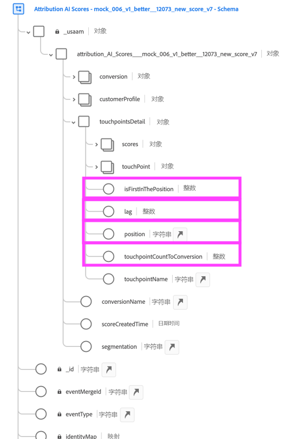

# 将Attribution AI与CJA集成

[Attribution AI](https://experienceleague.adobe.com/docs/experience-platform/intelligent-services/attribution-ai/overview.html?lang=en)作为Adobe Experience Platform Intelligent Services的一部分，是一项多渠道算法归因服务，用于计算客户交互对特定结果的影响和增量影响。 借助Attribution AI，营销人员可以通过了解客户旅程各个阶段每个客户互动的影响来衡量和优化营销和广告支出。

Attribution AI与Customer Journey Analytics(CJA)集成，以便Attribution AI针对客户的营销接触点和转化数据源运行模型。 然后，CJA会将这些模型的输出作为数据集进行导入，或者也可以将其与CJA数据集的其余部分集成。 然后，可以在CJA的数据视图和报表中利用启用Attribution AI的数据集。

Attribution AI支持3种Experience Platform模式：体验事件、Adobe Analytics和消费者体验事件。

Attribution AI支持两类得分：算法和基于规则。

## 算法得分

算法得分包括增量分数和受影响分数。

* **[!UICONTROL 影响] 分数** 将100%的转化点数分给营销渠道。
* **[!UICONTROL 增量] 分数** 首先，考虑即使没有营销，您也可以达到的转化基线。 此基线取决于AI对模式、季节性等的观察，这是因为现有的品牌认可、忠诚度和口碑。 剩余的点数按营销渠道进行划分。

## 基于规则的分数

基于规则的分数包括

* **[!UICONTROL 首次接触]** 将100%的点数分给在归因回顾窗口中看到的首次接触点。
* **[!UICONTROL 最近联系]** 将100%的点数分给转化前最近发生的接触点。
* **[!UICONTROL 线性]** 将相同的点数分给导致转化的每个接触点。
* **[!UICONTROL U型]** 将40%的点数分给首次交互，40%的点数分给最后交互，并将剩余20%的点数分给这两次交互之间的任意接触点。 对于具有单一接触点的转化，它将分得 100% 的点数。对于具有两个接触点的转化，两个接触点各分得 50% 的点数。
* **[!UICONTROL 时间衰减]** 采用具有自定义半衰期参数的指数衰减，其默认值为7天。 每个渠道的权重，取决于在接触点启动与最终转化之间流逝的时间。用于确定点数的公式是 `2^(-t/halflife)`，其中 `t` 是接触点与转化之间流逝的时间。然后，所有接触点均被标准化为 100%。

## 工作流程

在CJA中处理输出之前，某些步骤在Adobe Experience Platform中执行。 输出由具有应用的Attribution AI模型的数据集组成。

### 步骤1:创建Attribution AI实例

在Experience Platform中，通过选择和映射数据、定义事件和培训数据来创建Attribution AI实例，如所述 [此处](https://experienceleague.adobe.com/docs/experience-platform/intelligent-services/attribution-ai/user-guide.html).

### 步骤2:设置与Attribution AI数据集的CJA连接

在CJA中，您现在可以 [创建一个或多个连接](/help/connections/create-connection.md) Experience Platform已针对Attribution AI分析的数据集。 这些Attribution AI集会显示“数据得分”前缀，如下所示：

### 步骤3:根据这些连接创建数据视图

在CJA中， [创建一个或多个数据视图](/help/data-views/create-dataview.md) 包含Attribution AIXDM字段的ID。

以下是接触点的XDM架构字段：

以下是用于转化的XDM架构字段：

### 步骤4:在CJA工作区中报告AAI数据

在CJA工作区项目中，您可以提取“AAI订单”等量度，以及“AAI促销活动名称”或“AAI营销渠道”等维度，例如。

>[!IMPORTANT]
>
>这些维度和量度不会以这种方式在本地命名。 这些是“友好名称”。 的 [Attribution AI中的命名约定](https://experienceleague.adobe.com/docs/experience-platform/intelligent-services/attribution-ai/input-output.html?lang=en#attribution-ai-output-data) 遵循架构路径。 我们建议在CJA中将长AAI架构路径名称重命名为更易用的短名称（维度/量度）。 您可以在 **[!UICONTROL 数据视图]** > **[!UICONTROL 编辑数据视图]** > **[!UICONTROL 组件]** 选项卡> **[!UICONTROL 架构字段]** ->单击架构字段 — > **[!UICONTROL 组件名称]**.

**具有影响分数和增量分数的订单**

在此，我们看到一个包含AAI数据的工作区项目，该项目显示了具有影响和增量得分的订单。 通过以下方式向下访问任何维度以了解归因：促销活动、产品组、用户区段、地理位置等。

**营销效果**

比较和对比不同归因模型之间的接触点归因：

**渠道互动**

通过维恩图了解渠道交互，以了解哪些渠道可以最有效地与其他渠道一起使用：

**转化的热门路径**

此表显示了转化的热门路径（消除了重复项），以帮助您设计和优化接触点：

**转化前置时间**

在此，我们可以看到在混合接触点中出现转化的前置时间。 它有助于优化前置时间：

## Attribution AI和Attribution IQ之间的差异

因此，您何时应使用Attribution AI数据， [Attribution IQ](/help/analysis-workspace/attribution/overview.md)，是本机CJA功能吗？ 此表显示了功能上的一些差异：

| 功能 | Attribution AI | Attribution IQ |
| --- | --- | --- |
| 增量归因吗？ | 是 | 否 |
| 允许用户调整模型 | 是 | 是 |
| 跨渠道归因吗(注意：AAI使用的拼合数据与CJA不同。) | 是 | 是 |
| 包括受影响的得分 | 是 | 是 |
| ML建模吗？ | 是 | 是 |
| 基于区域的归因模型 | 是 | 是 |
| 可以在模型中配置营销接触点 | 是 | 否 |

{style=&quot;table-layout:auto&quot;}
