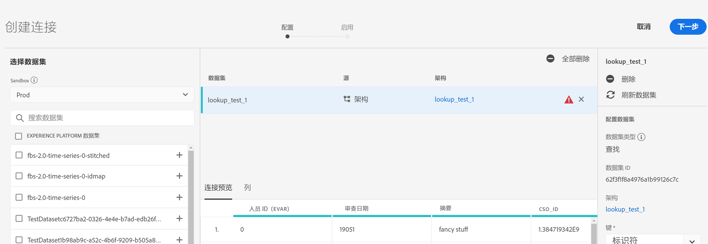
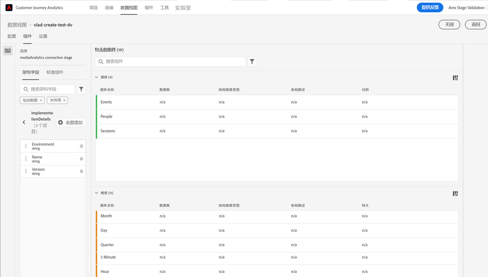
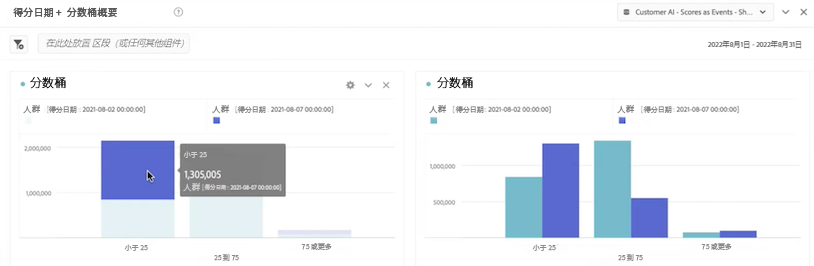
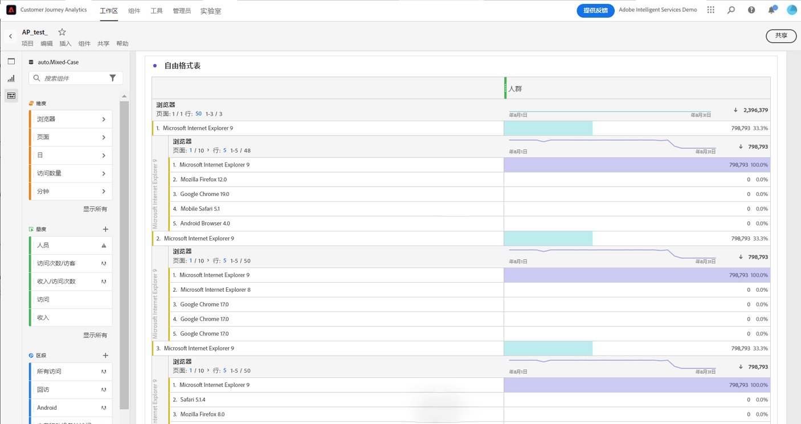
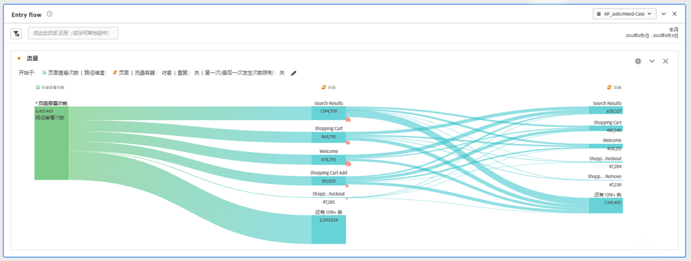
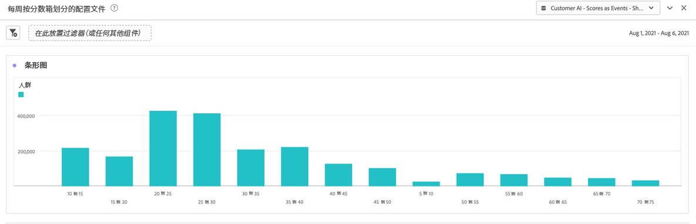
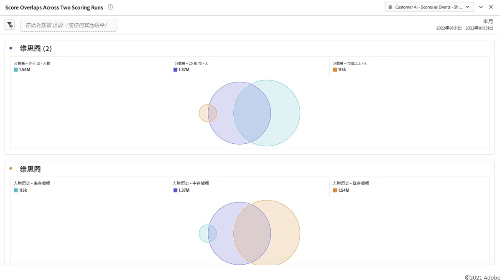

# 将 Customer AI 数据与 CJA 集成

{{release-limited-testing}}

[客户人工智能](https://experienceleague.adobe.com/docs/experience-platform/intelligent-services/customer-ai/overview.html?lang=zh-Hans)，作为 Adobe Experience Platform 智能服务的一部分，为营销人员提供了在个人层面生成客户预测的能力。

在影响因素的帮助下，客户人工智能可以告诉您客户可能会做什么以及为什么。此外，营销人员可以从客户人工智能预测和洞察中受益，通过提供最合适的优惠和消息传递来个性化客户体验。

客户人工智能依靠个人行为数据和个人资料数据进行倾向打分。客户人工智能很灵活，因为它可以接收多个数据源，包括 Adobe Analytics、Adobe Audience Manager、消费者体验事件数据和体验事件数据。如果您使用 Experience Platform 源连接器引入 Adobe Audience Manager 和 Adobe Analytics 数据，则模型会自动选取标准事件类型以对模型进行训练和评分。如果您在没有标准事件类型的情况下引入自己的体验事件数据集，并且您想在模型中使用此数据集，则需要将任何相关字段映射为自定义事件或个人资料属性。这可以在Experience Platform的Customer AI配置步骤中完成。

Customer AI可以与Customer Journey Analytics(CJA)集成，以便能够在CJA的数据视图和报表中利用支持Customer AI的数据集。 您可以:

* **跟踪一段时间内某个用户区段的倾向分数**。
   * 用例：了解特定区段中的客户进行转化的可能性。
   * 示例：一家连锁酒店的营销人员希望了解，酒店客户在酒店的音乐会场地购买展示票的可能性有多大。
* **分析哪些成功事件或属性与倾向得分相关联**.
   * 用例：了解与倾向得分关联的属性或成功事件。
   * 示例：连锁酒店的营销人员希望了解在酒店音乐会场地购买展示门票与倾向得分的关系。
* **遵循不同评分运行的客户倾向输入流**。
   * 用例：了解最初是低倾向用户的用户，并随着时间的推移，成为高倾向用户的用户。
   * 示例：连锁酒店的营销人员希望了解哪些酒店客户最初被确定为购买展示票倾向较低的客户，但随着时间的推移，这些客户成为购买展示票倾向较高的客户。
* **查看倾向分布**。
   * 用例：了解倾向得分的分布，以便在定义区段时更加精确。
   * 示例：零售商希望以每件产品50美元的优惠价格进行特定促销。 由于预算等原因，他们可能只想进行非常有限的促销。他们分析数据并决定只定位其前80%以上的客户。
* **查看一段时间内为特定同类群组完成某项操作的倾向**。
   * 用例：跟踪特定同类群组随时间的变化。
   * 示例：一家连锁酒店的营销人员希望追踪他们的铜质与银质，或银质与金质的关系。 因此，他们可以看到每个同类群体在一段时间内预订酒店的倾向。

要实际将Customer AI数据与CJA集成，请执行以下步骤：

>[!NOTE]
>
>在使用 CJA 中的输出之前，请在 Adobe Experience Platform 中执行某些步骤。

## 步骤 1：配置客户人工智能实例

准备好数据并准备好所有凭据和架构后，请按照 Adobe Experience Platform 中的[配置客户人工智能实例](https://experienceleague.adobe.com/docs/experience-platform/intelligent-services/customer-ai/user-guide/configure.html?lang=zh-Hans)指南开始。

## 第 2 步：设置与客户人工智能数据集的 CJA 连接

在 CJA 中，您现在可以 [创建一个或多个连接](/help/connections/create-connection.md) 到已针对客户人工智能进行检测的 Experience Platform 数据集。每个预测，例如“升级帐户的可能性”等同于一个数据集。这些数据集带有“EE 格式的客户人工智能分数 – name_of_application”前缀。

>[!IMPORTANT]
>
>如果打开了此开关以在步骤 1 中的配置期间启用 CJA 分数，则每个客户人工智能实例都有两个输出数据集。一个输出数据集以个人资料 XDM 格式显示，一个以体验事件 XDM 格式显示。

以下是 CJA 将作为现有或新数据集的一部分引入的 XDM 架构示例：

（请注意，该示例是一个配置文件数据集；同一组模式对象将成为 CJA 将获取的体验事件数据集的一部分。体验事件数据集将包括时间戳作为得分日期。）在此模型中得分的每个客户都会有一个分数、一个 scoreDate 等与他们相关联。

## 第 3 步：根据这些连接创建数据视图

在 CJA 中，您现在可以使用作为您建立的连接的一部分引入的维度（例如分数、分数日期、概率等）和指标继续[创建数据视图](/help/data-views/create-dataview.md)。

## 第 4 步：报告工作区中的 CAI 分数

在 CJA Workspace 中，创建一个新项目并引入可视化图表。

### 趋势倾向分数

下面是一个带有 CAI 数据的工作区项目示例，此示例在堆积条形图中显示了一段时间内用户区段的倾向分数趋势：

### 带有原因代码的表

下表显示了一个区段具有高倾向或低倾向分数的原因代码：

### 客户倾向输入流

此流图表显示不同评分运行的客户倾向输入流：

### 倾向分数分布

此条形图显示了倾向分数的分布：

### 倾向重叠

此维恩图显示不同评分运行的倾向重叠：

