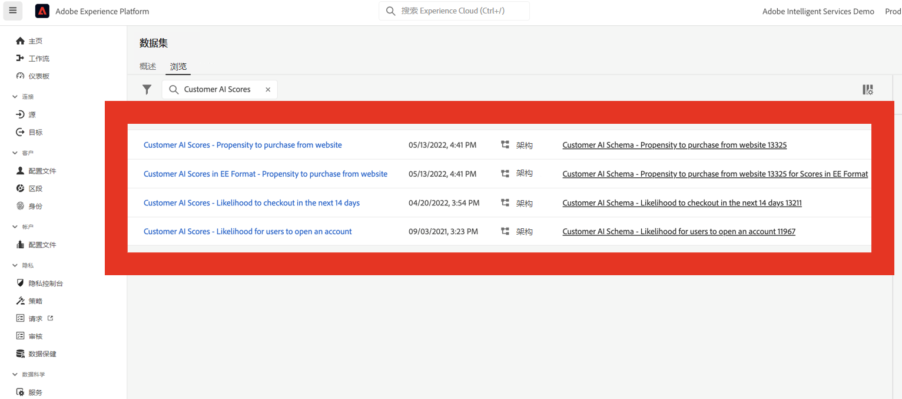
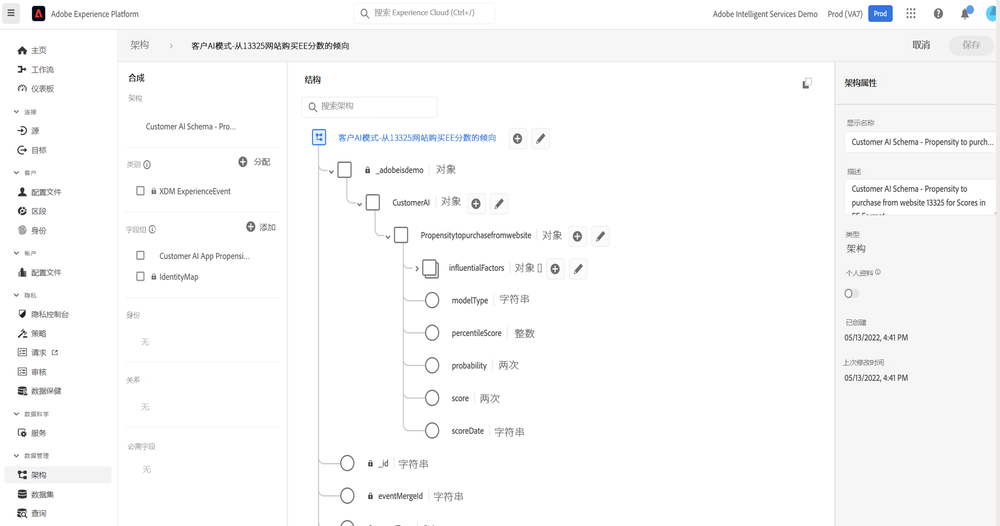

# 将客户人工智能与CJA集成

>[!NOTE]
>
>本页正在构建中。

[客户人工智能](https://experienceleague.adobe.com/docs/experience-platform/intelligent-services/customer-ai/overview.html?lang=en)，作为Adobe Experience Platform Intelligent Services的一部分，为营销人员提供了在个人级别生成客户预测的功能。

借助影响因素的帮助， Customer AI可以告诉您客户可能执行的操作以及原因。 此外，营销人员还可以从Customer AI预测和分析中受益，通过提供最合适的选件和消息传送来个性化客户体验。

Customer AI通过分析以下数据集之一来预测客户流失率或转化倾向得分：

* Adobe Analytics数据（使用Analytics源连接器）
* Adobe Audience ManagerAudience Manager源连接器
* 体验事件(EE)数据集
* 消费者体验事件(CEE)数据集

Customer AI与Customer Journey Analytics(CJA)集成，以便能够在CJA的数据视图和报表中利用支持Customer AI的数据集。

## 工作流程

在CJA中处理输出之前，某些步骤在Adobe Experience Platform中执行。

### 步骤1:下载Customer AI分数

下载Customer AI分数是通过组合Experience PlatformAPI调用来完成的，如所述 [此处](https://experienceleague.adobe.com/docs/experience-platform/intelligent-services/customer-ai/getting-started.html?lang=en#downloading-customer-ai-scores).

### 步骤2:定义Customer AI输入和输出

此过程在 [客户人工智能中的输入与输出](https://experienceleague.adobe.com/docs/experience-platform/intelligent-services/customer-ai/input-output.html?lang=en) 文档。

### 步骤3:配置Customer AI实例

准备数据并部署所有凭据和模式后，请首先按照 [配置Customer AI实例](https://experienceleague.adobe.com/docs/experience-platform/intelligent-services/customer-ai/user-guide/configure.html?lang=en) 的双曲余切值。

### 步骤4:设置与Customer AI数据集的CJA连接

在CJA中，您现在可以 [创建一个或多个连接](/help/connections/create-connection.md) Experience Platform为Customer AI分析的数据集。 这些数据集将显示前缀为“Customer AI得分”，如下所示：

每个预测（如“升级帐户的可能性”）等于一个数据集。

以下是CJA将作为现有或新数据集的一部分引入的XDM架构示例：

(请注意，此示例是用户档案数据集；同一组架构对象将包含在CJA将获取的体验事件数据集中。 “体验事件”数据集将包含时间戳作为得分日期。) 在此模型中得分的每位客户都将具有得分、scoreDate等。 关联。

### 步骤5:根据这些连接创建数据视图

在CJA中，您现在可以继续创建数据视图，其中包含作为已建立连接的一部分引入的维度。