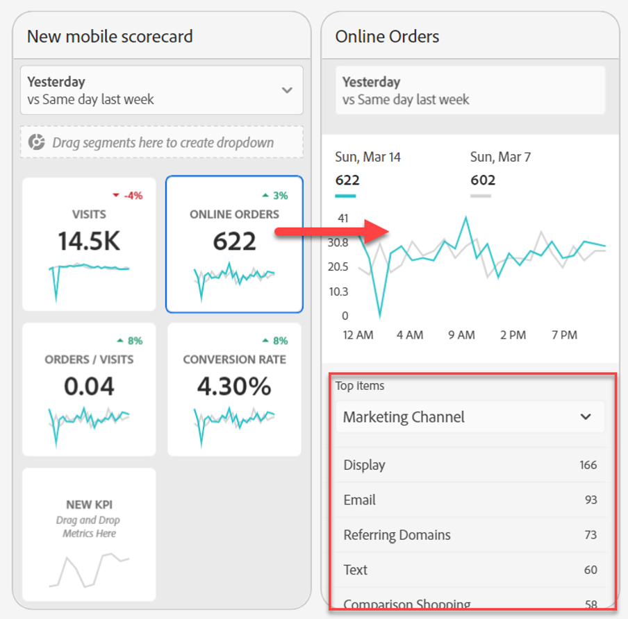
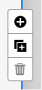
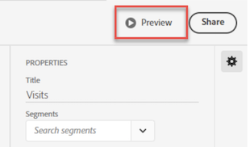

# 管理记分卡

本主题将指导Customer Journey Analytics数据的策划人如何查看和管理记分卡元素。

## 查看和配置图块属性 {#tiles}

在记分卡生成器中单击某个图块时，右侧边栏会显示与该图块及其详细信息幻灯片关联的属性和特征。 在此边栏中，可为该图块提供新的&#x200B;**标题**&#x200B;或通过应用过滤器而配置该图块。区段是Customer Journey Analytics中的过滤器。

## 查看详细信息幻灯片 {#view-detail-slides}

在单击某个图块时，将有一个动态弹出窗口显示如何在应用程序中为执行用户显示详细信息幻灯片。可添加维度以根据特定需求细分数据。如果尚未应用某个维度，则细分维度将为&#x200B;**小时**&#x200B;或&#x200B;**天**，具体取决于默认日期范围。

细分通过按维度项（如以下各项）细分各个指标而细化您的分析结果：

* 按广告平台 (AMO ID) 细分独特访客指标
* 按产品类别（零售）细分访问
* 按产品名称细分总收入

添加到图块的每个维度将显示在应用程序详细视图的下拉列表中。然后，执行用户可从该下拉列表中列出的各个选项中进行选择。

## 自定义详细信息幻灯片 {#customize-detail-slide}

通过自定义详细信息幻灯片，与受众共享的信息可更有针对性。

>[!BEGINSHADEBOX]

观看演示视频的 [自定义详细信息视图](https://video.tv.adobe.com/v/3410002?quality=12&learn=on){target="_blank"}。

>[!ENDSHADEBOX]

可修改每个详细信息幻灯片的布局，并添加文本以更好地解释最终用户可能在数据中看到的内容。还可使用下拉菜单更改图表类型。

### 更改幻灯片布局

更改幻灯片布局可强调最重要的信息。例如，可更改布局以仅显示图表或仅显示表格。要更改幻灯片布局，请选择预先设计的格式之一。

还可通过将可视化组件从左侧边栏拖放到画布上而更改幻灯片布局。每个详细信息幻灯片一次只能容纳两个可视化。

### 将描述性文本添加到幻灯片

可添加文本以提供关于图表中包含的内容的有意义信息或关于数据的细微差别。

要将文本添加到详细信息幻灯片，请选择显示 `T` 符号的布局，或将“文本”可视化组件从左侧边栏拖放过来。在添加新的文本可视化或选择带有文本的幻灯片布局时，将自动打开文本编辑器。文本编辑器提供用于设置文本格式的所有标准选项。可应用段落、标题和副标题等文本样式，并可应用粗体和斜体字体。可两端对齐文本、添加带项目符号和编号的列表以及添加链接。编辑完毕后，选择文本编辑器右上角的最小化按钮以关闭它。要编辑已添加的文本，请选择铅笔图标以再次打开文本编辑器。

## 删除组件 {#remove}

同样，要删除应用于整个记分卡的组件，请单击记分卡上图块外的任意位置，然后单击将鼠标悬停在该组件上时显示的&#x200B;**x**&#x200B;来删除组件，如下面的&#x200B;**首次访问**&#x200B;所示：

## 创建数据故事 {#create-data-story}

数据故事是围绕中心主题或量度构建的辅助数据点、业务背景和相关量度的集合。

例如，如果您专注于Web流量，则最重要的量度可能是访问次数，但您也可能对新用户、独特人员感兴趣，并且您可能希望查看按网页或流量来自哪个设备类型细分的数据。 通过移动记分卡项目中的数据故事，可重点介绍对您最重要的量度，同时用多张详细信息幻灯片讲述这些量度背后的整个故事。

观看视频以详细了解如何在 Analysis Workspace 中的移动记分卡项目中创建数据故事。

>[!BEGINSHADEBOX]

观看演示视频的 [移动记分卡项目的数据故事](https://video.tv.adobe.com/v/3416392/?quality=12&learn=on){target="_blank"}。

>[!ENDSHADEBOX]

**创建数据故事** {#data-story-create}

通过将多张详细信息幻灯片添加到磁贴而构建您的数据故事。

1. 从移动记分卡项目开始。
1. 选择要从其创建故事的磁贴。
   
   {width=".50%"}
1. 添加幻灯片以构建您的数据故事。默认生成您的第一张幻灯片。要添加新幻灯片，请将光标悬停在幻灯片上或单击幻灯片，然后选择可用的选项：
   * 点按 + 号以创建新幻灯片。
   * 点按复制图标以复制现有幻灯片。
1. 如果创建空白的幻灯片，请从左边栏拖放组件，或选择一种版面以自动为该幻灯片填入磁贴中的数据。
   
要删除幻灯片，请点按垃圾桶图标。

### 自定义数据故事 {#customize-data-story}

通过数据故事，可自定义一切，以使您可共享要共享的信息并排除多余的一切。可自定义磁贴和个别幻灯片以添加过滤器、显示细分、更改版面和更改可视化。

**自定义磁贴**

1. 点按磁贴。所选磁贴加入蓝色轮廓，并且右侧面板显示该磁贴属性。
1. 更改标题、图表类型和其他磁贴选项。
1. 将组件拖动到磁贴上。
   
在将可视化等组件拖放到磁贴上时，该组件将应用于所有数据故事幻灯片。
1. 要仅对标题应用更改，请按住 Shift 键以应用更改。
   

>[!NOTE]
>幻灯片从图块继承组件，但图块不从幻灯片继承组件。

**自定义个别幻灯片**

可更改数据故事中个别幻灯片的可视化。例如，可将特定幻灯片的水平条变为环形图。还可以更改版面。参阅[自定义详细信息幻灯片](#customize-detail-slide)。

### 预览数据故事 {#preview-data-story}

创建数据故事后，使用&#x200B;**预览**&#x200B;按钮可像应用程序用户那样查看数据故事并与之交互。有关预览数据故事的信息，请参阅[预览记分卡](#preview)

### 在磁贴和幻灯片之间导航 {#navigate-tiles-slides}

导航栏显示代表每张幻灯片上的内容的图标。如果您有大量幻灯片，可使用导航栏轻松导航到特定幻灯片。

要在磁贴和幻灯片之间移动，请点按导航栏。
{width="45%"}

还可使用箭头键或选择组件并按住它移向屏幕左侧或右侧进行滚动以来回导航。

## 预览记分卡 {#preview}

您可以预览记分卡在Adobe Analytics功能板应用程序中发布后的外观和功能。

1. 在屏幕的右上角单击&#x200B;**[!UICONTROL 预览]**。

   

1. 要查看记分卡在不同设备上的外观，请从[!UICONTROL 设备预览]下拉菜单中选择一个设备。

   

1. 要与预览交互，您可以：

   * 单击左键以模拟在手机屏幕上点击。

   * 使用计算机的滚动功能模拟用手指滚动手机屏幕。

   * 单击并按住以模拟在手机屏幕上按住手指。此操作对于与详细视图中的可视化效果交互很有用。

## 共享记分卡 {#share}

要与执行用户共享记分卡，请执行以下操作：

1. 单击&#x200B;**[!UICONTROL 共享]**&#x200B;菜单，然后选择&#x200B;**[!UICONTROL 共享记分卡]**。

1. 在&#x200B;**[!UICONTROL 共享移动记分卡]**&#x200B;表单中，通过以下方式填写字段：

   * 提供记分卡的名称
   * 提供记分卡的说明
   * 添加相关标记
   * 指定记分卡的收件人

1. 单击&#x200B;**[!UICONTROL 共享]**。

共享记分卡后，收件人可在其 Analytics 功能板中访问该记分卡。如果您在记分卡生成器中对记分卡进行后续更改，则已共享的记分卡会自动更新以反映这些更改。 然后，执行用户在其应用程序中刷新记分卡后，便可看到这些更改。

如果通过添加新组件来更新记分卡，则您可能需要再次共享记分卡（并选中&#x200B;**[!UICONTROL 共享嵌入的组件]**&#x200B;选项），以确保执行用户有权访问这些更改。

### 使用可共享链接共享记分卡

使用可共享链接，可以轻松地在电子邮件、文档或短信应用程序中共享记分卡。 通过可共享链接，收件人可在桌面上或功能板移动应用程序中打开记分卡。 可共享的深层链接可让您更轻松地共享项目并促进与利益相关者的互动。

使用可共享链接共享记分卡

1. 单击&#x200B;**[!UICONTROL 共享]**&#x200B;菜单，然后选择&#x200B;**[!UICONTROL 共享记分卡]**。

   

1. 复制链接并将其粘贴到电子邮件、文档或即时消息应用程序中。

   当收件人使用桌面应用程序或浏览器打开该链接时，将在Workspace中打开移动记分卡项目。

   当收件人在移动设备上打开链接时，记分卡将直接在Adobe Analytics功能板应用程序中打开。

   如果收件人尚未下载移动设备应用程序，则会被定向到App Store或Google Play应用商店中的应用程序列表，以便他们下载。

## 删除[!UICONTROL 未指定]维度项 {#remove-dims}

如果要从数据中删除[!UICONTROL 未指定]维度项，请执行以下操作：

1. 选择正确的图块。
1. 在右边栏中的&#x200B;**[!UICONTROL 深入分析]**&#x200B;下，选择要删除其&#x200B;**[!UICONTROL 未指定]**&#x200B;项的维度项旁边的右箭头。

   

1. 单击&#x200B;**[!UICONTROL 未指定]**&#x200B;旁边的图标以从报告中删除未指定数据。（您也可以删除任何其他维度项。）

## 在记分卡中查看智能字幕 {#captions}

智能字幕可以帮助非分析师在没有分析师帮助的情况下更好地理解他们的数据。 智能字幕使用高级机器学习和创作AI为可视化图表提供有价值的自然语言见解。

这些字幕挑选出数据中的关键统计见解，并以自然语言短语，从而帮助非分析师培养他们的数据素养。

智能题注可用于移动设备应用程序中的所有可视化图表，包括折线图、圆环图、条形图和概要数字。

要在移动记分卡中查看智能字幕，请执行以下操作：

1. 在记分卡中，单击进入图块。 例如，在此记分卡中，单击进入底部的线形图。

   

1. 点按右上方的蓝色图标以生成字幕。 字幕将显示在折线图的下方。

   

1. 向右轻扫以查看所有智能字幕。

   智能字幕可以指向数据激增、异常、趋势、下降、关联和其他现象。

1. 点按描述内的黑色标记可报告问题，如有害或非法内容。

   

1. 单击X退出&#x200B;**[!UICONTROL 报告结果]**&#x200B;对话框。
