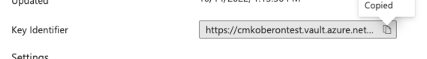

# 客户管理的密钥

Customer Journey Analytics (CJA) 为 [Healthcare Shield](https://www.adobe.com/cn/trust/compliance/hipaa-ready.html) 和 Privacy &amp; Security Shield 客户提供了一个选项，以使用要应用于 CJA 数据的 Azure 客户管理的密钥 (CMK)。请注意，此过程与 [Adobe Experience Platform CMK 设置](https://experienceleague.adobe.com/docs/experience-platform/landing/governance-privacy-security/customer-managed-keys.html)不同。

>[!NOTE]
>
>客户管理的密钥目前仅适用于已购买 [Healthcare Shield 或 Privacy &amp; Security Shield](https://experienceleague.adobe.com/docs/blueprints-learn/architecture/vertical-blueprints/healthcare-vertical.html?lang=zh-Hans%3Flang%3Den) 附加产品的组织。

## 为 CJA 设置 CMK

按照以下步骤为 CJA 设置 CMK：

1. 与您的 Adobe 客户团队核实，确保您有权使用 Adobe CJA CMK。
1. 确保您在 Azure 中是具有特权角色的管理员，例如应用程序管理员、云应用程序管理员或全局管理员。[从 Microsoft 了解详情](https://learn.microsoft.com/zh-cn/azure/active-directory/roles/permissions-reference)
1. 创建一个新的仅用于 CJA 的 Azure 密钥库。[从 Microsoft 了解详情](https://learn.microsoft.com/zh-cn/azure/key-vault/general/)
1. 授予 Adobe Azure 应用程序访问您在密钥库中的密钥的权限。这是 Adobe 应用程序 ID：251e3919-1940-4296-bb8b-6b9a5e8a4805。[从 Microsoft 了解详情](https://learn.microsoft.com/zh-cn/azure/storage/common/customer-managed-keys-configure-cross-tenant-existing-account?toc=%2Fazure%2Fstorage%2Fblobs%2Ftoc.json&amp;tabs=powershell-preview%2Cazure-portal#the-customer-grants-the-service-providers-app-access-to-the-key-in-the-key-vault)
1. 创建一个请求 CMK 设置的 Adobe 客户关怀票证。在您的票证中包含 Azure URI。可在 Azure Key 的&#x200B;**密钥标识符**&#x200B;字段中找到 URI。

   

1. Adobe 客户关怀部门将确认已在您的 CJA 数据中应用 CMK。

无论是否应用了 CMK，Platform 使用的所有数据在传输和静止时都经过加密，以确保您的数据安全。有关 Adobe Experience Platform 加密的信息，[了解详情](https://experienceleague.adobe.com/docs/experience-platform/landing/governance-privacy-security/encryption.html?lang=zh-Hans)。
