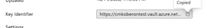

# 客户管理的密钥

Adobe Customer Journey Analytics 为 [Healthcare Shield](https://www.adobe.com/cn/trust/compliance/hipaa-ready.html) 和 Privacy &amp; Security Shield 客户提供了使用客户管理的密钥 (CMK) 来存储 Customer Journey Analytics 数据的选项。 请注意，此过程与 [Adobe Experience Platform CMK 设置](https://experienceleague.adobe.com/zh-hans/docs/experience-platform/landing/governance-privacy-security/customer-managed-keys/overview)不同。 客户管理的密钥仅适用于已购买 [Healthcare Shield 或 Privacy &amp; Security Shield](https://experienceleague.adobe.com/zh-hans/docs/events/customer-data-management-voices-recordings/governance/healthcare-shield) 附加产品的组织。

## 为 Azure 上的 Customer Journey Analytics 设置客户管理的密钥

按照以下步骤为 Azure 上运行的 Customer Journey Analytics 设置 CMK：

1. 请确保您有权使用 Adobe Customer Journey Analytics CMK，并且您的组织使用的是在 Azure 上运行的 Adobe Experience Platform。 您可以通过联系 Adobe 帐户团队来检查是否具备这些权限。
1. 确保您在 Azure 中是具有特权角色的管理员，例如应用程序管理员、云应用程序管理员或全局管理员。 有关更多信息，请参阅 [Microsoft Entra 内置角色](https://learn.microsoft.com/en-us/entra/identity/role-based-access-control/permissions-reference)。
1. 创建一个新的仅用于 Customer Journey Analytics 的 Azure 密钥库。 有关更多信息，请参阅 [Microsoft Azure 密钥库文档](https://learn.microsoft.com/zh-cn/azure/key-vault/general/)。
1. 授予 Adobe Azure 应用程序访问您在密钥库中的密钥的权限。 您可以使用以下任一方法完成此操作：
   * 通过以下URL的授权同意授予权限： [https://login.microsoftonline.com/common/oauth2/authorize?response_type=code&client_id=251e3919-1940-4296-bb8b-6b9a5e8a4805&redirect_uri=https://experience.adobe.com&scope=user.read](https://login.microsoftonline.com/common/oauth2/authorize?response_type=code&client_id=251e3919-1940-4296-bb8b-6b9a5e8a4805&redirect_uri=https://experience.adobe.com&scope=user.read)

   * 按照[为现有帐户配置客户管理的密钥](https://learn.microsoft.com/zh-cn/azure/storage/common/customer-managed-keys-configure-cross-tenant-existing-account?toc=%2Fazure%2Fstorage%2Fblobs%2Ftoc.json&tabs=powershell-preview%2Cazure-portal#the-customer-grants-the-service-providers-app-access-to-the-key-in-the-key-vault)中的说明操作。 Adobe 应用程序 ID 为：

     **`251e3919-1940-4296-bb8b-6b9a5e8a4805`**

1. 创建一个请求 CMK 设置的 Adobe 客户关怀票证。 在您的票证中包含 Azure URI。 可在 Azure 密钥的&#x200B;**密钥身份标识符**&#x200B;字段中找到 URI：

    的 URI 的密钥身份标识符字段

1. Adobe 客户关怀部门确认您已完成对 Customer Journey Analytics 数据应用 CMK。

无论是否应用了客户管理的密钥，Platform 使用的所有数据在传输和静止时都经过加密，以确保您的数据安全。 有关 Adobe Experience Platform 加密的信息，请参阅 [Adobe Experience Platform 中的数据加密](https://experienceleague.adobe.com/zh-hans/docs/experience-platform/landing/governance-privacy-security/encryption)。

## 为 Amazon Web Services 上的 Customer Journey Analytics 设置客户管理的密钥

>[!AVAILABILITY]
>
>本节适用于在 Amazon Web Services (AWS) 上运行的 Experience Platform 的实施。 目前，在 AWS 上运行的 Experience Platform 仅向有限数量的客户开放。 要了解有关受支持的 Experience Platform 基础架构的更多信息，请参阅 [Experience Platform 多云概述](https://experienceleague.adobe.com/zh-hans/docs/experience-platform/landing/multi-cloud)。

如果您的组织使用的是在 Amazon Web Services 上运行的 Adobe Experience Platform，则已为您配置了 CMK。 无需额外设置。
