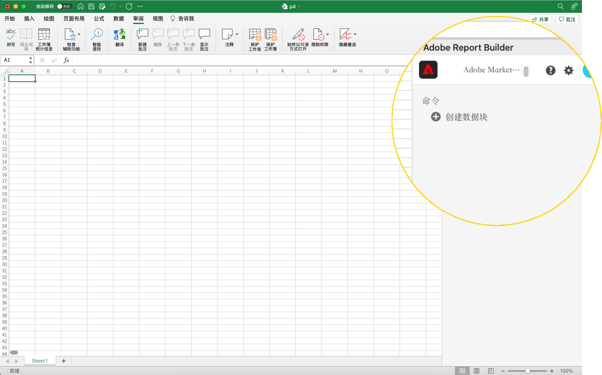
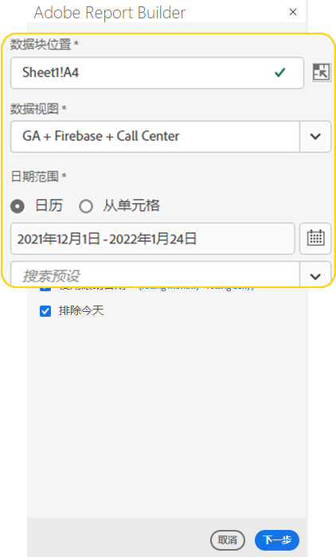
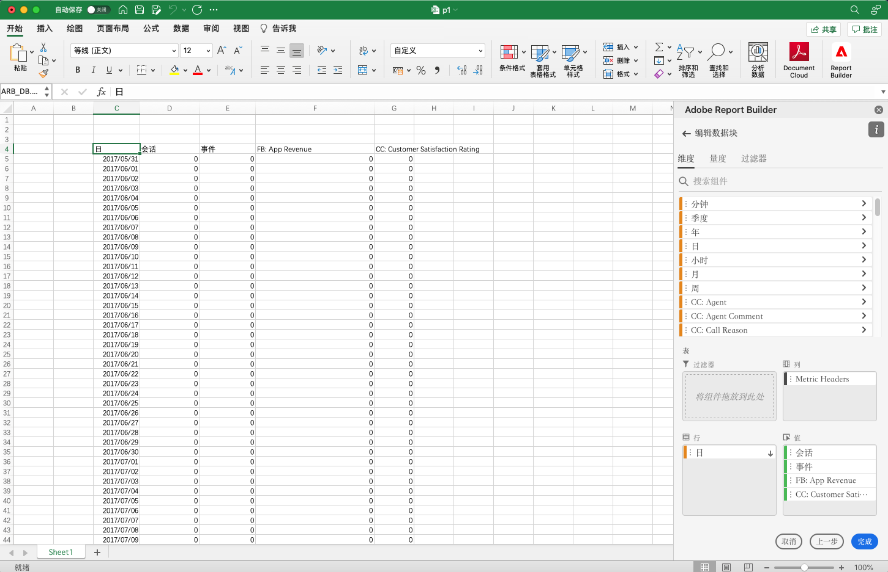
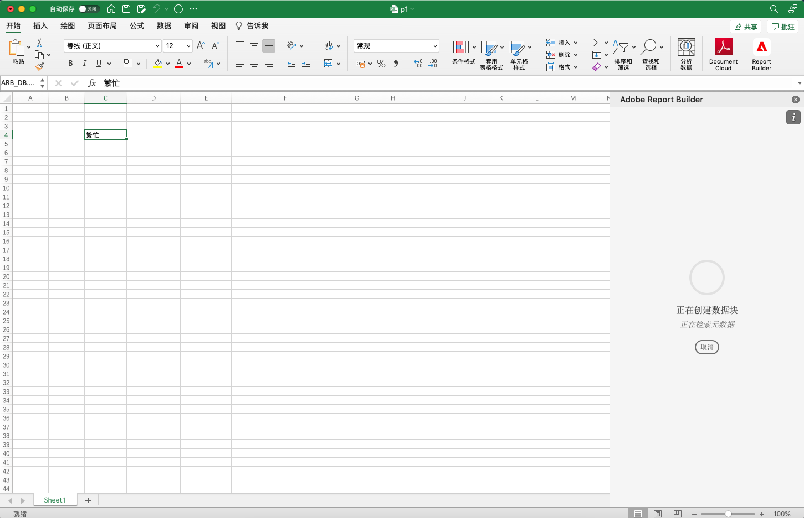
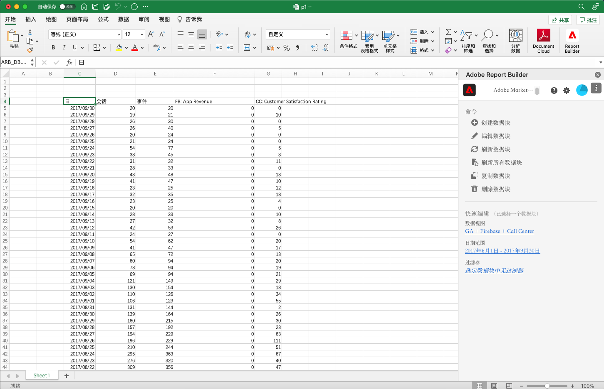

# 创建数据块

*数据块*&#x200B;是由单个数据请求创建的数据表。 Report Builder工作簿可以包含多个数据块。 创建数据块时，首先配置数据块，然后构建数据块。

## 配置数据块

为数据块位置、数据视图和日期范围配置初始数据块参数。

1. 单击&#x200B;**创建数据块**。

   

1. 设置&#x200B;**数据块位置**。

   数据块位置选项定义Report Builder将数据添加到工作表的工作表位置。

   要指定数据块位置，请在工作表中选择单个单元格，或输入单元格地址，如a3、\\\$a3、a\\\$3或sheet1!a2。 检索数据时，指定的单元格将位于数据块的左上角。

1. 选择&#x200B;**数据视图**。

   数据视图选项允许您从下拉菜单中选择数据视图，或从单元格位置引用数据视图。

1. 设置&#x200B;**日期范围**。

   日期范围选项允许您选择日期范围。 日期范围可以是固定的或滚动的。 有关数据范围选项的其他信息，请参阅&lt;&lt;链接到日期范围部分>>。

1. 单击&#x200B;**Next**。

   

   配置数据块后，您可以选择维度、量度和过滤器以构建数据块。 “Dimension”、“量度”和“过滤器”选项卡显示在“表生成器”窗格的上方。
<!--
    
  -->

## 构建数据块

要构建数据块，请选择报表组件，然后自定义布局。

1. 添加Dimension、量度和过滤器。

   滚动组件列表或使用&#x200B;**search**&#x200B;字段查找组件。 将组件拖放到表窗格，或双击列表中的组件名称，以自动将组件添加到表窗格。

   双击某个组件，将其添加到表的默认部分。

   - Dimension组件会添加到行部分或列部分（如果列中已有维度）。
   - 日期组件会添加到列部分。
   - 过滤器组件会添加到过滤器部分。

1. 在表窗格中排列项目以自定义数据块的布局。

   在“表”窗格中拖放组件以重新排序组件，或右键单击组件名称并从选项菜单中选择。

   向表中添加组件时，数据块的预览将显示在工作表中的数据块位置。 在添加、移动或删除表中的项目时，数据块预览的布局会自动更新。

   

1. 单击&#x200B;**完成**。

   在检索分析数据时，会显示处理消息。

   

   Report Builder会检索数据并在工作表中显示已完成的数据块。

   
