# 筛选维度

默认情况下，表中的每个维度项最多返回该维度的 10 项。

更改为每个维度返回的维度项数

1. 在“命令”面板中选择一个数据块并单击“编辑数据块”。

1. 单击“下一步”可显示“维度”选项卡。

1. 单击表中组件名称旁边的 **...** 图标。

   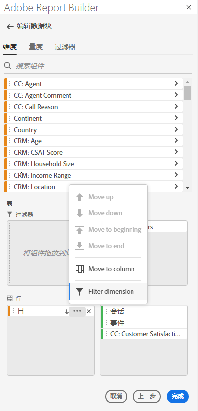

1. 在弹出菜单中选择&#x200B;**筛选维度**&#x200B;以显示&#x200B;**筛选维度**&#x200B;窗格。

1. 选择&#x200B;**最受欢迎**&#x200B;或&#x200B;**特定**。

   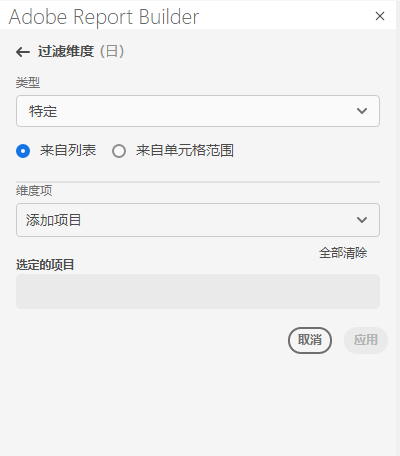

1. 根据所选筛选器类型选择相应的选项。

1. 单击&#x200B;**应用**&#x200B;以添加筛选器。

   Report Builder 显示通知以确认添加了筛选器。

要显示应用的筛选器，请将光标悬停在维度上。应用了筛选器的维度会在维度名称的右边显示一个筛选器图标。

## 筛选器类型

有两种方式来筛选维度项：最受欢迎和特定。

## 最受欢迎

通过“最受欢迎”选项，您可以根据量度值动态筛选维度项。“最受欢迎”筛选条件根据量度值返回排名最高的维度项。默认情况下列出前 10 个维度项，按照添加到数据块的第一个量度排序。

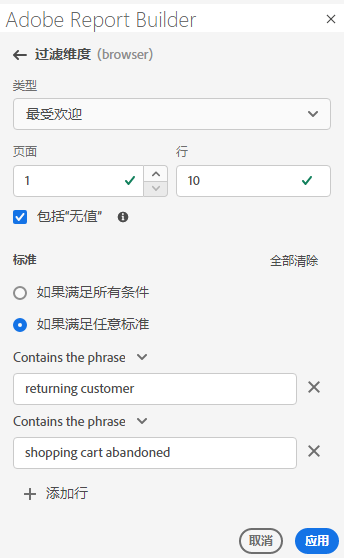

### “页面”和“行”选项

使用&#x200B;**页面**&#x200B;和&#x200B;**行**&#x200B;字段将数据划分为顺序组或页面。这样，您可以将排名的行值而不是最高的值提取到报表中。此功能在提取超过 50,000 行限制的数据时尤其有用。

#### “页面”和“行”默认值

- 页面 = 1
- 行 = 10

“页面”和“行”默认设置确定每页有 10 行数据。页面 1 返回前 10 项，页面 2 返回接下来的 10 项，以此类推。

下表列出了页面和行值的示例以及生成的输出。

| 页面 | 行 | 输出 |
|------|--------|----------------------|
| 1 | 10 | 前 10 项 |
| 2 | 10 | 项 11-20 |
| 1 | 100 | 前 100 项 |
| 2 | 100 | 项 101-200 |
| 2 | 50,000 | 项 50,001-100,000 |

#### 最小值和最大值

- 起始页面：最小值 = 1，最大值：5000 万
- 行数：最小值 = 1，最大值：50,000

### 包括“无值”

在 Customer Journey Analytics 中，一些维度收集“无值”条目。使用此筛选器，您可以从报表中排除这些值。例如，您可以创建分类，例如基于产品 SKU 键的产品名称分类。如果特定产品 SKU 没有设置其特定的产品名称分类，则其产品名称值设置为“无值”。

默认情况下选中以包括&#x200B;**无值**。取消选择此选项可排除无值的条目。

### 按条件筛选

可以根据是满足所有条件还是满足任意条件来筛选维度项。

设置筛选条件

1. 从下拉列表中选择运算符。

   

1. 在搜索字段中输入值。

1. 单击“添加”箭头以确认选区和添加另一个条件项。

1. 单击删除图标可删除条件项。

   最多可以包括 10 个条件项。

### 更改筛选器和排序顺序

量度旁边显示的箭头用于筛选和排序数据块。箭头的方向指示量度是按照从大到小还是从小到大排序。

要更改排序方向，请单击量度旁边的箭头。 

更改用于筛选和排序数据块的量度。

1. 在表生成器中，将光标悬停在所需的量度组件旁以显示其他选项。

2. 单击首选量度上的箭头。 

   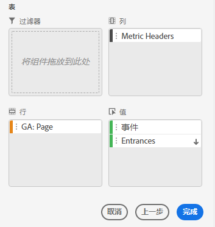

## 特定筛选

使用“特定”选项，您可以为每个维度创建固定的维度项列表。使用&#x200B;**特定**&#x200B;筛选类型指定要包括在筛选器中的确切维度项。可从列表或从单元格范围中选择项。

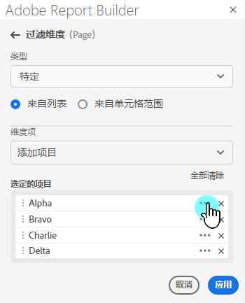

### 从列表

1. 选择&#x200B;**从列表**&#x200B;选项以搜索和选择维度项。

   选择&#x200B;**从列表**&#x200B;选项时，列表中填充维度项，具有最多事件的维度在前。

   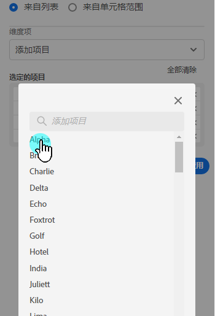

   **可用项**&#x200B;列表按照从最多事件到最少事件的顺序对维度项排序。

1. 在&#x200B;**添加项**&#x200B;字段中输入搜索词以搜索列表。

1. 要搜索未包含在过去 90 天数据中的项，请单击&#x200B;**显示过去 6 个月的项**&#x200B;以扩大搜索。

   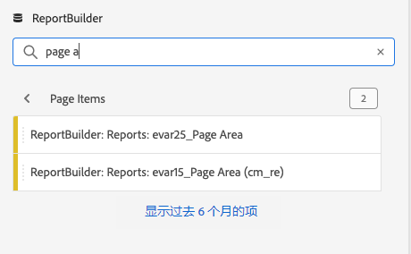

   加载了过去六个月的数据之后，Report Builder 更新链接以&#x200B;**显示过去 18 个月的项**。

1. 选择维度项。

   所选维度项自动添加到&#x200B;**选定项**&#x200B;列表中。

   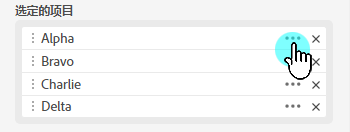

   要从列表中删除项，请单击删除图标以从列表中删除项。

   要在列表中移动项，请拖放该项或单击 ... 以显示移动菜单。

   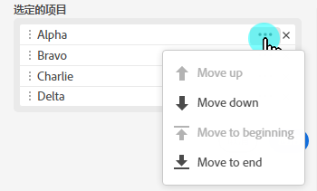

1. 单击&#x200B;**应用**。

   Report Builder 更新列表以显示所应用的特定筛选。

### 从单元格范围

选择&#x200B;**从单元格范围**&#x200B;选项可选择包含要匹配的维度项列表的单元格范围。

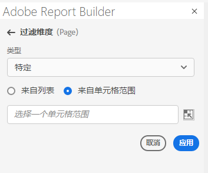

选择单元格范围时，请考虑以下限制：

- 范围必须至少有一个单元格。
- 范围不能超过 50,000 个单元格。
- 范围必须位于单个无中断的行或列中。

选区可以包含空单元格或者其值与特定维度项不匹配的单元格。

### 在表生成器的“维度”选项卡中

从&#x200B;**维度**&#x200B;选项卡，单击维度名称旁边的 V 形图标以查看维度项列表。

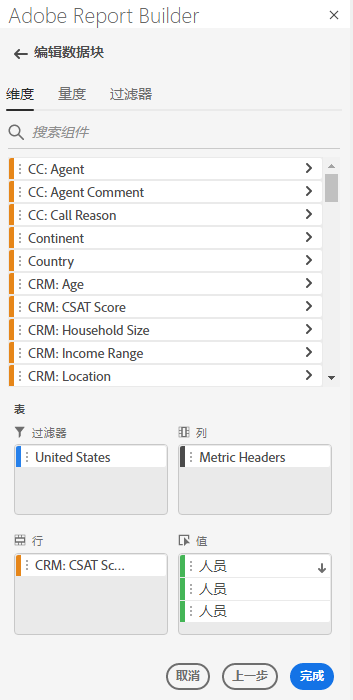

您可以将项拖放到&#x200B;**表**&#x200B;上或者双击项名称以将其添加到&#x200B;**表**&#x200B;生成器。
