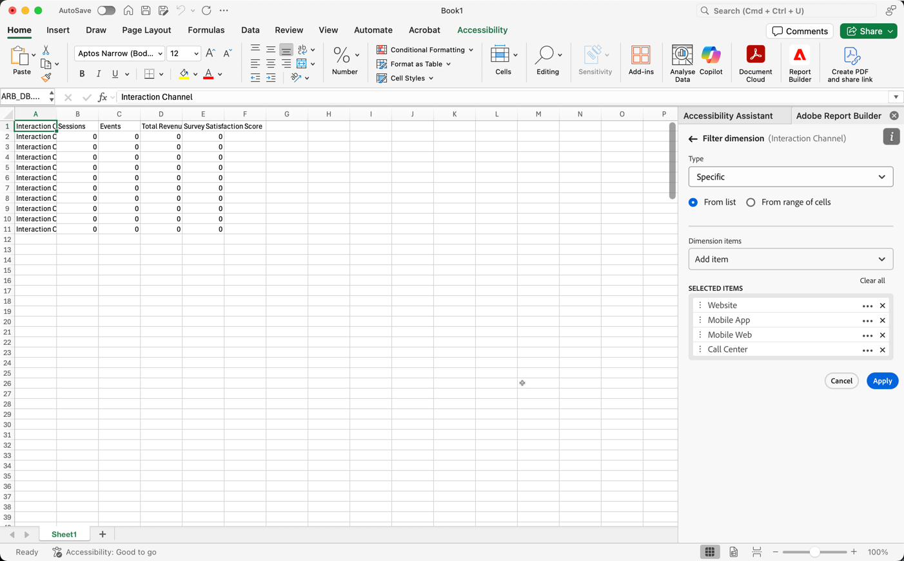

# 过滤维度

默认情况下，表中的每个维度项目都会返回该维度的前10个项目。

更改为每个维度返回的维度项目

1. 选择一个数据块，然后单击“命令”面板中的“编辑数据块”。

1. 单击下一步以显示“Dimension”选项卡。

1. 单击&#x200B;**...**&#x200B;图标。

   

1. 在弹出菜单中选择&#x200B;**过滤器维度**&#x200B;以显示&#x200B;**过滤器维度**&#x200B;窗格。

1. 选择&#x200B;**最受欢迎**&#x200B;或&#x200B;**特定**。

   

1. 根据所选的过滤器类型选择适当的选项。

1. 单击&#x200B;**Apply**&#x200B;以添加过滤器。

   Report Builder显示确认添加的过滤器的通知。

要显示已应用的过滤器，请将鼠标悬停在某个维度上。 已应用过滤器的Dimension在Dimension名称的右侧显示一个过滤器图标。

## 过滤器类型

有两种方法可过滤维度项目：最受欢迎和最具体。

## 最受欢迎

最受欢迎选项允许您根据量度值动态筛选维度项目。 最受欢迎的过滤根据量度值返回排名最高的维度项目。 默认情况下，将列出前10个维度项目，并按添加到数据块的第一个量度进行排序。

### “页面和行”选项

使用&#x200B;**Page**&#x200B;和&#x200B;**Rows**&#x200B;字段将数据划分为顺序组或页面。 这允许您将排名最前的行值以外的其他行值提取到报表中。 此功能对于提取超出50,000行限制的数据特别有用。

#### 页面和行默认值

- 页面= 1
- 行= 10

“页面”和“行”默认设置用于标识每个页面有10行数据。 第1页返回前10个项目，第2页返回后10个项目，依此类推。

下表列出了页面值和行值以及结果输出的示例。

| 页面 | Row | Output（输出） |
|------|--------|----------------------|
| 1 | 10 | 前10项 |
| 2 | 10 | 项目11-20 |
| 1 | 100 | 前100项 |
| 2 | 100 | 项目101-200 |
| 2 | 50,000 | 项目50,001-100,000 |

#### 最小值和最大值

- 起始页：最小= 1，最大：五千万
- 行数：最小= 1，最大：五万

### 包括“无值”

在Customer Journey Analytics中，某些维度会收集“无值”条目。 此过滤器允许您从报表中排除这些值。 例如，您可以根据产品SKU键值创建一个分类，如产品名称分类。 如果尚未使用其特定产品名称分类设置特定产品SKU，则其产品名称值会设置为“无值”。

默认情况下，“Include ”（**无值**）。 取消选择此选项可排除没有值的条目。

### 按条件筛选

您可以根据是否满足所有标准或是否满足任何标准来筛选维度项目。

设置筛选条件

1. 从下拉列表中选择一个运算符。

   

1. 在搜索字段中输入一个值。

1. 单击添加行以确认选择并添加其他标准项。

1. 单击删除图标可删除标准项。

   您最多可以包含10个标准项目。

### 更改过滤器和排序顺序

用于过滤和排序数据块的量度旁边会显示一个箭头。 箭头的方向指示量度是按最大到最小还是最小到最大进行排序。

要更改排序方向，请单击量度旁边的箭头。 

要更改用于过滤和排序数据块的量度，

1. 将鼠标悬停在表生成器中所需的量度组件上，可显示其他选项。

2. 单击首选量度上的箭头。 

   

## 特定过滤

利用“特定”选项，可为每个维度创建一个固定的维度项目列表。 使用&#x200B;**Specific**&#x200B;筛选类型指定要包含在筛选器中的确切维度项目。 您可以从列表或单元格范围中选择项目。

### 从列表

1. 选择&#x200B;**从列表**&#x200B;选项以搜索和选择维度项目。

   选择&#x200B;**从列表**&#x200B;选项时，将首先填充事件最多的维度项目。

   

   **可用项目**&#x200B;列表从事件最多的维度项目到事件最少的维度项目进行排序。

1. 在&#x200B;**Add item**&#x200B;字段中输入搜索词以搜索列表。

1. 要搜索最近90天数据中未包含的项目，请单击&#x200B;**显示最近6个月的项目**&#x200B;以扩展搜索。

   

   加载过去六个月的数据后，Report Builder会将链接更新为&#x200B;**显示过去18个月的项目**。

1. 选择维度项目。

   选定的维度项目会自动添加到&#x200B;**选定项目**&#x200B;列表。

   

   要从列表中删除某个项目，请单击删除图标以从列表中删除该项目。

   要在列表中移动项目，请拖放项目或单击……以显示移动菜单。

   

1. 单击&#x200B;**Apply**

   Report Builder会更新列表以显示您应用的特定过滤。

### 从单元格范围

选择&#x200B;**从单元格范围**&#x200B;选项，以选择包含要匹配的维度项目列表的单元格范围。

选择单元格范围时，请考虑以下限制：

- 范围必须至少具有一个单元格。
- 范围不能超过50,000个细胞。
- 范围必须位于单个无中断行或列中。

您的选择可以包含空单元格或单元格，其值与特定维度项目不匹配。

### 从表生成器的“Dimension”选项卡中

在&#x200B;**Dimension**&#x200B;选项卡中，单击维度名称旁边的V形图标以查看维度项目列表。

可以将项目拖放到&#x200B;**Table**&#x200B;上，或双击某个项目名称以将其添加到&#x200B;**Table**&#x200B;生成器中。
