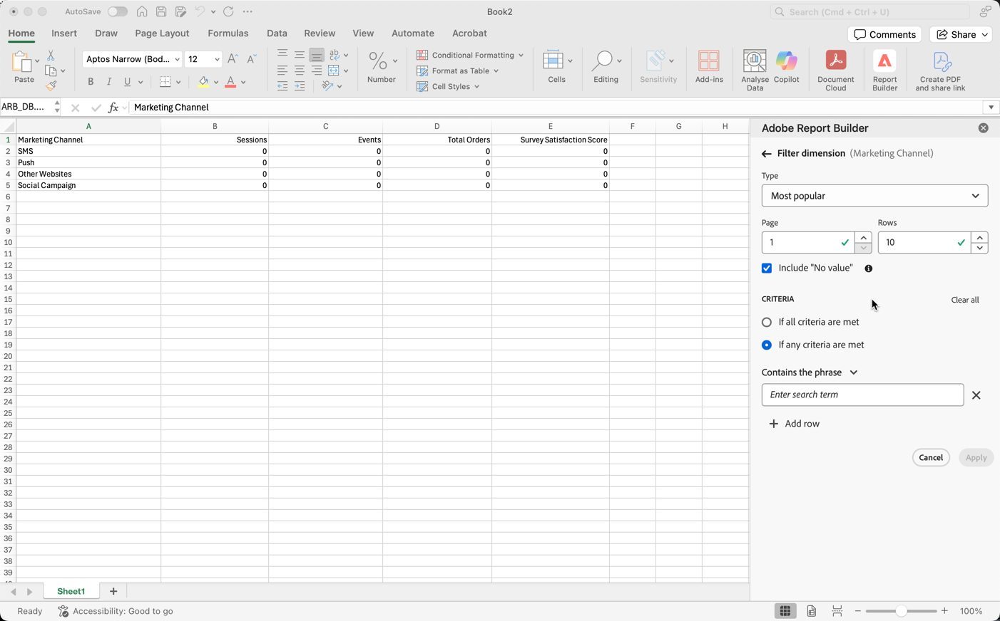
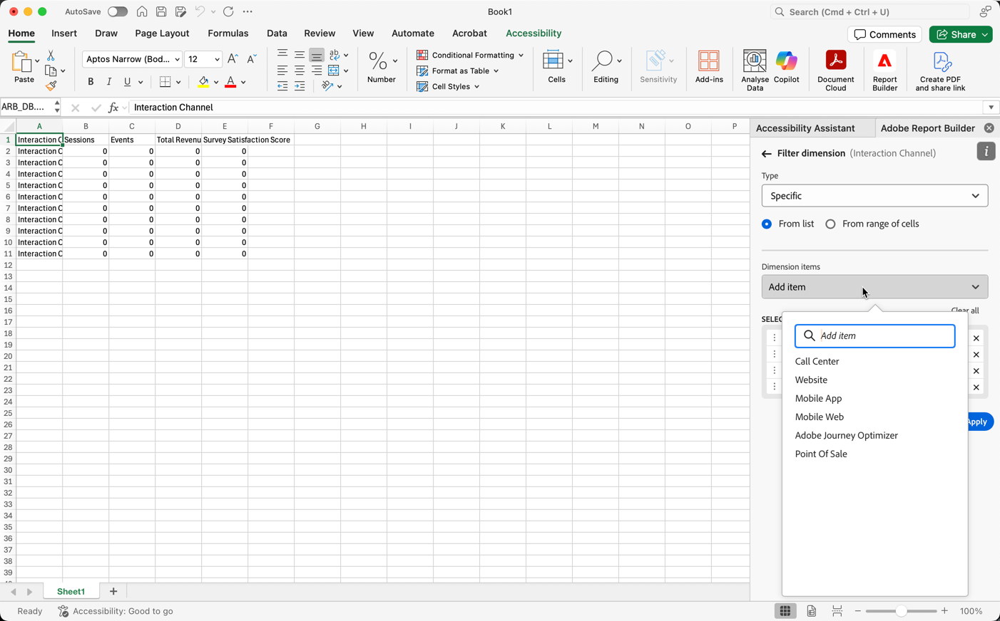

# 过滤器维度

默认情况下，表中的每个维度项最多返回该维度的 10 项。

要更改为每个维度返回的维度项，请执行以下操作：

1. 在数据块中选择单元格。

1. 在面板中选择&#x200B;**[!UICONTROL 编辑]** **[!UICONTROL 编辑数据块]**。

1. 选择&#x200B;**[!UICONTROL 下一步]**&#x200B;以显示&#x200B;**[!UICONTROL 维度]**&#x200B;选项卡。

1. 选择表中组件名称旁边的。

   {zoomable="yes"}

1. 在弹出菜单中选择&#x200B;**[!UICONTROL 筛选器维度]**&#x200B;以显示&#x200B;**[!UICONTROL 筛选器维度]**&#x200B;窗格。

1. 选择&#x200B;**最受欢迎**&#x200B;或&#x200B;**特定**&#x200B;作为&#x200B;**[!UICONTROL 类型]**。

   {zoomable="yes"}

1. 根据所选的[筛选器类型](#filter-type)选择相应的选项。

1. 选择&#x200B;**[!UICONTROL 应用]**&#x200B;以添加筛选器。

1. Report Builder 显示通知以确认添加了过滤器。

要显示应用的过滤器，请将光标悬停在维度上。应用了筛选器的维度在维度名称旁显示筛选器图标。

## 更改过滤器和排序顺序

用于筛选和排序数据块的量度旁边出现或。 箭头的方向指示量度是按升序还是降序排序。

要更改排序顺序，请执行以下操作：

- 选择指标旁边的或以切换排序顺序。

要更改用于筛选和排序数据块的量度，请执行以下操作：

1. 在表生成器中，将光标悬停在所需的量度组件旁以显示其他选项。

2. 选择作为首选量度。

   {zoomable="yes"}

## 过滤器类型

有两种筛选维度项的方法：[最受欢迎](#most-popular)和[特定](#specific-filtering)

### **[!UICONTROL 最受欢迎]**

**[!UICONTROL 最受欢迎]**&#x200B;选项允许您根据量度值动态筛选维度项。 “最受欢迎”量度根据量度值返回排名最高的维度项目。 默认情况下列出前 10 个维度项，按照添加到数据块的第一个量度排序。

{zoomable="yes"}

#### “页面”和“行”选项

使用&#x200B;**[!UICONTROL 页面]**&#x200B;和&#x200B;**[!UICONTROL 行]**&#x200B;字段将数据划分为顺序组或页面。通过此功能，您可以将排名的行值而不是最高的值提取到报表中。 并且对于提取超过50,000行限制的数据特别有用。

页面的默认值为`1`，行的默认值为`10`。 这些默认值表示每页有10行数据。 页面 1 返回前 10 项，页面 2 返回接下来的 10 项，以此类推。

下表列出了页面和行值的示例以及生成的输出。

| 页面 | 行 | 输出 |
|------|--------|----------------------|
| 1 | 10 | 前 10 项 |
| 2 | 10 | 项 11-20 |
| 1 | 100 | 前 100 项 |
| 2 | 100 | 项 101-200 |
| 2 | 50,000 | 项 50,001-100,000 |

下表列出了页面和行的最小值和最大值。

|       | 最小值 | 最大值 |
|-------|---------------:|---------------:|
| 起始页 | 1 | 5000万 |
| 行数 | 1 | 50,000 |

#### 包括“无值”

在Customer Journey Analytics中，某些维度收集&#x200B;*没有值*&#x200B;条目。 **[!UICONTROL 包括“无值”]**&#x200B;设置允许您从报表中排除这些值。 例如，您可以创建分类，例如基于产品 SKU 键的产品名称分类。如果特定产品SKU未设置其特定产品名称分类，则其产品名称值设置为&#x200B;*无值*。

默认情况下选中&#x200B;**[!UICONTROL 包括“无值”]**。 取消选择此选项可排除无值的条目。

#### 按条件筛选

可以根据是满足所有条件还是满足任意条件来筛选维度项。

要设置筛选条件，请执行以下操作：

1. 从运算符下拉菜单中选择运算符。 默认情况下，已选择&#x200B;**[!UICONTROL 包含短语]**

   {zoomable="yes"}

1. 输入搜索词。

1. 选择 **[!UICONTROL 添加行]**&#x200B;以确认选择并添加另一个条件项。

1. 选择以删除条件项。

最多可以包括 10 个条件项。

### **[!UICONTROL 特定]**

**[!UICONTROL 特定]**&#x200B;选项允许您为每个维度创建固定的维度项列表。 使用&#x200B;**[!UICONTROL 特定]**&#x200B;筛选类型指定要包括在过滤器中的确切维度项。可从列表或从单元格范围中选择项。

{zoomable="yes"}

#### 从列表

1. 选择&#x200B;**[!UICONTROL 从列表]**&#x200B;选项以搜索和选择维度项。

   选择&#x200B;**从列表**&#x200B;选项时，**[!UICONTROL Dimension项]**&#x200B;列表中填充了按事件数排序的维度项。

   {zoomable="yes"}

1. 在 **[!UICONTROL _添加项_]**&#x200B;中输入搜索词以搜索列表。

1. 要搜索未包含在过去90天数据中的项，请选择&#x200B;**[!UICONTROL 显示过去6个月的项]**&#x200B;以扩展搜索。 加载了过去6个月的数据后，Report Builder将链接更新为&#x200B;**[!UICONTROL 显示过去18个月的项]**。

1. 若要从&#x200B;**[!UICONTROL 选定项]**&#x200B;列表中删除项，请选择。

1. 要移动&#x200B;**[!UICONTROL 选定项]**&#x200B;列表中的项，请拖放该项或选择以显示上下文菜单并从移动选项中选择。

1. 选择&#x200B;**[!UICONTROL 应用]**。

Report Builder 更新列表以显示所应用的特定筛选。

#### 从单元格范围

选择&#x200B;**从单元格范围**&#x200B;选项可选择包含要匹配的维度项列表的单元格范围。

{zoomable="yes"}

选择单元格范围时，请考虑以下限制：

- 范围必须至少有一个单元格。
- 范围不能超过 50,000 个单元格。
- 范围必须位于单个无中断的行或列中。

选区可以包含空单元格或者其值与特定维度项不匹配的单元格。

### 快速筛选维度

要过滤当前未应用过滤器的维度，请执行以下操作：

1. 为维度选择。 例如，**[!UICONTROL 交互渠道]**。

1. 双击要添加到筛选器的维度项。 或者，选择一个或多个维度项，并将所选内容拖放到 **[!UICONTROL Row]**&#x200B;部分中。

   {zoomable="yes"}

