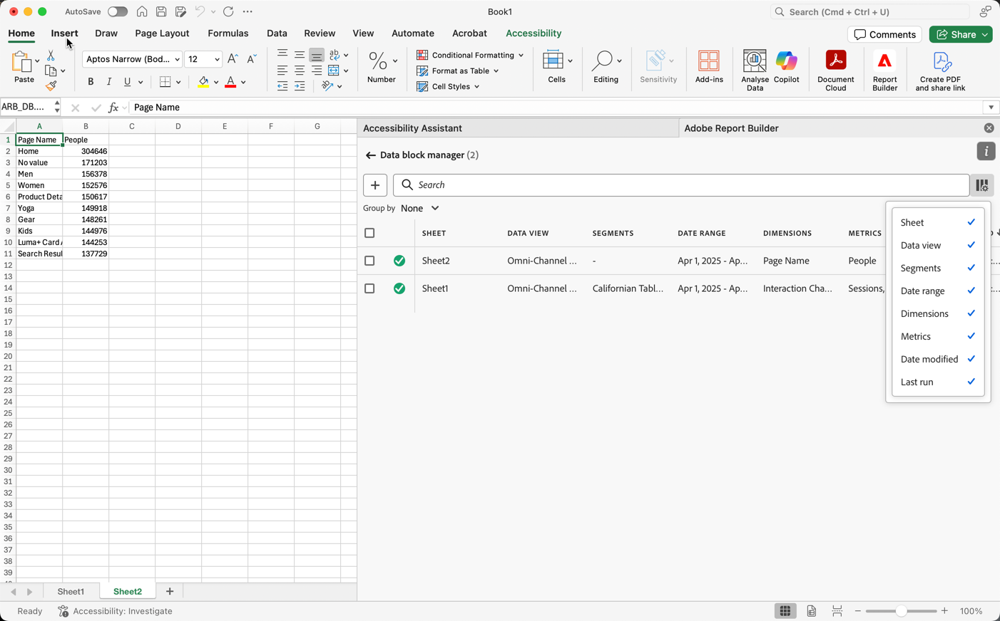
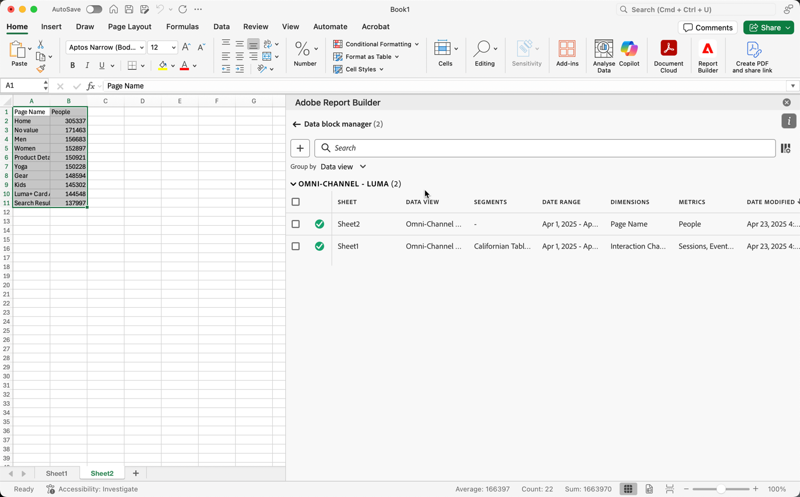

# 在 Report Builder 中管理数据块

您可以使用数据块管理器查看和管理工作簿中的所有数据块。数据块管理器提供搜索、过滤和排序功能，可让您快速定位特定数据块。选择一个或多个数据块后，可以对选中的数据块进行编辑、删除或刷新。

## 查看数据块

单击&#x200B;**管理**&#x200B;查看工作簿中所有数据块的列表。

数据块管理器列出工作簿中存在的所有数据块。 

## 对数据块列表进行排序

您可以按显示的列对数据块列表进行排序。例如，您可以按报告包、过滤器、日期范围和其他变量对数据块列表进行排序。

要对数据块列表进行排序，请单击列标题。

## 搜索数据块列表

使用搜索字段在数据块表中查找任何内容。 例如，您可以搜索数据块或报告包中包含的指标。 您还可以搜索出现在日期范围、修改日期或上次运行日期列中的日期。

## 编辑数据块

您可以编辑应用于一个或多个数据块的数据视图、日期范围或过滤器。

例如，您可以用一个或多个数据块中的新过滤器替换现有过滤器。

1. 选择要更新的数据块。您可以选中顶级复选框以选择所有数据块，也可以选择单个数据块。

   

1. 单击编辑图标以显示快速编辑窗口。

   

1. 选择过滤器链接以更新数据视图、日期范围或过滤器。

   

## 刷新数据块

单击刷新图标可刷新列表中的数据块。

要验证数据块是否已刷新，请查看刷新状态图标。绿色圆圈中的复选标记 表示数据块刷新成功。刷新失败的数据块会显示警告图标 .  这使得识别任何数据块是否有错误变得容易。

## 删除数据块

单击垃圾桶图标以删除选定的数据块。

## 分组数据块

您可以使用 **分组** 下拉菜单对数据块进行分组，也可以单击列标题。要按列对数据块进行排序，请单击列标题。要按组对数据块进行分组，请从&#x200B;**分组**&#x200B;下拉菜单中选择组名。例如，下面的屏幕截图显示了按“表”分组的数据块。它显示了按表 1 和 表 2 分组的数据块。这很有用，例如，在过滤器替换用例中。如果您对每个数据块应用了多个过滤器，则创建一个包含您要替换的所有数据块的组会很有帮助。然后，您可以轻松地一次性选择和编辑它们。

## 修改数据块管理器视图

您可以修改在“数据块管理器”窗口中可见的列。

单击列列表  图标以选择在数据块管理器中列出的列。选择一个列名以显示该列。取消选择列名称以从视图中删除该列。

