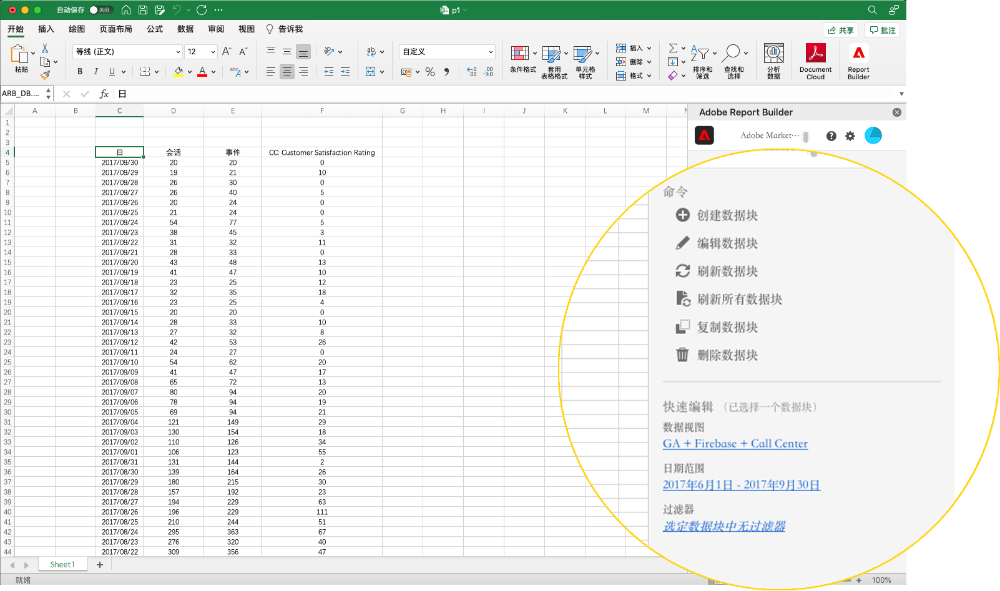

# Report Builder中心

使用Report Builder中心创建、更新或删除数据块。

Report Builder中心包含“命令”和“快速编辑”面板。



## “命令”面板

使用“命令”面板可访问与所选单元格或先前操作兼容的命令。


### 命令

| 显示的命令 | 可用时间…… | 用途 |
|------|------------------|--------|
| 创建数据块 | 工作簿中选择一个或多个单元格。 | 用于创建数据块 |
| 编辑数据块 | 所选单元格范围仅属于一个数据块。 | 用于编辑数据块 |
| 刷新数据块 | 该选择包含至少一个数据块。 该命令将仅刷新所选数据块。 | 用于刷新一个或多个数据块 |
| 刷新所有数据块 | 工作簿包含一个或多个数据块。 | 用于刷新工作簿中的所有数据块 |
| 复制数据块 | 所选单元格或单元格范围是一个或多个数据块的一部分。 | 用于复制数据块 |
| 删除数据块 | 所选单元格范围仅属于一个数据块。 | 用于删除数据块 |

## “快速编辑”面板

在电子表格中选择一个或多个数据块时，Report Builder会显示“快速编辑”面板。 您可以使用“快速编辑”面板更改单个数据块中的参数，或同时更改多个数据块中的参数。


使用“快速编辑”部分所做的更改将应用于所有选定的数据块。

### 数据视图

数据块从选定的数据视图中提取数据。 如果在工作表中选择了多个数据块，并且它们不从同一数据视图中提取数据，则&#x200B;**数据视图**&#x200B;链接会显示&#x200B;*多个*。

当您更改数据视图时，所选内容中的所有数据块都采用新的数据视图。 数据块中的组件会根据ID匹配到新的数据视图，例如匹配```evars```。 如果在数据块中找不到组件，则会显示一条警告消息，并且该组件会从数据块中删除。

要更改数据视图，请从下拉菜单中选择一个新的数据视图。


### 日期范围

**日期** 范围显示选定数据块的日期范围。如果选择了多个具有多个日期范围的数据块，则&#x200B;**日期范围**&#x200B;链接会显示&#x200B;*多个*。

### 筛选器

**Filters**&#x200B;链接显示选定数据块所使用过滤器的摘要列表。 如果选择了多个数据块并应用了多个过滤器，则&#x200B;**Filters**&#x200B;链接会显示&#x200B;*Multiple*。
