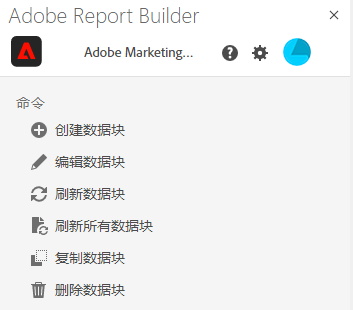
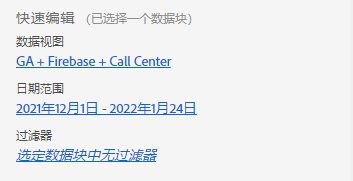
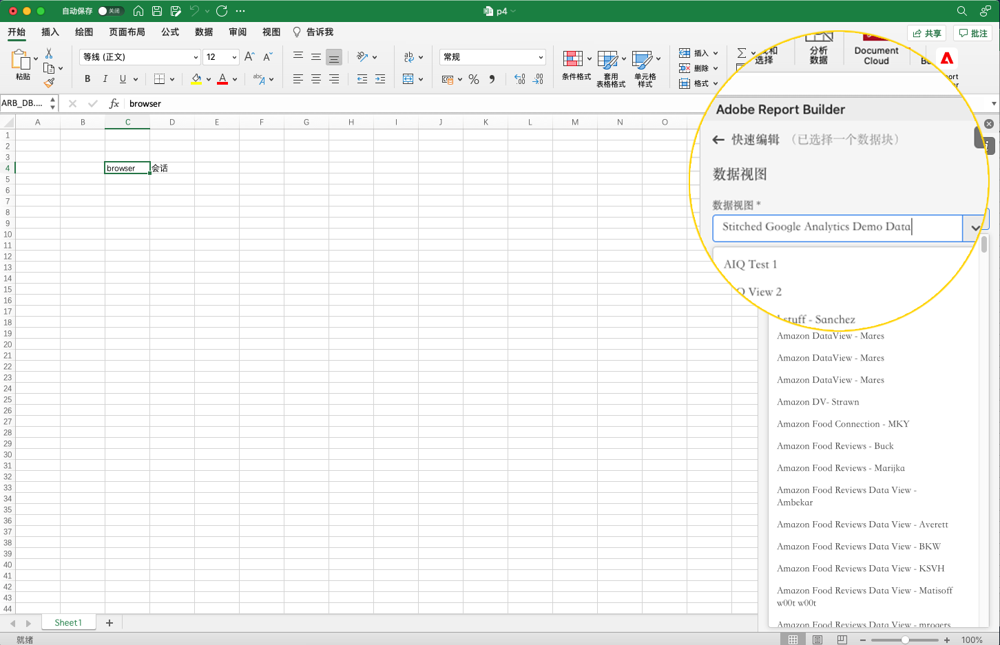

# Report Builder 中心

使用 Report Builder 中心创建、更新和管理数据块。

Report Builder 中心包含“创建和管理”按钮、“命令”列表和“快速编辑”面板。


## 创建和管理按钮

使用创建或管理按钮创建新数据块或管理现有数据块。

## “命令”面板

使用“命令”面板可以访问与所选单元格兼容的命令或者上一个操作。



### 命令

| 显示的命令 | 可用的时间… | 用途 |
|------|------------------|--------|
| 创建数据块 | 在工作簿中选择了一个或多个单元格时。 | 用于创建数据块 |
| 编辑数据块 | 所选一个或多个单元格仅属于一个数据块。 | 用于编辑数据块 |
| 刷新数据块 | 选区至少包含一个数据块。该命令仅刷新选区中的数据块。 | 用于刷新一个或多个数据块 |
| 刷新所有数据块 | 工作簿包含一个或多个数据块。 | 用于刷新工作簿中的所有数据块 |
| 复制数据块 | 所选单元格或单元格属于一个或多个数据块。 | 用于复制数据块 |
| 删除数据块 | 所选一个或多个单元格仅属于一个数据块。 | 用于删除一个数据块 |

## “快速编辑”面板

在电子表格中选择一个或多个数据块时，Report Builder 会显示“快速编辑”面板。您可以使用“快速编辑”面板更改单个数据块中的参数，或者同时更改多个数据块中的参数。



使用“快速编辑”部分所做的更改将会应用到所有选定的数据块。

### 数据视图

数据块从选定的数据视图提取数据。如果在一个工作簿中选择了多个数据块并且它们不从相同数据视图提取数据，则&#x200B;**数据视图**&#x200B;链接显示&#x200B;*多个*。

更改数据视图时，选区中的所有数据块将采用新的数据视图。数据块中的组件根据 ID 与新数据视图匹配，例如，匹配 ```evars```。如果在某个数据块中未找到组件，则会显示警告消息并从数据块中删除该组件。

要更改数据视图，请从下拉菜单中选择新数据视图。



### 日期范围

**日期范围**&#x200B;显示所选数据块的日期范围。如果选择了具有多个日期范围的多个数据块，则&#x200B;**日期范围**&#x200B;链接显示&#x200B;*多个*。

### 过滤器

**过滤器**&#x200B;链接显示所选数据块使用的过滤器概要列表。如果选择应用了多个过滤器的多个数据块，则&#x200B;**过滤器**&#x200B;链接显示&#x200B;*多个*。
