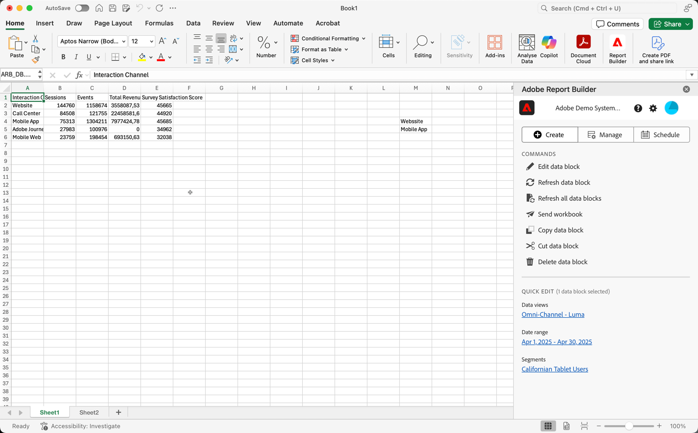

# Report Builder 中心

Report Builder中心是从Excel功能区栏选择 **[!UICONTROL Report Builder]**&#x200B;时显示在Excel工作簿中的右侧窗格。

使用 Report Builder 中心创建、更新和管理数据块。

Report Builder中心包含 **[!UICONTROL Create]**、 **[!UICONTROL Manage]**&#x200B;和 **[!UICONTROL 计划]**&#x200B;按钮、**[!UICONTROL 命令]**&#x200B;面板和&#x200B;**[!UICONTROL 快速编辑]**&#x200B;面板。

{zoomable="yes"}

选择

*  **[!UICONTROL 创建]**&#x200B;以[创建新数据块](create-a-data-block.md)。
*  **[!UICONTROL 管理]**&#x200B;以[管理现有的数据块](manage-reportbuilder.md)。
*  **[!UICONTROL 计划]**&#x200B;至[管理计划以通过电子邮件发送工作簿](schedule-reportbuilder.md)。

## “命令”面板

使用&#x200B;**[!UICONTROL 命令]**&#x200B;面板访问与所选单元格兼容的命令或上一个操作。

| 命令 | 可用的时间… | 用途 |
|------|------------------|--------|
| **[!UICONTROL 编辑数据块]** | 所选一个或多个单元格仅属于一个数据块。 | 用于编辑数据块。 |
|  **[!UICONTROL 刷新数据块]** | 选区至少包含一个数据块。该命令仅刷新选区中的数据块。 | 用于刷新一个或多个数据块。 |
|  **[!UICONTROL 刷新所有数据块]** | 工作簿包含一个或多个数据块。 | 用于刷新工作簿中的所有数据块 |
|  **[!UICONTROL 发送工作簿]** | 工作簿包含一个或多个数据块。 | 使用通过电子邮件以文件形式发送工作簿。 |
|  **[!UICONTROL 复制数据块]** | 所选单元格或单元格属于一个或多个数据块。 | 用于复制数据块。 |
|  **[!UICONTROL 剪切数据块]** | 所选单元格或单元格属于一个或多个数据块。 | 设置以剪切数据块。 |
|  **[!UICONTROL 删除数据块]** | 所选一个或多个单元格仅属于一个数据块。 | 用于删除数据块 |

## 快速编辑面板

在电子表格中选择一个或多个数据块时，Report Builder会显示&#x200B;**[!UICONTROL 快速编辑]**&#x200B;面板。 您可以使用&#x200B;**[!UICONTROL 快速编辑]**&#x200B;面板同时更改一个或多个数据块中的参数。

使用&#x200B;**[!UICONTROL 快速编辑]**&#x200B;分区时所做的更改将应用于所有选定的数据块。

### 数据视图

数据块从选定数据视图提取数据。 如果在一个工作表中选择了多个数据块并且它们不从同一数据视图提取数据，则&#x200B;**数据视图**&#x200B;链接显示&#x200B;**[!UICONTROL _多个_]**。

更改数据视图时，选区中的所有数据块将采用新的数据视图。数据块中的组件根据ID与新的数据视图匹配。 如果在数据块中未找到某个组件，则会删除该组件并将其替换为&#x200B;**[!UICONTROL 无效值]**&#x200B;或为特定组件显示。

若要更改数据视图，请从&#x200B;**[!UICONTROL 数据视图]**&#x200B;下拉菜单中选择新的数据视图。

### 日期范围

**日期范围**&#x200B;显示所选数据块的日期范围。如果选择具有多个日期范围的多个数据块，则&#x200B;**[!UICONTROL 日期范围]**&#x200B;链接显示&#x200B;**[!UICONTROL _多个_]**。

### 区段

**区段**&#x200B;链接显示所选数据块使用的区段的摘要列表。 如果选择应用了多个区段的多个数据块，则&#x200B;**区段**&#x200B;链接显示&#x200B;**[!UICONTROL _多个_]**。

>[!MORELIKETHIS]
>
>[选择数据视图](select-data-view.md)
>>[选择日期范围](select-date-range.md)
>>[使用筛选器](work-with-filters.md)
>
