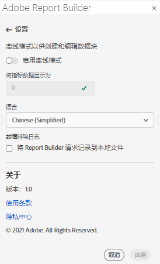
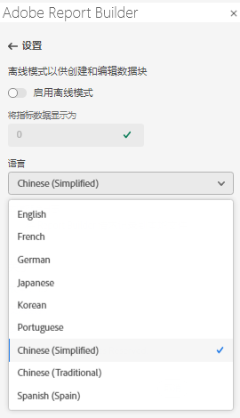

# Report Builder设置

使用&#x200B;**Settings**&#x200B;窗格配置应用程序级设置（如UI显示的语言），或者是否在脱机模式下工作。 将立即应用这些设置，并为以后的所有会话设置这些设置，直到它们被更改为止。

更改Report Builder设置

1. 单击&#x200B;**Settings**&#x200B;图标。

1. 更改“启用离线模式”、选择“语言”或“启用疑难解答日志设置”。

1. 单击&#x200B;**应用**。

   

## 脱机模式

在离线模式下创建和编辑数据块时，不会检索数据。 相反，会使用模拟数据，以便您能够快速创建和编辑数据块，而无需等待请求运行。 当您重新联机时，*刷新数据块*&#x200B;命令或&#x200B;*刷新所有数据块*&#x200B;命令会刷新您使用实际数据创建的数据块。

启用离线模式

1. 单击&#x200B;**Settings**&#x200B;图标。

1. 选择&#x200B;**启用离线模式**。

1. 在&#x200B;**将量度数据显示为**&#x200B;字段中输入正整数。

1. 单击&#x200B;**应用**。

## 语言

您可以选择Report BuilderUI的语言。 提供了所有受支持的Adobe Analytics语言。

选择Report BuilderUI中使用的语言

1. 单击设置。

1. 从&#x200B;**语言**&#x200B;下拉菜单中选择一种语言。

   

1. 单击&#x200B;**Apply.**

## 疑难解答

使用“疑难解答”设置将所有客户端/服务器数据记录到本地文件。 使用此选项可帮助解析支持票证。

要启用“疑难解答”选项，请选择&#x200B;**将报表生成器请求记录到本地文件**。
