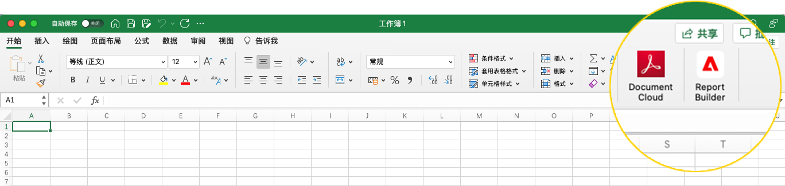
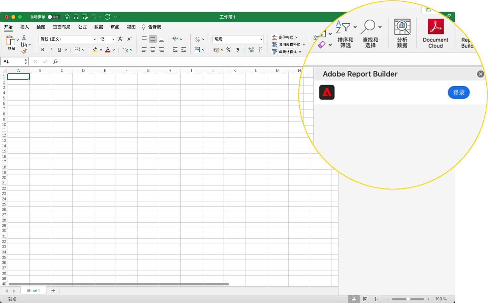
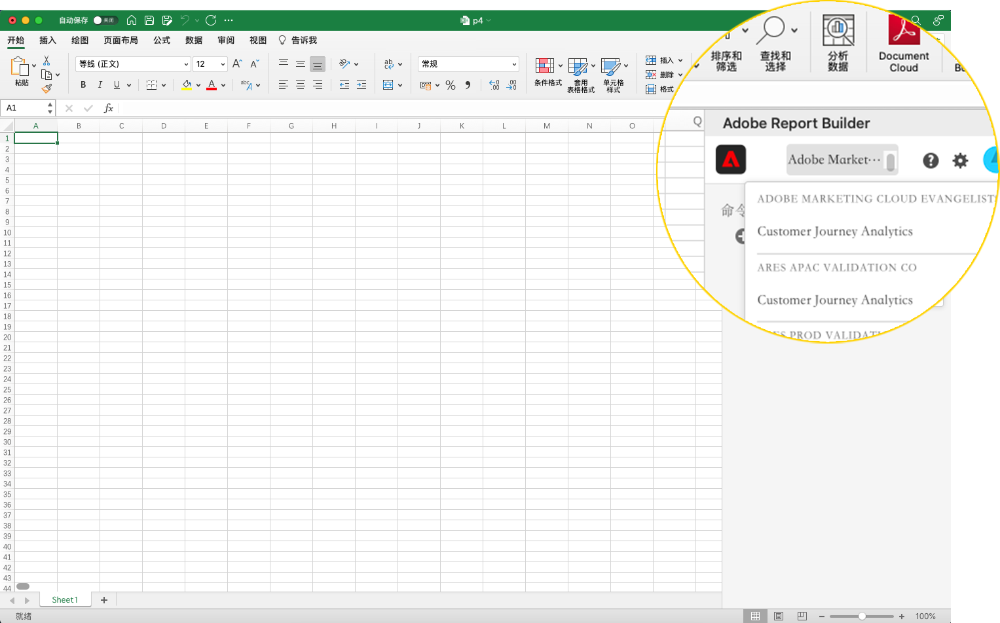

# Report Builder设置

您可以使用Excel加载项菜单快速访问Report Builder。

## 要求

以下操作系统和Web浏览器支持Customer Journey AnalyticsReport Builder。

### macOS

- macOS版本10.x或更高版本
- 所有Excel版本

### Windows

- Windows 10、版本1904或更高版本
- Excel版本2106或更高版本

   所有Windows桌面Excel用户必须安装Microsoft Edge Webview2才能使用加载项。 安装控制器：

   1. 转到 <http://aka.ms/webview2installer> 。
   1. 选择并下载Evergreen独立安装程序。
   1. 按照安装提示操作。

### Web Office

- 支持所有浏览器和版本

## Report BuilderExcel加载项

您必须安装Report BuilderExcel加载项才能使用Report Builder进行Customer Journey Analytics。 安装Report BuilderExcel加载项后，即可从打开的Excel工作簿中访问Report Builder。

### 下载并安装Report Builder加载项

要下载并安装Report Builder加载项，请执行以下操作

1. 启动Excel并打开新工作簿。

1. 选择插入>获取加载项。

1. 在Office加载项对话框中，选择“商店”选项卡。

1. 搜索“Report Builder”并单击“添加”。

1. 在许可条款和隐私政策对话框中，单击继续。

**如果未显示“商店”选项卡**

1. 在Excel中，选择文件>帐户>管理设置。

1. 选中“启用可选连接的体验”旁边的复选框

1. 重新启动Excel。

**如果贵组织阻止访问Microsoft商店**

请联系您的IT或安全团队以请求批准Report Builder加载项。 批准后，在Office加载项对话框中，选择管理员管理选项卡。

安装Report Builder加载项后，Report Builder图标会显示在主页选项卡下的Excel功能区中。

## 登录Report Builder

为操作平台或浏览器安装Report Builder for Excel加载项后，请按照以下步骤登录Report Builder。

1. 打开Excel工作簿。

1. 单击Report Builder图标以启动Report Builder。

1. 在Adobe Report Builder工具栏中，单击&#x200B;**登录**。

   

1. 输入您的Adobe Experience ID帐户信息。 您的帐户信息应与您的Customer Journey Analytics凭据匹配。

   

登录后，登录图标和组织将显示在面板顶部

## 切换组织

首次登录时，您将登录到分配给用户档案的默认组织。

1. 单击登录时显示的组织名称。

1. 从可用组织列表中选择组织。 仅列出您有权访问的组织。

   

## 注销

您可以从用户配置文件中注销Report Builder。

1. 保存对任何打开的工作簿所做的更改。

1. 单击头像图标以显示用户配置文件。

   

1. 单击&#x200B;**注销**。
