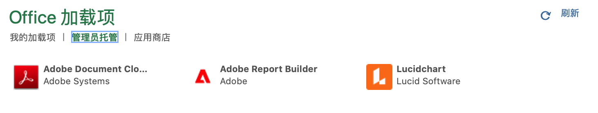

# Report Builder 设置

您可以使用 Excel 插件菜单快速访问 Report Builder。

## 要求

以下操作系统和 Web 浏览器支持适用于 Customer Journey Analytics 的 Report Builder。

### macOS

- macOS 版本 10.x 或更高版本
- 所有 Excel 版本

### Windows

- Windows 10，版本 1904 或更高版本
- Excel 版本 2106 或更高版本

   所有 Windows 桌面 Excel 用户必须安装 Microsoft Edge Webview2 以使用插件。安装控制器：

   1. 转到 <https://aka.ms/webview2installer>。
   1. 选择并下载 Evergreen 独立安装程序。
   1. 按照安装提示操作。

### Web Office

- 支持所有浏览器和版本

## Report Builder Excel 插件

必须安装 Report Builder Excel 插件以使用适用于 Customer Journey Analytics 的 Report Builder。安装 Report Builder Excel 插件之后，您可以从打开的 Excel 工作簿中访问 Report Builder。

### 下载并安装 Report Builder 插件

下载并安装 Report Builder 插件

1. 启动 Excel 并打开新工作簿。

1. 选择“插入”>“获取插件”。

1. 在“Office 插件”对话框中，选择“Store”选项卡。

1. 搜索“Report Builder”并单击“添加”。

1. 在许可条款和隐私政策对话框中，单击“继续”。

**如果“Store”选项卡未显示**

1. 在 Excel 中，选择“文件”>“帐户”>“管理设置”。

1. 选中“启用可选连接体验”旁边的框

1. 重新启动 Excel。

**如果组织阻止了对 Microsoft Store 的访问**

联系 IT 或安全团队，请求批准使用 Report Builder 插件。获得批准之后，在“Office 插件”对话框中，选择“管理员托管”选项卡。

安装 Report Builder 插件后，Report Builder 图标显示现在 Excel 功能区的“开始”选项卡下。

## 登录 Report Builder

为操作平台或浏览器安装适用于 Excel 的 Report Builder 插件之后，按照以下步骤登录 Report Builder。

1. 打开 Excel 工作簿。

1. 单击 Report Builder 图标以启动 Report Builder。

1. 从 Adobe Report Builder 工具栏，单击&#x200B;**登录**。

   

1. 输入您的 Adobe Experience ID 帐户信息。您的帐户信息应该与您的 Customer Journey Analytics 凭据匹配。

   

登录之后，您的登录图标和组织将显示在面板的顶部

## 切换组织

首次登录时，您会登录到分配给您的配置文件的默认组织。

1. 单击在您登录时显示的组织的名称。

1. 从可用组织列表中选择组织。只列出您有访问权限的组织。

   

## 注销

您可从 Report Builder 的用户配置文件中注销。

1. 保存对任何打开工作簿的更改。

1. 单击头像图标以显示您的用户配置文件。

   

1. 单击&#x200B;**注销**。
