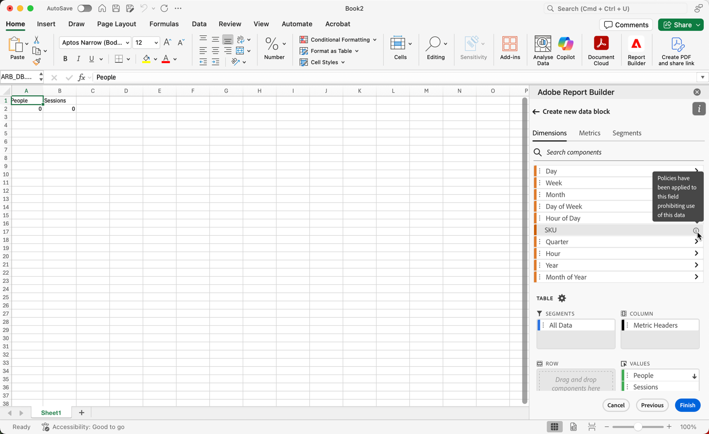
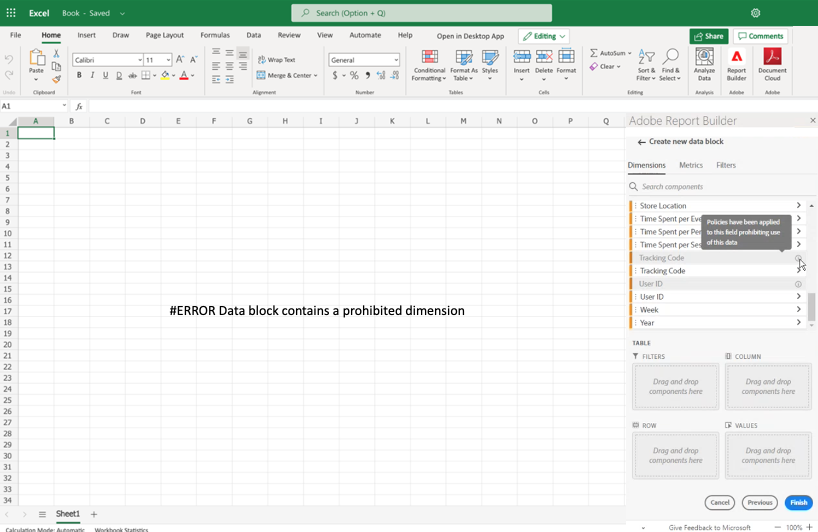

# Report Builder 中受到限制的标签

通常，Customer Journey Analytics中与数据治理相关的设置继承自Experience Platform。 Customer Journey Analytics与Experience Platform数据管理之间的集成允许标记敏感Customer Journey Analytics数据和实施隐私政策。

在Experience Platform使用的数据集上创建的隐私标签和策略可以在Customer Journey Analytics数据视图工作流中显示。 这些标签阻止或警告从敏感字段创建量度和维度的用户。 有关数据集的更多信息，请参阅[数据集概述](https://experienceleague.adobe.com/zh-hans/docs/experience-platform/catalog/datasets/overview)。

此外，从 Customer Journey Analytics 导出数据时（通过报告、导出、API 等），将添加警告或标签，以通知用户报告包含需要以特定方式处理的敏感信息。

此集成允许您管理合规性。 组织中的数据管理员可以设置策略以限制使用。 因此，您的 Customer Journey Analytics 用户可以更自信地使用数据，因为他们知道此等数据使用符合数据管理员定义的策略。

有关更多信息，请参阅[ Customer Journey Analytics 和数据治理](https://experienceleague.adobe.com/zh-hans/docs/analytics-platform/using/cja-privacy/privacy-overview)。

## 查看受限制的数据

Customer Journey Analytics中出现了两个Adobe定义的策略，这些策略影响报表、下载和共享：

* 强制分析策略
* 强制下载策略

遵循这些策略的组件呈灰显状态，并且确实有图标。 当您将鼠标悬停在信息图标上时，会显示一条注释，以指示以下内容：**[!UICONTROL 策略已应用于此字段，因此禁止使用此数据]**。

有关详细信息，请参阅[标签和策略](https://experienceleague.adobe.com/en/docs/analytics-platform/using/cja-dataviews/data-governance)。

{zoomable="yes"}

## 更新包含受限数据的报表

如果用户创建的 Report Builder 报告中的数据元素后来受到限制，则在刷新报告时，会显示一条错误消息。

{width="100%" zoomable="yes"}
