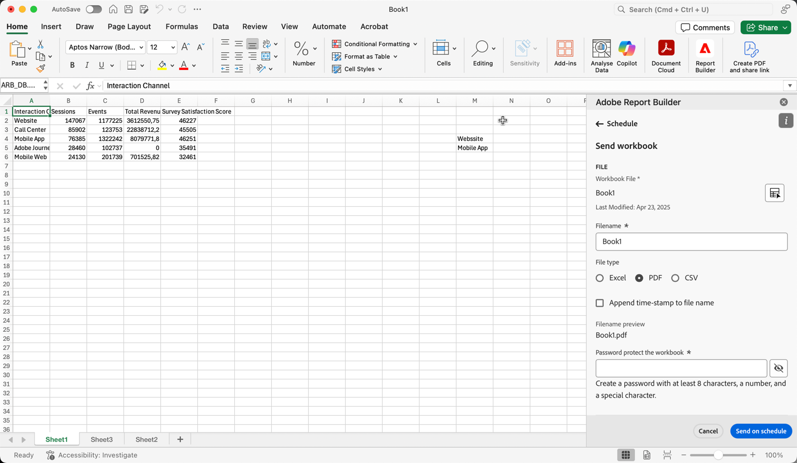

# 计划工作簿

保存工作簿并完成分析后，您可以使用计划功能轻松与团队中的其他人员共享工作簿。 “计划”功能允许您创建计划，以自动刷新工作簿中的数据，并在特定日期和时间将Excel工作簿.xlsx文件作为附件发送给指定受众。 设置计划会自动为收件人提供定期更新。 您还可以使用计划功能在不计划自动更新的情况下发出工作簿一次。

您可以为单个工作簿创建多个计划。 例如，您可以每天向团队发送工作簿，也可以通过创建两个不同的计划，每周将工作簿发送给您的经理一次。

“计划”功能还允许您为工作簿设置密码保护，并编辑以前计划的工作簿。

>[!VIDEO](https://video.tv.adobe.com/v/3413079/?quality=12&learn=on)

## 计划工作簿

使用Report Builder中心中的“计划”任务按钮可快速创建计划，以便自动将工作簿Excel文件(.xlsx)分发给个人或组。

1. 单击Report Builder中心中的计划按钮。

   {width="55%"}

1. 单击计划工作簿或左上角的加号按钮以创建新的计划工作簿。

   {width="55%"}

   计划窗格显示有关工作簿的一些预定义信息，如工作簿名称和修改工作簿的最后日期。

   {width="55%"}

1. （可选）输入文件名。

   工作簿文件名默认为工作簿的名称，但您可以根据需要更改此名称。 如果您将同一工作簿发送给多个受众，并且您希望为该工作簿命名一些对特定受众更友好的内容，则可以更改该名称。

1. （可选）选择 **将时间戳附加到文件名**.

   您可以在文件名中附加时间戳，以标识工作簿的更新日期。 这有助于快速查看在特定日期发送的工作簿版本。 的 **文件名预览** 显示分发工作簿时工作簿文件名在电子邮件中的显示方式。 时间戳格式为YYYY-MM-DD。

1. （可选）选择 **.zip压缩** 压缩文件并设置对文件的密码保护。

   进行此选择时，系统会提示您输入密码以打开文件。 如果您担心数据安全，并且希望对工作簿进行密码保护，此操作会很有帮助。 使用密码保护文件时，您需要选择 **.zip压缩**. 密码必须至少为8个字符，并且包含数字和特殊字符。

   {width="55%"}

1. 输入 **收件人**. 您可以输入组织中识别的人员姓名，也可以输入组织内外人员的电子邮件地址。

1. 输入 **主题** 电子邮件的内容和收件人的描述。 主体默认为工作簿文件名，但您可以根据需要修改主体。 您可以在描述部分中添加详细信息。

   {width="55%"}

1. 设置计划选项，以设置您希望工作簿通过电子邮件发送给收件人的日期和时间。

   选择开始和结束日期和时间范围。 这可以是今天的日期或将来的日期。

   选择 **频率** 下拉菜单中。 您可以将特定日期的频率设置为每小时、每天、每周、每月或每年。 例如，您可以设置一个计划，在每月的第一个星期日晚上发送工作簿，以便收件人在星期一上午的第一件事情中将电子邮件发送到其收件箱中。

   {width="55%"}

1. 设置计划后，单击 **按计划发送**.

   {width="55%"}

   您将在Report Builder中心的底部看到确认Toast，并且计划工作簿列在工作簿选项卡下。

   {width="55%"}

## 仅发送一次性工作簿

您也只能发送一次工作簿。

1. 取消检查 **显示计划选项**

   {width="40%"}

1. 单击&#x200B;**立即发送**。

## 查看和编辑计划工作簿

您可以在工作簿选项卡下的一个位置查看和管理所有计划工作簿。

1. 在Report Builder中心的计划部分，单击工作簿选项卡。 使用此视图可查看所有计划工作簿的列表。

1. 选择工作簿。 显示了多个工具，允许您编辑工作簿、更改计划、暂停和重新启动计划或删除计划。

   {width="55%"}

* （可选）单击铅笔图标以编辑工作簿计划。

* （可选）单击时钟图标以查看每个计划任务的历史记录。

* （可选）单击暂停图标以暂停并重新启动分发计划。 如果您需要在发送工作簿之前修改工作簿，则此操作会很有帮助。 当您要重新启动分发时，请再次单击暂停图标。

* （可选）单击垃圾桶以删除计划。

## 查看计划任务的状态

历史记录视图允许您查看每个计划任务的状态。 有一个单独的行记录每个计划任务的状态更改。 在以下示例中， *新的每小时计划* 于1月5日下午3时04分启动。 下午3:05时成功刷新该页面，并将其发送给收件人。 下一个工作簿， *工作簿错误*，在刷新过程中遇到错误。 如果工作簿发送失败，历史记录选项卡会显示错误发生的处理位置，从而帮助您进行故障诊断。 在这种情况下，可能是由于某些数据块错误（可能是缺少组件）导致工作簿无法成功刷新。

绿色复选标记表示工作簿已成功发送。 红色三角形中的感叹号表示出现错误。

通过单击搜索栏右侧的列设置图标，可选择要在历史记录选项卡中显示的列。

{width="55%"}

您可以向下过滤历史记录，以仅查看单个计划工作簿的历史记录，方法是转到工作簿选项卡，选择工作簿并单击历史记录图标。

您还可以从工作簿选项卡中查看特定工作簿的历史记录。 在工作簿选项卡中，选择工作簿，然后单击历史记录图标。

{width="55%"}

工作簿筛选器随后将显示在历史记录的顶部。 要再次查看所有计划任务的历史记录，请单击过滤器旁边的x。

{width="55%"}

