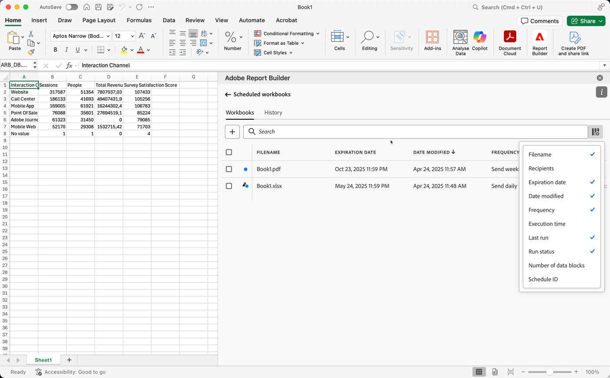

# 计划工作簿

保存工作簿并完成分析后，可以使用计划功能与团队中的其他人共享工作簿。 利用计划功能，可创建自动刷新工作簿中数据的计划。 在特定日期和时间将Excel工作簿文件作为附件发送到指定的受众。 设置计划会自动为收件人提供定期更新。 您还可以使用计划功能将工作簿发送一次，而无需计划自动更新。

您可以为单个工作簿创建多个计划。例如，您创建了两个计划，每周向团队和经理发送一次工作簿。

使用计划功能，您还可以为工作簿设置密码保护并编辑以前计划的工作簿。

>[!BEGINSHADEBOX]

请参阅 [计划工作簿](https://video.tv.adobe.com/v/3417502/?quality=12&learn=on&captions=chi_hans){target="_blank"}以观看演示视频。

>[!ENDSHADEBOX]

## 计划工作簿

要计划工作簿，请执行以下操作：

1. 选择Report Builder中心中的&#x200B;**[!UICONTROL 计划]**&#x200B;以创建计划，以便您将工作簿Excel文件(.xlsx)自动分发给个人或组。

   {zoomable="yes"}

1. 选择&#x200B;**[!UICONTROL 计划工作簿]**&#x200B;或以创建新的计划工作簿。

   {zoomable="yes"}

   计划窗格显示有关工作簿的一些预定义信息，例如工作簿名称和修改工作簿的最后日期。

### 文件

在&#x200B;**[!UICONTROL 文件]**&#x200B;部分中，您提供了文件类型、名称和密码的详细信息以保护文件。

{zoomable="yes"}

1. 使用选择当前工作簿（如果尚未选择）。

1. （可选）输入&#x200B;**[!UICONTROL 文件名]**。

   工作簿文件名默认为工作簿的名称，但您可以根据需要更改文件名。

1. 选择&#x200B;**[!UICONTROL 文件类型]**。

   * **[!UICONTROL Excel]**
   * **[!UICONTROL PDF]**
   * **[!UICONTROL CSV]**

   选择&#x200B;**[!UICONTROL CSV]**&#x200B;时，请注意，计划工作簿是作为zip附件发送的。 某些公司电子邮件管理部门可能会阻止包含zip附件的电子邮件。 您会看到相应的警告。

1. （可选）选择&#x200B;**[!UICONTROL 将时间戳附加到文件名]**。

   您可以将时间戳附加到文件名以标识工作簿的更新日期。时间戳有助于查看在特定日期发送的工作簿版本。 选中后，您可以选择以下选项：

   * **[!UICONTROL ISO日期格式]**，这会导致`YYYY-MM-DD`被附加到文件名中。
   * **[!UICONTROL ISO日期格式+时间戳]**，这会导致`YYYY-MM-DD_HH-MM-SS`被附加到文件名中。

<!-- Does no longer seem to be an option? 
1. (Optional) Select **.zip compression** to compress the file and set up password protection on the file.

    When you make this selection, you're prompted to enter a password to open the file. This is helpful if you have concerns about data security and you want to password protect the workbook. Protecting the file with a password requires you to select **.zip compression**. The password must be at least 8 characters and contain a number and a special character.

    {zoomable="yes"}{width="55%"}
-->

1. 在&#x200B;**[!UICONTROL 密码保护工作簿]**&#x200B;中输入密码。 有效密码至少需要8个字符、一个数字和一个特殊字符。 选择以显示密码，选择隐藏密码（默认）。

### 电子邮件

在&#x200B;**[!UICONTROL 电子邮件]**&#x200B;部分中，提供电子邮件的收件人、主题和描述。

{zoomable="yes"}

1. **输入收件人**。您可以输入组织中可识别的人员的姓名。 或者，您可以输入组织外部人员的电子邮件地址。

1. 输入电子邮件的&#x200B;**主题**&#x200B;和对收件人的描述。主题默认为工作簿文件名，但您可以根据需要修改主题。您可以在描述部分添加详细信息。

1. 您可以选择在&#x200B;**[!UICONTROL 描述]**&#x200B;文本区域中输入描述。

### 计划

在&#x200B;**[!UICONTROL 计划]**&#x200B;部分中，您可以定义将带有工作簿的电子邮件发送给收件人的计划。

{zoomable="yes"}

1. 选择&#x200B;**[!UICONTROL 显示计划选项]**&#x200B;以定义计划。

1. 输入从&#x200B;**开始的**&#x200B;开始日期。 或者，选择以从日历中选择开始日期。

1. 在&#x200B;**[!UICONTROL 结束日期]**&#x200B;中输入结束日期。 或者，选择以从日历中选择结束日期。

1. 选择&#x200B;**[!UICONTROL 频率]**。 根据所选的频率，您还有其他选项。 请参阅下表。

   | 频率 | 选项 |
   |---|---|
   | **[!UICONTROL 每小时发送]** | 为&#x200B;**[!UICONTROL 发送间隔小时数]**&#x200B;输入一个值。 |
   | **[!UICONTROL 每日发送]** | 选择&#x200B;**[!UICONTROL 每日频率]**：**[!UICONTROL 每天发送]**、**[!UICONTROL 每个工作日发送]**&#x200B;或&#x200B;**[!UICONTROL 自定义频率]**。 如果您选择&#x200B;**[!UICONTROL 自定义频率]**，请为&#x200B;**[!UICONTROL 发送间隔天数]**&#x200B;输入一个值。 |
   | **[!UICONTROL 每周发送]** | 为&#x200B;**[!UICONTROL 发送间隔周数]**&#x200B;输入一个值。 并选择一周中的&#x200B;**[!UICONTROL 天]**。 |
   | **[!UICONTROL 按星期几发送月报表]** | 选择&#x200B;**[!UICONTROL 周中某天]**&#x200B;和&#x200B;**[!UICONTROL 月中某周]**。 |
   | **[!UICONTROL 每月按月发送]** | 从&#x200B;**[!UICONTROL 发送日期]**&#x200B;中选择一个值。 |
   | **[!UICONTROL 按月份中的日期每年发送]** | 选择&#x200B;**[!UICONTROL 周中日]**，选择&#x200B;**[!UICONTROL 月中周]**，然后选择&#x200B;**[!UICONTROL 月中月]**。 |
   | **[!UICONTROL 按特定日期每年发送]** | 选择&#x200B;**[!UICONTROL 月份]**&#x200B;并从&#x200B;**[!UICONTROL 发送日期]**&#x200B;中选择一个值。 |

### 发送

要发送工作簿，请执行以下操作：

* 如果您尚未使用&#x200B;**[!UICONTROL 显示计划选项]**&#x200B;定义计划，请选择&#x200B;**[!UICONTROL 立即发送]**&#x200B;以立即通过电子邮件发送工作簿。
* 如果您使用&#x200B;**[!UICONTROL 显示计划选项]**&#x200B;定义了计划，请选择&#x200B;**[!UICONTROL 按计划发送]**，以使用您定义的计划通过电子邮件发送工作簿。

在这两种情况下，您都会在Report Builder中心底部看到一个确认吐司。

若要取消发送工作簿，请选择&#x200B;**[!UICONTROL 取消]**。

## 查看和管理计划的工作簿

您可以在&#x200B;**[!UICONTROL 工作簿]**&#x200B;选项卡中查看和管理所有计划工作簿。

1. 在Report Builder中心选择&#x200B;**[!UICONTROL 计划]**

1. 选择&#x200B;**[!UICONTROL 工作簿]**&#x200B;选项卡。 您会看到所有计划工作簿的列表。

   {zoomable="yes"}

   您可以将鼠标悬停在图标上以查看已计划工作簿的状态。

   使用搜索特定的计划工作簿。
使用定义要显示的列。

1. 选择一个或多个工作簿。

   {zoomable="yes"}

   可以使用以下选项：

   | 选项 | 描述 |
   |---|---|
   |  | 编辑所选工作簿的计划。 |
   |  | 显示所选工作簿的历史记录。 |
   |  | 暂停所选工作簿的计划。 |
   |  | 恢复所选工作簿的计划。 |
   |  | 将所选工作簿下载到新工作簿中。 |
   |  | 删除所选工作簿的计划。 |

## 计划工作簿的历史记录和状态

您可以在&#x200B;**[!UICONTROL 历史记录]**&#x200B;选项卡中查看计划工作簿的历史记录和状态。

1. 在Report Builder中心中选择&#x200B;**[!UICONTROL 计划]**。

1. 选择&#x200B;**[!UICONTROL 历史记录]**&#x200B;选项卡。 您会看到所有计划工作簿的列表。

   {zoomable="yes"}

   使用搜索列表中的特定工作簿。
使用定义要显示的列。

   使用&#x200B;**[!UICONTROL 历史记录]**&#x200B;选项卡可复查每个计划任务的状态。 单独的行记录每个计划任务的状态更改。

   * 表示工作簿已成功发送。
   * 表示出现错误。

或者，您也可以在&#x200B;**[!UICONTROL 工作簿]**&#x200B;选项卡中为一个或多个选定的工作簿选择。 此操作显示&#x200B;**[!UICONTROL History]**&#x200B;选项卡，该选项卡具有按您的选择过滤的列表。 选择以删除筛选器。
