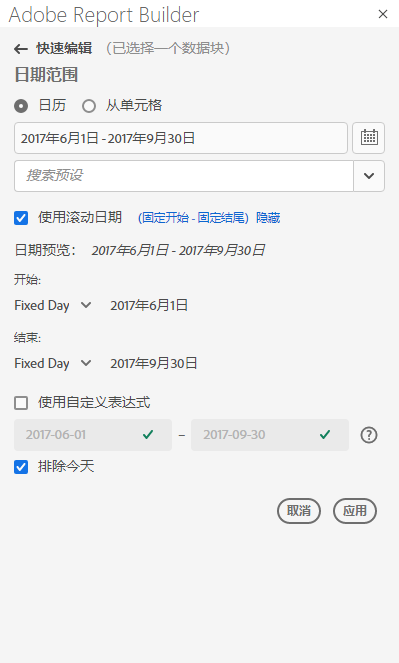
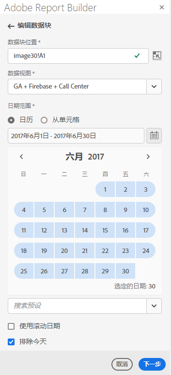
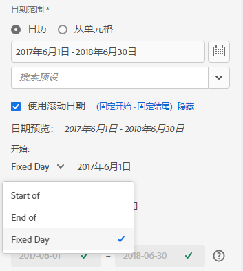
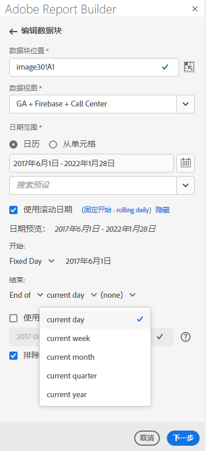
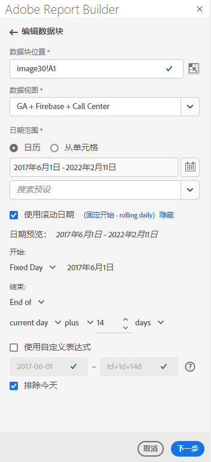
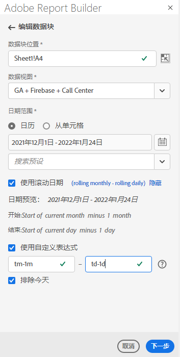
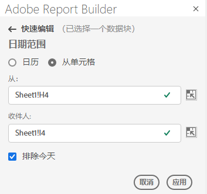

# 选择日期范围

要更改现有数据块的日期范围，请选择编辑数据块或使用“快速编辑”面板。

使用以下选项更改数据块的日期范围。

**日历**

日历允许您使用以下选项创建静态或滚动日期：

- 日期范围字段
- 日历
- 预设下拉菜单
- 滚动日期模式
- 自定义表达式


**从单元格**

“起始”单元格选项允许您引用在工作表单元格中输入的日期。

您可以选择在任何选定的日期范围内排除今天。



## 使用日历

使用&#x200B;**Calendar**&#x200B;时，日期范围字段显示数据块请求的当前日期范围。 您可以直接在日期范围字段中输入日期，也可以使用数据范围选择选项。

### 日期范围字段

要直接在日期范围字段中输入日期，请执行以下操作

1. 单击日历图标旁边的日期范围字段。

1. 输入日期范围的开始和结束日期。

### 日历

使用日历选择日期

1. 单击日历图标可显示每月日历。

1. 单击开始日期。

1. 单击结束日期。

要反向设置日期范围，请先单击结束日期，然后单击开始日期。



### “预设”下拉菜单

预设下拉菜单包含一组标准的预设日期范围和日期范围组件，用于您保存的数据视图或与您共享的数据视图。

### 滚动日期

滚动日期选项允许您使用滚动日期选择日期范围。

1. 选择&#x200B;**使用滚动日期**。

1. 为开始和结束日期选择滚动表达式。

   

   **开始**  — 用于选择一天、一周、一个月、一个季度或一年的开始。

   **结束**  — 允许您选择结束日期、周、月、季度或年。

   **固定日期**  — 用于在其他日期滚动时修复开始或结束日期。

1. 选择日、周、月、季度或年作为滚动期间。

   

1. 从滚动日期开始添加或删除天、周、月、季度或年。

   

1. 单击下一步以定义数据范围。

   使用日期预览确认生成的日期范围为所需范围。

### 自定义表达式

自定义表达式选项允许您通过构建自定义表达式来更改日期范围，也可以输入算术公式。

1. 选择&#x200B;**使用滚动日期**。

1. 选择&#x200B;**使用自定义表达式**。

   选择&#x200B;**使用自定义表达式**&#x200B;选项时，标准滚动日期范围控件将被禁用。

   

1. 输入自定义表达式。

   有关自定义表达式的示例列表，请参阅&#x200B;**日期表达式**。

1. 使用日期预览验证生成的日期范围是否为所需范围。

#### 创建自定义表达式

1. 输入&#x200B;**日期引用**。

1. 添加&#x200B;**Date运算符**&#x200B;以将日期移动到过去或将来的日期。

您可以输入包含多个运算符（如```tm-11m-1d```）的自定义日期表达式。

#### 日期引用

下表列出了日期参考示例。

| 日期参考 | 类型 | 描述 |
|----------------|--------------|----------------------------|
| 1/1/10 | 静态日期 | 以ISO日期格式输入 |
| td | 滚动日期 | 当天开始 |
| tw | 滚动日期 | 当周开始 |
| tm | 滚动日期 | 当月开始 |
| tq | 滚动日期 | 当季开始 |
| ty | 滚动日期 | 当年年初 |

#### 日期运算符

下表列出了日期运算符示例。

| 日期运算符 | 单位 | 描述 |
|----------------|---------|--------------------|
| +6d | 日 | 向日期参考添加6天 |
| +1w | 周 | 向日期参考添加整周 |
| -2米 | 月 | 在日期引用中减去2个整月 |
| -4q | 季度 | 在日期引用中减去4个季度 |
| -1y | 年 | 在日期引用中减去一年 |

#### 日期表达式

下表列出了日期表达式示例。

| 日期表达式 | 含义 |
|-----------------|--------------------------------------|
| td-1w | 上周的第一天 |
| tm-1d | 上个月的最后一天 |
| td-52w | 同一天，52周前 |
| tm-11m-1d | 去年同月的最后一天 |
| &quot;2020-09-06&quot; | 2020年9月9日 |

## 单元格中的日期范围

日期范围可以在工作表单元格中指定。 使用&#x200B;**单元格**&#x200B;中的日期范围选项，从选定的单元格中选择数据块的开始和结束日期。 选择&#x200B;**从单元格**&#x200B;选项后，该面板会显示&#x200B;**从**&#x200B;和&#x200B;**从**&#x200B;到字段，您可以在其中输入单元格位置。



## 排除今天

选择&#x200B;**排除今天**&#x200B;选项，以从选定的日期范围中排除今天。 如果选择包含当天，可能会提取当天的不完整数据。

选中&#x200B;**Exclude today**&#x200B;选项后，该选项会从包括日历、滚动日期或自定义表达式在内的所有日期范围模式中排除当天。

## 有效日期范围

以下列表介绍了有效的日期范围格式。

- 开始日期和结束日期必须采用以下格式：YYYY-MM-DD

- 开始日期必须早于或等于结束日期。 这两个日期都可以设置为将来。

- 使用滚动日期时，开始日期必须是今天或过去。 如果选中&#x200B;**Exclude today** ，则该参数必须为过去。

- 您可以创建为将来设置的静态日期范围。 例如，您可能需要为下周的营销活动启动设置未来日期。 此选项会提前为营销活动创建工作簿监控。

## 更改日期范围

通过在“命令”面板中选择“编辑”数据块，或在“快速编辑”面板中选择日期范围链接，可以编辑现有数据块的日期范围。

**编辑数据块**  — 允许您编辑单个数据块的多个数据块参数，包括日期范围。

**快速编辑：日期范围**  — 用于编辑一个或多个数据块的日期范围。

从“快速编辑”面板编辑日期范围

1. 选择工作表中一个或多个数据块中的单元格。

1. 单击“快速编辑”面板中的&#x200B;**日期范围**&#x200B;链接。

1. 使用任何日期选择选项选择日期范围。

1. 单击&#x200B;**应用**。


Report Builder将新日期范围应用于所选内容中的所有数据块。
